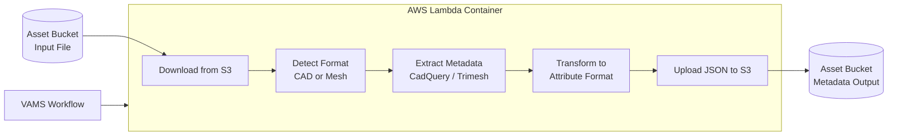

# CAD/Mesh Metadata Extraction Pipeline

The CAD/Mesh Metadata Extraction pipeline automatically extracts comprehensive metadata from CAD and mesh files, writing the results as file-level attributes in VAMS. It uses CadQuery for CAD file processing and Trimesh for mesh file processing, running as a containerized AWS Lambda function. This pipeline enriches your asset catalog with geometric, structural, and format-specific properties without manual data entry.

## Supported Formats

### CAD Formats

| Format | Extension       | Handler                 | Key Metadata                                                                             |
| :----- | :-------------- | :---------------------- | :--------------------------------------------------------------------------------------- |
| STEP   | `.step`, `.stp` | CadQuery (Open CASCADE) | Geometry dimensions, assembly hierarchy, volumes, surface areas, shape statistics, units |
| DXF    | `.dxf`          | CadQuery                | Layer information, 2D drawing data                                                       |

### Mesh Formats

| Format | Extension | Handler | Key Metadata                                               |
| :----- | :-------- | :------ | :--------------------------------------------------------- |
| STL    | `.stl`    | Trimesh | Triangle count, vertex count, bounding box, model size     |
| OBJ    | `.obj`    | Trimesh | Polygon count, vertex count, texture references, materials |
| PLY    | `.ply`    | Trimesh | Vertex count, vertex colors, normals                       |
| GLTF   | `.gltf`   | Trimesh | Shader info, animation data, texture references            |
| GLB    | `.glb`    | Trimesh | Shader info, animation data, embedded textures             |
| 3MF    | `.3mf`    | Trimesh | 3D printing metadata, units                                |
| XAML   | `.xaml`   | Trimesh | Transform matrices, model size                             |
| 3DXML  | `.3dxml`  | Trimesh | Dassault-specific metadata                                 |
| DAE    | `.dae`    | Trimesh | Animation data, materials, scene hierarchy                 |
| XYZ    | `.xyz`    | Trimesh | Point count, bounding box                                  |

## Architecture



### Execution Type

This pipeline uses the **Lambda** execution type with synchronous invocation. Like the 3D Basic Conversion pipeline, it does not use AWS Step Functions task token callbacks.

### Processing Flow

1. The Lambda function receives the input Amazon S3 URI and the output Amazon S3 metadata path.
2. The file extension is inspected to determine the handler type: `cad` for STEP/DXF files, `mesh` for all other supported formats.
3. The input file is downloaded from Amazon S3 to the Lambda container's temporary storage.
4. The appropriate extractor processes the file:
    - **CAD extractor**: Uses CadQuery to parse geometric details, assembly hierarchy, and material properties.
    - **Mesh extractor**: Uses Trimesh to extract polygon counts, vertex data, bounding box dimensions, and format-specific metadata.
5. Extracted metadata is transformed into the VAMS attribute format and saved as a JSON file.
6. The attribute JSON is uploaded to the output path as a file-level attribute file (`<filename>.attribute.json`).

## Extracted Metadata

### CAD Files (STEP, DXF)

| Category           | Fields                                                   |
| :----------------- | :------------------------------------------------------- |
| Geometric details  | Dimensions (length, width, height), volume, surface area |
| Assembly hierarchy | Component tree, relationships between parts              |
| Materials          | Material names and properties (if embedded in the file)  |
| Shape statistics   | Face count, edge count, vertex count per component       |
| Units              | Unit of measurement from the file header                 |
| Custom metadata    | Top-level node properties                                |

### Mesh Files (STL, OBJ, PLY, GLB, etc.)

| Category        | Fields                                       |
| :-------------- | :------------------------------------------- |
| Geometry        | Triangle count, vertex count, polygon count  |
| Bounding box    | Dimensions (X, Y, Z extents), model size     |
| Textures        | Embedded or referenced texture information   |
| Shaders         | Shader information (GLTF/GLB formats)        |
| Animation       | Frame count, duration (if present)           |
| Transforms      | Rotation, scale, translation matrices        |
| Format-specific | DRACO compression info, 3D Tiles data, units |

## Configuration

Enable this pipeline in `infra/config/config.json`:

```json
{
    "app": {
        "pipelines": {
            "useConversionCadMeshMetadataExtraction": {
                "enabled": true,
                "autoRegisterWithVAMS": true,
                "autoRegisterAutoTriggerOnFileUpload": true
            }
        }
    }
}
```

### Configuration Options

| Option                                | Default | Description                                                                       |
| :------------------------------------ | :------ | :-------------------------------------------------------------------------------- |
| `enabled`                             | `false` | Deploy the metadata extraction pipeline infrastructure.                           |
| `autoRegisterWithVAMS`                | `true`  | Automatically register the pipeline and workflow during CDK deployment.           |
| `autoRegisterAutoTriggerOnFileUpload` | `true`  | Automatically trigger the pipeline when supported CAD or mesh files are uploaded. |

:::tip[Automatic Metadata Enrichment]
When both `autoRegisterWithVAMS` and `autoRegisterAutoTriggerOnFileUpload` are enabled, every CAD or mesh file uploaded to VAMS is automatically analyzed and enriched with metadata. This provides immediate searchable properties for newly uploaded assets without user intervention.
:::

## Output Format

The pipeline produces file-level attribute files in the following JSON structure:

```json
{
    "type": "attribute",
    "updateType": "update",
    "metadata": [
        {
            "metadataKey": "vertex_count",
            "metadataValue": "45230",
            "metadataValueType": "string"
        },
        {
            "metadataKey": "bounding_box_dimensions",
            "metadataValue": "{\"x\": 10.5, \"y\": 8.2, \"z\": 3.1}",
            "metadataValueType": "string"
        }
    ]
}
```

The attribute file is uploaded to the metadata output path with the naming pattern `<original_filename>.attribute.json`. The VAMS workflow's process-output step reads this file and writes the attributes to the VAMS metadata system, making them searchable and visible in the web interface.

## Prerequisites

### No VPC Required

This pipeline runs as a containerized Lambda function and does not require a VPC. It operates independently of the global VPC configuration, making it one of the simplest pipelines to enable.

### Container Image

The Lambda container image is built during CDK deployment from `backendPipelines/conversion/meshCadMetadataExtraction/lambdaContainer/Dockerfile`. It includes:

-   **Python 3.12** -- Lambda runtime
-   **CadQuery** -- CAD file processing (STEP, DXF)
-   **Trimesh** -- Mesh file processing (STL, OBJ, PLY, GLTF, GLB, etc.)
-   **NumPy** -- Numerical computation for geometric analysis
-   **AWS Lambda Powertools** -- Structured logging

## Infrastructure Components

| Resource                      | Service            | Purpose                            |
| :---------------------------- | :----------------- | :--------------------------------- |
| Container Lambda Function     | AWS Lambda         | Metadata extraction execution      |
| Container Image               | Amazon ECR         | CadQuery + Trimesh container image |
| Step Functions State Machine  | AWS Step Functions | Workflow orchestration             |
| Lambda Function (vamsExecute) | AWS Lambda         | Pipeline coordination              |

## Limitations

| Constraint           | Details                                                                         |
| :------------------- | :------------------------------------------------------------------------------ |
| Maximum file size    | Limited by Lambda container `/tmp` storage (10 GB)                              |
| Execution timeout    | 15 minutes (Lambda maximum)                                                     |
| Read-only extraction | The pipeline reads metadata but does not modify the source file                 |
| Format fidelity      | Metadata depth varies by format; some formats embed richer metadata than others |

## Related Resources

-   [Pipeline System Overview](overview.md)
-   [3D Basic Conversion Pipeline](3d-conversion.md) -- converts between the same file formats
-   [3D Preview Thumbnail Pipeline](3d-thumbnail.md) -- generates visual previews from similar file formats
