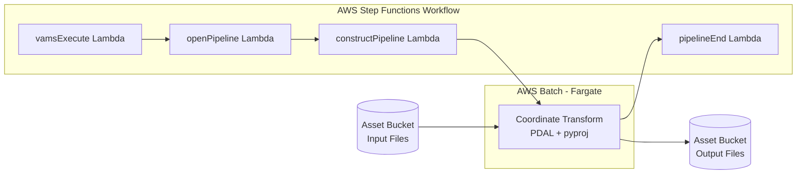

# Coordinate Transform Pipeline

The Coordinate Transform pipeline reprojects point cloud files between coordinate reference systems (CRS). It accepts E57, LAS, and LAZ input files and can output to LAZ, LAS, E57, or PLY. The pipeline runs as an AWS Batch Fargate container with PDAL-based transformation and supports per-asset CRS configuration through VAMS metadata.

## Supported Formats

| Format | Extension | Notes                                                                    |
| :----- | :-------- | :----------------------------------------------------------------------- |
| E57    | `.e57`    | ASTM standard for 3D imaging data                                        |
| LAS    | `.las`    | ASPRS LiDAR data exchange format                                         |
| LAZ    | `.laz`    | Compressed LAS format                                                    |
| PLY    | `.ply`    | Polygon File Format (point cloud variant). Output only -- see note below |

The pipeline's accepted-input list is `*.e57`, `*.las`, and `*.laz`, so a PLY file is not offered as an
input in the execute wizard and does not fire the file-upload trigger. PLY records no CRS of its own, and
the pipeline's built-in template enforces a source CRS, so a PLY input would be refused at validation
rather than transformed. To reproject PLY deliberately, register a custom template that overrides
`inputFileFilters` to add `*.ply` and sets `enforceSourceCrs` to `false`, which accepts the file and
assumes the configured `sourceCrs`. PLY remains available as an output format for every accepted input.

## Architecture



### Processing Flow

1. The `vamsExecute` Lambda receives the workflow event and invokes `openPipeline`.
2. `openPipeline` starts the AWS Step Functions state machine with input parameters and Amazon S3 paths.
3. `constructPipeline` merges pipeline default parameters with asset metadata overrides and builds the pipeline definition for the container.
4. AWS Batch submits an AWS Fargate job. The container downloads the input file, performs the coordinate transformation using PDAL and pyproj, and uploads output files to Amazon S3.
5. The container sends a task token callback to AWS Step Functions on completion.
6. `pipelineEnd` finalizes the workflow execution.

### Container Image Build

The container image is built via AWS CodeBuild during CDK deployment. When `useCodeBuild` is enabled, CDK uploads the container source to Amazon S3, and a custom resource triggers CodeBuild to build and push the image to Amazon ECR. The container includes PDAL, pyproj, and the coordinate transformation logic.

## Configuration

Enable this pipeline in `infra/config/config.json`:

```json
{
    "app": {
        "pipelines": {
            "useConversionCoordinateTransform": {
                "enabled": true,
                "useCodeBuild": true,
                "autoRegisterWithVAMS": true,
                "autoRegisterAutoTriggerOnFileUpload": false
            }
        }
    }
}
```

### Configuration Options

| Option                                | Default | Description                                                                                                                             |
| :------------------------------------ | :------ | :-------------------------------------------------------------------------------------------------------------------------------------- |
| `enabled`                             | `false` | Deploy the coordinate transform pipeline infrastructure. Enables the global VPC.                                                        |
| `useCodeBuild`                        | `false` | Build the container image via AWS CodeBuild during deployment. When enabled, CodeBuild runs outside the VPC to pull public base images. |
| `autoRegisterWithVAMS`                | `true`  | Automatically register the pipeline and workflow in the global VAMS database during CDK deployment.                                     |
| `autoRegisterAutoTriggerOnFileUpload` | `false` | Automatically trigger the pipeline when E57, LAS, or LAZ files are uploaded. Requires `autoRegisterWithVAMS` to be enabled.             |

## Input Parameters

The pipeline accepts transform parameters that control the coordinate reprojection. Parameters can be provided in two ways:

1. **Pipeline template** -- a named JSON configuration body registered against the pipeline. A template is chosen per run in the pipeline stage of the execute wizard, and its body can be edited for that one run. This pipeline requires a template (`systemConfig.requireTemplate` is `true`), so a run cannot start without selecting one. Deployment registers the `coordinate-transform-wgs84-to-osgb36-laz` template, which reprojects `EPSG:4326` to `EPSG:27700` and writes LAZ output.
2. **Asset metadata overrides** -- set as metadata key-value pairs on individual assets. Metadata values override the template parameters.

### Parameter Reference

| Parameter              | Type    | Required | Default | Description                                                           |
| :--------------------- | :------ | :------- | :------ | :-------------------------------------------------------------------- |
| `sourceCrs`            | string  | Yes      | --      | Source coordinate reference system (EPSG code, WKT, or PROJ string)   |
| `targetCrs`            | string  | Yes      | --      | Target coordinate reference system (EPSG code, WKT, or PROJ string)   |
| `outputFormats`        | array   | No       | `[laz]` | Output format(s): `laz`, `las`, `e57`, `ply`                          |
| `sourceScaleFactor`    | number  | No       | `1.0`   | Scale factor for source grid                                          |
| `targetScaleFactor`    | number  | No       | `1.0`   | Scale factor for target grid                                          |
| `applyScaleCorrection` | boolean | No       | `true`  | Whether to apply scale factor correction during transformation        |
| `combinedScaleFactor`  | number  | No       | --      | Override: apply a single combined scale factor directly               |
| `chunkSize`            | number  | No       | 1000000 | Points transformed and written at a time -- see the note on memory     |
| `enforceSourceCrs`     | boolean | No       | `true`  | Fail validation when the file records no CRS of its own               |
| `onMismatch`           | string  | No       | `warn`  | Action on a failed CRS validation: `error`, `warn`, or `skip`         |
| `compressLaz`          | boolean | No       | `true`  | Whether LAZ output is compressed; must agree with `outputFormats`     |

:::note[What `chunkSize` bounds, and what it does not]
Transformed points are written to a spill file on the task's ephemeral volume as they are produced, and the LAS/LAZ output is appended from that file one chunk at a time. For a LAS or LAZ **input**, `chunkSize` therefore bounds the transform's peak memory: raising it trades memory for fewer, larger writes, and lowering it does the reverse. The point count of the file does not enter into it.

For an E57 or PLY **input** the bound is a whole scan, not a chunk, whatever `chunkSize` is set to: `pye57` and `open3d` both read a scan (or a whole cloud) in one call and expose no chunked read. The same applies to E57 and PLY **output** — both libraries take complete arrays — so one full copy is assembled from the spill before the file is written. LAS and LAZ are the formats that stream in both directions.

The spill is a full uncompressed copy of the point payload, so the task's ephemeral volume has to hold the downloaded input, the spill, and every requested output format at once. A run whose estimated need exceeds the free space is refused before the reprojection is paid for, with a message naming the figures.
:::

:::note[`compressLaz` and `outputFormats` control the same property]
LAZ is the compressed LAS format, so `compressLaz` and a `laz` entry in `outputFormats` are two controls over one thing. A run that sets `compressLaz` to `false` while `outputFormats` contains `laz` is refused rather than served with one of the two settings discarded — request `las` for uncompressed output. The reverse combination is accepted: `compressLaz` defaults to `true`, so a format list without `laz` needs no change.
:::

### Supported CRS Formats

The `sourceCrs` and `targetCrs` parameters accept the following coordinate reference system formats. The pipeline resolves them in priority order:

| Format                | Syntax                | Example                                               | Notes                                                               |
| :-------------------- | :-------------------- | :---------------------------------------------------- | :------------------------------------------------------------------ |
| Custom named grid     | Grid name string      | `local+sizewell`                                      | Matched against `custom_grids` in pipeline config. Source CRS only. |
| EPSG code             | `EPSG:<numeric_code>` | `EPSG:27700`, `EPSG:4326`                             | Standard EPSG registry codes                                        |
| PROJ string           | Starts with `+proj`   | `+proj=lcc +lat_1=33 +lat_2=45 +datum=NAD83 +units=m` | Full PROJ.4 projection definition                                   |
| Well-Known Text (WKT) | OGC WKT string        | `GEOGCS["WGS 84",DATUM["WGS_1984",...]]`              | Fallback — any string not matching the above is parsed as WKT       |

:::note[Resolution Order]
The pipeline checks CRS strings in this order: custom named grid → EPSG code → PROJ string → WKT. The first successful match is used.
:::

#### Custom Named Grids

Custom grids allow you to define local or site-specific coordinate systems using a friendly name. Each grid maps a name to a PROJ string definition. Custom grids are configured in the pipeline's `custom_grids` parameter:

```json
{
    "custom_grids": [
        {
            "name": "local+sizewell",
            "definition": "+proj=tmerc +lat_0=52.2 +lon_0=1.6 +k=1 +x_0=0 +y_0=0 +datum=WGS84 +units=m +no_defs"
        }
    ]
}
```

Custom grid names are only supported for `sourceCrs`. For `targetCrs`, use EPSG codes, PROJ strings, or WKT.

### CRS Validation

Before transforming, the pipeline reads the CRS each input file records for itself and compares it against `sourceCrs`. What it can read depends on the format:

| Format   | CRS source                                                       |
| :------- | :--------------------------------------------------------------- |
| LAS, LAZ | Variable Length Record 2112 (OGC WKT) or 34735 (GeoTIFF GeoKeys) |
| E57      | The `coordinateMetadata` string on the E57Root element           |
| PLY      | None -- the format has no CRS field                              |

A file whose CRS disagrees with `sourceCrs`, whose CRS string cannot be parsed, or that cannot be read at all is a failed validation. `enforceSourceCrs` decides whether a file that records no CRS of its own is one as well: with `true` it is, and with `false` it passes and the configured `sourceCrs` is assumed.

Two inputs record no CRS and so are subject to that choice. An E57 whose E57Root element carries no `coordinateMetadata` string is one, which is common in files written by other tools; the built-in template enforces a source CRS, so such a file is refused rather than transformed, and processing it needs a template that sets `enforceSourceCrs` to `false`. PLY is the other, and because the format has no CRS field at all it is not in the pipeline's accepted-input list -- see [Supported Formats](#supported-formats) for the template override that accepts one.

`onMismatch` then decides what a failed validation does, and it governs all of them rather than mismatches alone. See [CRS Validation Failures](#crs-validation-failures).

### Recorded CRS in the output

Each output file records the target CRS wherever its format provides for one, in the same place the pipeline reads a CRS from on the way in:

| Format   | CRS recorded in the output                                                       |
| :------- | :------------------------------------------------------------------------------- |
| LAS, LAZ | Variable Length Records 34735 and 34737 (GeoTIFF GeoKeys), written as LAS 1.2     |
| E57      | The `coordinateMetadata` string on the E57Root element                           |
| PLY      | None -- the format has no CRS field                                              |

Because LAS, LAZ, and E57 outputs carry their CRS, a second run can take one as its input and detect the source CRS from the file itself, including with `enforceSourceCrs` set to `true`. A PLY output records no CRS, which is one of the reasons PLY is an output format rather than an accepted input -- see [Supported Formats](#supported-formats).

Each written output is read back before it is published, and a file that does not carry what its format should fails the run rather than being attached to the asset. See [Output Validation Failures](#output-validation-failures).

### Example template configuration body

```json
{
    "sourceCrs": "EPSG:27700",
    "targetCrs": "EPSG:4326",
    "outputFormats": ["laz", "e57"],
    "applyScaleCorrection": true
}
```

### Projection Scale Factors and Local Scale Factor (LSF)

Many national mapping projections — such as OSGB36 (`EPSG:27700`) which uses a Secant Transverse Mercator — have a local scale factor (LSF) that varies by position. In the case of OSGB36, the central meridian has a scale factor of 0.9996012717 and the two secant lines (approximately 180 km apart) have a scale factor of exactly 1.0. Between and beyond these lines the LSF transitions from less than 1.0 to greater than 1.0 depending on distance from the central meridian.

**The pipeline handles this automatically.** When you specify a well-defined CRS such as `EPSG:27700`, the underlying pyproj transformation applies the full rigorous inverse projection mathematics. This correctly accounts for the position-dependent LSF at every point in the cloud regardless of its grid location. You do **not** need to look up the local scale factor (for example, from NRG LSF or Grid InQuest) and supply it manually.

```json
{
    "sourceCrs": "EPSG:27700",
    "targetCrs": "EPSG:4326"
}
```

This is sufficient to correctly transform point clouds captured anywhere in the UK — the varying scale factor across the OSGB36 grid is handled by the CRS definition itself.

:::tip[When to use sourceScaleFactor / targetScaleFactor]
The `sourceScaleFactor` and `targetScaleFactor` parameters apply a **uniform** post-transformation multiplier to X and Y coordinates. They are intended for compensating additional scale offsets in local site grids or scan data that are not part of the standard CRS definition — not for handling the inherent projection scale variation of well-defined coordinate systems like OSGB36 or UTM zones.
:::

## Asset Metadata Overrides

The coordinate transform pipeline supports per-asset configuration via VAMS metadata fields. When a workflow executes, the asset's metadata is passed to the pipeline and any recognized keys override the pipeline's default parameters.

This allows you to set different source and target CRS values for individual assets without modifying the pipeline registration.

### How It Works

1. Set metadata on an asset in VAMS (via the web UI, API, or CLI) using recognized key names.
2. When the pipeline runs for that asset, the `constructPipeline` Lambda reads the asset metadata from the workflow event.
3. Recognized metadata keys are merged into the transform parameters, with metadata values taking priority over pipeline defaults.

### Recognized Metadata Keys

The following metadata key names are recognized (case-insensitive):

| Metadata Key           | Maps To                | Notes                                           |
| :--------------------- | :--------------------- | :---------------------------------------------- |
| `sourceCrs`            | `sourceCrs`            | EPSG code, WKT, or PROJ string                  |
| `targetCrs`            | `targetCrs`            | EPSG code, WKT, or PROJ string                  |
| `outputFormats`        | `outputFormats`        | Comma-separated string (for example, `laz,e57`) |
| `sourceScaleFactor`    | `sourceScaleFactor`    | Numeric value                                   |
| `targetScaleFactor`    | `targetScaleFactor`    | Numeric value                                   |
| `applyScaleCorrection` | `applyScaleCorrection` | `true` or `false`                               |
| `combinedScaleFactor`  | `combinedScaleFactor`  | Numeric value                                   |
| `chunkSize`            | `chunkSize`            | Numeric value; points transformed and written at a time |
| `enforceSourceCrs`     | `enforceSourceCrs`     | `true` or `false`                               |
| `onMismatch`           | `onMismatch`           | `error`, `warn`, or `skip`                      |
| `compressLaz`          | `compressLaz`          | `true` or `false`; must agree with `outputFormats` |

:::tip[Per-Asset CRS Configuration]
Set `sourceCrs` and `targetCrs` as metadata on each asset to define the correct coordinate systems for that specific scan. This is particularly useful when a database contains point clouds from multiple survey sites with different native coordinate systems.
:::

### Example Workflow

1. Upload a LAS file captured in British National Grid:
    - Set asset metadata: `sourceCrs` = `EPSG:27700`
2. Configure the pipeline default `targetCrs` as `EPSG:4326` (WGS84).
3. When the workflow triggers, the pipeline reads `sourceCrs` from asset metadata and `targetCrs` from pipeline defaults.
4. The output LAZ file is reprojected to WGS84.

## Prerequisites

### VPC with Private Subnets

This pipeline runs on AWS Batch with AWS Fargate compute. Enabling it automatically sets `app.useGlobalVpc.enabled` to `true`. The VPC builder creates the required VPC endpoints for AWS Batch, Amazon ECR, and Amazon ECR Docker.

### CodeBuild Internet Access

When `useCodeBuild` is enabled, the CodeBuild project runs **outside the VPC** to pull public base images from Amazon ECR Public during container builds. It accesses Amazon ECR and Amazon S3 via IAM credentials.

## Infrastructure Components

The following AWS resources are created when this pipeline is enabled:

| Resource                     | Service            | Purpose                                                                           |
| :--------------------------- | :----------------- | :-------------------------------------------------------------------------------- |
| Fargate Compute Environment  | AWS Batch          | Serverless container execution                                                    |
| Job Queue                    | AWS Batch          | Job scheduling and prioritization                                                 |
| Job Definition               | AWS Batch          | Container configuration (120 GiB ephemeral storage, for the transform spill)       |
| Container Repository         | Amazon ECR         | Stores the coordinate transform container image                                   |
| CodeBuild Project            | AWS CodeBuild      | Builds and pushes the container image to Amazon ECR                               |
| Step Functions State Machine | AWS Step Functions | Workflow orchestration with 4-hour timeout                                        |
| Lambda Functions (4)         | AWS Lambda         | Pipeline coordination (vamsExecute, openPipeline, constructPipeline, pipelineEnd) |

## Troubleshooting

### Container Fails to Start

If the AWS Batch job fails immediately, check that the CodeBuild project completed successfully:

```bash
aws codebuild list-builds-for-project \
    --project-name <CodeBuild-project-name> \
    --sort-order DESCENDING \
    --region <region>
```

Verify the build status is `SUCCEEDED` and the Amazon ECR repository contains the `latest` tag.

### Missing sourceCrs or targetCrs

The container requires both `sourceCrs` and `targetCrs` to be present in the final merged parameters. If neither the selected template body nor the asset metadata provide these values, the pipeline fails with:

```
inputParameters must include 'sourceCrs' and 'targetCrs'
```

`inputParameters` in that message is the container's own name for the merged configuration it receives; the values originate in the template body and the asset metadata. Ensure at least one of those provides both CRS values.

### Contradictory Output Compression

`compressLaz` and `outputFormats` control the same property, so `compressLaz: false` together with `laz` in `outputFormats` is refused before any container starts:

```
compressLaz is false but outputFormats requests laz. LAZ is the compressed LAS format, so the two settings contradict: request las for uncompressed output, or leave compressLaz at its default.
```

The check runs on the merged configuration, so it applies whether the value came from the template body or from asset metadata; a metadata value of `false`, `0`, `no`, or `off` (any case) counts as false. Ask for `las` in `outputFormats` to get uncompressed output, or remove `compressLaz`.

### CRS Validation Failures

Validation runs before any point is transformed, and `onMismatch` decides what a failure does:

-   `error` -- the run stops, and nothing is transformed
-   `warn` -- the failure is logged and the file is transformed anyway
-   `skip` -- the failure is ignored and the file is transformed anyway

The default is `warn`, so a file whose CRS disagrees with `sourceCrs` is still transformed unless `onMismatch` is set to `error`. A file that records no CRS of its own fails validation only when `enforceSourceCrs` is `true`, reporting:

```
No CRS detected in file metadata; source CRS enforcement is enabled
```

Setting `enforceSourceCrs` to `false` accepts such a file and transforms it as though it were already in `sourceCrs`. An E57 with no `coordinateMetadata` string always takes one of these two paths, as does a PLY file reached through the template override in [Supported Formats](#supported-formats).

### No Output Files Produced

A reader that yields no points writes no file, which the pipeline reports rather than recording as a successful conversion:

```
Transform produced no output files, so there is nothing to publish
```

Check that the input file contains points and that the configured `outputFormats` are among `laz`, `las`, `e57`, and `ply`.

### Output Validation Failures

Every written output is read back before it is uploaded, and a file that is not usable fails the run rather than being attached to the asset. The message names each offending file and what was wrong with it:

```
Transform wrote output that failed validation: red-rocks_EPSG_4326.laz: bounding box is not finite ...
Transform wrote output that failed validation: red-rocks_EPSG_4326.e57: records no coordinate reference system on its E57Root ...
```

A LAS or LAZ file is rejected when its header bounding box is not finite or is inverted, which is what a reprojection producing coordinates outside double-precision range leaves behind. An E57 is rejected when its E57Root records no CRS, since the coordinates would then carry no record of the system they are in and a second run over the file could not detect a source CRS.

A non-finite bounding box usually means `sourceCrs` does not describe the input. Confirm the input's own CRS -- the validation step logs it -- and set `onMismatch` to `error` so a contradiction stops the run before it transforms anything.

### Output Upload Failures

If the transform succeeds but its results cannot be written back to Amazon S3, the pipeline fails with the number of files affected, the destination bucket, and the object key of each one:

```
Failed to upload 2 output file(s) to s3://<bucket>: <key>, <key>
```

A parallel message reports `metadata file(s)` when the metadata files are the ones that fail. Both name the bucket the run writes to -- verify that the pipeline's AWS Batch job role holds `s3:PutObject` on it and that the AWS KMS key policy allows the role to encrypt.

## Third-Party Library Licenses

The container performs LAS/LAZ reading and writing with the open-source [laspy](https://github.com/laspy/laspy) library, which is distributed under a 3-clause BSD license (BSD-3-Clause). This is a standard permissive license — its terms are equivalent to the MIT and Apache-2.0 licenses used elsewhere in VAMS (use, modification, and redistribution with attribution and no warranty), plus the standard third clause prohibiting use of the copyright holders' names to endorse derived products. It carries no copyleft obligations. The pipeline's other core libraries — PDAL (BSD-3-Clause), pyproj (MIT), and NumPy (BSD-3-Clause) — are likewise permissively licensed. See [Notices](../additional/notices.md) for the full third-party software notice.

## Related Resources

-   [Pipeline System Overview](overview.md)
-   [Potree Point Cloud Viewer Pipeline](potree-viewer.md) -- converts point clouds to Potree octree format for web viewing
-   [Configuration Reference](../deployment/configuration-reference.md) -- all pipeline configuration options
