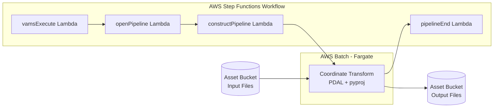

# Coordinate Transform Pipeline

The Coordinate Transform pipeline reprojects point cloud files between coordinate reference systems (CRS). It supports E57, LAS, LAZ, and PLY input formats and can output to LAZ, LAS, E57, or PLY. The pipeline runs as an AWS Batch Fargate container with PDAL-based transformation and supports per-asset CRS configuration through VAMS metadata.

## Supported Formats

| Format | Extension | Notes                                                     |
| :----- | :-------- | :-------------------------------------------------------- |
| E57    | `.e57`    | ASTM standard for 3D imaging data                         |
| LAS    | `.las`    | ASPRS LiDAR data exchange format                          |
| LAZ    | `.laz`    | Compressed LAS format                                     |
| PLY    | `.ply`    | Polygon File Format (point cloud variant)                 |

## Architecture



### Processing Flow

1. The `vamsExecute` Lambda receives the workflow event and invokes `openPipeline`.
2. `openPipeline` starts the AWS Step Functions state machine with input parameters and Amazon S3 paths.
3. `constructPipeline` merges pipeline default parameters with asset metadata overrides and builds the pipeline definition for the container.
4. AWS Batch submits an AWS Fargate job. The container downloads the input file, performs the coordinate transformation using PDAL and pyproj, and uploads output files to Amazon S3.
5. The container sends a task token callback to AWS Step Functions on completion.
6. `pipelineEnd` finalizes the workflow execution.

### Container Image Build

The container image is built via AWS CodeBuild during CDK deployment. When `useCodeBuild` is enabled, CDK uploads the container source to Amazon S3, and a custom resource triggers CodeBuild to build and push the image to Amazon ECR. The container includes PDAL, pyproj, and the coordinate transformation logic.

## Configuration

Enable this pipeline in `infra/config/config.json`:

```json
{
    "app": {
        "pipelines": {
            "useConversionCoordinateTransform": {
                "enabled": true,
                "useCodeBuild": true,
                "autoRegisterWithVAMS": true,
                "autoRegisterAutoTriggerOnFileUpload": false
            }
        }
    }
}
```

### Configuration Options

| Option                                | Default | Description                                                                                                                                 |
| :------------------------------------ | :------ | :------------------------------------------------------------------------------------------------------------------------------------------ |
| `enabled`                             | `false` | Deploy the coordinate transform pipeline infrastructure. Enables the global VPC.                                                            |
| `useCodeBuild`                        | `true`  | Build the container image via AWS CodeBuild during deployment. When enabled, CodeBuild runs outside the VPC to pull public base images.     |
| `autoRegisterWithVAMS`                | `true`  | Automatically register the pipeline and workflow in the global VAMS database during CDK deployment.                                         |
| `autoRegisterAutoTriggerOnFileUpload` | `false` | Automatically trigger the pipeline when E57, LAS, LAZ, or PLY files are uploaded. Requires `autoRegisterWithVAMS` to be enabled.            |

## Input Parameters

The pipeline accepts transform parameters that control the coordinate reprojection. Parameters can be provided in two ways:

1. **Pipeline defaults** -- configured during pipeline registration (the `inputParameters` field in the pipeline definition).
2. **Asset metadata overrides** -- set as metadata key-value pairs on individual assets. Metadata values override pipeline defaults.

### Parameter Reference

| Parameter              | Type    | Required | Default | Description                                                              |
| :--------------------- | :------ | :------- | :------ | :----------------------------------------------------------------------- |
| `sourceCrs`            | string  | Yes      | --      | Source coordinate reference system (EPSG code, WKT, or PROJ string)      |
| `targetCrs`            | string  | Yes      | --      | Target coordinate reference system (EPSG code, WKT, or PROJ string)      |
| `outputFormats`        | array   | No       | `[laz]` | Output format(s): `laz`, `las`, `e57`, `ply`                             |
| `sourceScaleFactor`    | number  | No       | `1.0`   | Scale factor for source grid                                             |
| `targetScaleFactor`    | number  | No       | `1.0`   | Scale factor for target grid                                             |
| `applyScaleCorrection` | boolean | No       | `true`  | Whether to apply scale factor correction during transformation           |
| `combinedScaleFactor`  | number  | No       | --      | Override: apply a single combined scale factor directly                   |
| `chunkSize`            | number  | No       | 1000000 | Number of points per processing chunk                                    |
| `enforceSourceCrs`     | boolean | No       | `true`  | Block processing if detected CRS does not match configured source CRS    |
| `onMismatch`           | string  | No       | `warn`  | Action on CRS mismatch: `error`, `warn`, or `skip`                       |
| `compressLaz`          | boolean | No       | `true`  | Whether to compress LAZ output                                           |

### Example Input Parameters

```json
{
    "sourceCrs": "EPSG:27700",
    "targetCrs": "EPSG:4326",
    "outputFormats": ["laz", "e57"],
    "applyScaleCorrection": true
}
```

## Asset Metadata Overrides

The coordinate transform pipeline supports per-asset configuration via VAMS metadata fields. When a workflow executes, the asset's metadata is passed to the pipeline and any recognized keys override the pipeline's default parameters.

This allows you to set different source and target CRS values for individual assets without modifying the pipeline registration.

### How It Works

1. Set metadata on an asset in VAMS (via the web UI, API, or CLI) using recognized key names.
2. When the pipeline runs for that asset, the `constructPipeline` Lambda reads the asset metadata from the workflow event.
3. Recognized metadata keys are merged into the transform parameters, with metadata values taking priority over pipeline defaults.

### Recognized Metadata Keys

The following metadata key names are recognized (case-insensitive):

| Metadata Key           | Maps To                | Notes                                                  |
| :--------------------- | :--------------------- | :----------------------------------------------------- |
| `sourceCrs`            | `sourceCrs`            | EPSG code, WKT, or PROJ string                         |
| `targetCrs`            | `targetCrs`            | EPSG code, WKT, or PROJ string                         |
| `outputFormats`        | `outputFormats`        | Comma-separated string (for example, `laz,e57`)        |
| `sourceScaleFactor`    | `sourceScaleFactor`    | Numeric value                                          |
| `targetScaleFactor`    | `targetScaleFactor`    | Numeric value                                          |
| `applyScaleCorrection` | `applyScaleCorrection` | `true` or `false`                                      |
| `combinedScaleFactor`  | `combinedScaleFactor`  | Numeric value                                          |
| `chunkSize`            | `chunkSize`            | Numeric value                                          |
| `enforceSourceCrs`     | `enforceSourceCrs`     | `true` or `false`                                      |
| `onMismatch`           | `onMismatch`           | `error`, `warn`, or `skip`                             |
| `compressLaz`          | `compressLaz`          | `true` or `false`                                      |

:::tip[Per-Asset CRS Configuration]
Set `sourceCrs` and `targetCrs` as metadata on each asset to define the correct coordinate systems for that specific scan. This is particularly useful when a database contains point clouds from multiple survey sites with different native coordinate systems.
:::

### Example Workflow

1. Upload a LAS file captured in British National Grid:
   - Set asset metadata: `sourceCrs` = `EPSG:27700`
2. Configure the pipeline default `targetCrs` as `EPSG:4326` (WGS84).
3. When the workflow triggers, the pipeline reads `sourceCrs` from asset metadata and `targetCrs` from pipeline defaults.
4. The output LAZ file is reprojected to WGS84.

## Prerequisites

### VPC with Private Subnets

This pipeline runs on AWS Batch with AWS Fargate compute. Enabling it automatically sets `app.useGlobalVpc.enabled` to `true`. The VPC builder creates the required VPC endpoints for AWS Batch, Amazon ECR, and Amazon ECR Docker.

### CodeBuild Internet Access

When `useCodeBuild` is enabled, the CodeBuild project runs **outside the VPC** to pull public base images from Amazon ECR Public during container builds. It accesses Amazon ECR and Amazon S3 via IAM credentials.

## Infrastructure Components

The following AWS resources are created when this pipeline is enabled:

| Resource                     | Service            | Purpose                                                           |
| :--------------------------- | :----------------- | :---------------------------------------------------------------- |
| Fargate Compute Environment  | AWS Batch          | Serverless container execution                                    |
| Job Queue                    | AWS Batch          | Job scheduling and prioritization                                 |
| Job Definition               | AWS Batch          | Container configuration (60 GiB ephemeral storage)                |
| Container Repository         | Amazon ECR         | Stores the coordinate transform container image                   |
| CodeBuild Project            | AWS CodeBuild      | Builds and pushes the container image to Amazon ECR               |
| Step Functions State Machine | AWS Step Functions | Workflow orchestration with 4-hour timeout                        |
| Lambda Functions (4)         | AWS Lambda         | Pipeline coordination (vamsExecute, openPipeline, constructPipeline, pipelineEnd) |

## Troubleshooting

### Container Fails to Start

If the AWS Batch job fails immediately, check that the CodeBuild project completed successfully:

```bash
aws codebuild list-builds-for-project \
    --project-name <CodeBuild-project-name> \
    --sort-order DESCENDING \
    --region <region>
```

Verify the build status is `SUCCEEDED` and the Amazon ECR repository contains the `latest` tag.

### Missing sourceCrs or targetCrs

The container requires both `sourceCrs` and `targetCrs` to be present in the final merged parameters. If neither the pipeline defaults nor the asset metadata provide these values, the pipeline fails with:

```
inputParameters must include 'sourceCrs' and 'targetCrs'
```

Ensure at least one source provides both CRS values.

### CRS Mismatch Errors

If `enforceSourceCrs` is `true` (default) and the file's embedded CRS does not match the configured `sourceCrs`, the pipeline behavior depends on the `onMismatch` setting:

- `error` -- Pipeline fails immediately
- `warn` -- Pipeline continues with a warning in the output report
- `skip` -- File is skipped without processing

## Related Resources

-   [Pipeline System Overview](overview.md)
-   [Potree Point Cloud Viewer Pipeline](potree-viewer.md) -- converts point clouds to Potree octree format for web viewing
-   [Configuration Reference](../deployment/configuration-reference.md) -- all pipeline configuration options
