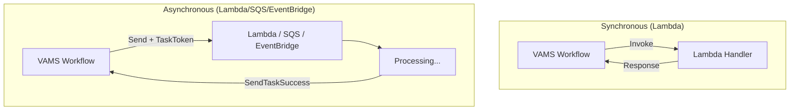
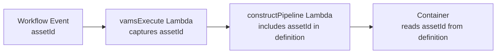

# Building custom pipelines

VAMS provides a flexible pipeline framework that supports three execution types for processing 3D assets: AWS Lambda, Amazon Simple Queue Service (Amazon SQS), and Amazon EventBridge. This guide covers the architecture patterns, development workflow, and conventions for building custom pipelines.

## Pipeline execution types

VAMS supports three pipeline execution types. Each type determines how the pipeline receives work and reports completion.

| Execution type  | Transport                | Sync/Async | Best for                                                            |
| --------------- | ------------------------ | ---------- | ------------------------------------------------------------------- |
| **Lambda**      | AWS Lambda invoke        | Both       | Quick processing tasks, internal pipelines, container orchestration |
| **SQS**         | Amazon SQS message       | Async only | External systems that poll for work, fan-out patterns               |
| **EventBridge** | Amazon EventBridge event | Async only | Loosely coupled integrations, cross-account pipelines               |

### Synchronous vs. asynchronous execution

-   **Synchronous (Lambda only)** -- The VAMS workflow invokes the Lambda function and waits for a response. Suitable for operations that complete within the Lambda timeout (15 minutes).
-   **Asynchronous (all types)** -- The VAMS workflow sends work and waits for a callback via an AWS Step Functions task token. The pipeline must call `SendTaskSuccess` or `SendTaskFailure` when processing is complete. Set `waitForCallback` to `"Enabled"` when registering the pipeline.



## Creating a Lambda pipeline

The most common pipeline type uses AWS Lambda for orchestration with AWS Batch or Amazon ECS for heavy compute. Follow these steps to create a new pipeline.

### Step 1: Create the pipeline handler code

Create a directory under `backendPipelines/` for your pipeline:

```
backendPipelines/
  yourCategory/
    yourPipeline/
      lambda/
        __init__.py
        vamsExecuteYourPipeline.py    # VAMS entry point
        openPipeline.py               # Starts Step Functions
        constructPipeline.py          # Builds pipeline definition
        pipelineEnd.py                # Cleanup and callback
        customLogging/
          __init__.py
          logger.py
      container/                      # Optional: container code
        Dockerfile
        __main__.py
        requirements.txt
```

#### vamsExecute Lambda

This is the entry point that VAMS calls. It receives the workflow payload and forwards it to the internal `openPipeline` Lambda.

```python
import os
import boto3
import json
from customLogging.logger import safeLogger

OPEN_PIPELINE_FUNCTION_NAME = os.environ["OPEN_PIPELINE_FUNCTION_NAME"]
logger = safeLogger(service="VamsExecuteYourPipeline")
lambda_client = boto3.client("lambda")

def lambda_handler(event, context):
    # Parse the VAMS workflow payload
    data = json.loads(event["body"]) if isinstance(event.get("body"), str) else event["body"]

    # Task token is required for async pipelines
    external_task_token = data.get("TaskToken")
    if not external_task_token:
        raise Exception("TaskToken not found in pipeline input")

    # Forward all S3 paths -- never hardcode empty strings
    message_payload = {
        "inputS3AssetFilePath": data["inputS3AssetFilePath"],
        "outputS3AssetFilesPath": data["outputS3AssetFilesPath"],
        "outputS3AssetPreviewPath": data["outputS3AssetPreviewPath"],
        "outputS3AssetMetadataPath": data["outputS3AssetMetadataPath"],
        "inputOutputS3AssetAuxiliaryFilesPath": data["inputOutputS3AssetAuxiliaryFilesPath"],
        "inputMetadata": data.get("inputMetadata", ""),
        "inputParameters": data.get("inputParameters", ""),
        "sfnExternalTaskToken": external_task_token,
    }

    lambda_client.invoke(
        FunctionName=OPEN_PIPELINE_FUNCTION_NAME,
        InvocationType="RequestResponse",
        Payload=json.dumps(message_payload).encode("utf-8"),
    )

    return {"statusCode": 200, "body": "Success"}
```

:::warning[Always pass through all S3 output paths]
The `vamsExecute` Lambda must forward all output paths (`outputS3AssetFilesPath`, `outputS3AssetPreviewPath`, `outputS3AssetMetadataPath`, `inputOutputS3AssetAuxiliaryFilesPath`) from the workflow payload. Never hardcode empty strings. The workflow's process-output step relies on finding files at these locations.
:::

#### constructPipeline Lambda

Builds the pipeline definition that tells the container what to process and where to write output.

```python
import json
import os

def lambda_handler(event, context):
    input_uri = event["inputS3AssetFilePath"]
    output_uri = event["outputS3AssetFilesPath"]
    auxiliary_uri = event["inputOutputS3AssetAuxiliaryFilesPath"]

    input_bucket, input_key = input_uri.replace("s3://", "").split("/", 1)
    output_bucket, output_key = output_uri.replace("s3://", "").split("/", 1)

    definition = {
        "jobName": event.get("jobName"),
        "stages": [{
            "type": "YOUR_STAGE",
            "inputFile": {
                "bucketName": input_bucket,
                "objectKey": input_key,
            },
            "outputFiles": {
                "bucketName": output_bucket,
                "objectDir": output_key,
            },
        }],
        "externalSfnTaskToken": event.get("externalSfnTaskToken", ""),
    }

    return {
        "jobName": event.get("jobName"),
        "definition": [json.dumps(definition)],
        "status": "STARTING",
    }
```

### Step 2: Create the CDK nested stack

Create the infrastructure under `infra/lib/nestedStacks/pipelines/yourCategory/yourPipeline/`:

```
infra/lib/nestedStacks/pipelines/
  yourCategory/
    yourPipeline/
      yourPipelineBuilder-nestedStack.ts    # Stack definition
      constructs/
        yourPipeline-construct.ts           # Infrastructure construct
      lambdaBuilder/
        yourPipelineFunctions.ts            # Lambda builder functions
```

The construct file creates:

-   AWS Batch or Amazon ECS compute resources (if using containers)
-   Lambda functions for pipeline orchestration
-   AWS Step Functions state machine
-   IAM roles and policies
-   Amazon CloudWatch log groups

### Step 3: Create the Lambda builder functions

Follow the standard Lambda builder pattern in the `lambdaBuilder/` file:

```typescript
export function buildVamsExecuteYourPipelineFunction(
    scope: Construct,
    lambdaCommonBaseLayer: LayerVersion,
    auxiliaryBucket: s3.Bucket,
    openPipelineFunction: lambda.Function,
    config: Config.Config,
    vpc: ec2.IVpc,
    subnets: ec2.ISubnet[],
    kmsKey?: kms.IKey
): lambda.Function {
    const fun = new lambda.Function(scope, "vamsExecuteYourPipeline", {
        code: lambda.Code.fromAsset(
            path.join(
                __dirname,
                "../../../../../../../backendPipelines/yourCategory/yourPipeline/lambda"
            )
        ),
        handler: "vamsExecuteYourPipeline.lambda_handler",
        runtime: Config.LAMBDA_PYTHON_RUNTIME,
        layers: [lambdaCommonBaseLayer],
        timeout: Duration.minutes(15),
        memorySize: Config.LAMBDA_MEMORY_SIZE,
        environment: {
            OPEN_PIPELINE_FUNCTION_NAME: openPipelineFunction.functionName,
        },
    });

    openPipelineFunction.grantInvoke(fun);
    return fun;
}
```

### Step 4: Add the configuration flag

Add your pipeline configuration to the `ConfigPublic` interface in `infra/config/config.ts`:

```typescript
// In the pipelines section of ConfigPublic
useYourPipeline: {
    enabled: boolean;
    autoRegisterWithVAMS: boolean;
}
```

Add backward-compatibility defaults in `getConfig()`:

```typescript
if (config.app.pipelines.useYourPipeline == undefined) {
    config.app.pipelines.useYourPipeline = {
        enabled: false,
        autoRegisterWithVAMS: true,
    };
}
```

### Step 5: Register in the pipeline builder

Add your pipeline to `infra/lib/nestedStacks/pipelines/pipelineBuilder-nestedStack.ts`:

```typescript
if (props.config.app.pipelines.useYourPipeline.enabled) {
    const yourPipelineNestedStack = new YourPipelineNestedStack(this, "YourPipelineNestedStack", {
        ...props,
        config: props.config,
        storageResources: props.storageResources,
        vpc: props.vpc,
        pipelineSubnets: pipelineNetwork.isolatedSubnets.pipeline,
        pipelineSecurityGroups: [pipelineNetwork.securityGroups.pipeline],
        lambdaCommonBaseLayer: props.lambdaCommonBaseLayer,
        importGlobalPipelineWorkflowFunctionName: props.importGlobalPipelineWorkflowFunctionName,
    });
    this.pipelineVamsLambdaFunctionNames.push(
        yourPipelineNestedStack.pipelineVamsLambdaFunctionName
    );
}
```

### Step 6: Add VPC endpoint conditions

If your pipeline uses AWS Batch, Amazon ECS, or Amazon ECR, add your pipeline's config flag to the VPC endpoint conditions in `infra/lib/nestedStacks/vpc/vpcBuilder-nestedStack.ts`. This ensures that Batch, ECR, and ECR Docker VPC endpoints are created when your pipeline is enabled.

Pipelines that require internet access (for example, AWS Marketplace integrations) should also be added to the public/private subnet configuration condition and the ECS endpoint condition.

## Amazon S3 output path conventions

The VAMS workflow generates several Amazon S3 paths that are passed to each pipeline step. Using the correct path for each output type is critical for the workflow's process-output step to function correctly.

| Path variable                          | Bucket           | Purpose                                                            | Versioned |
| -------------------------------------- | ---------------- | ------------------------------------------------------------------ | --------- |
| `outputS3AssetFilesPath`               | Asset bucket     | File-level outputs: new files, file previews (`.previewFile.X`)    | Yes       |
| `outputS3AssetPreviewPath`             | Asset bucket     | Asset-level preview images only (whole-asset representative image) | Yes       |
| `outputS3AssetMetadataPath`            | Asset bucket     | Metadata files produced by the pipeline                            | Yes       |
| `inputOutputS3AssetAuxiliaryFilesPath` | Auxiliary bucket | Temporary working files or special non-versioned viewer data       | No        |

:::note[Key distinction]
`outputS3AssetFilesPath` is for file-level outputs including `.previewFile.gif/.jpg/.png` thumbnails tied to specific files. `outputS3AssetPreviewPath` is only for asset-level preview images that represent the entire asset. Most pipelines producing file previews should write to `outputS3AssetFilesPath`.
:::

### When to use each path

-   **`outputS3AssetFilesPath`** -- Use for all standard pipeline outputs: converted files, generated thumbnails (`.previewFile.X`), and any new files that should be tracked as part of the asset.
-   **`outputS3AssetPreviewPath`** -- Use only for a single representative preview image of the entire asset. Do not use for file-level previews.
-   **`outputS3AssetMetadataPath`** -- Use for metadata JSON files (for example, `asset.metadata.json`) that the process-output step reads to update asset metadata in VAMS.
-   **`inputOutputS3AssetAuxiliaryFilesPath`** -- Use for temporary files during processing or for special non-versioned data that the frontend reads directly (for example, Potree octree viewer files).

## Preserving relative paths in output

When a pipeline writes output files that correspond to a specific input file (for example, `.previewFile.X` thumbnails), the output must preserve the input file's relative path within the asset. The process-output step expects outputs at the same relative location as the input.

Asset files are stored at `{assetId}/{relative_path}/{filename}`. The relative path may include zero or more subdirectories between the asset ID and the filename.

```
Input key:  xd130a6d6.../test/pump.e57
Output dir: xd130a6d6.../

Correct output: xd130a6d6.../test/pump.e57.previewFile.gif
Wrong output:   xd130a6d6.../pump.e57.previewFile.gif   (relative path lost)
```

### Computing the relative subdirectory

The `assetId` is passed as a workflow state variable. Thread it through the entire pipeline chain and use it in the container to compute the relative subdirectory:

```python
# assetId comes from the pipeline definition (threaded from workflow state)
input_parts = stage_input.objectKey.split("/")
asset_id_idx = input_parts.index(assetId)
relative_subdir = "/".join(input_parts[asset_id_idx + 1:-1])  # "" if file is at asset root
```

## Threading assetId through the pipeline

The `assetId` is a workflow state variable that must be threaded through every stage of the pipeline chain. Never attempt to derive the asset ID from Amazon S3 path segments.



```python
# In vamsExecute Lambda: capture assetId from event body
message_payload = {
    "assetId": data.get("assetId", ""),
    # ... other fields
}

# In constructPipeline Lambda: include in definition
definition = {
    "assetId": event.get("assetId", ""),
    # ... stages
}

# In container: read from pipeline definition
asset_id = pipeline_definition.get("assetId")
```

## Amazon SQS pipeline pattern

Amazon SQS pipelines send processing requests to an Amazon SQS queue. An external consumer polls the queue, processes the message, and optionally sends a callback.

### Registration

```python
# Register via API or auto-registration
{
    "pipelineId": "my-sqs-pipeline",
    "pipelineExecutionType": "SQS",
    "sqsQueueUrl": "https://sqs.us-east-1.amazonaws.com/123456789012/my-queue",
    "waitForCallback": "Enabled"
}
```

### Message format

The VAMS workflow sends a JSON message to the queue containing the input file path, output paths, metadata, parameters, and (when callback is enabled) an AWS Step Functions task token.

### Callback

When `waitForCallback` is `"Enabled"`, the message includes a `TaskToken` field. The consumer must call `SendTaskSuccess` or `SendTaskFailure` on the AWS Step Functions API when processing is complete.

```python
import boto3

sfn_client = boto3.client("stepfunctions")

# On success
sfn_client.send_task_success(
    taskToken=task_token,
    output=json.dumps({"status": "SUCCEEDED"})
)

# On failure
sfn_client.send_task_failure(
    taskToken=task_token,
    error="ProcessingError",
    cause="Description of what went wrong"
)
```

## Amazon EventBridge pipeline pattern

Amazon EventBridge pipelines publish processing requests as events to an Amazon EventBridge event bus. This pattern enables loosely coupled integrations with external systems and cross-account pipelines.

### Registration

```python
{
    "pipelineId": "my-eventbridge-pipeline",
    "pipelineExecutionType": "EventBridge",
    "eventBridgeBusArn": "arn:aws:events:us-east-1:123456789012:event-bus/my-bus",
    "eventBridgeSource": "vams.pipeline",
    "eventBridgeDetailType": "PipelineExecution",
    "waitForCallback": "Enabled"
}
```

### Event format

The VAMS workflow publishes an event with the configured source and detail type. The event detail contains the input file path, output paths, metadata, parameters, and (when callback is enabled) an AWS Step Functions task token.

### Callback

The callback mechanism is identical to the Amazon SQS pattern. The event consumer calls `SendTaskSuccess` or `SendTaskFailure` with the task token from the event detail.

## Auto-registration and auto-trigger

Pipelines can be automatically registered with VAMS at deploy time using a CDK custom resource. This eliminates the need for manual pipeline registration through the API.

### Auto-registration

Set `autoRegisterWithVAMS` to `true` in the pipeline configuration. The CDK construct uses a custom resource provider to call the VAMS pipeline/workflow import function during deployment.

### Auto-trigger on file upload

Set `autoRegisterAutoTriggerOnFileUpload` to `true` and specify the file extensions that should trigger the workflow. When a file with a matching extension is uploaded to VAMS, the workflow runs automatically.

```json
{
    "autoTriggerOnFileExtensionsUpload": ".stl,.obj,.ply,.glb"
}
```

## Testing pipelines locally

### Container testing

Most pipeline containers support a `localTest` mode for development:

```bash
# Build the container
docker build -f Dockerfile -t my-pipeline:v1 .

# Run with local test input
docker run -it \
  -v ${PWD}/inputTest:/data/input:ro \
  -v ${PWD}/outputTest:/data/output:rw \
  my-pipeline:v1 "localTest" "YOUR_STAGE"
```

### Lambda testing

Test Lambda handlers locally with a mock event payload:

```python
event = {
    "body": json.dumps({
        "inputS3AssetFilePath": "s3://bucket/asset-id/model.glb",
        "outputS3AssetFilesPath": "s3://bucket/asset-id/",
        "outputS3AssetPreviewPath": "s3://bucket/asset-id/",
        "outputS3AssetMetadataPath": "s3://bucket/asset-id/",
        "inputOutputS3AssetAuxiliaryFilesPath": "s3://aux-bucket/asset-id/",
        "TaskToken": "test-token",
        "inputParameters": "",
        "inputMetadata": "",
    })
}
```

## Development checklist

Use this checklist when building a new pipeline:

-   [ ] Pipeline handler code created under `backendPipelines/`
-   [ ] `vamsExecute` Lambda passes through all Amazon S3 output paths (never hardcodes empty strings)
-   [ ] `constructPipeline` Lambda uses the correct output path for the pipeline's output type
-   [ ] Container preserves relative paths when writing asset-adjacent files
-   [ ] `assetId` is threaded through the entire chain (vamsExecute -> constructPipeline -> container)
-   [ ] CDK nested stack created with Lambda builders, AWS Step Functions, and compute resources
-   [ ] All Lambda builders follow the standard security pattern (4 required security calls)
-   [ ] Configuration flag added to `ConfigPublic` with backward-compatibility defaults in `getConfig()`
-   [ ] Validation added in `getConfig()` for any required sub-options
-   [ ] Pipeline registered in `pipelineBuilder-nestedStack.ts`
-   [ ] VPC endpoint conditions updated if pipeline uses AWS Batch, Amazon ECS, or Amazon ECR
-   [ ] CDK Nag suppressions added with detailed justification
-   [ ] Configuration documented in the [Configuration Reference](../deployment/configuration-reference.md)

## Related pages

-   [Pipeline overview](overview.md)
-   [Deployment configuration](../deployment/configuration-reference.md)
