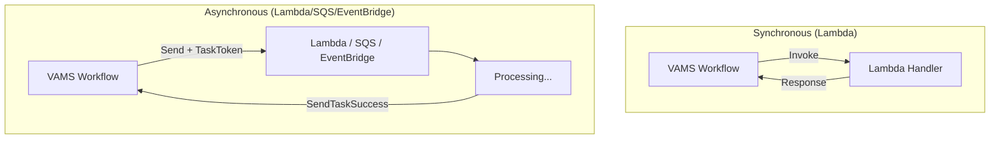
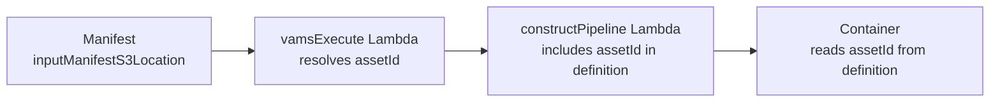

# Building custom pipelines

VAMS provides a flexible pipeline framework that supports four execution types for processing 3D assets: AWS Lambda, Amazon Simple Queue Service (Amazon SQS), Amazon EventBridge, and AWS Deadline Cloud. This guide covers the architecture patterns, development workflow, and conventions for building custom pipelines.

## Pipeline execution types

VAMS supports four pipeline execution types. Each type determines how the pipeline receives work and reports completion.

| Execution type    | Transport                | Sync/Async | Best for                                                            |
| ----------------- | ------------------------ | ---------- | ------------------------------------------------------------------- |
| **Lambda**        | AWS Lambda invoke        | Both       | Quick processing tasks, internal pipelines, container orchestration |
| **SQS**           | Amazon SQS message       | Async only | External systems that poll for work, fan-out patterns               |
| **EventBridge**   | Amazon EventBridge event | Async only | Loosely coupled integrations, cross-account pipelines               |
| **DeadlineCloud** | AWS Deadline Cloud job   | Async only | Render-farm and batch job submission (callback always required)     |

### Synchronous vs. asynchronous execution

-   **Synchronous (Lambda only)** -- The VAMS workflow invokes the Lambda function and waits for a response. Suitable for operations that complete within the Lambda timeout (15 minutes).
-   **Asynchronous (all other types)** -- The VAMS workflow sends work and waits for a callback via an AWS Step Functions task token. The pipeline must call `SendTaskSuccess` or `SendTaskFailure` when processing is complete. Set `waitForCallback` to `"Enabled"` when registering the pipeline.


```mermaid
flowchart TD
    subgraph "Synchronous (Lambda)"
        A1[VAMS Workflow] -->|Invoke| B1[Lambda Handler]
        B1 -->|Response| A1
    end

    subgraph "Asynchronous (Lambda/SQS/EventBridge)"
        A2[VAMS Workflow] -->|Send + TaskToken| B2[Lambda / SQS / EventBridge]
        B2 --> C2[Processing...]
        C2 -->|SendTaskSuccess| A2
    end
```

## Creating a Lambda pipeline

The most common pipeline type uses AWS Lambda for orchestration with AWS Batch or Amazon ECS for heavy compute. Follow these steps to create a new pipeline.

### Step 1: Create the pipeline handler code

Create a directory under `backendPipelines/` for your pipeline:

```
backendPipelines/
  yourCategory/
    yourPipeline/
      lambda/
        __init__.py
        vamsExecuteYourPipeline.py    # VAMS entry point
        openPipeline.py               # Starts Step Functions
        constructPipeline.py          # Builds pipeline definition
        pipelineEnd.py                # Cleanup and callback
        manifestHelper.py             # Resolves the manifest (copy from an existing pipeline)
        customLogging/                # Required in every pipeline lambda/ directory
          __init__.py
          logger.py
      vamsSchema/                     # Registration bundle
        pipeline.json
        workflow.json
        templates/
      container/                      # Optional: container code
        Dockerfile
        __main__.py
        requirements.txt
```

The `customLogging/` package and `manifestHelper.py` are copied into each pipeline's `lambda/`
directory — copy both from an existing pipeline, for example
`backendPipelines/3dRecon/splatToolbox/lambda/`. Without the local `customLogging/` package the Lambda
function fails at import with `No module named 'customLogging'`.

#### vamsExecute Lambda

This is the entry point that VAMS calls. It receives the workflow payload and forwards it to the internal `openPipeline` Lambda.

```python
import os
import boto3
import json
import manifestHelper
from customLogging.logger import safeLogger

OPEN_PIPELINE_FUNCTION_NAME = os.environ["OPEN_PIPELINE_FUNCTION_NAME"]
logger = safeLogger(service="VamsExecuteYourPipeline")
lambda_client = boto3.client("lambda")
s3_client = boto3.client("s3")

def lambda_handler(event, context):
    # The workflow payload carries the identity fields plus the manifest location.
    data = json.loads(event["body"]) if isinstance(event.get("body"), str) else event["body"]

    # Task token is required for async pipelines
    external_task_token = data.get("TaskToken")
    if not external_task_token:
        raise Exception("TaskToken not found in pipeline input")

    # Input files, output locations, and asset identity all come from the manifest.
    resolved = manifestHelper.resolve_pipeline_inputs(data, s3_client)

    # Forward all S3 paths -- never hardcode empty strings
    message_payload = {
        "inputS3AssetFilePath": resolved["inputS3AssetFilePath"],
        "outputS3AssetFilesPath": resolved["outputS3AssetFilesPath"],
        "outputS3AssetPreviewPath": resolved["outputS3AssetPreviewPath"],
        "outputS3AssetMetadataPath": resolved["outputS3AssetMetadataPath"],
        "inputOutputS3AssetAuxiliaryFilesPath": resolved["inputOutputS3AssetAuxiliaryFilesPath"],
        "assetId": resolved["assetId"],
        "databaseId": resolved["databaseId"],
        "inputMetadataS3Location": resolved["inputMetadataS3Location"],
        "inputConfigurationS3Location": resolved["inputConfigurationS3Location"],
        "sfnExternalTaskToken": external_task_token,
    }

    lambda_client.invoke(
        FunctionName=OPEN_PIPELINE_FUNCTION_NAME,
        InvocationType="RequestResponse",
        Payload=json.dumps(message_payload).encode("utf-8"),
    )

    return {"statusCode": 200, "body": "Success"}
```

:::warning[Resolve inputs from the manifest, then pass every output path through]
The payload does **not** contain `inputS3AssetFilePath` or the output paths -- resolve them from the
manifest with `manifestHelper.resolve_pipeline_inputs()`. Then forward all of them
(`outputS3AssetFilesPath`, `outputS3AssetPreviewPath`, `outputS3AssetMetadataPath`,
`inputOutputS3AssetAuxiliaryFilesPath`) to `constructPipeline`, and never hardcode empty strings: the
workflow's process-output step relies on finding files at those locations. See
[The pipeline input contract](#the-pipeline-input-contract).
:::

#### constructPipeline Lambda

Builds the pipeline definition that tells the container what to process and where to write output.

```python
import json
import os

def lambda_handler(event, context):
    input_uri = event["inputS3AssetFilePath"]
    output_uri = event["outputS3AssetFilesPath"]
    auxiliary_uri = event["inputOutputS3AssetAuxiliaryFilesPath"]

    input_bucket, input_key = input_uri.replace("s3://", "").split("/", 1)
    output_bucket, output_key = output_uri.replace("s3://", "").split("/", 1)

    definition = {
        "jobName": event.get("jobName"),
        # assetId is threaded through so the container can preserve each input file's
        # relative path within the asset. Never derive it from S3 path segments.
        "assetId": event.get("assetId", ""),
        "databaseId": event.get("databaseId", ""),
        "stages": [{
            "type": "YOUR_STAGE",
            "inputFile": {
                "bucketName": input_bucket,
                "objectKey": input_key,
            },
            "outputFiles": {
                "bucketName": output_bucket,
                "objectDir": output_key,
            },
        }],
        "externalSfnTaskToken": event.get("externalSfnTaskToken", ""),
    }

    return {
        "jobName": event.get("jobName"),
        "definition": [json.dumps(definition)],
        "status": "STARTING",
    }
```

### Step 2: Create the CDK nested stack

Create the infrastructure under `infra/lib/nestedStacks/pipelines/yourCategory/yourPipeline/`:

```
infra/lib/nestedStacks/pipelines/
  yourCategory/
    yourPipeline/
      yourPipelineBuilder-nestedStack.ts    # Stack definition
      constructs/
        yourPipeline-construct.ts           # Infrastructure construct
      lambdaBuilder/
        yourPipelineFunctions.ts            # Lambda builder functions
```

The construct file creates:

-   AWS Batch or Amazon ECS compute resources (if using containers)
-   Lambda functions for pipeline orchestration
-   AWS Step Functions state machine
-   IAM roles and policies
-   Amazon CloudWatch log groups

### Step 3: Create the Lambda builder functions

Follow the standard Lambda builder pattern in the `lambdaBuilder/` file:

```typescript
export function buildVamsExecuteYourPipelineFunction(
    scope: Construct,
    lambdaCommonBaseLayer: LayerVersion,
    auxiliaryBucket: s3.Bucket,
    openPipelineFunction: lambda.Function,
    config: Config.Config,
    vpc: ec2.IVpc,
    subnets: ec2.ISubnet[],
    kmsKey?: kms.IKey
): lambda.Function {
    const fun = new lambda.Function(scope, "vamsExecuteYourPipeline", {
        code: lambda.Code.fromAsset(
            path.join(
                __dirname,
                "../../../../../../../backendPipelines/yourCategory/yourPipeline/lambda"
            )
        ),
        handler: "vamsExecuteYourPipeline.lambda_handler",
        runtime: Config.LAMBDA_PYTHON_RUNTIME,
        layers: [lambdaCommonBaseLayer],
        timeout: Duration.minutes(15),
        memorySize: Config.LAMBDA_MEMORY_SIZE,
        environment: {
            OPEN_PIPELINE_FUNCTION_NAME: openPipelineFunction.functionName,
        },
    });

    openPipelineFunction.grantInvoke(fun);
    return fun;
}
```

### Step 4: Add the configuration flag

Add your pipeline configuration to the `ConfigPublic` interface in `infra/config/config.ts`:

```typescript
// In the pipelines section of ConfigPublic
useYourPipeline: {
    enabled: boolean;
    autoRegisterWithVAMS: boolean;
}
```

Add backward-compatibility defaults in `getConfig()`:

```typescript
if (config.app.pipelines.useYourPipeline == undefined) {
    config.app.pipelines.useYourPipeline = {
        enabled: false,
        autoRegisterWithVAMS: true,
    };
}
```

### Step 5: Register in the pipeline builder

Add your pipeline to `infra/lib/nestedStacks/pipelines/pipelineBuilder-nestedStack.ts`:

```typescript
if (props.config.app.pipelines.useYourPipeline.enabled) {
    const yourPipelineNestedStack = new YourPipelineNestedStack(this, "YourPipelineNestedStack", {
        ...props,
        config: props.config,
        storageResources: props.storageResources,
        vpc: props.vpc,
        pipelineSubnets: pipelineNetwork.isolatedSubnets.pipeline,
        pipelineSecurityGroups: [pipelineNetwork.securityGroups.pipeline],
        lambdaCommonBaseLayer: props.lambdaCommonBaseLayer,
        importGlobalPipelineWorkflowV2FunctionName:
            props.importGlobalPipelineWorkflowV2FunctionName,
    });
    this.pipelineVamsLambdaFunctionNames.push(
        yourPipelineNestedStack.pipelineVamsLambdaFunctionName
    );
}
```

### Step 6: Add VPC endpoint conditions

If your pipeline uses AWS Batch, Amazon ECS, or Amazon ECR, add your pipeline's config flag to the VPC endpoint conditions in `infra/lib/nestedStacks/vpc/vpcBuilder-nestedStack.ts`. This ensures that Batch, ECR, and ECR Docker VPC endpoints are created when your pipeline is enabled.

Pipelines that require internet access (for example, AWS Marketplace integrations) should also be added to the public/private subnet configuration condition and the ECS endpoint condition.

## Amazon S3 output path conventions

The VAMS workflow generates several Amazon S3 paths that are passed to each pipeline step. Using the correct path for each output type is critical for the workflow's process-output step to function correctly.

| Path variable                          | Bucket           | Purpose                                                            | Versioned |
| -------------------------------------- | ---------------- | ------------------------------------------------------------------ | --------- |
| `outputS3AssetFilesPath`               | Asset bucket     | File-level outputs: new files, file previews (`.previewFile.X`)    | Yes       |
| `outputS3AssetPreviewPath`             | Asset bucket     | Asset-level preview images only (whole-asset representative image) | Yes       |
| `outputS3AssetMetadataPath`            | Asset bucket     | Metadata files produced by the pipeline                            | Yes       |
| `inputOutputS3AssetAuxiliaryFilesPath` | Auxiliary bucket | Temporary working files or special non-versioned viewer data       | No        |

:::note[Key distinction]
`outputS3AssetFilesPath` is for file-level outputs including `.previewFile.gif/.jpg/.png` thumbnails tied to specific files. `outputS3AssetPreviewPath` is only for asset-level preview images that represent the entire asset. Most pipelines producing file previews should write to `outputS3AssetFilesPath`.
:::

### When to use each path

-   **`outputS3AssetFilesPath`** -- Use for all standard pipeline outputs: converted files, generated thumbnails (`.previewFile.X`), and any new files that should be tracked as part of the asset.
-   **`outputS3AssetPreviewPath`** -- Use only for a single representative preview image of the entire asset. Do not use for file-level previews.
-   **`outputS3AssetMetadataPath`** -- Use for metadata JSON files (for example, `asset.metadata.json`) that the process-output step reads to update asset metadata in VAMS.
-   **`inputOutputS3AssetAuxiliaryFilesPath`** -- Use for temporary files during processing or for special non-versioned data that the frontend reads directly (for example, Potree octree viewer files).

## Preserving relative paths in output

When a pipeline writes output files that correspond to a specific input file (for example, `.previewFile.X` thumbnails), the output must preserve the input file's relative path within the asset. The process-output step expects outputs at the same relative location as the input.

Asset files are stored at `{assetId}/{relative_path}/{filename}`. The relative path may include zero or more subdirectories between the asset ID and the filename.

```
Input key:  xd130a6d6.../test/pump.e57
Output dir: xd130a6d6.../

Correct output: xd130a6d6.../test/pump.e57.previewFile.gif
Wrong output:   xd130a6d6.../pump.e57.previewFile.gif   (relative path lost)
```

### Computing the relative subdirectory

The `assetId` is resolved from the manifest in the `vamsExecute` Lambda and threaded from there through
the rest of the chain. Use it in the container to compute the relative subdirectory:

```python
# assetId comes from the pipeline definition (resolved from the manifest in vamsExecute)
input_parts = stage_input.objectKey.split("/")
asset_id_idx = input_parts.index(assetId)
relative_subdir = "/".join(input_parts[asset_id_idx + 1:-1])  # "" if file is at asset root
```

## Threading assetId through the pipeline

The task body does not carry `assetId`. Resolve it from the manifest in the `vamsExecute` Lambda, then
thread it through every stage of the chain. Never attempt to derive the asset ID from Amazon S3 path
segments.


```mermaid
flowchart LR
    A[Manifest<br/>inputManifestS3Location] --> B[vamsExecute Lambda<br/>resolves assetId]
    B --> C[constructPipeline Lambda<br/>includes assetId in definition]
    C --> D[Container<br/>reads assetId from definition]
```

```python
# In vamsExecute Lambda: resolve assetId from the manifest
resolved = manifestHelper.resolve_pipeline_inputs(data, s3_client)
message_payload = {
    "assetId": resolved["assetId"],
    # ... other fields
}

# In constructPipeline Lambda: include in definition
definition = {
    "assetId": event.get("assetId", ""),
    # ... stages
}

# In container: read from pipeline definition
asset_id = pipeline_definition.get("assetId")
```

The helper takes the identity from the manifest's first input file, and for a pipeline whose
`inputFileArity` is `none` it falls back to the manifest's `outputTarget` block — so the same call
covers a run that selects no input file.

## The pipeline input contract

Every pipeline -- regardless of execution type -- receives the **same input body**. Only the envelope
differs: an AWS Lambda `Payload`, an Amazon SQS `MessageBody`, an Amazon EventBridge event `Detail`, or
AWS Deadline Cloud job parameters.

The body is deliberately small. It carries the workflow-execution identity, the run's I/O bucket, the
executing-user context, and the **S3 locations of two files**. Everything about the pipeline's inputs
and outputs -- the resolved input files, output and auxiliary locations, asset identity, and
orchestration configuration -- is read from the manifest, not from the body. That keeps the body
input-file-agnostic and multi-file ready.

### Body fields

| Field                                  | Always present | Purpose                                                                    |
| -------------------------------------- | -------------- | -------------------------------------------------------------------------- |
| `workflowDatabaseId`                   | Yes            | Database owning the workflow                                               |
| `workflowId`                           | Yes            | Workflow being executed                                                    |
| `workflowExecutionId`                  | Yes            | This execution's identifier                                                |
| `workflowExecutionS3InputOutputBucket` | Yes            | Bucket holding the run's input manifest, configuration, and output staging |
| `executingUserName`                    | Yes            | User who started the execution                                             |
| `executingRequestContext`              | Yes            | Request context of the caller                                              |
| `inputManifestS3Location`              | Yes            | **The manifest** -- the pipeline's real input contract (see below)         |
| `inputConfigurationS3Location`         | Yes            | The rendered per-pipeline configuration (the resolved template body)       |
| `TaskToken`                            | Callback only  | Present only when the pipeline sets `waitForCallback` to `"Enabled"`       |

:::warning[Input and output paths are not in the body]
The body carries no `inputS3AssetFilePath` and no output paths. Read them from the manifest instead --
a pipeline that indexes the body for those keys fails on its first invocation.
:::

### Reading the manifest

Fetch the object at `inputManifestS3Location` and resolve it with the shared helper each pipeline
vendors as `manifestHelper.py`. The helper returns a flat dictionary of resolved values, so pipeline
code does not parse the envelope itself:

```python
import manifestHelper

data = json.loads(event["body"]) if isinstance(event.get("body"), str) else event["body"]
resolved = manifestHelper.resolve_pipeline_inputs(data, s3_client)

resolved["inputFiles"]                              # every resolved input file
resolved["inputS3AssetFilePath"]                    # first input file, as s3://bucket/key
resolved["assetId"], resolved["databaseId"]         # asset identity
resolved["outputS3AssetFilesPath"]                  # file-level outputs
resolved["outputS3AssetPreviewPath"]                # asset-level previews
resolved["outputS3AssetMetadataPath"]               # metadata outputs
resolved["inputOutputS3AssetAuxiliaryFilesPath"]    # temporary working files
```

Two behaviors are worth knowing:

-   **`assetId` and `databaseId` come from the manifest's first input file.** For a pipeline with
    `inputFileArity: "none"` there are no input files, so they fall back to the execution's output
    target (`outputAssetId` / `outputDatabaseId`).
-   **Metadata arrives as a grouped envelope** at `inputMetadataS3Location`. Use the helper's
    accessors -- `asset_metadata_for`, `file_metadata_for`, `file_attributes_for`, and
    `database_metadata_for` -- to resolve records for a specific `(databaseId, assetId, fileKey)`
    rather than indexing the envelope directly.

### The metadata envelope

Asset, file, and database metadata travel in one envelope. Asset metadata and per-file metadata and
attributes are grouped under `assets`; database metadata belongs to no asset and sits in its own
top-level `databases` list:

```json
{
    "schemaVersion": 2,
    "assets": [
        {
            "databaseId": "engineering",
            "assetId": "building-01",
            "assetData": { "assetName": "Building 01", "description": "", "tags": [] },
            "files": [
                { "fileKey": "/", "metadata": { "site": "north" } },
                {
                    "fileKey": "/models/building.fbx",
                    "metadata": { "revision": "C" },
                    "attributes": { "units": "meters" }
                }
            ]
        }
    ],
    "databases": [{ "databaseId": "engineering", "metadata": { "program": "apollo" } }]
}
```

Read the envelope through the accessors rather than by indexing it:

-   The `fileKey` `/` record holds the **asset-level** metadata; a named key such as
    `/models/building.fbx` holds that file's metadata and attributes. `attributes` is present only
    where a file carries them.
-   `databases` carries **one entry per database** the run captured metadata from — a run whose input
    files span several databases carries several entries. The key is present only when the run
    captured database metadata at all, so treat its absence as "no database metadata" rather than
    expecting an empty list. `database_metadata_for(body, databaseId)` returns that database's
    metadata, or an empty object when the envelope holds no entry for it.
-   Database metadata is input only. A pipeline writes metadata back to assets and files; there is no
    database metadata output.

The entities a run captures follow from its own selection: every input file's asset, every asset the
execution named purely as a metadata source, and every distinct database of those assets. A run with
no input files captures the single database the execution named. Naming metadata sources is optional
at every arity and nothing enforces it, so a pipeline that requires particular metadata to run checks
for it itself and fails its own step when it is absent.

Metadata is bounded per entity, so a pipeline should not assume it received every key a large entity
holds. Each database, each asset, each file's metadata, and each file's attributes carries at most
1,000 entries and 300 KB, each measured on its own — a run over three databases, five assets, and ten
files therefore carries up to 1,000 entries for each of the three databases, each of the five assets,
and each of the ten files. Entries are retained in key order, so a bounded entity yields the same
subset on every run, and the execution that captured it returns a warning naming the bounded entity.

### Writing outputs

Write to the resolved output locations, preserving each input file's relative path within the asset.
The workflow's process-output step then moves the results onto the asset. Metadata write-back has its
own file convention:

| Output         | Location                      | Naming                                                     |
| -------------- | ----------------------------- | ---------------------------------------------------------- |
| Files          | `outputS3AssetFilesPath`      | Preserve the input's relative path                         |
| File previews  | `outputS3AssetFilesPath`      | `{inputFile}.previewFile.{ext}` (png, jpg, jpeg, gif, svg) |
| Asset preview  | `outputS3AssetPreviewPath`    | Any allowed image name                                     |
| File metadata  | `outputS3AssetMetadataPath`   | `{targetFilePath}.metadata.json`                           |
| Asset metadata | `outputS3AssetMetadataPath`   | `asset.metadata.json`                                      |
| Results        | The manifest's results prefix | Any name                                                   |

Metadata files use the body
`{"metadata": [{"metadataKey": "...", "metadataValue": "..."}], "updateType": "update"}`, adding
`"type": "metadata"` for file-level metadata. Only keys ending in `.metadata.json` are consumed -- a
differently-named file is ignored silently, which looks like a pipeline that simply produced no
metadata.

## Callbacks

When `waitForCallback` is `"Enabled"`, the body includes `TaskToken` and the workflow waits. The
pipeline must report completion, or the execution waits until its task timeout:

```python
import boto3, json

sfn_client = boto3.client("stepfunctions")

# On success
sfn_client.send_task_success(taskToken=task_token, output=json.dumps({"status": "SUCCEEDED"}))

# On failure -- always send this, or the workflow hangs to its timeout instead of failing fast
sfn_client.send_task_failure(
    taskToken=task_token, error="ProcessingError", cause="Description of what went wrong"
)
```

The pipeline's execution role needs both `states:SendTaskSuccess` and `states:SendTaskFailure`.
Granting only success is a common omission: the pipeline then cannot report failure, so a failed run
waits for the full task timeout instead of failing immediately.

Synchronous AWS Lambda pipelines (`waitForCallback` disabled) return normally and receive no
`TaskToken`. Amazon SQS, Amazon EventBridge, and AWS Deadline Cloud pipelines are asynchronous;
Deadline Cloud always uses the callback.

### Every failure route reports the token

The routes that most often go unreported are the ones that fail **before** the processing container or job
starts — a manifest that resolves to the wrong input-file count, an unreadable input configuration, a
malformed request body. On those paths nothing downstream exists to report the outcome, so the entry-point
Lambda is the only place that can.

Cover every path that ends the invocation without success:

-   each `except` block, including a broad catch-all;
-   every early `return` that emits a `4xx` **after** the token has been parsed from the body.

An early return that fires before the body is parsed carries no token and needs no callback.

:::warning[Verify the grant on the entry-point function, not the pipeline]
A pipeline's AWS CDK builder file usually grants `states:SendTaskSuccess` and `states:SendTaskFailure` to
its own callback-sending functions, so searching the file finds the actions even when the entry-point
function lacks them. Scope the check to the function that receives the token:

```bash
awk '/export function build.*VamsExecute/,/^}/' <builder>.ts | grep -c SendTaskFailure
```

Without the grant, `send_task_failure` raises `AccessDeniedException`, the handler logs it, and the
workflow task waits for its full timeout — the same behavior as omitting the call, distinguishable only by
a log line.
:::

Three details make the callback reliable:

-   **Report before propagating.** Send the callback, then re-raise or return the error, so the original
    cause still reaches Amazon CloudWatch Logs.
-   **Make the call conditional on a token.** A direct invocation carries no `TaskToken`; the callback
    helper returns without calling AWS Step Functions rather than failing on the missing value.
-   **Keep `cause` within 256 characters.** Longer text is truncated in the execution history; the full
    message belongs in the log entry.

## Registering sub-processes and logs

VAMS can only stop, and only read logs from, the resources a pipeline tells it about. A pipeline that
starts its own nested state machine, submits its own compute job, or writes to its own log group should
report each one — otherwise aborting the VAMS execution leaves that work running, and its logs are
unreachable from the execution view.

Report a resource by publishing a registration event to the orchestration bus. The bus name is injected
into the pipeline's Lambda environment by the CDK, and the event source prefix arrives on the payload:

```python
events_client.put_events(Entries=[{
    "EventBusName": ORCHESTRATION_BUS_NAME,
    "Source": orchestration_event_prefix,
    "DetailType": "pipeline.execution.register",
    "Detail": json.dumps({
        "pipelineExecutionId": pipeline_execution_id,
        "subExecution": {"resourceType": "stepFunctionsExecution",
                         "stateMachineArn": state_machine_arn,
                         "executionArn": sub_execution_arn},
        "logs": [{"logGroupArn": log_group_arn, "logGroupName": log_group_name}],
    }),
}])
```

Registration is **best-effort by design**: wrap it so a registration failure is logged and ignored rather
than failing a pipeline whose real work already started. Re-reporting the same locator is safe — an
already-registered resource is skipped, so an at-least-once event delivery does not duplicate it.

| Register                                  | So that                                                                                              |
| ----------------------------------------- | ---------------------------------------------------------------------------------------------------- |
| A nested Step Functions execution         | Aborting the VAMS execution stops it, and its state history appears in the execution's logs.         |
| A log group the pipeline writes to        | Its events appear under the step's logs without an operator needing to know where the pipeline logs. |
| A compute job the pipeline submits itself | Aborting terminates the job rather than leaving it running and billing.                              |

`resourceType` is what keeps this open-ended: the registration path validates and stores whichever locator
keys are reported (`executionArn`, `jobId`, `jobArn`, `taskArn`, `clusterArn`, `farmId`, `queueId`, or a
generic `arn`). A type VAMS cannot yet stop is still recorded, and an abort reports it as left running
instead of silently forgetting it.

### What registration enables

A registration is a durable record on the pipeline-execution row, and three separate capabilities read it.
Registering once is what turns each of them on:

| Capability             | Reads                              | Behavior without registration                                                                                 |
| ---------------------- | ---------------------------------- | ------------------------------------------------------------------------------------------------------------- |
| **Abort**              | `registeredSubExecutions`          | Aborting the VAMS execution stops the workflow but leaves the pipeline's own work running — and billing.      |
| **Logs**               | `registeredLogs`                   | The step's log viewer has no source, so it renders empty even though the pipeline is writing logs somewhere.  |
| **Sub-process status** | `registeredSubExecutions` locators | The execution view cannot report what the sub-process is doing, because it does not know the resource exists. |

The logs a step shows come from all three sources merged and sorted together — the pipeline's own Lambda log
group, any group reported through `registeredLogs`, and the sub-process history. See
[`GET /workflows/executions/{executionId}/logs`](../api/workflows.md) for the `subProcessEvents` and
`sfnHistoryEvents` shape a client receives.

:::info[Stopping is type-aware; recording is not]
Registration accepts any `resourceType`, but only the types VAMS has a stop API for are actually stopped
today: a Step Functions execution (`stepFunctionsExecution`) and an AWS Batch job (`batchJob`). Any other
type is stored and, on abort, reported back to the caller as left running rather than dropped.

That distinction is deliberate — it means registering a resource is always worth doing. A type VAMS cannot
stop yet becomes visible in the abort result immediately, and gains automatic stop and status handling when
support is added, with no change to the pipeline.
:::

:::tip[AWS Batch: which integration submits the job matters]
When a nested state machine submits its Batch job through the Step Functions `.sync` integration
(`IntegrationPattern.RUN_JOB`), Step Functions owns the job's lifecycle — registering the sub-execution is
sufficient, because stopping it stops the job.

When the pipeline submits the job itself (for example from a Lambda under `WAIT_FOR_TASK_TOKEN`), nothing
stops the job when the state machine stops. Register it explicitly:

```python
"subExecution": {"resourceType": "batchJob", "jobId": response["jobId"]}
```

The pipeline's role needs `batch:TerminateJob` for the abort to succeed. This is the difference between an
abort that stops a long-running GPU job and one that leaves it running for hours.
:::

## Per-type envelopes

### AWS Lambda

The body arrives as the Lambda event payload. `waitForCallback` may be disabled (synchronous) or
enabled (task-token callback).

```python
def lambda_handler(event, context):
    data = json.loads(event["body"]) if isinstance(event.get("body"), str) else event["body"]
    task_token = data.get("TaskToken")          # present only when callback is enabled
    resolved = manifestHelper.resolve_pipeline_inputs(data, s3_client)
```

### Amazon SQS

The body is the message body. An external consumer polls the queue, processes the work, and calls back:

```json
{
    "executionType": "SQS",
    "waitForCallback": "Enabled",
    "sqs": { "queueUrl": "https://sqs.us-east-1.amazonaws.com/123456789012/my-queue" }
}
```

### Amazon EventBridge

The body is the event `Detail`, published to the configured bus with the configured source and detail
type. This suits loosely coupled and cross-account integrations:

```json
{
    "executionType": "EventBridge",
    "waitForCallback": "Enabled",
    "eventBridge": {
        "busArn": "arn:aws:events:us-east-1:123456789012:event-bus/my-bus",
        "source": "vams.pipeline",
        "detailType": "PipelineExecution"
    }
}
```

When `detailType` is omitted, the pipeline id is used instead.

### AWS Deadline Cloud

Deadline Cloud submits a job to a farm queue and always waits for the callback. The body cannot be
passed as a single object, because Deadline caps a string job parameter at **1024 characters** and the
body is a multi-KB JSON object. Instead, **each body field becomes its own string-typed OpenJD job
parameter**, named `Vams` followed by the field name with its first letter capitalized:

| Body field                             | OpenJD job parameter                       |
| -------------------------------------- | ------------------------------------------ |
| `workflowDatabaseId`                   | `VamsWorkflowDatabaseId`                   |
| `workflowId`                           | `VamsWorkflowId`                           |
| `workflowExecutionId`                  | `VamsWorkflowExecutionId`                  |
| `workflowExecutionS3InputOutputBucket` | `VamsWorkflowExecutionS3InputOutputBucket` |
| `executingUserName`                    | `VamsExecutingUserName`                    |
| `inputManifestS3Location`              | `VamsInputManifestS3Location`              |
| `inputConfigurationS3Location`         | `VamsInputConfigurationS3Location`         |
| `TaskToken`                            | `VamsTaskToken`                            |
| `pipelineExecutionId`                  | `VamsPipelineExecutionId`                  |

`executingRequestContext` is **not** forwarded -- it can exceed the 1024-character cap.

:::danger[The OpenJD template must declare every reserved parameter]
`createJob` validates the submitted parameters against the registered job template. A template missing
any reserved `Vams*` parameter fails OpenJD validation and the job is never submitted. Declare all of
them as `type: STRING` in the template's `parameterDefinitions`, including any the job does not read.
:::

```json
{
    "executionType": "DeadlineCloud",
    "waitForCallback": "Enabled",
    "deadlineCloud": { "farmId": "farm-...", "queueId": "queue-..." }
}
```

The job reads the manifest from `VamsInputManifestS3Location` and calls `SendTaskSuccess` or
`SendTaskFailure` with `VamsTaskToken`. The `DeadlineCloud` execution type is available only when the
deployment sets `app.pipelines.deadlineCloudExecutionTypeEnabled`, and is unavailable in the AWS
GovCloud and European Sovereign Cloud partitions.

## Registration with the vamsSchema bundle

Deploying a pipeline's AWS resources does not make it usable. A pipeline becomes selectable in VAMS —
with its configuration templates and a runnable workflow — only once it is **registered** into the
pipeline and workflow tables. Registration is driven by a `vamsSchema/` bundle: a set of static JSON
files describing the pipeline, its workflow, and its optional templates.

```
backendPipelines/{useCase}/{name}/vamsSchema/
    pipeline.json                  # required
    workflow.json                  # one workflow for the pipeline
    templates/{templateId}.json    # optional -- one file per configuration template
```

Templates are read from the top level of `templates/` only. A subdirectory under `templates/` is
ignored, so a template file placed inside one registers nothing.

A pipeline that ships several model or mode variants gives each variant its own bundle directory, and
each is registered separately:

```
backendPipelines/{useCase}/{name}/vamsSchema/{variant}/
    pipeline.json
    workflow.json
    templates/{templateId}.json
```

Registration is idempotent. Re-deploying overwrites the existing definition and clears the archived
flag, so a redeploy neither duplicates a pipeline nor leaves a previously archived one hidden.

Re-registration runs only when the bundle's contents change. The registration resource carries a
content hash of `pipeline.json`, `workflow.json`, and the top-level `templates/*.json` files, so a
deployment that changes nothing under `vamsSchema/` leaves the registered definition untouched.

:::warning[An edit to a built-in is reverted the next time its bundle changes]
The bundle is the source of truth for a registered built-in pipeline. Changing one through the web
interface, the API, or the CLI — renaming it, retuning its `systemConfig`, or archiving it — is
overwritten the next time that bundle's contents change and the pipeline re-registers. To customize a
built-in durably, either edit its `vamsSchema/` files so the bundle carries the change, or create a
separate pipeline of your own rather than editing the built-in in place.
:::

### pipeline.json

The bundle contains no account identifiers or ARNs. The execution target is injected at deploy time
according to `executionConfig.executionType`, so the same file works in any account, Region, and
partition. Include the block for the execution type with its resource fields left empty:

```json
{
    "pipelineName": "3D Basic Conversion",
    "category": "Conversion",
    "description": "Convert between 3D mesh formats.",
    "executionConfig": {
        "executionType": "Lambda",
        "waitForCallback": "Disabled",
        "taskTimeout": "900",
        "lambda": {}
    },
    "systemConfig": {
        "inputFileArity": "one",
        "assetScope": { "wholeAsset": false },
        "metadataInputs": {
            "assetMetadata": false,
            "fileMetadata": false,
            "fileAttributes": false,
            "databaseMetadata": false
        },
        "requireTemplate": true,
        "allowCustomTemplateOverride": true,
        "inputFileFilters": { "allow": ["*.stl", "*.obj", "*.glb"], "exclude": [] }
    }
}
```

`systemConfig` is the admin-only contract that governs how the pipeline may be run:

| Field                         | Purpose                                                                                                                                 |
| ----------------------------- | --------------------------------------------------------------------------------------------------------------------------------------- |
| `inputFileArity`              | `one`, `multi`, or `none`. `none` is a results-only or generate-from-nothing pipeline.                                                  |
| `assetScope`                  | Whether the pipeline receives a whole asset or individual files.                                                                        |
| `metadataInputs`              | Which metadata the pipeline is given (asset metadata, file metadata, file attributes, database metadata). Every key defaults to `true`. |
| `requireTemplate`             | Whether a configuration template must be resolved before the pipeline can run.                                                          |
| `allowCustomTemplateOverride` | Whether a caller may supply a custom configuration body at run time.                                                                    |
| `inputFileFilters`            | Glob patterns for the file types the pipeline accepts.                                                                                  |

**Declare only what differs from the defaults.** Registration completes the block before storing it: every
field the bundle omits is filled with its documented default, and nested maps such as `assetScope` and
`metadataInputs` are filled key by key, so naming one rule does not drop its siblings. The stored record
replaces `systemConfig` wholesale rather than merging into it. This is also what keeps a newly added
`systemConfig` field from changing the meaning of bundles written before it existed.

#### What a bundle must declare

A bundle written against an earlier version of VAMS keeps registering, so an external solution that
pins a bundle shape does not have to track every field VAMS adds. Two properties make that hold:

-   **Two fields are required in `pipeline.json` — `pipeline.pipelineId` and `pipeline.pipelineName`.**
    Everything else in that file is optional, including the whole `systemConfig` block and the whole
    `executionConfig` block, so a bundle declaring only those two registers a pipeline whose every
    setting is the documented default. `pipelineId` may instead be supplied as a deploy-time id
    override, which is how the VAMS CDK names its built-ins. A `workflow` needs only `workflowId` and
    `workflowName`, a template only `templateId` and `templateName`, and a trigger only `triggerType`.
    `templates/` is optional. The importer also accepts a bundle with no workflow, but the
    `VamsSchemaRegistration` construct requires `workflow.json` on disk and fails synth without it — a
    pipeline is launchable only through a workflow, so ship one.
-   **Unknown fields are ignored rather than rejected.** A bundle carrying a field a given VAMS version
    does not recognize — because it was written for a newer one — still registers. Fields inside
    `systemConfig` are preserved on the stored record; fields elsewhere in the bundle are dropped. A
    bundle declaring a higher `schemaVersion` is likewise accepted, since records read their version
    with a default rather than matching it exactly.

The exception is a value that is present but invalid: an unknown key inside `metadataInputs`,
`assetScope`, or `inputFileFilters`, an `inputFileArity` outside `none | one | multi`, or a
match-everything exclude pattern is rejected at import, because silently ignoring one would leave a
pipeline running under a filter or scope its author did not write.

These points determine whether a registered pipeline is actually usable:

-   **`inputFileFilters.allow` must match the file types the pipeline handles.** These patterns are what
    the execute API and the file-upload trigger match against. A missing extension makes the pipeline
    unselectable for that file type without producing an error.

    An omitted, empty, or `*` allow list means **any file**, deferring the decision to the rest of the
    chain (workflow, then pipeline, then the chosen template's overrides). An omitted exclude list
    excludes nothing. A filter only ever narrows eligibility — it can never re-admit a file something
    upstream rejected. A match-everything pattern (`*`, `**`, `*.*`, `/*`, `/**`) in an **exclude** list
    is rejected on save at every level, including triggers: exclude is applied last, so it would remove
    every file. Leave the list empty to exclude nothing.

-   **A template can raise the pipeline's input requirements.** When one pipeline supports several modes
    that consume different inputs, set the pipeline's `inputFileArity` to the **lowest** value any of its
    templates needs — usually `none` — and let each template raise it through its `overrides`, which may
    set `inputFileArity`, `assetScope`, `metadataInputs`, and `inputFileFilters` (validated on save;
    unknown keys and invalid arity values are rejected rather than silently ignored at execute time).

    A text-to-video template then needs no input file while an image-to-video template on the same
    pipeline requires one. This keeps one pipeline per **model** rather than one per mode, and the execute
    form asks for a file only when the chosen template consumes one.

-   **A `requireTemplate` pipeline needs a default template.** Execution auto-selects the pipeline's
    default template; without one, every caller must name a `templateId` explicitly. A bundle shipping
    exactly one template has it promoted to the default automatically. With two or more templates the
    choice is ambiguous, so mark the intended one with `"isDefault": true` in its template file.
-   **`inputFileArity: "none"` takes its asset identity from the output target.** There are no input
    files, so `assetId` and `databaseId` are resolved from the execution's `outputAssetId` and
    `outputDatabaseId`.
-   **Confirm the registration landed.** A malformed bundle can fail to import while the deployment
    still reports success. Verify with the CLI after deploying:

    ```bash
    vamscli pipeline get -d GLOBAL -p {pipelineId} --json-output
    vamscli pipeline template list -d GLOBAL -p {pipelineId}
    ```

    `assetScope` accepts two vocabularies: the shorthand `{"wholeAsset": true|false}` and the canonical
    four `*Allowed` keys. Both are valid, so a bundle written either way imports — but a malformed value
    can fail the import while the deployment still exits successfully, which is why the check above
    matters.

### workflow.json

A bundle may ship one runnable workflow for its pipeline. Its `systemConfig` is the gate an execution
is checked against, and it is authored rather than derived from the pipeline:

```json
{
    "workflowName": "3D Gaussian Splat Toolbox",
    "category": "3D Reconstruction",
    "description": "Process images and videos into 3D splats.",
    "systemConfig": {
        "inputFileArity": "one",
        "assetScope": { "singleAssetOnly": true, "wholeAssetAllowed": false },
        "inputFileFilters": { "allow": ["*.zip", "*.mov", "*.mp4"], "exclude": [] },
        "outputTarget": { "locationType": "asset", "allowOverride": false },
        "allowWorkflowTriggerChaining": false,
        "defaultOutputFileBaseExecutionPathExtension": "/{{executionId}}/"
    }
}
```

-   **`inputFileArity` is authored, not inherited.** Templates are chosen per execution, so set it to the
    **maximum** any pipeline/template combination in the workflow can require. A lower value rejects a
    selection a template would have accepted.

-   **The workflow's `inputFileFilters` are applied before the pipelines'.** The selected files are
    narrowed by the workflow first, and each pipeline is then judged against what survived. A workflow
    whose filters exclude a type its own pipeline requires produces a workflow that can never satisfy
    that pipeline — the API rejects such an execution, and the workflow editor warns while saving.

-   **`allowWorkflowTriggerChaining`** (default `false`) lets another workflow's _output_ fire this
    workflow's triggers — how a preview or metadata workflow runs on a conversion's result. A workflow
    never fires on output it wrote itself whatever the value, so it cannot loop on its own files, and a
    chained file must still match the trigger's own `inputFileFilters`.

-   **`defaultOutputFileBaseExecutionPathExtension`** supplies the output path prefix when an execution
    names none. It is stored **unresolved**, so its `{{tag}}` placeholders resolve per run: one stored
    `/{{executionId}}/` gives every execution its own output folder. The prefix is inserted immediately
    before each output file's own name, so a container's own output folder structure is preserved.

    :::warning[Do not create a per-job folder inside the container]
    The workflow prefix is what separates one run's output from another's. A container that also creates
    its own per-job folder adds a stray level inside every asset.
    :::

A workflow may not list the same pipeline twice — see
[Specified pipelines](../concepts/pipelines-and-workflows.md#specified-pipelines). Ship two pipelines
sharing a container image when one model needs two modes in a single workflow.

### Built-in pipelines: registration through the CDK

For a pipeline deployed as part of the VAMS solution, the `VamsSchemaRegistration` construct handles
registration. It uploads the bundle to the artefacts bucket and invokes the import function through a
custom resource during deployment, passing the deploy-time resolved resource values:

```typescript
new VamsSchemaRegistration(this, "MyPipelineSchema", {
    importFunctionName: props.importGlobalPipelineWorkflowV2FunctionName,
    artefactsBucket: props.storageResources.s3.artefactsBucket,
    vamsSchemaDir: path.join(
        __dirname,
        "../../../../../backendPipelines/{useCase}/{name}/vamsSchema"
    ),
    resourceOverrides: { lambdaName: myPipelineFunction.functionName },
    idOverrides: { pipelineId: "my-pipeline", workflowId: "my-pipeline" },
});
```

`resourceOverrides` is a **flat** map of deploy-time resolved values, keyed by the execution type's
override name — `lambdaName`, `sqsQueueUrl`, `eventBridgeBusArn` / `eventBridgeSource` /
`eventBridgeDetailType`, or `deadlineFarmId` / `deadlineQueueId` / `deadlineStorageProfileId`. The
importer reads only these flat keys; a nested object is ignored and the pipeline registers with an
empty resource identifier, so every execution of it fails at the invoke state.

Set `autoRegisterWithVAMS` to `true` in the pipeline's configuration to enable registration. To also
create a file-upload trigger on the registered workflow, a pipeline uses one of two configuration
fields, depending on which the pipeline's construct reads:

-   `autoRegisterAutoTriggerOnFileUpload` (boolean) — enables the trigger directly.
-   `autoTriggerOnFileExtensionsUpload` (string) — a legacy comma-separated extension list, used by the
    NVIDIA Cosmos and Cosmos 3 pipelines. Only whether the value is **non-empty** is significant: it
    switches the trigger on. The extensions themselves are not used for matching.

:::note[Trigger matching comes from inputFileFilters]
Whichever field enables the trigger, matching is performed with the workflow's `inputFileFilters`
globs — not with an extension list in the configuration. Setting
`autoTriggerOnFileExtensionsUpload` to `".jpg,.png"` on a pipeline whose filters allow only `*.mp4`
enables the trigger but never matches a `.jpg` upload. Keep `inputFileFilters` authoritative and use
the configuration field only as the on/off switch.
:::

### External pipelines: registering outside the VAMS CDK solution

A pipeline can be deployed and operated entirely outside the VAMS solution — in a separate stack, a
separate account, or by a third party — and still register itself with VAMS. The import path is the
same one the CDK uses; only the caller differs.

Two options are available:

1.  **Call the pipeline and workflow APIs directly.** Create the pipeline, its templates, and its
    workflow through the standard endpoints, supplying your own resource identifiers in
    `executionConfig` (for example the Lambda function name, Amazon SQS queue URL, or Amazon
    EventBridge bus ARN that your solution owns). This is the most direct route and needs no VAMS
    deployment artifacts:

    ```bash
    vamscli pipeline create -d GLOBAL -p my-external-pipeline -n "My External Pipeline" \
        --execution-config '{"executionType":"SQS","sqs":{"queueUrl":"https://sqs.../my-queue"}}' \
        --system-config '{"inputFileArity":"one","requireTemplate":false,
                          "inputFileFilters":{"allow":["*.glb"],"exclude":[]}}'
    vamscli workflow create -d GLOBAL -w my-external-workflow -n "My External Workflow" \
        --pipeline GLOBAL:my-external-pipeline
    ```

2.  **Invoke the import function with a vamsSchema bundle.** The import function accepts the same
    bundle structure the built-in pipelines use, so an external solution can keep its pipeline
    definition as versioned JSON and register it idempotently on each of its own deployments. Because
    the schema files carry no ARNs, supply your resource identifiers as the resource overrides. This
    requires permission to invoke the import function in the target VAMS deployment.

Because registration is idempotent in both cases, an external solution may safely re-register on every
deployment to keep its definition current.

An externally registered pipeline is a normal VAMS pipeline: it appears in the pipelines list, can be
referenced by workflows, honors the same `systemConfig` contract, and is governed by the same two-tier
authorization. Its execution target simply lives outside the VAMS stack. For asynchronous types, the
pipeline is responsible for calling `SendTaskSuccess` or `SendTaskFailure` with the task token when
`waitForCallback` is enabled, exactly as a built-in pipeline does.

## Input-configuration template tags

A pipeline's input configuration (the input parameters supplied when the pipeline is registered or overridden at execute time) may contain `{{tagName}}` template tags. VAMS substitutes these tags with values from the running execution before the pipeline receives its configuration, so a pipeline can ship a fixed configuration file with placeholders instead of building it field-by-field. Tags are replaced **per pipeline run**, and — in a multi-pipeline workflow — **per pipeline step**, so each step's tags reflect its own inputs.

Two kinds of tag resolve in a configuration body, and the difference is who supplies the value:

| Tag kind        | Declared in                    | Value comes from                              |
| --------------- | ------------------------------ | --------------------------------------------- |
| **System tags** | Nothing — always available     | The running execution, resolved automatically |
| **User tags**   | The template's own `tagSchema` | The operator, per run, on the execute form    |

The system tags are catalogued under [Available tags](#available-tags) below. User tags are what turn a
pipeline into a form an operator fills in — a generation prompt, a seed, a quality preset, a target
format — and are described in
[Configuration templates and per-run options](#configuration-templates-and-per-run-options).

Substitution operates on the raw configuration text regardless of format, and comes in two forms:

-   **Scalar tags** replace a value inside quotes: `"databaseId": "{{firstAssetFileDatabaseId}}"`.
-   **Array / object tags** replace a JSON value without quotes: `"files": {{assetFileKeyArray}}`. These are the all-input-file arrays and the metadata-content objects listed below.

A template body whose `configFormat` is `json` is checked against those two shapes when the template is saved, so a scalar tag used as a bare value, or an array/object tag written inside quotes, is rejected with a 400 rather than producing malformed configuration at run time.

```json
{
    "databaseId": "{{firstAssetFileDatabaseId}}",
    "assetId": "{{firstAssetFileAssetId}}",
    "inputFile": "{{firstAssetFileS3Uri}}",
    "allInputKeys": {{assetFileKeyArray}},
    "outputLocation": "{{outputFilesS3Uri}}",
    "runId": "{{executionId}}"
}
```

:::info
An unrecognized tag causes the execution to fail, so a typo is caught rather than silently passed through. A recognized tag whose value is not available for a given run (for example a `{{firstAssetFile...}}` tag on a run with no input files) resolves to an empty value rather than failing.
:::

### Available tags

**Execution and pipeline identity:** `{{executionId}}`, `{{workflowId}}`, `{{workflowDatabaseId}}`, `{{triggerType}}`, `{{executingUserName}}`, `{{pipelineExecutionId}}`, `{{pipelineId}}` / `{{pipelineName}}`, `{{pipelineDatabaseId}}`, `{{jobName}}`.

**Timestamps:** `{{jobStartTimestamp}}`, `{{jobStartTimestampUnix}}`, `{{jobStartDate}}`, `{{executionStartTimestamp}}`.

**First input file** (`{{firstAssetFile...}}`): `DatabaseId`, `AssetId`, `AssetBucket`, `AssetRootS3Key`, `RelativePath`, `Key`, `VersionId`, `AuxPreviewPrefix`, `S3Uri`, `AuxPreviewS3Uri`, `FileName`, `FileNameNoExt`, `FileExtension`.

**All input files (arrays):** `{{assetFileKeyArray}}`, `{{assetFileRelativePathArray}}`, `{{assetFileS3UriArray}}`, `{{assetFileVersionIdArray}}`, `{{assetFileObjectArray}}`, `{{assetFileAssetIdArray}}`, `{{assetFileUniqueAssetIdArray}}`, `{{assetFileDatabaseIdArray}}`, `{{assetFileUniqueDatabaseIdArray}}`, `{{assetFileCount}}`.

**Output and auxiliary locations:** `{{outputBucket}}`, `{{outputFilesPrefix}}` / `{{outputFilesS3Uri}}`, `{{outputPreviewsPrefix}}` / `{{outputPreviewsS3Uri}}`, `{{outputMetadataPrefix}}` / `{{outputMetadataS3Uri}}`, `{{outputResultsPrefix}}` / `{{outputResultsS3Uri}}`, `{{outputTargetAssetId}}`, `{{outputTargetDatabaseId}}`, `{{outputTargetLocationType}}`, `{{outputTargetAssetRootS3Key}}`, `{{outputFileBaseExecutionPathExtension}}`, `{{auxBucket}}`, `{{auxTempPrefix}}` / `{{auxTempS3Uri}}`, `{{auxPreviewPipelineSuffix}}`.

**Metadata and configuration locations:** `{{inputMetadataS3Location}}`, `{{inputConfigurationS3Location}}`, `{{orchestrationBusArn}}`, `{{orchestrationEventPrefix}}`.

**Metadata content** (inject the asset/file/database metadata directly, as JSON objects): `{{inputMetadataObject}}`, `{{assetMetadataObject}}`, `{{fileMetadataObject}}`, `{{fileAttributesObject}}`, `{{assetDataObject}}`, `{{databaseMetadataObject}}`.

Each of these resolves for the subject the pipeline task is running against: the task's input file supplies the file scopes, and that file's asset supplies the asset scopes. `{{databaseMetadataObject}}` resolves the database of that subject, with one refinement — when a run captured metadata from exactly one database, that database resolves whatever the subject is. This is what makes the tag usable for a run that takes no input file, where there is no asset to resolve a database through. A run that captured several databases resolves the subject's own database, and a database the run did not capture yields an empty object.

**Deadline Cloud** (`{{deadlineFarmId}}`, `{{deadlineQueueId}}`, `{{deadlineStorageProfileId}}`): recognized so a Deadline Cloud job template can reference them today, but they resolve to empty values until a future pipeline configuration supplies the pipeline's farm, queue, and storage profile.

The `{{outputFileBaseExecutionPathExtension}}` value is also itself template-rendered, so an execute request — or a workflow's `systemConfig.defaultOutputFileBaseExecutionPathExtension`, which supplies it when a request does not — can produce a per-run output sub-folder such as `/{{jobName}}/`, `/{{executionId}}/`, or `/{{jobStartDate}}/`. The prefix is inserted immediately before each output file's own name, so the folder structure a container writes below its output prefix is preserved: a container writing `render/thumb.png` under a prefix of `/{{jobName}}/` produces `render/<jobName>/thumb.png` in the asset. Containers should therefore not create their own per-job folder — the workflow's prefix is what separates runs.

:::note
One dynamic tag family is planned but not yet available: `{{metadata_<key>}}`, for looking up an individual metadata field by name. Using it today fails the execution as an unrecognized tag, and the `metadata_` prefix is reserved so a template's own tag key cannot collide with it. User-defined tags **are** available — they are declared per template rather than on the pipeline definition, as described next.
:::

## Configuration templates and per-run options

A **template** is what gives a pipeline per-run, operator-facing options — a generation prompt, a seed,
an output format, a quality preset — without a code change and without a separate pipeline for each
variation. It pairs a configuration body with a typed declaration of the fields inside it:

-   **`configBody`** — the configuration document delivered to the container, containing `{{tagName}}`
    placeholders.
-   **`tagSchema`** — the typed declaration of those placeholders. VAMS renders it as the fields on the
    execute form and validates a run's values against it.

At launch VAMS substitutes the supplied values, writes the result to the run's configuration object, and
the container reads it exactly as it reads any other configuration. Nothing in the container needs to
know a template was involved.

A template ships in the pipeline's `vamsSchema/templates/{templateId}.json` bundle file, or is created
through the API or the web console.

### Declaring a tag schema

Each entry in `tagSchema` describes one field:

| Field         | Required   | Purpose                                                                                   |
| ------------- | ---------- | ----------------------------------------------------------------------------------------- |
| `tagKey`      | Yes        | The placeholder name. Letters, digits, and underscores only, so `{{tagKey}}` substitutes. |
| `type`        | No         | `string` (default), `integer`, `number`, `boolean`, `string-list`, or `enum`.             |
| `required`    | No         | Defaults to `false`. A required field with no value fails the launch.                     |
| `default`     | No         | Applied when the operator supplies nothing. Must itself be valid for `type`.              |
| `enumValues`  | For `enum` | The allowed values. An `enum` without them is rejected.                                   |
| `label`       | No         | The field's label on the execute form.                                                    |
| `description` | No         | Helper text on the execute form — where units, ranges, and fallbacks belong.              |

```json
{
    "templateId": "text-to-video-720p",
    "templateName": "Text to video (720p)",
    "configFormat": "json",
    "tagSchema": [
        {
            "tagKey": "PROMPT",
            "type": "string",
            "required": true,
            "label": "Prompt",
            "description": "What to generate."
        },
        {
            "tagKey": "SEED",
            "type": "integer",
            "required": false,
            "default": 42,
            "label": "Seed",
            "description": "Fixed seed for a repeatable result."
        },
        {
            "tagKey": "FORMAT",
            "type": "enum",
            "enumValues": ["mp4", "webm"],
            "default": "mp4",
            "label": "Output format"
        }
    ],
    "configBody": "{\"prompt\": \"{{PROMPT}}\", \"seed\": {{SEED}}, \"format\": \"{{FORMAT}}\", \"runId\": \"{{executionId}}\"}"
}
```

:::warning[Quoting a typed tag in a `json` body is rejected]
A placeholder for a tag typed `integer`, `number`, `boolean`, or `string-list` renders a JSON **value**
and takes no quotes. A `string` or `enum` tag renders text and belongs inside the quotes of the string it
fills. Quoting a typed tag would deliver `"42"` where the pipeline expects `42`, so the template is
refused when it is saved. This check applies to `json` bodies only — `yaml`, `xml`, `openjd`, and `raw`
bodies are stored verbatim and are not shape-checked, though their tags still substitute.
:::

### One pipeline per model, one template per mode

Prefer several templates on one pipeline over several near-identical pipelines. A template may also
narrow its pipeline's own input rules through `overrides`, which accepts exactly four keys:
`inputFileArity`, `assetScope`, `metadataInputs`, and `inputFileFilters`. Any other key is rejected when
the template is saved rather than ignored at execute time.

That is what lets one pipeline offer a text-to-video mode needing no input file alongside a
video-to-video mode that requires one: set the pipeline's own `inputFileArity` to the lowest any template
needs, and let each template raise it. The execute form then asks for a file only when the selected
template consumes one.

Set `inputInstructions` on a template when an operator needs guidance the field descriptions cannot
carry; it is shown on the execute form.

### Overriding a body for one run

A run may replace the stored body entirely with a `customTemplateOverride`, but only when the pipeline
sets `allowCustomTemplateOverride` or the chosen template sets `allowCustomEdit`. A `json`-format
override is held to the same shape rules as a stored body, and an unparseable one is refused at launch —
every pipeline-side configuration reader treats an unreadable configuration as _absent_ and falls back
to its defaults, so accepting one would produce a run that reports success while silently discarding
every parameter the caller set.

For the authoring and per-run bounds on templates, tag schemas, and tag values, see
[Service Quotas and Limits](../additional/quotas.md#pipeline-template-and-tag-schema-limits).

## Testing pipelines locally

### Container testing

Most pipeline containers support a `localTest` mode for development:

```bash
# Build the container
docker build -f Dockerfile -t my-pipeline:v1 .

# Run with local test input
docker run -it \
  -v ${PWD}/inputTest:/data/input:ro \
  -v ${PWD}/outputTest:/data/output:rw \
  my-pipeline:v1 "localTest" "YOUR_STAGE"
```

### Lambda testing

Test Lambda handlers locally with a mock event payload that carries the same body fields the state
machine sends — the identity fields plus the two S3 locations, and nothing else:

```python
event = {
    "body": json.dumps({
        "workflowDatabaseId": "my-database",
        "workflowId": "my-workflow",
        "workflowExecutionId": "3f7c1e9a2b4d48c6a1f05e8d7c9b0a12",
        "workflowExecutionS3InputOutputBucket": "bucket",
        "executingUserName": "test-user",
        "executingRequestContext": {},
        "inputManifestS3Location": "s3://bucket/pipelines/workflowExecutionInputs/3f7c1e9a2b4d48c6a1f05e8d7c9b0a12/pipeline1/manifest.json",
        "inputConfigurationS3Location": "s3://bucket/pipelines/workflowExecutionInputs/3f7c1e9a2b4d48c6a1f05e8d7c9b0a12/pipeline1/config.json",
        "TaskToken": "test-token",
    })
}
```

Input files, output paths, and asset identity are resolved from the **manifest**, so a local test also
needs a manifest object at `inputManifestS3Location` (or a stubbed
`manifestHelper.resolve_pipeline_inputs`). A mock event that hands the handler `inputS3AssetFilePath` or
the output paths directly tests a contract the deployed state machine does not send, and a handler that
passes such a test still fails on its first real invocation.

:::warning[A run with no input files takes its identity from the manifest's `outputTarget`]
For a pipeline whose `inputFileArity` is `none`, the manifest carries no input file to derive
`assetId`/`databaseId` from, and the task body does not carry them either — they come from the
manifest's `outputTarget` block. Cover that case in a local test, or the handler passes every
input-file test and then delivers an empty `assetId` to the container on exactly the runs that have no
input file.
:::

## Development checklist

Use this checklist when building a new pipeline:

-   [ ] Pipeline handler code created under `backendPipelines/`
-   [ ] `vamsExecute` Lambda passes through all Amazon S3 output paths (never hardcodes empty strings)
-   [ ] `constructPipeline` Lambda uses the correct output path for the pipeline's output type
-   [ ] Container preserves relative paths when writing asset-adjacent files
-   [ ] `assetId` resolved from the manifest in `vamsExecute` and threaded from there (vamsExecute -> constructPipeline -> container), never read off the task body or derived from S3 path segments
-   [ ] Every sub-process and log location registered (nested state machines, log groups, and any compute job the pipeline submits itself) — see [Registering sub-processes and logs](#registering-sub-processes-and-logs)
-   [ ] `SendTaskFailure` sent on every error path, not only the expected ones — including the pre-invoke rejections that fail before the container or job starts, and every post-token early `return` that emits a `4xx`
-   [ ] `states:SendTaskFailure` granted on the **entry-point** Lambda builder specifically, not merely present somewhere in the builder file — see [Every failure route reports the token](#every-failure-route-reports-the-token)
-   [ ] CDK nested stack created with Lambda builders, AWS Step Functions, and compute resources
-   [ ] All Lambda builders follow the standard security pattern (4 required security calls)
-   [ ] Configuration flag added to `ConfigPublic` with backward-compatibility defaults in `getConfig()`
-   [ ] Validation added in `getConfig()` for any required sub-options
-   [ ] Pipeline registered in `pipelineBuilder-nestedStack.ts`
-   [ ] VPC endpoint conditions updated if pipeline uses AWS Batch, Amazon ECS, or Amazon ECR
-   [ ] CDK Nag suppressions added with detailed justification
-   [ ] Configuration documented in the [Configuration Reference](../deployment/configuration-reference.md)

## Related pages

-   [Pipeline overview](overview.md)
-   [Deployment configuration](../deployment/configuration-reference.md)
