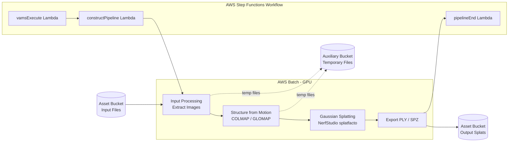

# Gaussian Splatting Pipeline

The Gaussian Splatting pipeline generates 3D Gaussian splat reconstructions from images or video using the open-source 3D Reconstruction Toolbox. It accepts collections of photographs (as a ZIP archive) or video files and produces 3D Gaussian splat models viewable in the VAMS web interface. This pipeline runs on AWS Batch with GPU instances to accelerate the computationally intensive training process.

## Supported Input Formats

| Format | Extension | Description |
|:---|:---|:---|
| ZIP archive | `.zip` | Archive containing a set of images for multi-view reconstruction |
| MP4 video | `.mp4` | Video file from which frames are extracted for reconstruction |
| MOV video | `.mov` | QuickTime video file from which frames are extracted |

## Output Formats

| Format | Extension | Description |
|:---|:---|:---|
| PLY | `.ply` | Standard 3D Gaussian splat point cloud for viewing |
| SPZ | `.spz` | Compressed splat format optimized for web viewing |

## Architecture



### Processing Steps

The pipeline executes four major stages within a single AWS Batch GPU job:

1. **Input Processing** -- Accepts a ZIP archive of images or a video file. Videos are decomposed into individual frames. Input format and quality are validated.

2. **Structure from Motion (SfM)** -- Uses COLMAP or GLOMAP for camera pose estimation. This stage generates a sparse 3D point cloud and estimates camera intrinsic and extrinsic parameters from the input images.

3. **3D Gaussian Splatting** -- Uses NerfStudio's splatfacto implementation to train a 3D Gaussian representation of the scene. GPU acceleration is used for the iterative training process.

4. **Output Generation** -- The trained model is exported as a PLY file for standard 3D viewing and optionally as a compressed SPZ format for optimized web viewing. Results are uploaded to the asset bucket in Amazon S3.

### Duplicate Job Detection

The `constructPipeline` Lambda function includes a deduplication mechanism that uses lock files in the auxiliary Amazon S3 bucket. If the same job name and input file combination is submitted within a 5-minute window, the duplicate request is rejected. This prevents redundant GPU workloads from accidental double-triggers.

## Configuration

Enable this pipeline in `infra/config/config.json`:

```json
{
    "app": {
        "pipelines": {
            "useSplatToolbox": {
                "enabled": true,
                "autoRegisterWithVAMS": true
            }
        }
    }
}
```

### Configuration Options

| Option | Default | Description |
|:---|:---|:---|
| `enabled` | `false` | Deploy the Gaussian Splatting pipeline infrastructure. Enables the global VPC. |
| `autoRegisterWithVAMS` | `false` | Automatically register the pipeline and workflow during CDK deployment. |

:::note[No Auto-Trigger on Upload]
Unlike preview pipelines, the Gaussian Splatting pipeline does not support `autoRegisterAutoTriggerOnFileUpload`. Reconstruction jobs are resource-intensive and should be triggered intentionally through the VAMS web interface or API.
:::


## Pipeline Parameters

When executing the pipeline, the following parameters can be configured through the VAMS workflow input:

| Parameter | Description | Default |
|:---|:---|:---|
| `MODEL` | Splatting model type (e.g., `splatfacto`, `splatfacto-big`) | `splatfacto` |
| `MAX_STEPS` | Number of training iterations | Varies by model |
| `SFM_SOFTWARE_NAME` | Structure from Motion software (`COLMAP` or `GLOMAP`) | `COLMAP` |
| `REMOVE_BACKGROUND` | Enable background removal from input images | `false` |
| `GENERATE_SPLAT` | Enable generation of compressed splat output files | `true` |

## Prerequisites

### GPU Instance Availability

This pipeline requires GPU-enabled instances for AWS Batch compute. The CDK stack creates a GPU compute environment using the `BatchGpuPipelineConstruct` with the following defaults:

| Resource | Default Value |
|:---|:---|
| vCPUs | 15 |
| Memory | 60,000 MiB (~58 GB) |
| GPU | 1 (NVIDIA) |
| Retry attempts | 3 |
| Job timeout | 43,200 seconds (12 hours) |

:::warning[GPU Instance Limits]
Ensure your AWS account has sufficient GPU instance quotas for the target region. Common GPU instance types used include G4dn, G5, and P3 families. If the compute environment cannot provision instances, jobs will remain in a RUNNABLE state indefinitely.
:::


### VPC with Internet Access

The pipeline runs on AWS Batch with GPU instances in **private subnets** that have internet access via a NAT Gateway. Internet access is required during the container build process to download model weights and dependencies. Enabling this pipeline automatically sets `app.useGlobalVpc.enabled` to `true`.

### Container Image

The container image is automatically synced from the upstream open-source repository during CDK deployment:

- **Repository**: [Open Source 3D Reconstruction Toolbox for Gaussian Splats](https://github.com/aws-solutions-library-samples/guidance-for-open-source-3d-reconstruction-toolbox-for-gaussian-splats-on-aws)
- **Pinned commit**: The CDK stack pins to a specific commit hash to ensure reproducible builds.
- **Integration**: A VAMS-specific entrypoint script (`pipeline_vams.py`) wraps the upstream pipeline with Amazon S3 I/O and AWS Step Functions callback handling.

The sync process clones the upstream repository, copies the container files into the pipeline directory, and builds the Docker image during `cdk deploy`.

## Infrastructure Components

| Resource | Service | Purpose |
|:---|:---|:---|
| GPU Compute Environment | AWS Batch | GPU-accelerated container execution |
| Job Queue | AWS Batch | Job scheduling with GPU instance selection |
| Job Definition | AWS Batch | Container configuration with GPU, memory, and storage settings |
| Container Image | Amazon ECR | 3D reconstruction toolbox container |
| Step Functions State Machine | AWS Step Functions | Workflow orchestration |
| Lambda Functions (5) | AWS Lambda | Pipeline coordination (vamsExecute, constructPipeline, openPipeline, sqsExecute, pipelineEnd) |
| SQS Queue | Amazon SQS | Event-driven pipeline triggering |

## How It Works

1. A user uploads images (ZIP) or video (MP4/MOV) to VAMS and triggers the Gaussian Splatting workflow.
2. The `vamsExecute` Lambda function receives the workflow event and forwards it with all S3 output paths to the `constructPipeline` Lambda function.
3. The `constructPipeline` Lambda function checks for duplicate jobs, then builds a `SPLAT` stage definition directing output to `outputS3AssetFilesPath` (asset bucket) and temporary files to `inputOutputS3AssetAuxiliaryFilesPath` (auxiliary bucket).
4. AWS Batch submits a GPU job. The container downloads the input, runs the full reconstruction pipeline (SfM + Gaussian Splatting + export), and uploads the resulting PLY/SPZ files to Amazon S3.
5. AWS Step Functions receives the task token callback, and the `pipelineEnd` Lambda function finalizes the execution. The process-output step registers the generated 3D files in VAMS.
6. Users can view the generated Gaussian splat in the VAMS web interface using the built-in splat viewer plugin.

## Related Resources

- [Pipeline System Overview](overview.md)
- [3D Preview Thumbnail Pipeline](3d-thumbnail.md) -- generates preview images from 3D files including Gaussian splat outputs

