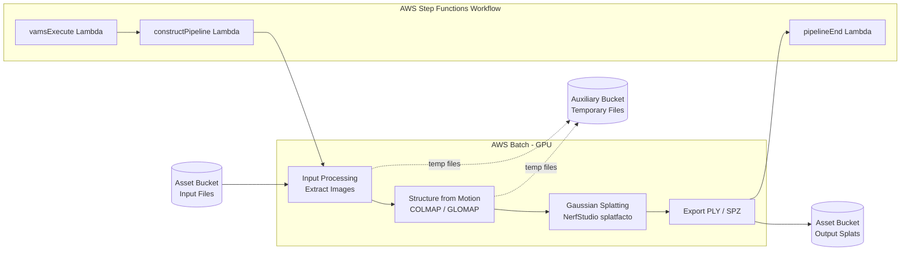

# Gaussian Splatting Pipeline

The Gaussian Splatting pipeline generates 3D Gaussian splat reconstructions from images or video using the open-source 3D Reconstruction Toolbox. It accepts collections of photographs (as a ZIP archive) or video files and produces 3D Gaussian splat models viewable in the VAMS web interface. This pipeline runs on AWS Batch with GPU instances to accelerate the computationally intensive training process.

## Supported Input Formats

| Format      | Extension | Description                                                      |
| :---------- | :-------- | :--------------------------------------------------------------- |
| ZIP archive | `.zip`    | Archive containing a set of images for multi-view reconstruction |
| MP4 video   | `.mp4`    | Video file from which frames are extracted for reconstruction    |
| MOV video   | `.mov`    | QuickTime video file from which frames are extracted             |

## Output Formats

| Format | Extension | Description                                        |
| :----- | :-------- | :------------------------------------------------- |
| PLY    | `.ply`    | Standard 3D Gaussian splat point cloud for viewing |
| SPZ    | `.spz`    | Compressed splat format optimized for web viewing  |

## Architecture


```mermaid
flowchart LR
    subgraph Workflow["AWS Step Functions Workflow"]
        VE[vamsExecute Lambda]
        CP[constructPipeline Lambda]
        PE[pipelineEnd Lambda]
    end

    subgraph Batch["AWS Batch - GPU"]
        Input[Input Processing<br/>Extract Images]
        SfM[Structure from Motion<br/>COLMAP / GLOMAP]
        Train[Gaussian Splatting<br/>NerfStudio splatfacto]
        Export[Export PLY / SPZ]
    end

    S3In[(Asset Bucket<br/>Input Files)]
    S3Out[(Asset Bucket<br/>Output Splats)]
    Aux[(Auxiliary Bucket<br/>Temporary Files)]

    VE --> CP
    CP --> Input
    S3In --> Input
    Input --> SfM
    SfM --> Train
    Train --> Export
    Export --> S3Out
    Input -.->|temp files| Aux
    SfM -.->|temp files| Aux
    Export --> PE
```

### Processing Steps

The pipeline executes four major stages within a single AWS Batch GPU job:

1. **Input Processing** -- Accepts a ZIP archive of images or a video file. Videos are decomposed into individual frames. Input format and quality are validated.

2. **Structure from Motion (SfM)** -- Uses COLMAP or GLOMAP for camera pose estimation. This stage generates a sparse 3D point cloud and estimates camera intrinsic and extrinsic parameters from the input images.

3. **3D Gaussian Splatting** -- Uses NerfStudio's splatfacto implementation to train a 3D Gaussian representation of the scene. GPU acceleration is used for the iterative training process.

4. **Output Generation** -- The trained model is exported as a PLY file for standard 3D viewing and optionally as a compressed SPZ format for optimized web viewing. Results are uploaded to the asset bucket in Amazon S3.

### Duplicate Job Detection

The `constructPipeline` Lambda function includes a deduplication mechanism that uses lock files in the auxiliary Amazon S3 bucket. If the same job name and input file combination is submitted within a 5-minute window, the duplicate request is rejected. This prevents redundant GPU workloads from accidental double-triggers.

## Configuration

Enable this pipeline in `infra/config/config.json`:

```json
{
    "app": {
        "useGlobalVpc": {
            "enabled": true
        },
        "pipelines": {
            "useSplatToolbox": {
                "enabled": true,
                "useCodeBuild": true,
                "autoRegisterWithVAMS": true
            }
        }
    }
}
```

### Configuration Options

| Option                 | Default | Description                                                                                               |
| :--------------------- | :------ | :-------------------------------------------------------------------------------------------------------- |
| `enabled`              | `false` | Deploy the Gaussian Splatting pipeline infrastructure. Requires the global VPC.                           |
| `useCodeBuild`         | `false` | Build the container image with AWS CodeBuild instead of locally during `cdk deploy`. See Container Image. |
| `autoRegisterWithVAMS` | `false` | Automatically register the pipeline and workflow during CDK deployment.                                   |

:::note[No Auto-Trigger on Upload]
Unlike preview pipelines, the Gaussian Splatting pipeline does not support `autoRegisterAutoTriggerOnFileUpload`. Reconstruction jobs are resource-intensive and should be triggered intentionally through the VAMS web interface or API.
:::

## Pipeline Parameters

Parameters are supplied through the selected configuration template's `configBody` (or a per-run
override). Only keys the container recognizes take effect; an unrecognized key is skipped and reported
on the container's own log line.

Four of them are declared as template tags, so the execute form renders a field for each and the value
is substituted into the body at launch. The **Template tag** column names that field's tag key; a row
with `--` is not tag-backed and is set by editing the configuration body.

| Parameter                  | Template tag         | Description                                                          | Default          |
| :------------------------- | :------------------- | :------------------------------------------------------------------- | :--------------- |
| `MODEL`                    | --                   | Splatting model type (for example `splatfacto`, `splatfacto-big`)    | `splatfacto`     |
| `MAX_STEPS`                | --                   | Number of training iterations                                        | `15000`          |
| `RECON_SOFTWARE_NAME`      | --                   | Reconstruction software (`colmap`, `glomap`, `hloc`, `map_anything`) | `glomap`         |
| `SPHERICAL_CAMERA`         | --                   | Treat the input as a 360/spherical capture                           | `False`          |
| `REMOVE_BACKGROUND`        | --                   | Enable background removal from input images                          | `False`          |
| `ENABLE_SPZ`               | --                   | Export the compressed SPZ splat format                               | `True`           |
| `ENABLE_SOG`               | --                   | Export the SOG splat format                                          | `True`           |
| `RUN_RECON`                | `RUN_RECON`          | Recover camera poses from the input capture before training          | `True`           |
| `RUN_TRAIN`                | `RUN_TRAIN`          | Train the splat model                                                | `True`           |
| `CROP_OUTPUT_BOUNDS`       | `CROP_OUTPUT_BOUNDS` | Trim the exported splat to the reconstructed scene bounds            | `False`          |
| `CROP_MODE`                | `CROP_MODE`          | How the crop bounds are computed (`rigid_body`, `environment`)       | Set per template |
| `BACKGROUND_REMOVAL_MODEL` | --                   | Segmentation model used for background and human-subject removal     | `u2net`          |
| `REMOVE_OBJECT`            | --                   | Remove the objects named by `OBJECT_REMOVAL_OBJECTS` from the input  | `False`          |
| `OBJECT_REMOVAL_ACTION`    | --                   | `remove` masks the object out; `erase` inpaints it with SDXL         | `erase`          |
| `OBJECT_REMOVAL_OBJECTS`   | --                   | Objects the object-removal step targets                              | `['human']`      |

Clearing `RUN_RECON` reuses camera poses from an earlier run, and clearing `RUN_TRAIN` exports from an
already-trained model. Both read that run's archive from the input, so neither applies to a fresh
capture.

### Template configuration body

The **Objects (standard capture)** template's body. Each placeholder is resolved from its form field at
launch. A boolean tag renders a JSON `true` or `false` and its placeholder therefore carries no quotes,
while `CROP_MODE` renders text and sits inside the string it fills:

```json
{
    "RUN_RECON": {{RUN_RECON}},
    "RUN_TRAIN": {{RUN_TRAIN}},
    "CROP_OUTPUT_BOUNDS": {{CROP_OUTPUT_BOUNDS}},
    "CROP_MODE": "{{CROP_MODE}}"
}
```

:::note
The pipeline ships two templates — **Objects (standard capture)** for standard object captures, and
**Environments (360 / spherical capture)**, which additionally sets `SPHERICAL_CAMERA`. Both declare
the same four template tags and differ in the `CROP_MODE` default: `rigid_body` for Objects, which
fits a tight box around a single object, and `environment` for Environments, which keeps the
surrounding scene. Both also allow a per-run configuration edit, so any parameter above can be set on
the execute form, tag-backed or not.
:::

## Prerequisites

### GPU Instance Availability

This pipeline requires GPU-enabled instances for AWS Batch compute. The CDK stack creates a GPU compute environment using the `BatchGpuPipelineConstruct` with the following defaults:

| Resource       | Default Value             |
| :------------- | :------------------------ |
| vCPUs          | 15                        |
| Memory         | 60,000 MiB (~58 GB)       |
| GPU            | 1 (NVIDIA)                |
| Retry attempts | 3                         |
| Job timeout    | 43,200 seconds (12 hours) |

:::warning[GPU Instance Limits]
Ensure your AWS account has sufficient GPU instance quotas for the target region. Common GPU instance types used include G4dn, G5, and P3 families. If the compute environment cannot provision instances, jobs will remain in a RUNNABLE state indefinitely.
:::

### VPC with Internet Access

The pipeline runs on AWS Batch with GPU instances in **private subnets** that have internet access via a NAT Gateway. Internet access is required during the container build process to download model weights and dependencies. Most of those weights ship inside the image, so a job needs no egress for background removal or for `OBJECT_REMOVAL_ACTION=remove`. The default `OBJECT_REMOVAL_ACTION=erase` is the exception: it fetches Stable Diffusion XL at run time, as do the opt-in `dn-splatter` model variants (LPIPS and ZoeDepth), so those need egress from the job's subnets. This pipeline requires the global VPC: set `app.useGlobalVpc.enabled` to `true` alongside `useSplatToolbox`, or configuration validation fails with an error naming the pipeline.

### Container Image

The container image is automatically synced from the upstream open-source repository during CDK deployment:

-   **Repository**: [Open Source 3D Reconstruction Toolbox for Gaussian Splats](https://github.com/aws-solutions-library-samples/guidance-for-open-source-3d-reconstruction-toolbox-for-gaussian-splats-on-aws)
-   **Pinned commit**: The CDK stack pins the upstream repository to a specific commit hash, so every deployment builds from the same upstream sources.
-   **Integration**: A VAMS-specific entry point (`__main__.py`, with its `vams_utils` package) wraps the upstream pipeline with Amazon S3 I/O and AWS Step Functions callback handling.

The sync process clones the upstream repository at the pinned commit and copies the container files into the pipeline directory. The synth verifies that the checked-out commit matches the pinned hash and that the VAMS entry point is staged into the Dockerfile, and fails the deployment if either check does not hold rather than building from stale sources.

:::note[The pin covers the upstream commit, not every source the image build fetches]
The upstream Dockerfile fetches further third-party sources while the image builds. Most are pinned — cloned and then reset to a recorded commit, or fetched at a version tag — and the rest resolve to whatever the source serves at build time, so two builds of the same pinned commit can produce different images. That set is recorded by URL in `dockerfilePinAudit.ts`, and the sync compares the synced Dockerfile against the record and fails the deployment's synthesis when it changes in either direction: a source that is newly unpinned, or a recorded one the upstream project has since pinned. The comparison runs only for a deployment that creates this pipeline.
:::

Set `useCodeBuild` to `true` to build the image with AWS CodeBuild instead of locally. The deployment then creates an Amazon ECR repository, uploads the container directory as an Amazon S3 source asset, and runs a CodeBuild project (Docker layer caching, privileged mode, in the pipeline VPC) that pushes the image to Amazon ECR; the AWS Batch job definition consumes that image. This avoids building the large CUDA image on the machine running `cdk deploy`. The build is started by a custom resource and continues after the deployment completes, so check its status before running the pipeline:

```bash
aws codebuild list-builds-for-project --project-name <SplatToolboxCodeBuild project>
```

Left at `false`, the image is built locally during `cdk deploy`.

## Infrastructure Components

| Resource                     | Service            | Purpose                                                                           |
| :--------------------------- | :----------------- | :-------------------------------------------------------------------------------- |
| GPU Compute Environment      | AWS Batch          | GPU-accelerated container execution                                               |
| Job Queue                    | AWS Batch          | Job scheduling with GPU instance selection                                        |
| Job Definition               | AWS Batch          | Container configuration with GPU, memory, and storage settings                    |
| Container Image              | Amazon ECR         | 3D reconstruction toolbox container                                               |
| Step Functions State Machine | AWS Step Functions | Workflow orchestration                                                            |
| Lambda Functions (4)         | AWS Lambda         | Pipeline coordination (vamsExecute, openPipeline, constructPipeline, pipelineEnd) |

## How It Works

1. A user uploads images (ZIP) or video (MP4/MOV) to VAMS and triggers the Gaussian Splatting workflow.
2. The `vamsExecute` Lambda function receives the workflow event and forwards it with all S3 output paths to the `constructPipeline` Lambda function.
3. The `constructPipeline` Lambda function checks for duplicate jobs, then builds a `SPLAT` stage definition directing output to `outputS3AssetFilesPath` (asset bucket) and temporary files to `inputOutputS3AssetAuxiliaryFilesPath` (auxiliary bucket).
4. AWS Batch submits a GPU job. The container downloads the input, runs the full reconstruction pipeline (SfM + Gaussian Splatting + export), and uploads the resulting PLY/SPZ files to Amazon S3.
5. AWS Step Functions receives the task token callback, and the `pipelineEnd` Lambda function finalizes the execution. The process-output step registers the generated 3D files in VAMS.
6. Users can view the generated Gaussian splat in the VAMS web interface using the built-in splat viewer plugin.

## Attribution

The container image ships the segmentation model weights the optional background-removal and object-removal steps load: the U^2-Net weights (Apache-2.0) as redistributed by [backgroundremover](https://github.com/nadermx/backgroundremover) (MIT), their ONNX forms and [BiRefNet](https://github.com/ZhengPeng7/BiRefNet) portrait matting (MIT) resolved through [rembg](https://github.com/danielgatis/rembg) (MIT), the SAM 2.1 hiera-large checkpoint ([SAM 2](https://github.com/facebookresearch/sam2), Apache-2.0), and four torchvision checkpoints (BSD-3-Clause). Stable Diffusion XL, used by the default object-erase action, is fetched at run time rather than shipped. See [Notices](../additional/notices.md) for the full list.

## Related Resources

-   [Pipeline System Overview](overview.md)
-   [3D Preview Thumbnail Pipeline](3d-thumbnail.md) -- generates preview images from 3D files including Gaussian splat outputs
    
