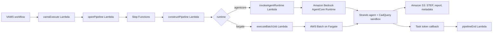

# GenAI CAD STEP Agent Pipeline

The GenAI CAD STEP Agent pipeline creates or modifies a CAD STEP file (`.stp`, `.step`) from a natural-language instruction. A [Strands Agents](https://strandsagents.com) agent reads the instruction, optionally researches the design on the internet, writes CadQuery (Open CASCADE) Python scripts, runs them in a sandbox with a bounded self-repair loop, and writes the resulting STEP file back to the asset together with a report of what was done and what could not be completed. The agent uses an Amazon Bedrock model by default and can be switched per run to an OpenAI model when the deployment configures an API-key secret.

## Modes and Templates

The pipeline ships two templates over one pipeline, and a workflow for each:

| Template                  | Workflow                        | Input                        | Result                                                                                                                                                    |
| :------------------------ | :------------------------------ | :--------------------------- | :-------------------------------------------------------------------------------------------------------------------------------------------------------- |
| `cad-step-agent-modify`   | GenAI CAD STEP Agent - Modify   | Exactly one `.stp` / `.step` | The changed part, written to the input file's own path and name (a new version of that file) unless a prefix or file name override is set.                |
| `cad-step-agent-generate` | GenAI CAD STEP Agent - Generate | None                         | A brand-new STEP file on the output asset chosen at execution time; its name comes from the design name or the prompt plus a timestamp unless overridden. |

The modify workflow carries a disarmed file-upload trigger for `*.stp` and `*.step` files (`autoRegisterAutoTriggerOnFileUpload` arms it). The generate workflow has no trigger; the output asset is selected when the workflow is executed.

## Template Tags

Every tag has a default, so both workflows run with no arguments; the defaults produce a geometry report of the input (modify) or a sample mounting plate (generate).

| Tag                       | Type                     | Default     | Purpose                                                                                                                                             |
| :------------------------ | :----------------------- | :---------- | :-------------------------------------------------------------------------------------------------------------------------------------------------- |
| `PROMPT`                  | string                   | (see above) | The design instruction: the change to make to the input file, or the part to create.                                                                |
| `OUTPUT_FILENAME`         | string                   | `""`        | File name override (no folders). Empty keeps the input name (modify) or generates a name (generate). The STEP extension is kept or added.           |
| `OUTPUT_FILENAME_PREFIX`  | string                   | `""`        | Prefix prepended to the resolved file name, so a modify run writes a separate file instead of a new version of the input.                           |
| `ALLOW_INTERNET_RESEARCH` | boolean                  | `true`      | Registers the web search and page fetch tools for this run. Ignored when the deployment disables research (`allowInternetResearch: false`).         |
| `MODEL_PROVIDER`          | enum `bedrock`, `openai` | `bedrock`   | The model provider for this run. `openai` requires the deployment's `openAi.apiKeySecretArn` and `openAi.modelId`.                                  |
| `MODEL_ID`                | string                   | `""`        | Model id override for the chosen provider; empty uses the deployment default.                                                                       |
| `MAX_ATTEMPTS`            | integer                  | `4`         | How many generated-script attempts the agent may make (1-10). Each attempt validates the produced STEP file and feeds the result back to the agent. |
| `DESIGN_NAME`             | string (generate only)   | `""`        | Short name used for the generated file name, for example `Jetson Nano carrier board` becomes `jetson-nano-carrier-board-<timestamp>.step`.          |

### Output file naming

1. An override is sanitized (folders, control characters and leading dots removed).
2. A modify run keeps the input file's extension; a generate run writes `.step` unless the override carries `.stp` or `.step`.
3. The base name is the override, else the input's base name (modify), else a slug of the design name or of the first words of the prompt followed by `-YYYYMMDD-HHMMSS` (generate).
4. The prefix is prepended last, so it stacks on an override.

A name that VAMS does not accept is refused before any compute starts, and the execution is failed with the reason.

## Outputs

Every run that produced a valid STEP file writes three things to the asset:

-   **The STEP file**, at the input file's asset-relative path (modify) or the asset root (generate).
-   **A Markdown report** beside it, named `<file>.cad-agent-report.md`: the instruction, each attempt's outcome, the final geometry summary (solid count, bounding box, volume), the web sources consulted, and every requested element the agent could not complete.
-   **File metadata** on the STEP file: `cadAgentStatus` (`succeeded` or `partial`), `cadAgentSummary`, `cadAgentUnresolved` (JSON list), `cadAgentSources` (JSON list), `cadAgentModel`, `cadAgentAttempts`, `cadAgentGeometry`, and `cadAgentRunId`. These are queryable like any other file metadata.

A run is `partial` when the agent produced a valid STEP file but recorded elements it could not complete — for example a reference design it could not find online. A run that produces no valid STEP file within its attempt or time budget fails, and the execution record carries the reason. The execution's success payload carries the outcome summary only, never the scripts' output.

## Architecture



The `constructPipeline` Lambda validates the run's settings and resolves the output file name before any compute starts. The agent container then downloads the input file (if any), builds the agent with the tools the run allows, and runs it under a wall-clock watchdog. The outcome is derived from the tools' recorded state — the attempts made, the best validated output, the agent's `finish` call — rather than from the model's prose.

### Runtimes

| Runtime               | Where the agent runs                                                                                                                                                                                                            | Networking                                                                                                                                                  | Warm capacity                                                                                                                                                                                              |
| :-------------------- | :------------------------------------------------------------------------------------------------------------------------------------------------------------------------------------------------------------------------------ | :---------------------------------------------------------------------------------------------------------------------------------------------------------- | :--------------------------------------------------------------------------------------------------------------------------------------------------------------------------------------------------------- |
| `agentcore` (default) | An Amazon Bedrock AgentCore Runtime hosting the container (`linux/arm64`, built by AWS CodeBuild). The invoke Lambda hands the run to the runtime, which acknowledges at once and reports the task token when the run finishes. | The runtime uses public network mode: research reaches the internet directly, and no container runs in the VPC. Commercial partition only.                  | `agentCore.warmSessionSlots` fixed session ids are reused across runs; a session stays alive for `idleRuntimeSessionTimeoutSeconds` (up to `maxLifetimeSeconds`), so repeat runs land on a warm container. |
| `fargate`             | An AWS Batch job on Fargate (`linux/amd64`) in the private pipeline subnets, submitted by the `executeBatchJob` Lambda and registered as abortable.                                                                             | Private subnets with NAT egress for research (adds public subnets and one NAT gateway per Availability Zone). Available wherever Amazon Bedrock is offered. | None: each job starts a fresh container.                                                                                                                                                                   |

One container image serves both runtimes; the AWS CodeBuild project builds the platform the selected runtime needs.

## Configuration

Enable the pipeline in `infra/config/config.json`:

```json
{
    "app": {
        "useGlobalVpc": { "enabled": true },
        "pipelines": {
            "useGenAiCadStepAgent": {
                "enabled": true,
                "runtime": "agentcore",
                "useCodeBuild": true,
                "autoRegisterWithVAMS": true,
                "autoRegisterAutoTriggerOnFileUpload": false,
                "bedrockModelId": "global.anthropic.claude-sonnet-4-5-20250929-v1:0",
                "openAi": { "modelId": "", "apiKeySecretArn": "" },
                "allowInternetResearch": true,
                "agentCore": {
                    "warmSessionSlots": 0,
                    "idleRuntimeSessionTimeoutSeconds": 900,
                    "maxLifetimeSeconds": 28800
                },
                "maxRunSeconds": 3600
            }
        }
    }
}
```

Every option is described in the [Configuration Reference](../deployment/configuration-reference.md#genai-cad-step-agent-apppipelinesusegenaicadstepagent). Two points shape a deployment:

-   **Model.** Set `bedrockModelId` to a model available in the deployment's Region (an Anthropic Claude model by default). To offer OpenAI models, store the API key in AWS Secrets Manager (as a plain string or as JSON with an `apiKey` key) and set `openAi.apiKeySecretArn` and `openAi.modelId`; a run then selects it with the `MODEL_PROVIDER` tag.
-   **Internet research.** `allowInternetResearch` is the deployment master switch. With it on, a run's `ALLOW_INTERNET_RESEARCH` tag decides; with it off, the search and fetch tools are never registered.

## Security Model

-   **Generated scripts run in a sandbox.** Each script runs in a subprocess with an isolated interpreter (`python -I`), a scrubbed environment (no AWS credential variables, no task token, no model API key), a per-attempt working directory, a wall-clock timeout, and a bounded output tail. Where the runtime starts the container as root the script additionally runs as a separate `sandboxrunner` account; the agent itself always runs as the non-root `cadagent` account.
-   **Least privilege.** The container role may read and write objects under the registered asset-bucket prefixes and the auxiliary bucket, invoke the configured Amazon Bedrock model, report on AWS Step Functions task tokens, and — only when configured — read the single OpenAI API-key secret.
-   **Bounded runs.** `MAX_ATTEMPTS`, `maxRunSeconds`, the per-attempt script timeout and the Batch attempt duration bound cost and wall time; a run that exceeds its budget is failed and reported.
-   **Caller content stays with the caller.** The prompt is recorded in the run's report on the asset; the pipeline Lambdas log identifiers and counts, not the instruction text.

## Prerequisites

-   A VPC (`app.useGlobalVpc.enabled`). The `fargate` runtime also needs private subnets with NAT egress, which the VPC builder creates.
-   Access to the configured Amazon Bedrock model in the deployment's Region.
-   For the `agentcore` runtime: the commercial AWS partition and `useCodeBuild: true`.
-   For the OpenAI provider: an AWS Secrets Manager secret holding the API key.

## Troubleshooting

| Symptom                                                                 | Cause and action                                                                                                                                                                                                   |
| :---------------------------------------------------------------------- | :----------------------------------------------------------------------------------------------------------------------------------------------------------------------------------------------------------------- |
| Execution fails immediately with an output-file-name message            | The `OUTPUT_FILENAME` or `OUTPUT_FILENAME_PREFIX` value sanitized to nothing or produced a name VAMS refuses. Use letters, digits, spaces, dots, commas, hyphens and underscores only.                             |
| Execution fails with "The openai model provider is not configured"      | The run selected `MODEL_PROVIDER: openai` but the deployment has no `openAi.apiKeySecretArn`. Configure the secret and model id, or use `bedrock`.                                                                 |
| Execution fails with "No valid STEP file was produced after N attempts" | The agent exhausted `MAX_ATTEMPTS` without a script that exported a loadable solid. Read the attempts in the execution's failure cause and the CloudWatch log; simplify the instruction or raise `MAX_ATTEMPTS`.   |
| `cadAgentStatus` is `partial`                                           | The STEP file is valid but `cadAgentUnresolved` lists requested elements the agent could not complete (often a reference it could not find online). Review the report and re-run with a more specific instruction. |
| Jobs never start on the `agentcore` runtime                             | The CodeBuild image build had not finished or failed; the CodeBuild project name is in the CDK stack outputs. The runtime pulls the content-addressed tag the deployment named.                                    |
| The run appears to hang and then fails after the time budget            | The agent or a script outlived `maxRunSeconds`; the watchdog reported the failure. Lower the scope of the instruction or raise the budget (bounded by `agentCore.maxLifetimeSeconds` on the `agentcore` runtime).  |

## Third-Party Library Licenses

CadQuery (Apache-2.0) with the Open CASCADE Technology bindings (LGPL-2.1 with the Open CASCADE exception, dynamically linked), Strands Agents (Apache-2.0), the Amazon Bedrock AgentCore SDK (Apache-2.0), `ddgs` (MIT) and `httpx` (BSD-3-Clause). See [Notices](../additional/notices.md#genai-cad-step-agent-pipeline-library-notice).

## Related Resources

-   [Pipeline System Overview](overview.md)
-   [Configuration Reference](../deployment/configuration-reference.md)
-   [Custom Pipelines](custom-pipelines.md)
