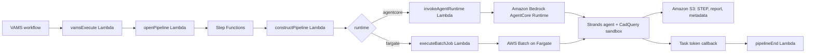

# GenAI CAD STEP Agent Pipeline

The GenAI CAD STEP Agent pipeline creates or modifies a CAD STEP file (`.stp`, `.step`) from a natural-language instruction. A [Strands Agents](https://strandsagents.com) agent reads the instruction, optionally researches the design on the internet, writes CadQuery (Open CASCADE) Python scripts, runs them in a sandbox with a bounded self-repair loop, and writes the resulting STEP file back to the asset together with a report of what was done and what could not be completed. The agent uses an Amazon Bedrock model by default and can be switched per run to an OpenAI model when the deployment configures an API-key secret.

## Modes and Templates

The pipeline ships two templates over one pipeline, and a workflow for each:

| Template                  | Workflow                        | Input                        | Result                                                                                                                                                    |
| :------------------------ | :------------------------------ | :--------------------------- | :-------------------------------------------------------------------------------------------------------------------------------------------------------- |
| `cad-step-agent-modify`   | GenAI CAD STEP Agent - Modify   | Exactly one `.stp` / `.step` | The changed part, written to the input file's own path and name (a new version of that file) unless a prefix or file name override is set.                |
| `cad-step-agent-generate` | GenAI CAD STEP Agent - Generate | None                         | A brand-new STEP file on the output asset chosen at execution time; its name comes from the design name or the prompt plus a timestamp unless overridden. |

The modify workflow carries a disarmed file-upload trigger for `*.stp` and `*.step` files (`autoRegisterAutoTriggerOnFileUpload` arms it). The generate workflow has no trigger; the output asset is selected when the workflow is executed.

## Template Tags

Every tag has a default, so both workflows run with no arguments; the defaults produce a geometry report of the input (modify) or a sample mounting plate (generate).

| Tag                       | Type                     | Default     | Purpose                                                                                                                                             |
| :------------------------ | :----------------------- | :---------- | :-------------------------------------------------------------------------------------------------------------------------------------------------- |
| `PROMPT`                  | string                   | (see above) | The design instruction: the change to make to the input file, or the part to create.                                                                |
| `OUTPUT_FILENAME`         | string                   | `""`        | File name override (no folders). Empty keeps the input name (modify) or generates a name (generate). The STEP extension is kept or added.           |
| `OUTPUT_FILENAME_PREFIX`  | string                   | `""`        | Prefix prepended to the resolved file name, so a modify run writes a separate file instead of a new version of the input.                           |
| `ALLOW_INTERNET_RESEARCH` | boolean                  | `true`      | Registers the web search and page fetch tools for this run. Ignored when the deployment disables research (`allowInternetResearch: false`).         |
| `MODEL_PROVIDER`          | enum `bedrock`, `openai` | `bedrock`   | The model provider for this run. `openai` requires the deployment's `openAi.apiKeySecretArn` and `openAi.modelId`.                                  |
| `MODEL_ID`                | string                   | `""`        | Model id override for the chosen provider; empty uses the deployment default.                                                                       |
| `MAX_ATTEMPTS`            | integer                  | `4`         | How many generated-script attempts the agent may make (1-10). Each attempt validates the produced STEP file and feeds the result back to the agent. |
| `DESIGN_NAME`             | string (generate only)   | `""`        | Short name used for the generated file name, for example `Jetson Nano carrier board` becomes `jetson-nano-carrier-board-<timestamp>.step`.          |

### Output file naming

1. An override is sanitized (folders, control characters and leading dots removed).
2. A modify run keeps the input file's extension; a generate run writes `.step` unless the override carries `.stp` or `.step`.
3. The base name is the override, else the input's base name (modify), else a slug of the design name or of the first words of the prompt followed by `-YYYYMMDD-HHMMSS` (generate).
4. The prefix is prepended last, so it stacks on an override.

A name that VAMS does not accept is refused before any compute starts, and the execution is failed with the reason.

## Outputs

Every run that produced a valid STEP file writes three things to the asset:

-   **The STEP file**, at the input file's asset-relative path (modify) or the asset root (generate).
-   **A Markdown report** beside it, named `<file>.cad-agent-report.md`: the instruction, each attempt's outcome, the final geometry summary (solid count, bounding box, volume, features — all measured on the file's solids; the PMI annotation planes and curves an AP242 export carries are counted, not measured, and are dropped from the output file), the web sources consulted, and every requested element the agent could not complete.
-   **File metadata** on the STEP file: `cadAgentStatus` (`succeeded` or `partial`), `cadAgentSummary`, `cadAgentUnresolved` (JSON list), `cadAgentSources` (JSON list), `cadAgentModel`, `cadAgentAttempts`, `cadAgentGeometry`, and `cadAgentRunId`. These are queryable like any other file metadata.

A run is `partial` when the agent produced a valid STEP file but recorded elements it could not complete or verify — a reference design it could not find online, a stated dimension it could not meet — or completed the work on assumptions about figures the instruction specifies or implies (a named product's hole pattern taken from memory); `cadAgentUnresolved` names each one. A value the instruction leaves open and the agent chose (a wall thickness, a fillet radius) is listed under "Assumptions" in `cadAgentSummary` and does not by itself make a run `partial`. A run that produces no valid STEP file within its attempt or time budget fails and writes no report; the execution record carries the reason and the attempt count. The execution's success payload carries the outcome summary only, never the scripts' output.

## Architecture



The `constructPipeline` Lambda validates the run's settings and resolves the output file name before any compute starts. The agent container then downloads the input file (if any), builds the agent with the tools the run allows, and runs it under a wall-clock watchdog. On a modify run every script result also states what the attempt changed against the input — volume, hole and solid counts, bounding box — and treats a volume difference within the part's re-export noise band (one millionth of the input's volume, at least 0.001 mm³, stated in the result as `unchanged_below_mm3`) as no change. The outcome is derived from the tools' recorded state — the attempts made, the best validated output, the agent's `finish` call — rather than from the model's prose.

### Runtimes

| Runtime               | Where the agent runs                                                                                                                                                                                                            | Networking                                                                                                                                                  | Warm capacity                                                                                                                                                                                              |
| :-------------------- | :------------------------------------------------------------------------------------------------------------------------------------------------------------------------------------------------------------------------------ | :---------------------------------------------------------------------------------------------------------------------------------------------------------- | :--------------------------------------------------------------------------------------------------------------------------------------------------------------------------------------------------------- |
| `agentcore` (default) | An Amazon Bedrock AgentCore Runtime hosting the container (`linux/arm64`, built by AWS CodeBuild). The invoke Lambda hands the run to the runtime, which acknowledges at once and reports the task token when the run finishes. | The runtime uses public network mode: research reaches the internet directly, and no container runs in the VPC. Commercial partition only.                  | `agentCore.warmSessionSlots` fixed session ids are reused across runs; a session stays alive for `idleRuntimeSessionTimeoutSeconds` (up to `maxLifetimeSeconds`), so repeat runs land on a warm container. |
| `fargate`             | An AWS Batch job on Fargate (`linux/amd64`) in the private pipeline subnets, submitted by the `executeBatchJob` Lambda and registered as abortable.                                                                             | Private subnets with NAT egress for research (adds public subnets and one NAT gateway per Availability Zone). Available wherever Amazon Bedrock is offered. | None: each job starts a fresh container.                                                                                                                                                                   |

One container image serves both runtimes; the AWS CodeBuild project builds the platform the selected runtime needs. The deployment waits for that build: the image-build custom resource completes only when CodeBuild has pushed the content-addressed tag, and the AgentCore Runtime (or the Batch job definition) is created after it. A first deploy, and any deploy that changes the container sources, is therefore longer by the build's duration (typically 10-20 minutes). The AgentCore Runtime accepts an image of at most 2048 MB (a fixed service quota); the CadQuery/Open CASCADE dependencies make this image large, so a change that adds dependencies should be checked against that cap (`aws ecr describe-images` reports `imageSizeInBytes`).

## Configuration

Enable the pipeline in `infra/config/config.json`:

```json
{
    "app": {
        "useGlobalVpc": { "enabled": true },
        "pipelines": {
            "useGenAiCadStepAgent": {
                "enabled": true,
                "runtime": "agentcore",
                "useCodeBuild": true,
                "autoRegisterWithVAMS": true,
                "autoRegisterAutoTriggerOnFileUpload": false,
                "bedrockModelId": "global.anthropic.claude-sonnet-4-5-20250929-v1:0",
                "openAi": { "modelId": "", "apiKeySecretArn": "" },
                "allowInternetResearch": true,
                "bedrockGuardrail": { "guardrailId": "", "guardrailVersion": "" },
                "agentCore": {
                    "warmSessionSlots": 0,
                    "idleRuntimeSessionTimeoutSeconds": 900,
                    "maxLifetimeSeconds": 28800
                },
                "maxRunSeconds": 3600
            }
        }
    }
}
```

Every option is described in the [Configuration Reference](../deployment/configuration-reference.md#genai-cad-step-agent-apppipelinesusegenaicadstepagent). Three points shape a deployment:

-   **Model.** Set `bedrockModelId` to a model available in the deployment's Region (an Anthropic Claude model by default). To offer OpenAI models, store the API key in AWS Secrets Manager (as a plain string or as JSON with an `apiKey` key) and set `openAi.apiKeySecretArn` and `openAi.modelId`; a run then selects it with the `MODEL_PROVIDER` tag.
-   **Guardrail.** Leave `bedrockGuardrail` empty and the deployment creates an Amazon Bedrock guardrail with a prompt-attack input filter (strength `LOW`) and applies it to every run; or name an existing guardrail's id and numbered version (or `DRAFT`) to apply your own, for example one that adds denied topics or word filters. The guardrail is applied whichever model provider a run uses.
-   **Internet research.** `allowInternetResearch` is the deployment master switch. With it on, a run's `ALLOW_INTERNET_RESEARCH` tag decides; with it off, the search and fetch tools are never registered.

### Warm sessions

`agentCore.warmSessionSlots` trades start-up latency for concurrency. With `0` (the default) every run gets a fresh runtime session and its own container; runs are independent but each pays the container start. With `N` slots, runs are hashed onto `N` fixed session ids that the runtime keeps warm for `idleRuntimeSessionTimeoutSeconds`, so repeat runs start on a warm container — but one session hosts one run at a time: a run that lands on a slot whose session is still busy is refused by the container and retried by the workflow onto the same slot (30 seconds apart, doubling, four times, about 7.5 minutes in all; a run that still finds the slot busy then fails), and a session that reaches `maxLifetimeSeconds` mid-run ends that run. Size the slot count to the expected concurrency, or keep `0` where runs are rare or long.

## Security Model

-   **Generated scripts run in a bounded subprocess.** Each script runs in its own session with an isolated interpreter (`python -I`), an allow-listed environment (no AWS credential variables, no task token, no model API key), resource limits (address space, process count, file size), a per-attempt working directory, a wall-clock timeout that kills the whole process group and every process the script left outside it that is still reachable through its parent chain or its session, and a bounded (3 s) wait for the output after that kill, so a process the sandbox could not reach cannot stall the agent — it ends with the container (on a warm `agentcore` slot, with the session), and a stop request that arrives while it holds the output pipe takes effect within the script timeout plus that grace (about 303 s at the default) — and a bounded output tail. Every process above the script that holds the task environment is non-dumpable: the container's init (PID 1, the image's own entrypoint on both runtimes, which forwards stop signals to the agent and reaps orphaned processes) makes itself non-dumpable before it starts the agent, and the agent does the same before it runs a script, so a script that walks the process tree through `/proc` finds no ancestor whose environment, memory or open files it can read; the command lines, which `/proc` shows regardless, carry module names only. The Batch job definition asks Amazon ECS for no init process of its own, because that init would be an ordinary process of the same account holding the whole task environment. The script runs under the same `cadagent` account, in the same container and network namespace as the agent: the sandbox bounds time, output and the direct environment, and it is not a uid, network or credential boundary on its own. Treat the agent's task role as the permission set of any script the model writes.
-   **`allowInternetResearch` gates tools, not egress.** With research off the search and fetch tools are not registered, but the container still has network access (public network mode on `agentcore`, NAT egress on `fargate`) for its own calls to Amazon Bedrock, Amazon S3 and AWS Step Functions. The page-fetch tool accepts only `http(s)` URLs without credentials, resolves every host and refuses private, loopback, link-local and metadata addresses (before the request and again on every redirect, which it follows one bounded hop at a time), and caps the response size and time.
-   **Every model invocation runs under a guardrail.** The Amazon Bedrock provider applies the deployment's guardrail (`bedrockGuardrail.guardrailId` / `guardrailVersion`, or the one the deployment creates when both are empty) with a prompt-attack input filter, and tags the caller's instruction as the guard content the filter inspects; fetched pages are screened through `ApplyGuardrail` before they reach the model.
-   **Least privilege.** The container role may read and write objects under the registered asset-bucket prefixes and the auxiliary bucket, invoke the configured Amazon Bedrock model (the inference profile and, for a cross-Region profile, the foundation model in every Region it routes to), apply the guardrail, report on AWS Step Functions task tokens, and — only when configured — read the single OpenAI API-key secret.
-   **Bounded runs.** `MAX_ATTEMPTS`, `maxRunSeconds`, the per-attempt script timeout and the Batch attempt duration bound cost and wall time; a run that reaches its budget is reported as failed and stopped where it stands (the running script is killed and the agent takes no further turn). On the `fargate` runtime an execution abort terminates the Batch job and the container stops the run where it stands: nothing is uploaded and nothing is reported on the token. On the `agentcore` runtime an abort cannot reach the session from outside, so the agent keeps working and the run ends when the agent finishes or when `maxRunSeconds` elapses, whichever comes first. Before it uploads a result the container confirms that its workflow task is still waiting, so a run whose execution was aborted uploads nothing and reports nothing on the token.
-   **Caller content stays with the caller.** The prompt is recorded in the run's report on the asset; the pipeline Lambdas log identifiers and counts, not the instruction text. The definition document reaches the container through its environment (not its command line) and carries no workflow token.

## Prerequisites

-   A VPC (`app.useGlobalVpc.enabled`). The `fargate` runtime also needs private subnets with NAT egress, which the VPC builder creates.
-   Access to the configured Amazon Bedrock model in the deployment's Region.
-   For the `agentcore` runtime: the commercial AWS partition and `useCodeBuild: true`.
-   For the OpenAI provider: an AWS Secrets Manager secret holding the API key.

## Troubleshooting

| Symptom                                                                                                                       | Cause and action                                                                                                                                                                                                                                                                                                                                                          |
| :---------------------------------------------------------------------------------------------------------------------------- | :------------------------------------------------------------------------------------------------------------------------------------------------------------------------------------------------------------------------------------------------------------------------------------------------------------------------------------------------------------------------ |
| Execution fails immediately with an output-file-name message                                                                  | The `OUTPUT_FILENAME` or `OUTPUT_FILENAME_PREFIX` value sanitized to nothing or produced a name VAMS refuses. Use letters, digits, spaces, dots, commas, hyphens and underscores only.                                                                                                                                                                                    |
| Execution fails with "The openai model provider is not configured"                                                            | The run selected `MODEL_PROVIDER: openai` but the deployment has no `openAi.apiKeySecretArn`. Configure the secret and model id, or use `bedrock`.                                                                                                                                                                                                                        |
| Execution fails with "No valid STEP file was produced after N attempts"                                                       | The agent exhausted `MAX_ATTEMPTS` without a script that exported a loadable solid. Read the attempts in the execution's failure cause and the CloudWatch log; simplify the instruction or raise `MAX_ATTEMPTS`.                                                                                                                                                          |
| `cadAgentStatus` is `partial`                                                                                                 | The STEP file is valid but `cadAgentUnresolved` lists requested elements the agent could not complete, verify or had to assume (often a reference it could not find online); a run completed on stated assumptions reads the same as one with a geometric shortfall, so read that list. Re-run with a more specific instruction where it names a figure the agent lacked. |
| The deployment fails on the image-build custom resource                                                                       | The CodeBuild build of the container image did not succeed; the CloudFormation event names the build id and its final status and phase, and the CodeBuild project name is in the CDK stack outputs. Read that build's log, fix the cause (a dependency that no longer resolves, an image over the 2048 MB AgentCore cap) and redeploy.                                    |
| The run appears to hang and then fails after the time budget                                                                  | The agent or a script outlived `maxRunSeconds`; the watchdog reported the failure and stopped the agent. Lower the scope of the instruction or raise the budget (bounded by `agentCore.maxLifetimeSeconds` on the `agentcore` runtime).                                                                                                                                   |
| The CadStepAgent nested stack fails after the AgentCore Runtime exists, and the rollback takes long or ends `ROLLBACK_FAILED` | Deleting an AgentCore Runtime during a rollback takes about ten minutes longer than the rest of the stack and can time out, which leaves the core stack `ROLLBACK_FAILED`. Wait until `aws bedrock-agentcore-control list-agent-runtimes` lists no runtime for the deployment, delete the failed stack if CloudFormation requires it, then redeploy.                      |
| A redeploy after a failed first deploy fails validation with a name conflict on the API Gateway CloudWatch role               | The role is retained when the stack rolls back, by design. Redeploy with `cdk deploy --import-existing-resources` so CloudFormation adopts the existing role instead of creating it.                                                                                                                                                                                      |

## Third-Party Library Licenses

CadQuery (Apache-2.0) with the Open CASCADE Technology bindings (LGPL-2.1 with the Open CASCADE exception, dynamically linked), Strands Agents (Apache-2.0), the Amazon Bedrock AgentCore SDK (Apache-2.0), `ddgs` (MIT) and `httpx` (BSD-3-Clause). See [Notices](../additional/notices.md#genai-cad-step-agent-pipeline-library-notice).

## Related Resources

-   [Pipeline System Overview](overview.md)
-   [Configuration Reference](../deployment/configuration-reference.md)
-   [Custom Pipelines](custom-pipelines.md)
