# GenAI 3D Metadata Labeling Pipeline

The GenAI 3D Metadata Labeling pipeline uses Amazon Bedrock and Amazon Rekognition to automatically generate descriptive metadata labels for 3D assets. It renders multiple 2D camera views of a 3D model using Blender, analyzes each rendered image with both a large language model (LLM) and computer vision, and consolidates the results into a deduplicated set of keywords stored as asset-level metadata.

## Overview

| Property                    | Value                                                          |
| --------------------------- | -------------------------------------------------------------- |
| **Pipeline ID**             | `genai-metadata-3d-labeling-obj-glb-fbx-ply-stl-usd`           |
| **Configuration flag**      | `app.pipelines.useGenAiMetadata3dLabeling.enabled`             |
| **Execution type**          | Lambda (asynchronous with callback)                            |
| **Supported input formats** | `.glb`, `.fbx`, `.obj`, `.stl`, `.ply`, `.usd`, `.dae`, `.abc` |
| **Output**                  | Asset-level metadata (`autoGeneratedKeywords` key)             |
| **Timeout**                 | 5 hours                                                        |

## Architecture

The pipeline is orchestrated by an AWS Step Functions state machine that chains a container-based rendering stage with a Lambda-based metadata generation stage.

```mermaid
flowchart LR
    A[VAMS Workflow] --> B[vamsExecute Lambda]
    B --> C[openPipeline Lambda]
    C --> D[Step Functions]
    D --> E[constructPipeline Lambda]
    E --> F[Blender Renderer<br/>AWS Batch Fargate]
    F --> G[metadataGeneration Lambda]
    G --> H[Amazon Bedrock<br/>+ Amazon Rekognition]
    H --> I[pipelineEnd Lambda]
    I --> J[Metadata written to S3]
```



### Processing stages

1. **Blender Renderer (AWS Batch on AWS Fargate)** -- Downloads the 3D model file from Amazon S3, imports it into Blender running in headless mode with the Cycles rendering engine, and renders multiple camera-angle PNG images to the auxiliary Amazon S3 bucket.

2. **Metadata Generation (AWS Lambda)** -- Downloads the rendered images, sends each to Amazon Bedrock (using the configured model) and Amazon Rekognition for label detection. Labels with a confidence score above 97% are collected and passed to a final Amazon Bedrock summarization call that deduplicates, removes outliers, normalizes casing, and returns a consolidated JSON keyword list.

## Configuration

Add the following to your `config.json` under `app.pipelines`:

```json
{
    "app": {
        "pipelines": {
            "useGenAiMetadata3dLabeling": {
                "enabled": true,
                "bedrockModelId": "anthropic.claude-3-sonnet-20240229-v1:0",
                "autoRegisterWithVAMS": true,
                "autoRegisterAutoTriggerOnFileUpload": false
            }
        }
    }
}
```

| Option                                | Default    | Description                                                                                                                                          |
| ------------------------------------- | ---------- | ---------------------------------------------------------------------------------------------------------------------------------------------------- |
| `enabled`                             | `false`    | Enable or disable the pipeline deployment.                                                                                                           |
| `bedrockModelId`                      | (required) | The Amazon Bedrock model ID to use for image analysis and summarization. Must support the Anthropic Messages API with vision capabilities.           |
| `autoRegisterWithVAMS`                | `true`     | Automatically register the pipeline and workflow with VAMS at deploy time.                                                                           |
| `autoRegisterAutoTriggerOnFileUpload` | `false`    | When `true`, the workflow automatically triggers on upload of supported file types (`.stl`, `.obj`, `.ply`, `.glb`, `.usd`, `.dae`, `.abc`, `.fbx`). |

## Prerequisites

:::warning[Amazon Bedrock model access required]
You must enable access to the configured Amazon Bedrock model in your deployment region before using this pipeline. Go to the Amazon Bedrock console, select **Model access**, and request access to the desired model (for example, Anthropic Claude 3 Sonnet).
:::

-   **Amazon Bedrock** -- The deployment region must have access to the model specified in `bedrockModelId`.
-   **Amazon Rekognition** -- Available in the deployment region (used for supplementary label detection).
-   **VPC configuration** -- The pipeline deploys into isolated subnets. Ensure VPC endpoints are configured for Amazon S3, Amazon Bedrock, and Amazon Rekognition if running in a VPC-only environment.
-   **AWS Batch on AWS Fargate** -- The Blender rendering container runs on AWS Batch with AWS Fargate compute. No GPU is required for this pipeline.

## How it works

### Input parameters

The pipeline accepts optional `inputParameters` in JSON format when triggered:

```json
{
    "includeAllAssetFileHierarchyFiles": "True",
    "seedMetadataGenerationWithInputMetadata": "True"
}
```

| Parameter                                 | Default   | Description                                                                                                                                               |
| ----------------------------------------- | --------- | --------------------------------------------------------------------------------------------------------------------------------------------------------- |
| `includeAllAssetFileHierarchyFiles`       | `"False"` | When `"True"`, downloads all files in the asset directory hierarchy (useful for models with separate texture or material files).                          |
| `seedMetadataGenerationWithInputMetadata` | `"False"` | When `"True"`, passes existing asset metadata, file metadata, and file attributes to the LLM to help refine label generation and reduce outlier keywords. |

### Rendering stage

The Blender container imports the 3D model and renders multiple camera views as PNG images using the Cycles rendering engine. The `renderScene.py` script handles camera placement, lighting setup, and multi-angle capture. Rendered images are uploaded to the auxiliary Amazon S3 bucket.

:::tip[Supported 3D formats]
The Blender renderer supports all formats that Blender can import natively: OBJ, GLB/GLTF, FBX, ABC, DAE, PLY, STL, and USD. Complex models with external texture references benefit from setting `includeAllAssetFileHierarchyFiles` to `"True"`.
:::

### Metadata generation stage

For each rendered image, the pipeline:

1. **Amazon Bedrock analysis** -- Sends the image (base64-encoded) along with a prompt asking the model to identify high-confidence labels. If `seedMetadataGenerationWithInputMetadata` is enabled, existing metadata is included in the prompt to help refine results.

2. **Amazon Rekognition analysis** -- Calls `detect_labels` on the same image and filters for labels with confidence above 97%.

3. **Consolidation** -- All collected labels from all images are sent to a final Amazon Bedrock call that deduplicates, removes outliers using frequency analysis, normalizes casing, and returns a JSON object.

### Output

The pipeline writes an `asset.metadata.json` file to both the auxiliary bucket and the asset metadata output path. The file follows the VAMS metadata format:

```json
{
    "type": "metadata",
    "updateType": "update",
    "metadata": [
        {
            "metadataKey": "autoGeneratedKeywords",
            "metadataValue": "[\"keyword1\", \"keyword2\", \"keyword3\"]",
            "metadataValueType": "string"
        }
    ]
}
```

The VAMS workflow process-output step reads this file and persists the keywords as asset-level metadata visible in the VAMS web interface.

## Supported Amazon Bedrock models

Any Amazon Bedrock model that supports the Anthropic Messages API with image input can be used. Recommended models include:

| Model                       | Model ID                                    |
| --------------------------- | ------------------------------------------- |
| Anthropic Claude 3 Sonnet   | `anthropic.claude-3-sonnet-20240229-v1:0`   |
| Anthropic Claude 3 Haiku    | `anthropic.claude-3-haiku-20240307-v1:0`    |
| Anthropic Claude 3.5 Sonnet | `anthropic.claude-3-5-sonnet-20240620-v1:0` |

:::info[Cost considerations]
Each pipeline execution makes multiple Amazon Bedrock API calls (one per rendered image plus one summarization call) and multiple Amazon Rekognition `detect_labels` calls. The number of rendered images depends on the Blender render script configuration. Monitor Amazon Bedrock and Amazon Rekognition usage for cost management.
:::

## Related pages

-   [Pipeline overview](overview.md)
-   [Custom pipelines](custom-pipelines.md)
-   [Deployment configuration](../deployment/configuration-reference.md)
