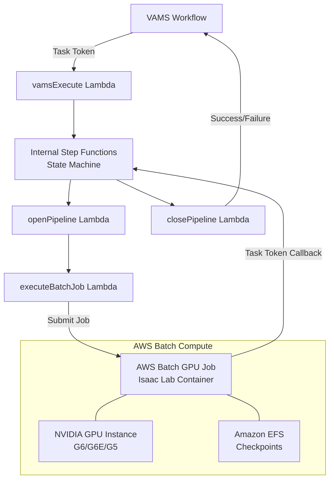

# NVIDIA Isaac Lab Training Pipeline

The Isaac Lab pipeline enables reinforcement learning (RL) policy training and evaluation using NVIDIA Isaac Lab on GPU-accelerated Amazon EC2 instances managed by AWS Batch. It supports two operational modes -- training new RL policies from scratch and evaluating pre-trained policies -- both orchestrated by AWS Step Functions with asynchronous task token callbacks.

## Overview

| Property | Value |
|---|---|
| **Pipeline IDs** | `isaaclab-training`, `isaaclab-evaluation` |
| **Configuration flag** | `app.pipelines.useIsaacLabTraining.enabled` |
| **Execution type** | Lambda (asynchronous with callback) |
| **Compute** | AWS Batch with GPU instances (G6, G6E, G5 families) |
| **Storage** | Amazon Elastic File System (Amazon EFS) for checkpoints |
| **Training timeout** | 8 hours |
| **Evaluation timeout** | 2 hours |

## Architecture

The pipeline uses a two-level AWS Step Functions pattern. The VAMS workflow invokes the `vamsExecute` Lambda function, which starts an internal Step Functions state machine. The internal state machine manages the AWS Batch GPU job lifecycle and reports completion back to the VAMS workflow via task tokens.



### AWS infrastructure components

| Component | Service | Purpose |
|---|---|---|
| Container image | Amazon Elastic Container Registry (Amazon ECR) | Isaac Lab Docker image built from NVIDIA NGC base |
| Compute environment | AWS Batch (Amazon EC2) | GPU instance management with G6, G6E, G5 instance types |
| Job queue | AWS Batch | Job scheduling and priority management |
| Checkpoint storage | Amazon EFS | Persistent storage for training checkpoints across jobs |
| Orchestration | AWS Step Functions | Workflow management with error handling |
| Monitoring | Amazon CloudWatch Container Insights | ECS cluster metrics and logging |

## Configuration

Add the following to your `config.json` under `app.pipelines`:

```json
{
  "app": {
    "pipelines": {
      "useIsaacLabTraining": {
        "enabled": true,
        "acceptNvidiaEula": true,
        "autoRegisterWithVAMS": true,
        "keepWarmInstance": false
      }
    }
  }
}
```

| Option | Default | Description |
|---|---|---|
| `enabled` | `false` | Enable or disable the pipeline deployment. |
| `acceptNvidiaEula` | `false` | **Required when enabled.** You must accept the [NVIDIA Software License Agreement](https://docs.nvidia.com/ngc/gpu-cloud/ngc-catalog-user-guide/index.html#ngc-software-license) by setting this to `true`. Deployment fails if this is `false` when the pipeline is enabled. |
| `autoRegisterWithVAMS` | `true` | Automatically register both the `isaaclab-training` and `isaaclab-evaluation` pipelines and workflows with VAMS at deploy time. |
| `keepWarmInstance` | `false` | When `true`, maintains one warm GPU instance (8 vCPUs for g6.2xlarge) in the AWS Batch compute environment. Reduces cold-start latency at the cost of continuous GPU instance charges. |

:::warning[NVIDIA EULA acceptance required]
The Isaac Lab container is built from the NVIDIA NGC base image. You must review and accept the [NVIDIA Software License Agreement](https://docs.nvidia.com/ngc/gpu-cloud/ngc-catalog-user-guide/index.html#ngc-software-license) before enabling this pipeline. The CDK deployment will fail with a validation error if `acceptNvidiaEula` is not set to `true`.
:::


## Prerequisites

- **GPU instance availability** -- Request quota increases for G6, G6E, or G5 instance families in your deployment region if needed. The compute environment uses `BEST_FIT_PROGRESSIVE` allocation across multiple instance types for optimal availability.
- **VPC with NAT Gateway** -- The pipeline requires private subnets with internet access (via NAT Gateway) because the Isaac Lab container needs to download NVIDIA Omniverse assets at runtime.
- **Amazon EFS** -- An Amazon EFS file system is automatically created in isolated subnets for training checkpoint persistence.
- **Large EBS volume** -- A 100 GB GP3 EBS volume is configured via launch template to accommodate the Isaac Lab container image (10+ GB).

## Training mode

The training mode trains new RL policies from scratch using the RSL-RL, RL Games, or SKRL reinforcement learning libraries.

### Training input parameters

Pass training configuration as `inputParameters` when triggering the pipeline:

```json
{
  "trainingConfig": {
    "mode": "train",
    "task": "Isaac-Cartpole-Direct-v0",
    "numEnvs": 4096,
    "maxIterations": 1500,
    "rlLibrary": "rsl_rl",
    "seed": 42
  },
  "computeConfig": {
    "numNodes": 1
  }
}
```

| Parameter | Default | Description |
|---|---|---|
| `trainingConfig.mode` | `"train"` | Must be `"train"` for training mode. |
| `trainingConfig.task` | `"Isaac-Cartpole-v0"` | The Isaac Lab task environment name. |
| `trainingConfig.numEnvs` | `4096` | Number of parallel simulation environments. |
| `trainingConfig.maxIterations` | `1500` | Maximum training iterations. |
| `trainingConfig.rlLibrary` | `"rsl_rl"` | RL library to use. Options: `"rsl_rl"`, `"rl_games"`, `"skrl"`. |
| `trainingConfig.seed` | `null` | Optional random seed for reproducibility. |
| `computeConfig.numNodes` | `1` | Number of compute nodes. Values greater than 1 enable multi-node distributed training via `torchrun`. |

### Training output

Training results are uploaded to the VAMS asset bucket under the job UUID prefix:

| Output | Format | Description |
|---|---|---|
| `checkpoints/model_*.pt` | PyTorch | Model checkpoint files saved during training |
| `metrics.csv` | CSV | Training metrics exported from TensorBoard event files |
| `*_git_diff.txt` | Text | Configuration diff files (converted from `.diff` for VAMS compatibility) |
| `training-config.json` | JSON | Input configuration saved for reference |

### Multi-node training

When `computeConfig.numNodes` is greater than 1, the pipeline uses AWS Batch multi-node parallel jobs with `torchrun` for distributed training. The main node (index 0) coordinates training and uploads results. All nodes send heartbeats to AWS Step Functions to prevent timeout.

## Evaluation mode

The evaluation mode runs a pre-trained policy against the simulation environment and captures metrics and video recordings.

### Evaluation input parameters

```json
{
  "trainingConfig": {
    "mode": "evaluate",
    "task": "Isaac-Cartpole-Direct-v0",
    "numEnvs": 100,
    "numEpisodes": 50,
    "stepsPerEpisode": 1000,
    "recordVideo": false,
    "rlLibrary": "rsl_rl"
  }
}
```

| Parameter | Default | Description |
|---|---|---|
| `trainingConfig.mode` | (required) | Must be `"evaluate"` for evaluation mode. |
| `trainingConfig.numEnvs` | `100` | Number of parallel environments for evaluation. |
| `trainingConfig.numEpisodes` | `50` | Number of evaluation episodes to run. |
| `trainingConfig.stepsPerEpisode` | `1000` | Steps per evaluation episode. |
| `trainingConfig.recordVideo` | `false` | Whether to record evaluation videos (videos are always generated as they are required for the Isaac Lab play script to terminate). |
| `trainingConfig.policyS3Uri` | `null` | Amazon S3 URI to a `.pt` policy file. The `openPipeline` Lambda discovers this automatically from the VAMS asset. |

### Evaluation output

| Output | Format | Description |
|---|---|---|
| `metrics.csv` | CSV | Evaluation metrics from TensorBoard |
| `videos/*.mp4` | MP4 | Evaluation episode recordings |
| `evaluation-config.json` | JSON | Input configuration saved for reference |

## Custom environments

The pipeline supports custom Isaac Lab environments packaged as Python packages. Upload your custom environment package (`.tar.gz`, `.zip`, or `.whl`) to an Amazon S3 location and reference it in the pipeline configuration:

```json
{
  "trainingConfig": {
    "mode": "train",
    "task": "MyCustomTask-v0"
  },
  "customEnvironmentS3Uri": "s3://my-bucket/envs/my-custom-env.tar.gz"
}
```

The container downloads the package at runtime and installs it with `pip install -e` before starting training or evaluation.

## Heartbeat mechanism

Long-running training jobs send periodic heartbeats (every 5 minutes) to both the internal and external AWS Step Functions state machines to prevent timeout. The heartbeat thread runs in the background during the entire training or evaluation process. The internal state machine has a 30-minute heartbeat timeout, so any interruption lasting longer than 30 minutes will cause the job to be marked as failed.

:::tip[Monitoring training progress]
Training progress can be monitored through Amazon CloudWatch Logs for the AWS Batch job. Container Insights is enabled on the ECS cluster for detailed resource utilization metrics.
:::


## Related pages

- [Pipeline overview](overview.md)
- [Custom pipelines](custom-pipelines.md)
- [Deployment configuration](../deployment/configuration-reference.md)
