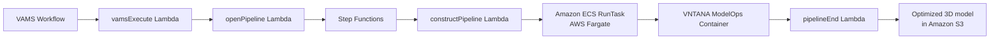

# ModelOps (VNTANA) Pipeline

The ModelOps pipeline integrates the VNTANA Intelligent 3D Optimization Engine for automated 3D model optimization, conversion, and preparation for web viewing. It is a licensed third-party product that runs as a container on Amazon Elastic Container Service (Amazon ECS) with AWS Fargate, orchestrated by AWS Step Functions.

## Overview

| Property                     | Value                                                                             |
| ---------------------------- | --------------------------------------------------------------------------------- |
| **Pipeline IDs**             | `vntana-model-ops-to-usdz`, `vntana-model-ops-to-glb`, `vntana-model-ops-to-gltf` |
| **Configuration flag**       | `app.pipelines.useModelOps.enabled`                                               |
| **Execution type**           | Lambda (asynchronous with callback)                                               |
| **Compute**                  | Amazon ECS on AWS Fargate (2 vCPU, 16 GB memory)                                  |
| **Supported input formats**  | `.glb`, `.gltf`, `.fbx`, `.obj`, `.stl`, `.ply`, `.usd`, `.usdz`, `.dae`, `.abc`  |
| **Supported output formats** | `.usdz`, `.glb`, `.gltf`                                                          |
| **Timeout**                  | 5 hours                                                                           |

:::warning[Licensed product]
VNTANA ModelOps is a commercial product that requires a valid subscription. The container image must be provided as an Amazon ECR image URI. Contact VNTANA for licensing information.
:::

## Architecture



The pipeline follows the standard VAMS container pipeline pattern:

1. **constructPipeline Lambda** -- Builds the pipeline definition with input and output Amazon S3 paths and container commands.
2. **Amazon ECS RunTask** -- Runs the VNTANA container as an AWS Fargate task in private subnets with internet egress for AWS Marketplace metering.
3. **pipelineEnd Lambda** -- Closes the pipeline and sends the callback to the VAMS workflow.

## Configuration

Add the following to your `config.json` under `app.pipelines`:

```json
{
    "app": {
        "pipelines": {
            "useModelOps": {
                "enabled": true,
                "ecrContainerImageURI": "your-ecr-image-uri",
                "autoRegisterWithVAMS": true
            }
        }
    }
}
```

| Option                 | Default    | Description                                                                         |
| ---------------------- | ---------- | ----------------------------------------------------------------------------------- |
| `enabled`              | `false`    | Enable or disable the pipeline deployment.                                          |
| `ecrContainerImageURI` | (required) | The Amazon ECR container image URI for the VNTANA ModelOps container.               |
| `autoRegisterWithVAMS` | `true`     | Automatically register conversion pipelines and workflows with VAMS at deploy time. |

## Prerequisites

-   **VNTANA license** -- A valid VNTANA subscription is required. The container image must be accessible from your AWS account.
-   **Internet access** -- The container requires internet access for AWS Marketplace metering API communication. The ECS cluster deploys in private subnets with a NAT Gateway.
-   **VPC with private subnets** -- When using an external VPC, provide private subnet IDs in the VPC configuration for the ECS cluster.
-   **Container image** -- The `ecrContainerImageURI` must point to a valid container image.

## Registered workflows

When `autoRegisterWithVAMS` is `true`, the following pipelines and workflows are automatically registered at deploy time:

| Pipeline ID                | Output format | Description                                                                                |
| -------------------------- | ------------- | ------------------------------------------------------------------------------------------ |
| `vntana-model-ops-to-usdz` | `.usdz`       | Optimize and convert 3D models to USDZ for Apple AR Quick Look and other USD-based viewers |
| `vntana-model-ops-to-glb`  | `.glb`        | Optimize and convert 3D models to GLB for web viewing and real-time applications           |
| `vntana-model-ops-to-gltf` | `.gltf`       | Optimize and convert 3D models to GLTF with separate binary and texture files              |

All registered pipelines accept any supported input file format (`.all`) and operate as asynchronous pipelines with callback enabled. The task timeout is set to 4 hours per conversion job.

## VNTANA optimization capabilities

The VNTANA engine provides the following optimization modules that can be configured through pipeline input parameters:

-   **Mesh decimation** -- Reduces polygon count while preserving visual quality.
-   **Texture optimization** -- Compresses and resizes textures for target delivery platforms.
-   **LOD generation** -- Creates multiple levels of detail for progressive loading.
-   **Surface smoothing** -- Smooths mesh surfaces after decimation.
-   **Normal generation** -- Generates vertex normals for models that lack them.
-   **Animation preservation** -- Maintains skeletal and morph target animations during conversion.

:::info[Template-based configuration]
VNTANA supports template-based optimization configurations through the `inputParameters` field. Templates define a sequence of optimization and conversion modules with per-module settings. Refer to the VNTANA documentation for the full template schema and available options.
:::

## AWS Marketplace integration

The ModelOps container integrates with AWS Marketplace for usage tracking. The container IAM roles include permissions for `aws-marketplace:RegisterUsage` and `aws-marketplace:MeterUsage`. Ensure the AWS Marketplace subscription is active in the deployment account before running the pipeline.

## Related pages

-   [Pipeline overview](overview.md)
-   [RapidPipeline](rapidpipeline.md)
-   [Custom pipelines](custom-pipelines.md)
-   [Deployment configuration](../deployment/configuration-reference.md)
