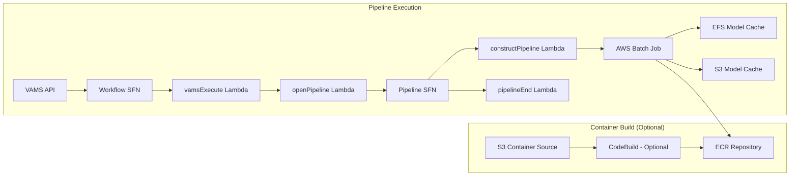

# NVIDIA Cosmos 3 Pipeline

The NVIDIA Cosmos 3 pipeline uses NVIDIA's Cosmos 3 omnimodal world foundation models to generate images and videos from text prompts (text2image, text2video), from an input image (image2video), or from an input video (video2video and control-signal transfer). The pipeline runs on GPU-accelerated AWS Batch instances and stores generated media back to VAMS assets.

:::info[Cosmos 3 Model Families]
VAMS supports the **Cosmos 3** omnimodal Mixture-of-Transformers architecture with Nano (16B) and Super (64B) parameter variants. Each enabled variant is registered as its own pipeline, and the generation mode is chosen per run by selecting one of that pipeline's templates. See [Generation modes](#generation-modes) for the modes each pipeline ships and the input files they consume.
:::

## Overview

| Property                    | Value                                                                                                                      |
| --------------------------- | -------------------------------------------------------------------------------------------------------------------------- |
| **Model Family**            | Cosmos 3 (Omnimodal Mixture-of-Transformers)                                                                               |
| **Pipeline ID**             | `nvidia-cosmos3-nano`, `nvidia-cosmos3-super`, `nvidia-cosmos3-super-text2image`, `nvidia-cosmos3-super-image2video`       |
| **Configuration flag**      | `app.pipelines.useNvidiaCosmos3.enabled`, per-model flags under `app.pipelines.useNvidiaCosmos3.modelsOmni.*`              |
| **Execution type**          | Lambda (asynchronous with callback)                                                                                        |
| **Supported input formats** | Text modes (text2image, text2video): none, the prompt is the only input. Image input (image2video): `.jpg`, `.jpeg`, `.png`, `.webp`. Video input (video2video, transfer): `.mp4`, `.mov` |
| **Output (Nano)**           | Video: MP4 (1024x576, 24fps, 93 frames by default -- about 3.9 seconds -- set per run with the template's **Frames to generate** field). Every Nano template generates video |
| **Output (Super)**          | Image (Super-Text2Image): PNG (1024x1024), Video (Super/Super-Image2Video): MP4 (1280x720, 24fps, ~8 seconds / 189 frames) |
| **Timeout**                 | 8 hours (Batch job), 8 hours (VAMS workflow task token)                                                                    |

:::note[A run may write more than one output object]
A run writes back every artifact it produced, so more than one object can appear under the execution's
output file path. The **primary** artifact -- the most recently written, then the largest, then the
first by path -- carries the asset-facing name (`cosmos3-{variant}-{timestamp}` for the text modes,
`{input file stem}_Cosmos3_{variant}_{timestamp}` for the input-file modes) and is the only one the
`.previewFile.gif` thumbnail is generated from and keyed to. Additional artifacts are written flat
beside the primary, with their path inside the container's output directory folded into the file name
rather than reproduced as a folder, because the workflow's own output path extension is what separates
one run's files from another's. Control-signal transfer is where this is most visible: when the
framework leaves the control signal it computed beside the generated video, both videos reach the asset.
:::

### Approximate Run Times

| Phase                             | Duration (Nano: g6e.12xlarge / Super: p5.48xlarge) | Notes                                                 |
| --------------------------------- | ------------------------------------------------- | ------------------------------------------------------ |
| Cold start (instance launch)      | 5-10 min                                          | Skipped if `useWarmInstances` is enabled               |
| Container image pull              | 5-8 min                                           | Cached after first pull on instance                    |
| Model sync (EFS cached)           | 1-5 min                                           | First run: 30+ min for model download from HuggingFace |
| Inference (Nano video generation) | 6-10 min                                          | 4x L40S 48GB, parameters sharded across them           |
| Inference (Super image)           | 5-8 min                                           | Multi-GPU on 8x H100 80GB                              |
| Inference (Super video)           | 15-25 min                                         | Multi-GPU on 8x H100 80GB                              |
| S3 upload + callback              | < 1 min                                           | ~1-10MB output                                         |
| **Total Nano (cached models)**    | **~15-30 min**                                    | Including cold start                                   |
| **Total Super (cached models)**   | **~30-50 min**                                    | Including cold start                                   |
| **Total (warm instance, cached)** | **~10-20 min (Nano), ~20-30 min (Super)**         | No cold start                                          |

:::tip[Higher performance with larger instances]
Super 64B models require instances with 8 GPUs (p5.48xlarge with 8x H100 80GB, p5e.48xlarge with 8x H200 80GB, or p4de.24xlarge with 8x A100-80GB). Nano models require at least 4 GPUs: the 16B checkpoint is roughly 32 GB of BF16 weights, which leaves too little of a single L40S's usable 48 GB for the activations of a full-length sequence, so the container shards the parameters across the GPUs the job reserves. Every g6e size carries the same 48 GB L40S, so a larger g6e contributes more devices rather than more memory per device -- g6e.12xlarge (4x L40S) is the smallest instance the Nano tier runs on.
:::

## Generation modes

Each enabled model variant with `autoRegisterWithVAMS` set is registered as its own pipeline together with a built-in workflow of the same name. The generation mode is not a deployment setting -- it is chosen per run by selecting one of the pipeline's templates, and the template declares whether the run consumes an input file.

| Pipeline                           | Template                          | Mode        | Input file                            | Runs on the built-in workflow      |
| ---------------------------------- | --------------------------------- | ----------- | ------------------------------------- | ---------------------------------- |
| `nvidia-cosmos3-nano`              | Text-to-Video (Nano) -- default   | text2video  | None                                  | Yes                                |
| `nvidia-cosmos3-nano`              | Image-to-Video (Nano)             | image2video | One: `.jpg`, `.jpeg`, `.png`, `.webp` | No -- needs an input-file workflow |
| `nvidia-cosmos3-nano`              | Video-to-Video (Nano)             | video2video | One: `.mp4`, `.mov`                   | No -- needs an input-file workflow |
| `nvidia-cosmos3-nano`              | Control-Signal Transfer (Nano)    | transfer    | One: `.mp4`, `.mov`                   | No -- needs an input-file workflow |
| `nvidia-cosmos3-super`             | Text-to-Video (Super) -- default  | text2video  | None                                  | Yes                                |
| `nvidia-cosmos3-super`             | Video-to-Video (Super)            | video2video | One: `.mp4`, `.mov`                   | No -- needs an input-file workflow |
| `nvidia-cosmos3-super`             | Control-Signal Transfer (Super)   | transfer    | One: `.mp4`, `.mov`                   | No -- needs an input-file workflow |
| `nvidia-cosmos3-super-text2image`  | Text-to-Image (Super) -- default  | text2image  | None                                  | Yes                                |
| `nvidia-cosmos3-super-image2video` | Image-to-Video (Super) -- default | image2video | One: `.jpg`, `.jpeg`, `.png`, `.webp` | Yes                                |

Text-to-image runs on the `nvidia-cosmos3-super-text2image` pipeline. The Nano pipeline ships no text-to-image template, and image-to-video on the Super 64B checkpoint is served by the separate `nvidia-cosmos3-super-image2video` pipeline rather than by a template on `nvidia-cosmos3-super`.

:::warning[Input-file modes on the Nano and Super pipelines need a workflow that accepts an input file]
A workflow declares an `inputFileArity` of `none`, `one`, or `multi`, and an execution is rejected when the file selection does not match it. The built-in "NVIDIA Cosmos 3 Nano (16B)" and "NVIDIA Cosmos 3 Super (64B)" workflows declare `none`, because their default template generates from a text prompt alone. Selecting the Image-to-Video, Video-to-Video, or Control-Signal Transfer template through one of those workflows is rejected with `Workflow expects no input files.`

To run those modes, create a workflow that contains the pipeline and declares an `inputFileArity` of `one` (the default for a newly created workflow) or `multi`, then select the template on that workflow's execute form. The built-in "NVIDIA Cosmos 3 Super Image2Video (64B)" workflow already declares `one`, so that pipeline's image-to-video mode runs as shipped.
:::

:::note[File-upload triggers on the text-mode workflows]
When `autoTriggerOnFileExtensionsUpload` is set, the built-in workflow's file-upload trigger is enabled. On the Nano and Super workflows, which take no input files, the uploaded file selects the trigger and names the asset the generated media is written back to -- it is not used as an input file, and the run generates from the prompt in the asset's `COSMOS3_PROMPT` metadata using the default text-to-video template. On the Super Image2Video workflow, the uploaded file is the input image.
:::

## Container Build Options

VAMS supports two methods for building the Cosmos 3 container:

### CodeBuild (Optional)

When `useCodeBuild: true`, containers are built in the cloud using AWS CodeBuild:

-   Container source code is uploaded to Amazon S3 during CDK deployment
-   CodeBuild builds the Docker image and pushes to Amazon ECR
-   Batch job definitions reference the Amazon ECR image
-   Automatic rebuilds when container source code changes
-   Runs in the same private VPC subnets as the pipeline Batch compute, with NAT Gateway egress for internet access

**Advantages:**

-   No local Docker build required (avoids large image builds on developer machines)
-   Faster iteration with high-bandwidth cloud builds
-   Automatic rebuilds on source changes

**Troubleshooting CodeBuild failures:** CodeBuild runs asynchronously after CDK deployment completes. If a container build fails, the CDK deployment itself will succeed but the Batch pipeline will fail with a container image pull error. To check build status, use the CodeBuild project name from the CDK stack outputs:

```bash
# Get the CodeBuild project name from stack outputs
aws cloudformation describe-stacks --stack-name <your-stack-name> --query "Stacks[0].Outputs[?contains(OutputKey,'CodeBuildProject')].OutputValue" --output text

# Check build status
aws codebuild list-builds-for-project --project-name <project-name>
aws codebuild batch-get-builds --ids <build-id>
```

:::warning[CodeBuild Internet Access]
CodeBuild runs in the same private VPC subnets used by the Cosmos pipeline Batch compute environments. These private subnets require a NAT Gateway for internet egress, which is automatically provisioned when the Cosmos pipeline is enabled. For AWS GovCloud and EU Sovereign Cloud deployments, organizations should validate that CodeBuild is configured with the correct private VPC settings for their environment.
:::

:::warning[Docker Hub Rate Limiting]
CodeBuild builds that pull base images from Docker Hub (for example, `nvidia/cuda`) are subject to Docker Hub's anonymous pull rate limits, which can cause build failures with "429 Too Many Requests" errors. To avoid throttling, configure Docker Hub authentication credentials in CodeBuild by storing credentials in AWS Secrets Manager and referencing them in the buildspec or CodeBuild environment. Alternatively, organizations can mirror base images to Amazon ECR Public or a private Amazon ECR repository.
:::

### DockerImageAsset (Legacy)

When `useCodeBuild: false`, containers are built locally during CDK deployment using Docker and pushed to a CDK-managed Amazon ECR repository. This requires significant local resources and bandwidth.

## Architecture

The pipeline leverages NVIDIA Cosmos 3 models running on GPU-enabled AWS Batch compute instances with container-based inference. Generated models are cached on Amazon EFS and optionally backed up to Amazon S3 for faster subsequent runs.



### Processing stages

1. **Model Download and Caching (First Run Only)** -- On the first pipeline execution, the container downloads the Cosmos 3 model and its dependencies from HuggingFace to Amazon EFS. Subsequent runs reuse the cached models from Amazon EFS with Amazon S3 backup.

2. **Media Generation (AWS Batch on GPU Instances)** -- The container loads the model from Amazon EFS, processes the text prompt and, in the input-file modes, the input image or video, and generates an image or video using NVIDIA's Cosmos 3 omnimodal model. Every artifact the run leaves in the container's output directory is written to the auxiliary Amazon S3 bucket, the primary one under the asset-facing name and the rest flat beside it.

3. **Thumbnail Generation** -- For video outputs, the container extracts frames from the primary artifact and creates a `.previewFile.gif` thumbnail for web preview, keyed to that artifact's own file name.

4. **Output Processing** -- The VAMS workflow process-output step moves every generated artifact and the thumbnail to the asset bucket at the correct file path.

## Prerequisites

:::warning[HuggingFace access and model license required]
You must accept the NVIDIA Cosmos 3 model license on HuggingFace before using this pipeline. All model access must be granted to the same HuggingFace account used to generate the API token.
:::

-   **HuggingFace Account** -- Create an account at [huggingface.co](https://huggingface.co/).
-   **Accept Licenses and Request Model Access** -- You must explicitly accept the license and request access for each model on HuggingFace. Visit each model page, accept the license terms, click "Request access" (if gated), and wait for approval. Accept the license for each model you plan to use:

    | Model                                                                                       | Params | Task                              | License                                        | HuggingFace URL                                                 |
    | ------------------------------------------------------------------------------------------- | ------ | --------------------------------- | ---------------------------------------------- | --------------------------------------------------------------- |
    | [nvidia/Cosmos3-Nano](https://huggingface.co/nvidia/Cosmos3-Nano)                           | 16B    | omni (all modes)                  | [OpenMDW-1.1](https://openmdw.ai/license/1-1/) | [Link](https://huggingface.co/nvidia/Cosmos3-Nano)              |
    | [nvidia/Cosmos3-Super](https://huggingface.co/nvidia/Cosmos3-Super)                         | 64B    | text2video/text2image/image2video | [OpenMDW-1.1](https://openmdw.ai/license/1-1/) | [Link](https://huggingface.co/nvidia/Cosmos3-Super)             |
    | [nvidia/Cosmos3-Super-Text2Image](https://huggingface.co/nvidia/Cosmos3-Super-Text2Image)   | 64B    | text2image                        | [OpenMDW-1.1](https://openmdw.ai/license/1-1/) | [Link](https://huggingface.co/nvidia/Cosmos3-Super-Text2Image)  |
    | [nvidia/Cosmos3-Super-Image2Video](https://huggingface.co/nvidia/Cosmos3-Super-Image2Video) | 64B    | image2video                       | [OpenMDW-1.1](https://openmdw.ai/license/1-1/) | [Link](https://huggingface.co/nvidia/Cosmos3-Super-Image2Video) |

-   **HuggingFace Token** -- Generate a Read access token from your HuggingFace account settings. The token must be associated with the account that has been granted access to the models listed above. Store the token value directly in the `huggingFaceToken` field of the CDK configuration -- it will be securely stored in AWS Secrets Manager during deployment.
-   **GPU Instance Availability** -- The pipeline uses `BEST_FIT_PROGRESSIVE` allocation with multiple fallback instance types. Ensure your AWS Region has capacity for at least one of the configured types. Nano models require instances with at least 4 GPUs of 48GB+ VRAM; Super models require 8 GPUs.
-   **VPC Configuration** -- The pipeline deploys into private subnets with NAT Gateway or public subnets for internet access (required for HuggingFace model downloads on first run). Ensure VPC endpoints are configured for Amazon S3, Amazon EFS, Amazon ECR, and AWS Batch if running in a VPC-only environment.
-   **Amazon EFS** -- The pipeline creates a shared Amazon EFS file system for model caching across AWS Batch instances.

:::warning[Availability outside the commercial partition]
The shipped `instanceTypes` values target commercial AWS Regions. Deployment configuration validation checks that an enabled model variant names a non-empty `instanceTypes` array and that each named type carries at least as many GPUs as that tier's jobs reserve (4 for Nano, 8 for Super) -- an instance type with too few is rejected at synthesis, because AWS Batch would accept the compute environment and then leave every job `RUNNABLE` without reporting an error. An instance type VAMS does not recognize is reported as unverified rather than rejected, so a newly released accelerated family is not blocked. Validation does not check that those GPU instance families are offered in the deployment Region, or that the HuggingFace model download path is reachable from the partition. For AWS GovCloud and the AWS European Sovereign Cloud, compare the configured instance types against the GPU instances the target Region offers, adjust them where they differ, and evaluate the pipeline in a non-production deployment before enabling it.
:::

## Configuration

Add the following to your `config.json` under `app.pipelines`:

```json
{
    "app": {
        "pipelines": {
            "useNvidiaCosmos3": {
                "enabled": true,
                "huggingFaceToken": "hf_yourTokenHere",
                "useCodeBuild": false,
                "useWarmInstances": false,
                "warmInstanceCount": 1,
                "modelsOmni": {
                    "nano16B": {
                        "enabled": true,
                        "autoRegisterWithVAMS": true,
                        "autoTriggerOnFileExtensionsUpload": "",
                        "instanceTypes": ["g6e.12xlarge", "g6e.24xlarge", "g6e.48xlarge"],
                        "maxVCpus": 192
                    },
                    "super64B": {
                        "enabled": false,
                        "autoRegisterWithVAMS": true,
                        "autoTriggerOnFileExtensionsUpload": "",
                        "instanceTypes": ["p5.48xlarge", "p5e.48xlarge", "p4de.24xlarge"],
                        "maxVCpus": 192
                    },
                    "superText2Image64B": {
                        "enabled": false,
                        "autoRegisterWithVAMS": true,
                        "instanceTypes": ["p5.48xlarge", "p5e.48xlarge"],
                        "maxVCpus": 192
                    },
                    "superImage2Video64B": {
                        "enabled": false,
                        "autoRegisterWithVAMS": true,
                        "autoTriggerOnFileExtensionsUpload": "",
                        "instanceTypes": ["p5.48xlarge", "p5e.48xlarge", "p4de.24xlarge"],
                        "maxVCpus": 192
                    }
                }
            }
        }
    }
}
```

| Option                                                             | Default                                            | Description                                                                                                                                                                                                                       |
| ------------------------------------------------------------------ | -------------------------------------------------- | --------------------------------------------------------------------------------------------------------------------------------------------------------------------------------------------------------------------------------- |
| `enabled`                                                          | `false`                                            | Enable or disable the Cosmos 3 pipeline deployment.                                                                                                                                                                               |
| `huggingFaceToken`                                                 | `""`                                               | HuggingFace Read access token value (for example, `hf_xxxx`). CDK automatically stores this in AWS Secrets Manager during deployment. The token is never exposed in CloudFormation templates.                                     |
| `useCodeBuild`                                                     | `false`                                            | When `true`, builds the container using AWS CodeBuild. When `false`, uses local Docker build (DockerImageAsset).                                                                                                                  |
| `useWarmInstances`                                                 | `false`                                            | When `true`, keeps GPU instances running when idle for instant pipeline starts. When `false`, scales to zero after job completion and incurs ~5-10 minute cold start. **Warning:** Warm instances incur continuous compute costs. |
| `warmInstanceCount`                                                | `1`                                                | Number of warm GPU instances to keep running when `useWarmInstances` is `true`.                                                                                                                                                   |
| `modelsOmni.nano16B.enabled`                                       | `false`                                            | Enable the Cosmos3-Nano 16B model for generating video from a text prompt, from an input image, or from a source video.                                                                                                           |
| `modelsOmni.nano16B.autoRegisterWithVAMS`                          | `true`                                             | Automatically register the pipeline and workflow with VAMS at deploy time.                                                                                                                                                        |
| `modelsOmni.nano16B.autoTriggerOnFileExtensionsUpload`             | `""`                                               | Any non-empty value enables the built-in workflow's file-upload trigger; leave empty to leave it disabled. The extensions the trigger fires on come from the workflow's trigger filter (`.mp4`, `.mov`, `.jpg`, `.jpeg`, `.png`, `.webp`). |
| `modelsOmni.nano16B.instanceTypes`                                 | `["g6e.12xlarge", "g6e.24xlarge", "g6e.48xlarge"]` | EC2 GPU instance types for AWS Batch compute (BEST_FIT_PROGRESSIVE). Each must carry at least 4 GPUs of 48GB+ VRAM; a smaller type is rejected at synthesis.                                                                       |
| `modelsOmni.nano16B.maxVCpus`                                      | `192`                                              | Maximum vCPUs for the AWS Batch compute environment.                                                                                                                                                                              |
| `modelsOmni.super64B.enabled`                                      | `false`                                            | Enable the Cosmos3-Super 64B omnimodal model for generating video from a text prompt or from a source video.                                                                                                                      |
| `modelsOmni.super64B.autoRegisterWithVAMS`                         | `true`                                             | Automatically register the pipeline and workflow with VAMS at deploy time.                                                                                                                                                        |
| `modelsOmni.super64B.autoTriggerOnFileExtensionsUpload`            | `""`                                               | Any non-empty value enables the built-in workflow's file-upload trigger; leave empty to leave it disabled. The extensions the trigger fires on come from the workflow's trigger filter (`.mp4`, `.mov`, `.jpg`, `.jpeg`, `.png`, `.webp`). |
| `modelsOmni.super64B.instanceTypes`                                | `["p5.48xlarge", "p5e.48xlarge", "p4de.24xlarge"]` | EC2 GPU instance types for AWS Batch compute. Requires 8x H100/H200/A100-80GB GPUs.                                                                                                                                               |
| `modelsOmni.super64B.maxVCpus`                                     | `192`                                              | Maximum vCPUs for the AWS Batch compute environment.                                                                                                                                                                              |
| `modelsOmni.superText2Image64B.enabled`                            | `false`                                            | Enable the Cosmos3-Super-Text2Image 64B model for generating high-quality images from text prompts.                                                                                                                               |
| `modelsOmni.superText2Image64B.autoRegisterWithVAMS`               | `true`                                             | Automatically register the pipeline and workflow with VAMS at deploy time.                                                                                                                                                        |
| `modelsOmni.superText2Image64B.instanceTypes`                      | `["p5.48xlarge", "p5e.48xlarge"]`                  | EC2 GPU instance types for AWS Batch compute. Requires 8x H100/H200 GPUs.                                                                                                                                                         |
| `modelsOmni.superText2Image64B.maxVCpus`                           | `192`                                              | Maximum vCPUs for the AWS Batch compute environment.                                                                                                                                                                              |
| `modelsOmni.superImage2Video64B.enabled`                           | `false`                                            | Enable the Cosmos3-Super-Image2Video 64B model for generating high-quality videos from images with optional text guidance.                                                                                                        |
| `modelsOmni.superImage2Video64B.autoRegisterWithVAMS`              | `true`                                             | Automatically register the pipeline and workflow with VAMS at deploy time.                                                                                                                                                        |
| `modelsOmni.superImage2Video64B.autoTriggerOnFileExtensionsUpload` | `""`                                               | Any non-empty value enables the built-in workflow's file-upload trigger; leave empty to leave it disabled. The extensions the trigger fires on come from the workflow's trigger filter (`.jpg`, `.jpeg`, `.png`, `.webp`).        |
| `modelsOmni.superImage2Video64B.instanceTypes`                     | `["p5.48xlarge", "p5e.48xlarge", "p4de.24xlarge"]` | EC2 GPU instance types for AWS Batch compute. Requires 8x H100/H200/A100-80GB GPUs.                                                                                                                                               |
| `modelsOmni.superImage2Video64B.maxVCpus`                          | `192`                                              | Maximum vCPUs for the AWS Batch compute environment.                                                                                                                                                                              |

## GPU Instance Recommendations

The NVIDIA Cosmos 3 models require significant GPU memory for full-precision inference. The following table provides instance recommendations based on model variant and size:

| Variant | Params | Min VRAM              | Recommended Instance                       | GPUs                       | Notes                                                           |
| ------- | ------ | --------------------- | ------------------------------------------ | -------------------------- | --------------------------------------------------------------- |
| Nano    | 16B    | ~35 GB (BF16 weights) | g6e.12xlarge                               | 4× L40S (48 GB each)       | Parameters sharded across the 4 GPUs, ~35 GB download           |
| Super   | 64B    | >128 GB aggregate     | p5.48xlarge / p5e.48xlarge / p4de.24xlarge | 8× H100 / H200 / A100-80GB | Multi-GPU mandatory (won't fit one 80 GB GPU); ~133 GB download |

:::warning[Super 64B multi-GPU]
The Super 64B models do not fit on a single 80 GB H100 GPU and must be sharded across 8 GPUs on one NVLink node. Use `p4de` (A100 80 GB), not `p4d` (40 GB). The Super-Text2Image and Super-Image2Video variants are specialized checkpoints that share the same multi-GPU requirement.
:::

## Model Caching

On the first pipeline execution, the container downloads the Cosmos 3 model and its dependencies from HuggingFace:

-   **Cosmos3-Nano** -- ~35 GB
-   **Cosmos3-Super** -- ~133 GB
-   **Cosmos3-Super-Text2Image** -- ~133 GB
-   **Cosmos3-Super-Image2Video** -- ~133 GB

The models are cached on Amazon EFS with backup to Amazon S3 (under `cosmos3/hf_cache` prefix). Subsequent pipeline runs load models directly from Amazon EFS, enabling instant start times (after cold start warm-up).

:::info[Amazon EFS costs]
The Amazon EFS file system stores model weights and incurs standard Amazon EFS storage costs. The pipeline uses General Purpose performance mode with elastic throughput. Monitor Amazon EFS costs and consider setting lifecycle policies for long-term cost optimization.
:::

:::warning[The Amazon S3 model cache bucket is RETAINED]
Enabling this pipeline creates an Amazon S3 model cache bucket in addition to the Amazon EFS file system.
It uses a `RETAIN` removal policy, so it and its contents **survive `cdk destroy`** and require a manual
delete — unlike the EFS file system, which is removed with the stack. Cached weights make it one of the
largest buckets in a deployment, and it occupies one of the account's Amazon S3 bucket slots (100 by
default) until deleted.

The bucket is auto-named, so a retained copy does **not** block a redeploy. See
[AWS resources](../architecture/aws-resources.md#amazon-s3-buckets) for the full inventory and
[Uninstall the solution](../deployment/uninstall.md#step-2-delete-s3-buckets) for the cleanup steps.
:::

## Warm vs Cold Instances

The `useWarmInstances` configuration option controls whether AWS Batch compute instances remain running when idle:

### Cold Instances (useWarmInstances: false, default)

-   **Behavior:** AWS Batch scales to zero when no jobs are running. Instances launch on-demand when a job is queued.
-   **Cold Start Time:** ~5-10 minutes (instance launch + model load from Amazon EFS).
-   **Cost:** Pay only for active job execution time (no idle instance costs).
-   **Use Case:** Infrequent pipeline usage, cost-sensitive deployments.

### Warm Instances (useWarmInstances: true)

-   **Behavior:** AWS Batch keeps `warmInstanceCount` GPU instances running at all times. Jobs start immediately without waiting for instance launch.
-   **Start Time:** Near-instant (model already loaded in memory).
-   **Cost:** Continuous compute costs. Multiply by `warmInstanceCount` for total cost.
-   **Use Case:** Frequent pipeline usage, latency-sensitive applications, interactive demos.

:::warning[Warm instance costs]
Keeping warm instances running incurs continuous compute costs. A single g6e.12xlarge instance -- the smallest the Nano tier runs on -- costs approximately $10.49/hr (~$251/day, ~$7,558/month) at 24/7 utilization. Use warm instances only when start-time reduction justifies the additional cost.
:::

## Metadata Reference

The Cosmos 3 pipeline uses metadata keys to configure generation parameters. The metadata scope (asset vs file) depends on the pipeline mode:

| Metadata Key               | Scope                                       | Applies to           | Default                                                               |
| -------------------------- | ------------------------------------------- | -------------------- | --------------------------------------------------------------------- |
| `COSMOS3_PROMPT`           | Asset (text) / File then asset (input-file) | all generative modes | required for text modes; scene-continue fallback for input-file modes |
| `COSMOS3_NEGATIVE_PROMPT`  | Asset/File                                  | generative modes     | `""`                                                                  |
| `COSMOS3_SEED`             | Asset/File                                  | all                  | `0`                                                                   |
| `COSMOS3_GUIDANCE`         | Asset/File                                  | generative modes     | model default                                                         |
| `COSMOS3_NUM_FRAMES`       | Asset/File                                  | video modes          | `93` (the Nano templates' **Frames to generate** default)             |
| `COSMOS3_TASK_MODE`        | Asset/File                                  | mode switch          | the mode the selected template declares                               |
| `COSMOS3_CONTROL_TYPE`     | File then asset                             | transfer mode        | `edge` (comma-separated for multi-control, e.g. `edge,blur`)          |
| `COSMOS3_CONTROL_PATH`     | File then asset                             | transfer mode        | `""` (auto-compute from source; comma-aligned to control types)       |
| `COSMOS3_CONTROL_WEIGHT`   | File then asset                             | transfer mode        | `1.0` (comma-aligned to control types)                                |
| `COSMOS3_CONTROL_GUIDANCE` | File then asset                             | transfer mode        | `1.5`                                                                 |

A value typed into the corresponding field on the execute form wins over metadata, so a metadata value acts as a standing default that each run can override. `COSMOS3_SEED`, `COSMOS3_GUIDANCE`, and `COSMOS3_CONTROL_PATH` have no field on the shipped templates and are supplied by metadata alone. `COSMOS3_NUM_FRAMES` has a field on the four **Nano** templates, which declare it as an integer tag, and none on the Super templates — so on a Super run it too is supplied by metadata alone.

:::warning[Asset vs File metadata]
**Text-input modes** (text2image, text2video) read metadata from **asset-level metadata** only, because they do not operate on a specific file -- they generate media from text only, so a value set on a file is not found. **Input-file modes** (image2video, video2video, transfer) read **file-level metadata first and fall back to asset-level metadata**, so a per-file value overrides a standing value on the asset.
:::

### Control-Signal Transfer (Video-to-Video)

The general-purpose omni variants (`nano` and `super`) can perform **control-signal transfer** -- transforming a source video while preserving its structure via a spatial control signal, equivalent to the standalone NVIDIA Cosmos Transfer capability. Transfer runs on the existing Nano and Super pipelines through their **Control-Signal Transfer** template; no separate pipeline registration is required. The task-specialized variants (`super-text2image`, `super-image2video`) do not support transfer and ignore the request.

To run transfer, select the **Control-Signal Transfer** template for the pipeline and choose the source video as the run's input file. Because the template consumes an input file, run it through a workflow whose `inputFileArity` is `one` or `multi` -- see [Generation modes](#generation-modes). The control settings are fields on the template's execute form, each falling back to a metadata key when left blank:

-   **`COSMOS3_CONTROL_TYPE`** -- one or more control signals: `edge` (Canny edge map), `blur` (blurred reference), `depth` (depth map), `seg` (segmentation map), or `wsm` (world-scenario map). Supply a comma-separated list for **multi-control** (for example, `edge,blur`) to blend multiple hints in a single pass.
-   **`COSMOS3_CONTROL_PATH`** -- optional comma-separated list of S3 paths to pre-computed control videos, positionally aligned to `COSMOS3_CONTROL_TYPE`. Leave an entry blank to have the framework auto-compute that signal from the source video. Metadata only -- the shipped template has no field for it.
-   **`COSMOS3_CONTROL_WEIGHT`** -- optional comma-separated control strengths (default `1.0` each), positionally aligned to `COSMOS3_CONTROL_TYPE`.
-   **`COSMOS3_CONTROL_GUIDANCE`** -- optional control-guidance scale (default `1.5`).
-   **`COSMOS3_PROMPT`** -- a caption describing the desired output (recommended).

The input file is the source video; the output is a transformed MP4 written back to the asset. When the framework also leaves the control signal it computed in the output directory, that video is written back alongside the transformed one -- see [A run may write more than one output object](#overview). Transfer runs on the framework's `video2video` model mode.

:::note[Transfer is Nano/Super only]
Transfer is honored only on the `nano` and `super` pipelines. If `COSMOS3_TASK_MODE=transfer` is set for the `super-text2image` or `super-image2video` pipelines, it is ignored and the pipeline runs its normal mode.
:::

:::note[Switching the mode with metadata]
`COSMOS3_TASK_MODE` overrides the mode the selected template declares, but it does not change what the run carries. A run launched from a text-mode template selects no input file, so switching it to `transfer`, `image2video`, or `video2video` this way is rejected with `Input S3 URI is required for this mode` before any GPU capacity is provisioned. Select the template for the mode you intend to run -- the shipped Control-Signal Transfer template already sets `transfer`.
:::

### Template Configuration Keys

The container reads its runtime settings from the selected template's configuration body. The shipped templates set `MODEL_VARIANT` and `TASK_MODE` for their mode and expose `DISABLE_GUARDRAILS` as a field on the execute form. The remaining keys have no form field, so setting them takes editing the template's configuration body or supplying a custom template override on the run -- every shipped template allows custom edits, and every Cosmos 3 pipeline allows a custom template override.

| Key                        | Default      | Source in the shipped templates | Description                                                                                                  |
| -------------------------- | ------------ | ------------------------------- | ------------------------------------------------------------------------------------------------------------ |
| `MODEL_VARIANT`            | N/A          | Fixed by the template           | Model variant (`nano`, `super`, `super-text2image`, `super-image2video`).                                     |
| `TASK_MODE`                | N/A          | Fixed by the template           | Task mode (`text2image`, `text2video`, `image2video`, `video2video`, `transfer`).                             |
| `DISABLE_GUARDRAILS`       | `true`       | Execute-form field, checked     | Disable safety guardrails. Clear the field to run them (requires additional GPU memory for guardrail models). |
| `GENERATE_PREVIEW_GIF`     | unset (off)  | Configuration body only         | Generate a `.previewFile.gif` thumbnail from the output video. Requires additional memory after inference.    |
| `INVALIDATE_COSMOS_MODELS` | unset (off)  | Configuration body only         | Force re-download of all models from HuggingFace (clears Amazon EFS and Amazon S3 cache).                     |

## Troubleshooting

### Out-of-Memory (OOM) errors

If the pipeline fails with OOM errors, the selected instance type may not have sufficient GPU memory for the model size:

-   **Nano 16B models:** Use g6e.12xlarge or larger (at least 4 GPUs, minimum 48GB VRAM each).
-   **Super 64B models:** Use p5.48xlarge, p5e.48xlarge, or p4de.24xlarge (minimum 8x 80GB VRAM GPUs).

### HuggingFace token issues

If the pipeline fails to download models from HuggingFace:

1. Verify the HuggingFace token value in the `huggingFaceToken` config field is correct and has Read permissions.
2. Ensure the model licenses have been accepted on your HuggingFace account (see Prerequisites table above).
3. Verify the token is associated with the HuggingFace account that has access to all models.
4. Check the AWS Batch job logs in Amazon CloudWatch for detailed error messages.

### Invalidating model cache (force re-download)

If a model has been updated on HuggingFace or the cached version on Amazon EFS is corrupted, you can force the pipeline to re-download all models by adding `INVALIDATE_COSMOS_MODELS` to the template's configuration body:

1. In the VAMS UI, edit the template's configuration body to include `"INVALIDATE_COSMOS_MODELS": "true"`, or supply the same body as a custom template override on the run.
2. Run the pipeline. All cached models on Amazon EFS and Amazon S3 will be deleted and re-downloaded from HuggingFace.
3. After the run completes successfully, remove the `INVALIDATE_COSMOS_MODELS` key to resume using the fast Amazon EFS cache path.

:::warning
Invalidating the model cache triggers a full re-download of model weights from HuggingFace. This significantly increases the pipeline execution time.
:::

### Amazon EFS mount failures

If the pipeline fails to mount the Amazon EFS file system:

-   Ensure the AWS Batch compute instances are in subnets with access to the Amazon EFS mount targets.
-   Verify the security group attached to the Amazon EFS mount targets allows inbound traffic from the AWS Batch compute instances on port 2049 (NFS).
-   Check Amazon EFS mount target status in the Amazon EFS console.

### Cold start timeout

If pipeline jobs are queued for longer than expected:

-   Check AWS Batch compute environment status in the AWS Batch console.
-   Verify the selected instance types are available in your Region and Availability Zones.
-   Request a quota increase for the instance type if capacity is constrained.

## Attribution

This pipeline is built on NVIDIA Cosmos foundation models, which are licensed under the [OpenMDW-1.1 License](https://openmdw.ai/license/1-1/). When using NVIDIA Cosmos in your applications, you must include the following attribution:

**"Built on NVIDIA Cosmos"**

For commercial use, review the OpenMDW-1.1 License terms to ensure compliance.

## Related pages

-   [Pipeline overview](overview.md)
-   [Custom pipelines](custom-pipelines.md)
-   [Deployment configuration](../deployment/configuration-reference.md)
