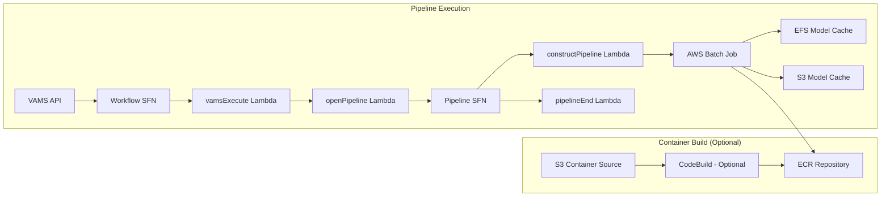

# NVIDIA Cosmos 3 Pipeline

The NVIDIA Cosmos 3 pipeline uses NVIDIA's Cosmos 3 omnimodal world foundation models to generate images and videos from text prompts (text2image, text2video) or from images (image2video). The pipeline runs on GPU-accelerated AWS Batch instances and stores generated media back to VAMS assets.

:::info[Cosmos 3 Model Families]
VAMS supports the **Cosmos 3** omnimodal Mixture-of-Transformers architecture with Nano (16B) and Super (64B) parameter variants. Both text-to-image, text-to-video, and image-to-video modes are available through separate configuration options.
:::

## Overview

| Property                    | Value                                                                                                                      |
| --------------------------- | -------------------------------------------------------------------------------------------------------------------------- |
| **Model Family**            | Cosmos 3 (Omnimodal Mixture-of-Transformers)                                                                               |
| **Pipeline ID**             | `nvidia-cosmos3-nano`, `nvidia-cosmos3-super`, `nvidia-cosmos3-super-text2image`, `nvidia-cosmos3-super-image2video`       |
| **Configuration flag**      | `app.pipelines.useNvidiaCosmos3.enabled`, per-model flags under `app.pipelines.useNvidiaCosmos3.modelsOmni.*`              |
| **Execution type**          | Lambda (asynchronous with callback)                                                                                        |
| **Supported input formats** | Nano (text2image/text2video): None (uses text prompt only), Nano/Super (image2video): `.jpg`, `.jpeg`, `.png`              |
| **Output (Nano)**           | Image: PNG (1024x1024 or 512x512), Video: MP4 (1024x576, 24fps, 189 frames by default, tunable via `COSMOS3_NUM_FRAMES`)   |
| **Output (Super)**          | Image (Super-Text2Image): PNG (1024x1024), Video (Super/Super-Image2Video): MP4 (1280x720, 24fps, ~8 seconds / 189 frames) |
| **Timeout**                 | 8 hours (Batch job), 8 hours (VAMS workflow task token)                                                                    |

### Approximate Run Times

| Phase                             | Duration (Nano: g6e.4xlarge / Super: p5.48xlarge) | Notes                                                  |
| --------------------------------- | ------------------------------------------------- | ------------------------------------------------------ |
| Cold start (instance launch)      | 5-10 min                                          | Skipped if `useWarmInstances` is enabled               |
| Container image pull              | 5-8 min                                           | Cached after first pull on instance                    |
| Model sync (EFS cached)           | 1-5 min                                           | First run: 30+ min for model download from HuggingFace |
| Inference (Nano image generation) | 2-4 min                                           | Single-GPU on L40S 48GB                                |
| Inference (Nano video generation) | 6-10 min                                          | Single-GPU on L40S 48GB                                |
| Inference (Super image)           | 5-8 min                                           | Multi-GPU on 8x H100 80GB                              |
| Inference (Super video)           | 15-25 min                                         | Multi-GPU on 8x H100 80GB                              |
| S3 upload + callback              | < 1 min                                           | ~1-10MB output                                         |
| **Total Nano (cached models)**    | **~15-30 min**                                    | Including cold start                                   |
| **Total Super (cached models)**   | **~30-50 min**                                    | Including cold start                                   |
| **Total (warm instance, cached)** | **~10-20 min (Nano), ~20-30 min (Super)**         | No cold start                                          |

:::tip[Higher performance with larger instances]
For reduced run times, use larger GPU instances. Super 64B models require multi-GPU instances (p5.48xlarge with 8x H100 80GB, p5e.48xlarge with 8x H200 80GB, or p4de.24xlarge with 8x A100-80GB). Nano models run efficiently on single-GPU instances like g6e.4xlarge (1x L40S 48GB).
:::

## Container Build Options

VAMS supports two methods for building the Cosmos 3 container:

### CodeBuild (Optional)

When `useCodeBuild: true`, containers are built in the cloud using AWS CodeBuild:

-   Container source code is uploaded to Amazon S3 during CDK deployment
-   CodeBuild builds the Docker image and pushes to Amazon ECR
-   Batch job definitions reference the Amazon ECR image
-   Automatic rebuilds when container source code changes
-   Runs in the same private VPC subnets as the pipeline Batch compute, with NAT Gateway egress for internet access

**Advantages:**

-   No local Docker build required (avoids large image builds on developer machines)
-   Faster iteration with high-bandwidth cloud builds
-   Automatic rebuilds on source changes

**Troubleshooting CodeBuild failures:** CodeBuild runs asynchronously after CDK deployment completes. If a container build fails, the CDK deployment itself will succeed but the Batch pipeline will fail with a container image pull error. To check build status, use the CodeBuild project name from the CDK stack outputs:

```bash
# Get the CodeBuild project name from stack outputs
aws cloudformation describe-stacks --stack-name <your-stack-name> --query "Stacks[0].Outputs[?contains(OutputKey,'CodeBuildProject')].OutputValue" --output text

# Check build status
aws codebuild list-builds-for-project --project-name <project-name>
aws codebuild batch-get-builds --ids <build-id>
```

:::warning[CodeBuild Internet Access]
CodeBuild runs in the same private VPC subnets used by the Cosmos pipeline Batch compute environments. These private subnets require a NAT Gateway for internet egress, which is automatically provisioned when the Cosmos pipeline is enabled. For AWS GovCloud and EU Sovereign Cloud deployments, organizations should validate that CodeBuild is configured with the correct private VPC settings for their environment.
:::

:::warning[Docker Hub Rate Limiting]
CodeBuild builds that pull base images from Docker Hub (for example, `nvidia/cuda`) are subject to Docker Hub's anonymous pull rate limits, which can cause build failures with "429 Too Many Requests" errors. To avoid throttling, configure Docker Hub authentication credentials in CodeBuild by storing credentials in AWS Secrets Manager and referencing them in the buildspec or CodeBuild environment. Alternatively, organizations can mirror base images to Amazon ECR Public or a private Amazon ECR repository.
:::

### DockerImageAsset (Legacy)

When `useCodeBuild: false`, containers are built locally during CDK deployment using Docker and pushed to a CDK-managed Amazon ECR repository. This requires significant local resources and bandwidth.

## Architecture

The pipeline leverages NVIDIA Cosmos 3 models running on GPU-enabled AWS Batch compute instances with container-based inference. Generated models are cached on Amazon EFS and optionally backed up to Amazon S3 for faster subsequent runs.



### Processing stages

1. **Model Download and Caching (First Run Only)** -- On the first pipeline execution, the container downloads the Cosmos 3 model and its dependencies from HuggingFace to Amazon EFS. Subsequent runs reuse the cached models from Amazon EFS with Amazon S3 backup.

2. **Media Generation (AWS Batch on GPU Instances)** -- The container loads the model from Amazon EFS, processes the text prompt and optional input image, and generates an image or video using NVIDIA's Cosmos 3 omnimodal model. The generated media is written to the auxiliary Amazon S3 bucket.

3. **Thumbnail Generation** -- For video outputs, the container extracts frames from the generated video and creates a `.previewFile.gif` thumbnail for web preview.

4. **Output Processing** -- The VAMS workflow process-output step moves the generated media and thumbnail to the asset bucket at the correct file path.

## Prerequisites

:::warning[HuggingFace access and model license required]
You must accept the NVIDIA Cosmos 3 model license on HuggingFace before using this pipeline. All model access must be granted to the same HuggingFace account used to generate the API token.
:::

-   **HuggingFace Account** -- Create an account at [huggingface.co](https://huggingface.co/).
-   **Accept Licenses and Request Model Access** -- You must explicitly accept the license and request access for each model on HuggingFace. Visit each model page, accept the license terms, click "Request access" (if gated), and wait for approval. Accept the license for each model you plan to use:

    | Model                                                                                       | Params | Task                              | License                                        | HuggingFace URL                                                 |
    | ------------------------------------------------------------------------------------------- | ------ | --------------------------------- | ---------------------------------------------- | --------------------------------------------------------------- |
    | [nvidia/Cosmos3-Nano](https://huggingface.co/nvidia/Cosmos3-Nano)                           | 16B    | omni (all modes)                  | [OpenMDW-1.1](https://openmdw.ai/license/1-1/) | [Link](https://huggingface.co/nvidia/Cosmos3-Nano)              |
    | [nvidia/Cosmos3-Super](https://huggingface.co/nvidia/Cosmos3-Super)                         | 64B    | text2video/text2image/image2video | [OpenMDW-1.1](https://openmdw.ai/license/1-1/) | [Link](https://huggingface.co/nvidia/Cosmos3-Super)             |
    | [nvidia/Cosmos3-Super-Text2Image](https://huggingface.co/nvidia/Cosmos3-Super-Text2Image)   | 64B    | text2image                        | [OpenMDW-1.1](https://openmdw.ai/license/1-1/) | [Link](https://huggingface.co/nvidia/Cosmos3-Super-Text2Image)  |
    | [nvidia/Cosmos3-Super-Image2Video](https://huggingface.co/nvidia/Cosmos3-Super-Image2Video) | 64B    | image2video                       | [OpenMDW-1.1](https://openmdw.ai/license/1-1/) | [Link](https://huggingface.co/nvidia/Cosmos3-Super-Image2Video) |

-   **HuggingFace Token** -- Generate a Read access token from your HuggingFace account settings. The token must be associated with the account that has been granted access to the models listed above. Store the token value directly in the `huggingFaceToken` field of the CDK configuration -- it will be securely stored in AWS Secrets Manager during deployment.
-   **GPU Instance Availability** -- The pipeline uses `BEST_FIT_PROGRESSIVE` allocation with multiple fallback instance types. Ensure your AWS Region has capacity for at least one of the configured types. Nano models require single-GPU instances with 48GB+ VRAM. Super models require multi-GPU instances with 8 GPUs.
-   **VPC Configuration** -- The pipeline deploys into private subnets with NAT Gateway or public subnets for internet access (required for HuggingFace model downloads on first run). Ensure VPC endpoints are configured for Amazon S3, Amazon EFS, Amazon ECR, and AWS Batch if running in a VPC-only environment.
-   **Amazon EFS** -- The pipeline creates a shared Amazon EFS file system for model caching across AWS Batch instances.

## Configuration

Add the following to your `config.json` under `app.pipelines`:

```json
{
    "app": {
        "pipelines": {
            "useNvidiaCosmos3": {
                "enabled": true,
                "huggingFaceToken": "hf_yourTokenHere",
                "useCodeBuild": false,
                "useWarmInstances": false,
                "warmInstanceCount": 1,
                "modelsOmni": {
                    "nano16B": {
                        "enabled": true,
                        "autoRegisterWithVAMS": true,
                        "autoTriggerOnFileExtensionsUpload": "",
                        "instanceTypes": ["g6e.4xlarge", "g6e.12xlarge"],
                        "maxVCpus": 192
                    },
                    "super64B": {
                        "enabled": false,
                        "autoRegisterWithVAMS": true,
                        "autoTriggerOnFileExtensionsUpload": "",
                        "instanceTypes": ["p5.48xlarge", "p5e.48xlarge", "p4de.24xlarge"],
                        "maxVCpus": 192
                    },
                    "superText2Image64B": {
                        "enabled": false,
                        "autoRegisterWithVAMS": true,
                        "instanceTypes": ["p5.48xlarge", "p5e.48xlarge"],
                        "maxVCpus": 192
                    },
                    "superImage2Video64B": {
                        "enabled": false,
                        "autoRegisterWithVAMS": true,
                        "autoTriggerOnFileExtensionsUpload": "",
                        "instanceTypes": ["p5.48xlarge", "p5e.48xlarge", "p4de.24xlarge"],
                        "maxVCpus": 192
                    }
                }
            }
        }
    }
}
```

| Option                                                             | Default                                            | Description                                                                                                                                                                                                                       |
| ------------------------------------------------------------------ | -------------------------------------------------- | --------------------------------------------------------------------------------------------------------------------------------------------------------------------------------------------------------------------------------- |
| `enabled`                                                          | `false`                                            | Enable or disable the Cosmos 3 pipeline deployment.                                                                                                                                                                               |
| `huggingFaceToken`                                                 | `""`                                               | HuggingFace Read access token value (for example, `hf_xxxx`). CDK automatically stores this in AWS Secrets Manager during deployment. The token is never exposed in CloudFormation templates.                                     |
| `useCodeBuild`                                                     | `false`                                            | When `true`, builds the container using AWS CodeBuild. When `false`, uses local Docker build (DockerImageAsset).                                                                                                                  |
| `useWarmInstances`                                                 | `false`                                            | When `true`, keeps GPU instances running when idle for instant pipeline starts. When `false`, scales to zero after job completion and incurs ~5-10 minute cold start. **Warning:** Warm instances incur continuous compute costs. |
| `warmInstanceCount`                                                | `1`                                                | Number of warm GPU instances to keep running when `useWarmInstances` is `true`.                                                                                                                                                   |
| `modelsOmni.nano16B.enabled`                                       | `false`                                            | Enable the Cosmos3-Nano 16B model for generating images and videos from text prompts, or videos from images.                                                                                                                      |
| `modelsOmni.nano16B.autoRegisterWithVAMS`                          | `true`                                             | Automatically register the pipeline and workflow with VAMS at deploy time.                                                                                                                                                        |
| `modelsOmni.nano16B.autoTriggerOnFileExtensionsUpload`             | `""`                                               | Comma-separated list of file extensions to auto-trigger the pipeline on upload (for example, `".jpg,.png"`). Leave empty to disable auto-trigger.                                                                                 |
| `modelsOmni.nano16B.instanceTypes`                                 | `["g6e.4xlarge", "g6e.12xlarge"]`                  | EC2 GPU instance types for AWS Batch compute (BEST_FIT_PROGRESSIVE). Requires single-GPU with 48GB+ VRAM.                                                                                                                         |
| `modelsOmni.nano16B.maxVCpus`                                      | `192`                                              | Maximum vCPUs for the AWS Batch compute environment.                                                                                                                                                                              |
| `modelsOmni.super64B.enabled`                                      | `false`                                            | Enable the Cosmos3-Super 64B omnimodal model for generating images and videos from text prompts, or videos from images.                                                                                                           |
| `modelsOmni.super64B.autoRegisterWithVAMS`                         | `true`                                             | Automatically register the pipeline and workflow with VAMS at deploy time.                                                                                                                                                        |
| `modelsOmni.super64B.autoTriggerOnFileExtensionsUpload`            | `""`                                               | Comma-separated list of file extensions to auto-trigger the pipeline on upload (for example, `".jpg,.png"`). Leave empty to disable auto-trigger.                                                                                 |
| `modelsOmni.super64B.instanceTypes`                                | `["p5.48xlarge", "p5e.48xlarge", "p4de.24xlarge"]` | EC2 GPU instance types for AWS Batch compute. Requires 8x H100/H200/A100-80GB GPUs.                                                                                                                                               |
| `modelsOmni.super64B.maxVCpus`                                     | `192`                                              | Maximum vCPUs for the AWS Batch compute environment.                                                                                                                                                                              |
| `modelsOmni.superText2Image64B.enabled`                            | `false`                                            | Enable the Cosmos3-Super-Text2Image 64B model for generating high-quality images from text prompts.                                                                                                                               |
| `modelsOmni.superText2Image64B.autoRegisterWithVAMS`               | `true`                                             | Automatically register the pipeline and workflow with VAMS at deploy time.                                                                                                                                                        |
| `modelsOmni.superText2Image64B.instanceTypes`                      | `["p5.48xlarge", "p5e.48xlarge"]`                  | EC2 GPU instance types for AWS Batch compute. Requires 8x H100/H200 GPUs.                                                                                                                                                         |
| `modelsOmni.superText2Image64B.maxVCpus`                           | `192`                                              | Maximum vCPUs for the AWS Batch compute environment.                                                                                                                                                                              |
| `modelsOmni.superImage2Video64B.enabled`                           | `false`                                            | Enable the Cosmos3-Super-Image2Video 64B model for generating high-quality videos from images with optional text guidance.                                                                                                        |
| `modelsOmni.superImage2Video64B.autoRegisterWithVAMS`              | `true`                                             | Automatically register the pipeline and workflow with VAMS at deploy time.                                                                                                                                                        |
| `modelsOmni.superImage2Video64B.autoTriggerOnFileExtensionsUpload` | `""`                                               | Comma-separated list of file extensions to auto-trigger the pipeline on upload (for example, `".jpg,.png"`). Leave empty to disable auto-trigger.                                                                                 |
| `modelsOmni.superImage2Video64B.instanceTypes`                     | `["p5.48xlarge", "p5e.48xlarge", "p4de.24xlarge"]` | EC2 GPU instance types for AWS Batch compute. Requires 8x H100/H200/A100-80GB GPUs.                                                                                                                                               |
| `modelsOmni.superImage2Video64B.maxVCpus`                          | `192`                                              | Maximum vCPUs for the AWS Batch compute environment.                                                                                                                                                                              |

## GPU Instance Recommendations

The NVIDIA Cosmos 3 models require significant GPU memory for full-precision inference. The following table provides instance recommendations based on model variant and size:

| Variant | Params | Min VRAM              | Recommended Instance                       | GPUs                       | Notes                                                           |
| ------- | ------ | --------------------- | ------------------------------------------ | -------------------------- | --------------------------------------------------------------- |
| Nano    | 16B    | ~35 GB (BF16 weights) | g6e.4xlarge                                | 1× L40S (48 GB)            | Single-GPU, Batch-friendly, ~35 GB download                     |
| Super   | 64B    | >128 GB aggregate     | p5.48xlarge / p5e.48xlarge / p4de.24xlarge | 8× H100 / H200 / A100-80GB | Multi-GPU mandatory (won't fit one 80 GB GPU); ~133 GB download |

:::warning[Super 64B multi-GPU]
The Super 64B models do not fit on a single 80 GB H100 GPU and must be sharded across 8 GPUs on one NVLink node. Use `p4de` (A100 80 GB), not `p4d` (40 GB). The Super-Text2Image and Super-Image2Video variants are specialized checkpoints that share the same multi-GPU requirement.
:::

## Model Caching

On the first pipeline execution, the container downloads the Cosmos 3 model and its dependencies from HuggingFace:

-   **Cosmos3-Nano** -- ~35 GB
-   **Cosmos3-Super** -- ~133 GB
-   **Cosmos3-Super-Text2Image** -- ~133 GB
-   **Cosmos3-Super-Image2Video** -- ~133 GB

The models are cached on Amazon EFS with backup to Amazon S3 (under `cosmos3/hf_cache` prefix). Subsequent pipeline runs load models directly from Amazon EFS, enabling instant start times (after cold start warm-up).

:::info[Amazon EFS costs]
The Amazon EFS file system stores model weights and incurs standard Amazon EFS storage costs. The pipeline uses General Purpose performance mode with elastic throughput. Monitor Amazon EFS costs and consider setting lifecycle policies for long-term cost optimization.
:::

## Warm vs Cold Instances

The `useWarmInstances` configuration option controls whether AWS Batch compute instances remain running when idle:

### Cold Instances (useWarmInstances: false, default)

-   **Behavior:** AWS Batch scales to zero when no jobs are running. Instances launch on-demand when a job is queued.
-   **Cold Start Time:** ~5-10 minutes (instance launch + model load from Amazon EFS).
-   **Cost:** Pay only for active job execution time (no idle instance costs).
-   **Use Case:** Infrequent pipeline usage, cost-sensitive deployments.

### Warm Instances (useWarmInstances: true)

-   **Behavior:** AWS Batch keeps `warmInstanceCount` GPU instances running at all times. Jobs start immediately without waiting for instance launch.
-   **Start Time:** Near-instant (model already loaded in memory).
-   **Cost:** Continuous compute costs. Multiply by `warmInstanceCount` for total cost.
-   **Use Case:** Frequent pipeline usage, latency-sensitive applications, interactive demos.

:::warning[Warm instance costs]
Keeping warm instances running incurs continuous compute costs. A single g6e.4xlarge instance costs approximately $1.61/hr (~$38.64/day, ~$1,159/month) at 24/7 utilization. Use warm instances only when start-time reduction justifies the additional cost.
:::

## Metadata Reference

The Cosmos 3 pipeline uses metadata keys to configure generation parameters. The metadata scope (asset vs file) depends on the pipeline mode:

| Metadata Key               | Scope                                   | Applies to           | Default                                                               |
| -------------------------- | --------------------------------------- | -------------------- | --------------------------------------------------------------------- |
| `COSMOS3_PROMPT`           | Asset (text modes) / File (image2video) | all generative modes | required for text modes; scene-continue fallback for input-file modes |
| `COSMOS3_NEGATIVE_PROMPT`  | Asset/File                              | generative modes     | `""`                                                                  |
| `COSMOS3_SEED`             | Asset/File                              | all                  | `0`                                                                   |
| `COSMOS3_GUIDANCE`         | Asset/File                              | generative modes     | model default                                                         |
| `COSMOS3_NUM_FRAMES`       | Asset/File                              | video modes          | `189` (1 frame produces an image)                                     |
| `COSMOS3_TASK_MODE`        | Asset/File                              | mode switch          | pipeline default (set `transfer` to run control-signal transfer)      |
| `COSMOS3_CONTROL_TYPE`     | File                                    | transfer mode        | `edge` (comma-separated for multi-control, e.g. `edge,blur`)          |
| `COSMOS3_CONTROL_PATH`     | File                                    | transfer mode        | `""` (auto-compute from source; comma-aligned to control types)       |
| `COSMOS3_CONTROL_WEIGHT`   | File                                    | transfer mode        | `1.0` (comma-aligned to control types)                                |
| `COSMOS3_CONTROL_GUIDANCE` | File                                    | transfer mode        | `1.5`                                                                 |

:::warning[Asset vs File metadata]
**Text-input modes** (text2image, text2video) read the prompt from **asset-level metadata** because they do not operate on a specific file -- they generate media from text only. **Image2video** and **transfer** read metadata from **file-level metadata** because they operate on a specific file within the asset. Setting the metadata on the wrong scope will result in the value not being found.
:::

### Control-Signal Transfer (Video-to-Video)

The general-purpose omni variants (`nano` and `super`) can perform **control-signal transfer** -- transforming a source video while preserving its structure via a spatial control signal, equivalent to the standalone NVIDIA Cosmos Transfer capability. Transfer is a **metadata-driven mode** on the existing Nano and Super pipelines; no separate pipeline registration is required. The task-specialized variants (`super-text2image`, `super-image2video`) do not support transfer and ignore the request.

To run transfer, set `COSMOS3_TASK_MODE` to `transfer` on the **input video file's** metadata, along with the control settings:

-   **`COSMOS3_CONTROL_TYPE`** -- one or more control signals: `edge` (Canny edge map), `blur` (blurred reference), `depth` (depth map), `seg` (segmentation map), or `wsm` (world-scenario map). Supply a comma-separated list for **multi-control** (for example, `edge,blur`) to blend multiple hints in a single pass.
-   **`COSMOS3_CONTROL_PATH`** -- optional comma-separated list of S3 paths to pre-computed control videos, positionally aligned to `COSMOS3_CONTROL_TYPE`. Leave an entry blank to have the framework auto-compute that signal from the source video.
-   **`COSMOS3_CONTROL_WEIGHT`** -- optional comma-separated control strengths (default `1.0` each), positionally aligned to `COSMOS3_CONTROL_TYPE`.
-   **`COSMOS3_CONTROL_GUIDANCE`** -- optional control-guidance scale (default `1.5`).
-   **`COSMOS3_PROMPT`** -- a caption describing the desired output (recommended; read from file metadata for transfer).

The input file is the source video; the output is a transformed MP4 written back to the asset. Transfer runs on the framework's `video2video` model mode.

:::note[Transfer is Nano/Super only]
`COSMOS3_TASK_MODE=transfer` is honored only on the `nano` and `super` pipelines. If it is set for the `super-text2image` or `super-image2video` pipelines, it is ignored and the pipeline runs its normal mode.
:::

### Pipeline Input Parameters

The following input parameters can be set on the pipeline's `inputParameters` to control runtime behavior. These are set as defaults during CDK deployment and can be overridden per-execution in the VAMS UI.

| Parameter                  | Default   | Description                                                                                                                                             |
| -------------------------- | --------- | ------------------------------------------------------------------------------------------------------------------------------------------------------- |
| `MODEL_VARIANT`            | N/A       | Model variant to use (`nano`, `super`, `super-text2image`, `super-image2video`).                                                                        |
| `TASK_MODE`                | N/A       | Task mode (`text2image`, `text2video`, `image2video`). Per-run transfer is triggered by the `COSMOS3_TASK_MODE` metadata key instead (Nano/Super only). |
| `DISABLE_GUARDRAILS`       | `"true"`  | Disable safety guardrails. Set to `"false"` to enable (requires additional GPU memory for guardrail models).                                            |
| `GENERATE_PREVIEW_GIF`     | `"false"` | Generate a `.previewFile.gif` thumbnail from the output video. Requires additional memory after inference.                                              |
| `INVALIDATE_COSMOS_MODELS` | `"false"` | Force re-download of all models from HuggingFace (clears Amazon EFS and Amazon S3 cache).                                                               |

## Troubleshooting

### Out-of-Memory (OOM) errors

If the pipeline fails with OOM errors, the selected instance type may not have sufficient GPU memory for the model size:

-   **Nano 16B models:** Use g6e.4xlarge or larger (minimum 48GB VRAM per GPU).
-   **Super 64B models:** Use p5.48xlarge, p5e.48xlarge, or p4de.24xlarge (minimum 8x 80GB VRAM GPUs).

### HuggingFace token issues

If the pipeline fails to download models from HuggingFace:

1. Verify the HuggingFace token value in the `huggingFaceToken` config field is correct and has Read permissions.
2. Ensure the model licenses have been accepted on your HuggingFace account (see Prerequisites table above).
3. Verify the token is associated with the HuggingFace account that has access to all models.
4. Check the AWS Batch job logs in Amazon CloudWatch for detailed error messages.

### Invalidating model cache (force re-download)

If a model has been updated on HuggingFace or the cached version on Amazon EFS is corrupted, you can force the pipeline to re-download all models by adding `INVALIDATE_COSMOS_MODELS` to the pipeline's input parameters:

1. In the VAMS UI, edit the pipeline's input parameters to include `{"INVALIDATE_COSMOS_MODELS": "true"}`.
2. Run the pipeline. All cached models on Amazon EFS and Amazon S3 will be deleted and re-downloaded from HuggingFace.
3. After the run completes successfully, remove the `INVALIDATE_COSMOS_MODELS` parameter to resume using the fast Amazon EFS cache path.

:::warning
Invalidating the model cache triggers a full re-download of model weights from HuggingFace. This significantly increases the pipeline execution time.
:::

### Amazon EFS mount failures

If the pipeline fails to mount the Amazon EFS file system:

-   Ensure the AWS Batch compute instances are in subnets with access to the Amazon EFS mount targets.
-   Verify the security group attached to the Amazon EFS mount targets allows inbound traffic from the AWS Batch compute instances on port 2049 (NFS).
-   Check Amazon EFS mount target status in the Amazon EFS console.

### Cold start timeout

If pipeline jobs are queued for longer than expected:

-   Check AWS Batch compute environment status in the AWS Batch console.
-   Verify the selected instance types are available in your Region and Availability Zones.
-   Request a quota increase for the instance type if capacity is constrained.

## Attribution

This pipeline is built on NVIDIA Cosmos foundation models, which are licensed under the [OpenMDW-1.1 License](https://openmdw.ai/license/1-1/). When using NVIDIA Cosmos in your applications, you must include the following attribution:

**"Built on NVIDIA Cosmos"**

For commercial use, review the OpenMDW-1.1 License terms to ensure compliance.

## Related pages

-   [Pipeline overview](overview.md)
-   [Custom pipelines](custom-pipelines.md)
-   [Deployment configuration](../deployment/configuration-reference.md)
