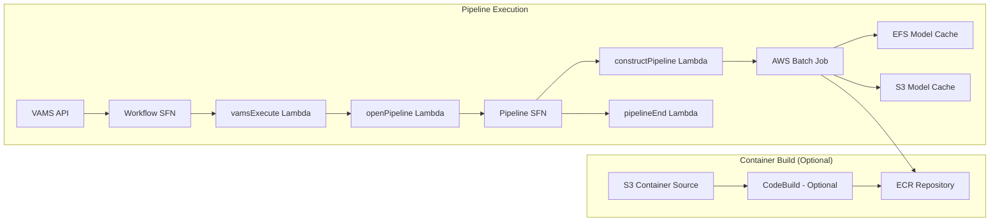

# NVIDIA Cosmos Predict Pipeline

The NVIDIA Cosmos Predict pipeline uses NVIDIA's Cosmos world foundation models to generate videos from text prompts (Text2World) or from images and videos with optional text guidance (Video2World). The pipeline runs on GPU-accelerated AWS Batch instances and stores generated videos back to VAMS assets.

:::info[Cosmos Predict Model Families]
VAMS supports the **Cosmos-Predict2.5** (v2, flow-matching) model family with 2B and 14B parameter variants. Both Text2World and Video2World modes are available through separate configuration options.
:::

## Overview

| Property                    | Value                                                                                                                                  |
| --------------------------- | -------------------------------------------------------------------------------------------------------------------------------------- |
| **Model Family**            | Cosmos-Predict2.5 (v2, flow-matching)                                                                                                  |
| **Pipeline ID (v2.5)**      | `cosmos-predict2-text2world-2b`, `cosmos-predict2-text2world-14b`, `cosmos-predict2-video2world-2b`, `cosmos-predict2-video2world-14b` |
| **Configuration flag**      | `app.pipelines.useNvidiaCosmos.enabled`, per-model flags under `app.pipelines.useNvidiaCosmos.modelsPredict.*`                         |
| **Execution type**          | Lambda (asynchronous with callback)                                                                                                    |
| **Supported input formats** | Text2World: None (uses text prompt only), Video2World: `.jpg`, `.jpeg`, `.png`, `.gif`, `.mp4`, `.mov`, `.avi`, `.mkv`                 |
| **Output (v2.5)**           | MP4 video (1280x720, 16fps, ~4 seconds / 61 frames)                                                                                    |
| **Timeout**                 | 8 hours (Batch job), 8 hours (VAMS workflow task token)                                                                                |

### Approximate Run Times

| Phase                             | Duration (g6e.12xlarge / L40S) | Notes                                                  |
| --------------------------------- | ------------------------------ | ------------------------------------------------------ |
| Cold start (instance launch)      | 5-10 min                       | Skipped if `useWarmInstances` is enabled               |
| Container image pull              | 5-8 min                        | Cached after first pull on instance                    |
| Model sync (EFS cached)           | 1-5 min                        | First run: 20+ min for model download from HuggingFace |
| Text embedding (T5-11B)           | 7-8 min                        | Loaded from EFS, offloaded to CPU after use            |
| Video generation (diffusion)      | 14-15 min                      | Main inference on 4 GPUs                               |
| S3 upload + callback              | < 1 min                        | ~1MB output video                                      |
| **Total (cached models)**         | **~30-40 min**                 | Including cold start                                   |
| **Total (warm instance, cached)** | **~25-30 min**                 | No cold start                                          |

:::tip[Higher performance with larger instances]
For reduced run times, use larger GPU instances (e.g., `g6e.48xlarge` with 8x L40S 48GB, or `p5.48xlarge` with 8x H100 80GB). These instances provide significantly more GPU memory and compute, enabling: faster inference (~6 min on H100 vs ~15 min on L40S), guardrail support without OOM, and preview GIF generation after inference. Add larger instance types to the `instanceTypes` array (e.g., `["g6e.48xlarge", "g6e.12xlarge"]`).
:::

## Container Build Options

VAMS supports two methods for building the Cosmos Predict container:

### CodeBuild (Optional)

When `useCodeBuild: true`, containers are built in the cloud using AWS CodeBuild:

-   Container source code is uploaded to S3 during CDK deployment
-   CodeBuild builds the Docker image and pushes to ECR
-   Batch job definitions reference the ECR image
-   Automatic rebuilds when container source code changes
-   Runs in the same private VPC subnets as the pipeline Batch compute, with NAT Gateway egress for internet access

**Advantages:**

-   No local Docker build required (avoids 35GB+ image builds on developer machines)
-   Faster iteration with high-bandwidth cloud builds
-   Automatic rebuilds on source changes

**Troubleshooting CodeBuild failures:** CodeBuild runs asynchronously after CDK deployment completes. If a container build fails, the CDK deployment itself will succeed but the Batch pipeline will fail with a container image pull error. To check build status, use the CodeBuild project name from the CDK stack outputs:

```bash
# Get the CodeBuild project name from stack outputs
aws cloudformation describe-stacks --stack-name <your-stack-name> --query "Stacks[0].Outputs[?contains(OutputKey,'CodeBuildProject')].OutputValue" --output text

# Check build status
aws codebuild list-builds-for-project --project-name <project-name>
aws codebuild batch-get-builds --ids <build-id>
```

:::warning[CodeBuild Internet Access]
CodeBuild runs in the same private VPC subnets used by the Cosmos pipeline Batch compute environments. These private subnets require a NAT Gateway for internet egress, which is automatically provisioned when the Cosmos pipeline is enabled. For GovCloud deployments, organizations should validate that CodeBuild is configured with the correct private VPC settings for their environment.
:::

:::warning[Docker Hub Rate Limiting]
CodeBuild builds that pull base images from Docker Hub (e.g., `nvidia/cuda`) are subject to Docker Hub's anonymous pull rate limits, which can cause build failures with "429 Too Many Requests" errors. To avoid throttling, configure Docker Hub authentication credentials in CodeBuild by storing credentials in AWS Secrets Manager and referencing them in the buildspec or CodeBuild environment. See [AWS CodeBuild Docker Hub authentication](https://docs.aws.amazon.com/codebuild/latest/userguide/sample-private-registry.html) for details. Alternatively, organizations can mirror base images to Amazon ECR Public or a private ECR repository.
:::

### DockerImageAsset (Legacy)

When `useCodeBuild: false`, containers are built locally during CDK deployment using Docker and pushed to a CDK-managed ECR repository. This requires significant local resources and bandwidth.

## Architecture

The pipeline leverages NVIDIA Cosmos Predict models running on GPU-enabled AWS Batch compute instances with container-based inference. Generated models are cached on Amazon EFS and optionally backed up to Amazon S3 for faster subsequent runs.



### Processing stages

1. **Model Download and Caching (First Run Only)** -- On the first pipeline execution, the container downloads the Cosmos Predict2.5 model and its dependencies from HuggingFace to Amazon EFS. The v2.5 models are self-contained and download their own dependencies internally via HF_HOME. Subsequent runs reuse the cached models from EFS with S3 backup.

2. **Video Generation (AWS Batch on GPU Instances)** -- The container loads the model from Amazon EFS, processes the text prompt and optional input image/video, and generates a 5-second video using NVIDIA's Cosmos Predict diffusion model. The generated video is written to the auxiliary Amazon S3 bucket.

3. **Thumbnail Generation** -- The container extracts frames from the generated video and creates a `.previewFile.gif` thumbnail for web preview.

4. **Output Processing** -- The VAMS workflow process-output step moves the generated video and thumbnail to the asset bucket at the correct file path.

## Prerequisites

:::warning[HuggingFace access and model license required]
You must accept the NVIDIA Cosmos Predict model license on HuggingFace before using this pipeline. The v2.5 models are self-contained and download their own dependencies internally via HF_HOME. All model access must be granted to the same HuggingFace account used to generate the API token.
:::

-   **HuggingFace Account** -- Create an account at [huggingface.co](https://huggingface.co/).
-   **Accept Licenses and Request Model Access** -- You must explicitly accept the license and request access for each model on HuggingFace. Visit each model page, accept the license terms, click "Request access" (if gated), and wait for approval. Accept the license for each model you plan to use:

    | Model                                                                               | Purpose                              | License                   | HuggingFace URL                                             |
    | ----------------------------------------------------------------------------------- | ------------------------------------ | ------------------------- | ----------------------------------------------------------- |
    | [nvidia/Cosmos-Predict2.5-2B](https://huggingface.co/nvidia/Cosmos-Predict2.5-2B)   | 2B model (Text2World + Video2World)  | NVIDIA Open Model License | [Link](https://huggingface.co/nvidia/Cosmos-Predict2.5-2B)  |
    | [nvidia/Cosmos-Predict2.5-14B](https://huggingface.co/nvidia/Cosmos-Predict2.5-14B) | 14B model (Text2World + Video2World) | NVIDIA Open Model License | [Link](https://huggingface.co/nvidia/Cosmos-Predict2.5-14B) |

    :::note
    The v2.5 models are self-contained and download their own internal dependencies (tokenizer, text encoder, guardrail models) automatically via HF_HOME during the first run. You only need to accept the license for the Predict model repositories listed above.
    :::

-   **HuggingFace Token** -- Generate a Read access token from your HuggingFace account settings. The token must be associated with the account that has been granted access to the models listed above. Store the token value directly in the `huggingFaceToken` field of the CDK configuration -- it will be securely stored in AWS Secrets Manager during deployment.
-   **GPU Instance Availability** -- The pipeline uses `BEST_FIT_PROGRESSIVE` allocation with multiple fallback instance types (default: `g6e.12xlarge`, `g5.12xlarge`, `g5.48xlarge`). Ensure your AWS Region has capacity for at least one of these types. The container requires ~180GB system RAM and 4 GPUs with 24GB+ VRAM each.
-   **VPC Configuration** -- The pipeline deploys into private subnets with NAT Gateway or public subnets for internet access (required for HuggingFace model downloads on first run). Ensure VPC endpoints are configured for Amazon S3, Amazon EFS, Amazon ECR, and Amazon Batch if running in a VPC-only environment.
-   **Amazon EFS** -- The pipeline creates a shared Amazon EFS file system for model caching across AWS Batch instances.

## Configuration

Add the following to your `config.json` under `app.pipelines`:

```json
{
    "app": {
        "pipelines": {
            "useNvidiaCosmos": {
                "enabled": true,
                "huggingFaceToken": "hf_yourTokenHere",
                "useWarmInstances": false,
                "warmInstanceCount": 1,
                "modelsPredict": {
                    "text2world2B_v2": {
                        "enabled": true,
                        "autoRegisterWithVAMS": true,
                        "instanceTypes": ["g6e.12xlarge", "g5.12xlarge", "g5.48xlarge"],
                        "maxVCpus": 192
                    },
                    "text2world14B_v2": {
                        "enabled": false,
                        "autoRegisterWithVAMS": true,
                        "instanceTypes": ["g6e.48xlarge", "p5.48xlarge"],
                        "maxVCpus": 192
                    },
                    "video2world2B_v2": {
                        "enabled": true,
                        "autoRegisterWithVAMS": true,
                        "autoTriggerOnFileExtensionsUpload": "",
                        "instanceTypes": ["g6e.12xlarge", "g5.12xlarge", "g5.48xlarge"],
                        "maxVCpus": 192
                    },
                    "video2world14B_v2": {
                        "enabled": false,
                        "autoRegisterWithVAMS": true,
                        "autoTriggerOnFileExtensionsUpload": "",
                        "instanceTypes": ["g6e.48xlarge", "p5.48xlarge"],
                        "maxVCpus": 192
                    }
                }
            }
        }
    }
}
```

| Option                                                              | Default                                          | Description                                                                                                                                                                                                                                                   |
| ------------------------------------------------------------------- | ------------------------------------------------ | ------------------------------------------------------------------------------------------------------------------------------------------------------------------------------------------------------------------------------------------------------------- |
| `enabled`                                                           | `false`                                          | Enable or disable the Cosmos Predict pipeline deployment.                                                                                                                                                                                                     |
| `huggingFaceToken`                                                  | `""`                                             | HuggingFace Read access token value (e.g., `hf_xxxx`). CDK automatically stores this in AWS Secrets Manager during deployment. The token is never exposed in CloudFormation templates.                                                                        |
| `useWarmInstances`                                                  | `false`                                          | When `true`, keeps GPU instances running when idle for instant pipeline starts. When `false`, scales to zero after job completion and incurs ~5-10 minute cold start. **Warning:** Warm instances incur continuous compute costs (~$5.67/hr per g5.12xlarge). |
| `warmInstanceCount`                                                 | `1`                                              | Number of warm GPU instances to keep running when `useWarmInstances` is `true`.                                                                                                                                                                               |
| `modelsPredict.text2world2B_v2.enabled`                             | `false`                                          | Enable the Cosmos-Predict2.5-2B-Text2World model for generating ~4-second videos from text prompts only.                                                                                                                                                      |
| `modelsPredict.text2world2B_v2.autoRegisterWithVAMS`                | `true`                                           | Automatically register the pipeline and workflow with VAMS at deploy time.                                                                                                                                                                                    |
| `modelsPredict.text2world2B_v2.instanceTypes`                       | `["g6e.12xlarge", "g5.12xlarge", "g5.48xlarge"]` | EC2 GPU instance types for AWS Batch compute (BEST_FIT_PROGRESSIVE). Requires 4 GPUs with 24GB+ VRAM.                                                                                                                                                         |
| `modelsPredict.text2world2B_v2.maxVCpus`                            | `192`                                            | Maximum vCPUs for the AWS Batch compute environment.                                                                                                                                                                                                          |
| `modelsPredict.text2world14B_v2.enabled`                            | `false`                                          | Enable the Cosmos-Predict2.5-14B-Text2World model for generating ~4-second videos from text prompts only.                                                                                                                                                     |
| `modelsPredict.text2world14B_v2.autoRegisterWithVAMS`               | `true`                                           | Automatically register the pipeline and workflow with VAMS at deploy time.                                                                                                                                                                                    |
| `modelsPredict.text2world14B_v2.instanceTypes`                      | `["g6e.48xlarge", "p5.48xlarge"]`                | EC2 GPU instance types for AWS Batch compute. Requires 8x L40S 48GB (g6e.48xlarge) or 8x H100 80GB (p5.48xlarge).                                                                                                                                             |
| `modelsPredict.text2world14B_v2.maxVCpus`                           | `192`                                            | Maximum vCPUs for the AWS Batch compute environment.                                                                                                                                                                                                          |
| `modelsPredict.video2world2B_v2.enabled`                            | `false`                                          | Enable the Cosmos-Predict2.5-2B-Video2World model for generating ~4-second videos from image/video inputs with optional text guidance.                                                                                                                        |
| `modelsPredict.video2world2B_v2.autoRegisterWithVAMS`               | `true`                                           | Automatically register the pipeline and workflow with VAMS at deploy time.                                                                                                                                                                                    |
| `modelsPredict.video2world2B_v2.autoTriggerOnFileExtensionsUpload`  | `""`                                             | Comma-separated list of file extensions to auto-trigger the pipeline on upload (for example, `".jpg,.png,.mp4"`). Leave empty to disable auto-trigger.                                                                                                        |
| `modelsPredict.video2world2B_v2.instanceTypes`                      | `["g6e.12xlarge", "g5.12xlarge", "g5.48xlarge"]` | EC2 GPU instance types for AWS Batch compute (BEST_FIT_PROGRESSIVE). Requires 4 GPUs with 24GB+ VRAM.                                                                                                                                                         |
| `modelsPredict.video2world2B_v2.maxVCpus`                           | `192`                                            | Maximum vCPUs for the AWS Batch compute environment.                                                                                                                                                                                                          |
| `modelsPredict.video2world14B_v2.enabled`                           | `false`                                          | Enable the Cosmos-Predict2.5-14B-Video2World model for generating ~4-second videos from image/video inputs with optional text guidance.                                                                                                                       |
| `modelsPredict.video2world14B_v2.autoRegisterWithVAMS`              | `true`                                           | Automatically register the pipeline and workflow with VAMS at deploy time.                                                                                                                                                                                    |
| `modelsPredict.video2world14B_v2.autoTriggerOnFileExtensionsUpload` | `""`                                             | Comma-separated list of file extensions to auto-trigger the pipeline on upload (for example, `".jpg,.png,.mp4"`). Leave empty to disable auto-trigger.                                                                                                        |
| `modelsPredict.video2world14B_v2.instanceTypes`                     | `["g6e.48xlarge", "p5.48xlarge"]`                | EC2 GPU instance types for AWS Batch compute. Requires 8x L40S 48GB (g6e.48xlarge) or 8x H100 80GB (p5.48xlarge).                                                                                                                                             |
| `modelsPredict.video2world14B_v2.maxVCpus`                          | `192`                                            | Maximum vCPUs for the AWS Batch compute environment.                                                                                                                                                                                                          |

## Cosmos Predict v2.5 (Predict2.5)

NVIDIA Cosmos Predict provides two inference modes: **Text2World** and **Video2World**. Both generate ~4-second videos at 1280x720 resolution and 16fps.

**Model Variant:** The v2.5 pipeline uses the **post-trained** checkpoint variant by default (`2B/post-trained` and `14B/post-trained`). NVIDIA provides three variants for the 2B model:

| Variant                    | Checkpoint Subpath | Description                                                                        |
| -------------------------- | ------------------ | ---------------------------------------------------------------------------------- |
| **Post-trained** (default) | `2B/post-trained`  | Fine-tuned on curated data for best quality output. Used by the VAMS pipeline.     |
| Pre-trained                | `2B/pre-trained`   | Base model without post-training. Lower quality but useful for custom fine-tuning. |
| Distilled                  | `2B/distilled`     | Faster inference via knowledge distillation. Text2World only (no Video2World).     |

The 14B model is available as `14B/post-trained` only.

:::note
The VAMS pipeline always uses the **post-trained** variant for best quality. To use the distilled variant (faster but lower quality, Text2World only), the container code supports it via the `2B-distilled` model size but this is not currently exposed as a separate VAMS pipeline registration.
:::

### v2.5 Text2World

The v2.5 Text2World models generate videos from text prompts only.

**Model IDs:**

-   `cosmos-predict2-text2world-2b` (2B parameter model)
-   `cosmos-predict2-text2world-14b` (14B parameter model)

**Text Prompt:** Set the prompt via the `COSMOS_PREDICT_PROMPT` asset metadata key or pass it in the workflow `inputParameters` as `{"prompt": "your prompt text"}`.

**Prompt Priority:** COSMOS_PREDICT_PROMPT metadata > inputParameters prompt > no prompt (uses model default).

**Output:** MP4 video (1280x720, 16fps, 61 frames / ~4s) + `.previewFile.gif` thumbnail stored in the asset bucket.

**Example prompt:** "A futuristic city skyline at sunset with flying cars"

### v2.5 Video2World

The v2.5 Video2World models generate videos from input images or videos with optional text guidance. The v2.5 architecture uses a unified model that handles both image and video conditioning.

**Model IDs:**

-   `cosmos-predict2-video2world-2b` (2B parameter model)
-   `cosmos-predict2-video2world-14b` (14B parameter model)

**Input Formats:** `.jpg`, `.jpeg`, `.png`, `.gif`, `.mp4`, `.mov`, `.avi`, `.mkv`

**Input Frame Handling:** The v2.5 model accepts either **1 frame** (image) or **2 frames** (video) as conditioning input.

| Input Type | File Extensions                                           | Conditioning Frames | Behavior                                                                                  |
| ---------- | --------------------------------------------------------- | ------------------- | ----------------------------------------------------------------------------------------- |
| Image      | `.jpg`, `.jpeg`, `.png`, `.webp`, `.gif`, `.bmp`, `.tiff` | 1 frame             | Model takes the image as the first frame and generates 60 additional frames               |
| Video      | `.mp4`, `.mov`, `.avi`, `.mkv`                            | 2 frames            | Model extracts the first 2 frames for temporal context and generates 59 additional frames |

:::note[v2.5 Conditioning Frame Count]
The v2.5 model uses **2 frames** for video conditioning, providing a short temporal context window. This design choice supports faster inference while still capturing temporal motion information from the input video.
:::

**Resolution Requirements:** The model expects input at **1280x720** resolution (16:9 aspect ratio). The model automatically handles resolution adjustment internally. For best quality, provide input at or near native resolution.

**Text Prompt (Optional):** Set the prompt via the `COSMOS_PREDICT_PROMPT` file metadata key or pass it in the workflow `inputParameters` as `{"prompt": "your prompt text"}`. If no prompt is provided, the pipeline uses a default prompt: _"Continue the scene from the input video"_.

:::note
The Cosmos Video2World framework requires a text prompt internally. When no user prompt is provided, the pipeline supplies a generic default prompt. For best results, provide a descriptive prompt via the `COSMOS_PREDICT_PROMPT` file metadata key.
:::

**Prompt Priority:** COSMOS_PREDICT_PROMPT file metadata > inputParameters prompt > default prompt ("Continue the scene from the input video").

**Output:** MP4 video file named `{input_filename}_CosmosPredictVideo2World_{timestamp}.mp4`, stored in the asset bucket at the same relative path as the input file.

**Example prompt:** "Transform this image into a cinematic pan with dynamic lighting"

### v2.5 Model Requirements

**HuggingFace Model Access:** Users must request access to the v2.5 model repositories on HuggingFace. The v2.5 models are separate gated repositories with independent access controls.

**Model Variant:** The v2.5 pipeline uses the **post-trained** checkpoint variant by default (`2B/post-trained` and `14B/post-trained`). NVIDIA provides three variants for the 2B model:

| Variant                    | Checkpoint Subpath | Description                                                                        |
| -------------------------- | ------------------ | ---------------------------------------------------------------------------------- |
| **Post-trained** (default) | `2B/post-trained`  | Fine-tuned on curated data for best quality output. Used by the VAMS pipeline.     |
| Pre-trained                | `2B/pre-trained`   | Base model without post-training. Lower quality but useful for custom fine-tuning. |
| Distilled                  | `2B/distilled`     | Faster inference via knowledge distillation. Text2World only (no Video2World).     |

The 14B model is available as `14B/post-trained` only.

:::note
The VAMS pipeline always uses the **post-trained** variant for best quality. To use the distilled variant (faster but lower quality, Text2World only), the container code supports it via the `2B-distilled` model size but this is not currently exposed as a separate VAMS pipeline registration.
:::

### Model Architecture

| Feature                | Cosmos-Predict2.5                                                                       |
| ---------------------- | --------------------------------------------------------------------------------------- |
| **Architecture**       | Rectified flow (flow-matching)                                                          |
| **Model Sizes**        | 2B, 14B                                                                                 |
| **Output Resolution**  | 1280x720 (16:9)                                                                         |
| **Output FPS**         | 16fps                                                                                   |
| **Output Duration**    | ~4 seconds (61 frames)                                                                  |
| **Inference Speed**    | ~5-10 min (g6e.12xlarge, 2B); ~10-20 min (g6e.48xlarge, 14B)                            |
| **Model Download**     | ~5-10GB per model (unified model for text/image/video)                                  |
| **Unified Model**      | Yes (single model handles text2world + image2world + video2world)                       |
| **GPU Offloading**     | No (2B model runs fully on GPU without offloading)                                      |
| **GPU Recommendation** | 2B: 4x A10G (24GB each); 14B: 8x L40S 48GB (g6e.48xlarge) or 8x H100 80GB (p5.48xlarge) |

:::tip[2B Model Efficiency]
The 2B model runs on g5/g6e instances with 4 GPUs and **does not require CPU offloading**, resulting in fast and efficient inference. The entire model pipeline runs on GPU.
:::

:::warning[v2.5 14B Model Requirements]
The 14B model requires 8-GPU instances with context parallelism via torchrun. The default is **g6e.48xlarge** (8x L40S 48GB) with **p5.48xlarge** (8x H100 80GB) as fallback. **p4d.24xlarge instances are not supported** — the older NVIDIA driver (550.x, CUDA 12.4) is incompatible with the Cosmos Predict 2.5 CUDA 12.8 runtime when using 8-GPU context parallelism, causing NCCL communication failures.
:::

### v2.5 Text2World

The v2.5 Text2World models generate videos from text prompts only.

**Model IDs:**

-   `cosmos-predict2-text2world-2b` (2B parameter model)
-   `cosmos-predict2-text2world-14b` (14B parameter model)

**Text Prompt:** Set via `COSMOS_PREDICT_PROMPT` asset metadata key or pass in workflow `inputParameters` as `{"prompt": "your prompt text"}`.

**Prompt Priority:** COSMOS_PREDICT_PROMPT metadata > inputParameters prompt > no prompt (uses model default).

**Output:** MP4 video (1280x720, 16fps, 61 frames / ~4s) + `.previewFile.gif` thumbnail stored in the asset bucket.

**Example prompt:** "A futuristic city skyline at sunset with flying cars"

### v2.5 Video2World

The v2.5 Video2World models generate videos from input images or videos with optional text guidance. The v2.5 architecture uses a unified model that handles both image and video conditioning.

**Model IDs:**

-   `cosmos-predict2-video2world-2b` (2B parameter model)
-   `cosmos-predict2-video2world-14b` (14B parameter model)

**Input Formats:** `.jpg`, `.jpeg`, `.png`, `.gif`, `.mp4`, `.mov`, `.avi`, `.mkv`

**Input Frame Handling:** The v2.5 model accepts either **1 frame** (image) or **2 frames** (video) as conditioning input.

| Input Type | File Extensions                                           | Conditioning Frames | Behavior                                                                                  |
| ---------- | --------------------------------------------------------- | ------------------- | ----------------------------------------------------------------------------------------- |
| Image      | `.jpg`, `.jpeg`, `.png`, `.webp`, `.gif`, `.bmp`, `.tiff` | 1 frame             | Model takes the image as the first frame and generates 60 additional frames               |
| Video      | `.mp4`, `.mov`, `.avi`, `.mkv`                            | 2 frames            | Model extracts the first 2 frames for temporal context and generates 59 additional frames |

:::note[v2.5 Conditioning Frame Count]
The v2.5 model uses **2 frames** for video conditioning, providing a short temporal context window. This design choice supports faster inference while still capturing temporal motion information from the input video.
:::

**Resolution Requirements:** The model expects input at **1280x720** resolution (16:9 aspect ratio). The model automatically handles resolution adjustment internally. For best quality, provide input at or near native resolution.

**Text Prompt (Optional):** Set via `COSMOS_PREDICT_PROMPT` file metadata key or pass in workflow `inputParameters`. Default prompt when not provided: _"Continue the scene from the input video"_.

**Prompt Priority:** COSMOS_PREDICT_PROMPT file metadata > inputParameters prompt > default prompt.

**Output:** MP4 video file named `{input_filename}_CosmosPredictVideo2World_{timestamp}.mp4`, stored in the asset bucket at the same relative path as the input file.

**Example prompt:** "Transform this image into a cinematic pan with dynamic lighting"

### v2.5 Model Requirements

**HuggingFace Model Access:** Users must request access to the v2.5 model repositories on HuggingFace. Accept the license for each model you plan to use:

| Model                                                                               | Purpose                              | License                   | HuggingFace URL                                             |
| ----------------------------------------------------------------------------------- | ------------------------------------ | ------------------------- | ----------------------------------------------------------- |
| [nvidia/Cosmos-Predict2.5-2B](https://huggingface.co/nvidia/Cosmos-Predict2.5-2B)   | 2B model (Text2World + Video2World)  | NVIDIA Open Model License | [Link](https://huggingface.co/nvidia/Cosmos-Predict2.5-2B)  |
| [nvidia/Cosmos-Predict2.5-14B](https://huggingface.co/nvidia/Cosmos-Predict2.5-14B) | 14B model (Text2World + Video2World) | NVIDIA Open Model License | [Link](https://huggingface.co/nvidia/Cosmos-Predict2.5-14B) |

:::note[Self-Contained Models]
The v2.5 models are self-contained and download their own internal dependencies (tokenizer, text encoder, guardrail models) automatically via HF_HOME during the first run. You only need to accept the license for the Predict model repositories listed above.
:::

### v2.5 Configuration Options

Add the following configuration options to `infra/config/config.json` under `app.pipelines.useNvidiaCosmos.modelsPredict`:

```json
{
    "text2world2B_v2": {
        "enabled": false,
        "autoRegisterWithVAMS": true,
        "instanceTypes": ["g6e.12xlarge", "g5.12xlarge", "g5.48xlarge"],
        "maxVCpus": 192
    },
    "text2world14B_v2": {
        "enabled": false,
        "autoRegisterWithVAMS": true,
        "instanceTypes": ["g6e.48xlarge", "p5.48xlarge"],
        "maxVCpus": 192
    },
    "video2world2B_v2": {
        "enabled": false,
        "autoRegisterWithVAMS": true,
        "autoTriggerOnFileExtensionsUpload": "",
        "instanceTypes": ["g6e.12xlarge", "g5.12xlarge", "g5.48xlarge"],
        "maxVCpus": 192
    },
    "video2world14B_v2": {
        "enabled": false,
        "autoRegisterWithVAMS": true,
        "autoTriggerOnFileExtensionsUpload": "",
        "instanceTypes": ["g6e.48xlarge", "p5.48xlarge"],
        "maxVCpus": 192
    }
}
```

| Option                                                       | Default                                          | Description                                                                                                                               |
| ------------------------------------------------------------ | ------------------------------------------------ | ----------------------------------------------------------------------------------------------------------------------------------------- |
| `models.text2world2B_v2.enabled`                             | `false`                                          | Enables Cosmos-Predict2.5-2B-Text2World for generating ~4-second videos from text prompts only.                                           |
| `models.text2world2B_v2.autoRegisterWithVAMS`                | `true`                                           | Automatically registers the pipeline during deployment.                                                                                   |
| `models.text2world2B_v2.instanceTypes`                       | `["g6e.12xlarge", "g5.12xlarge", "g5.48xlarge"]` | EC2 GPU instance types for AWS Batch compute (BEST_FIT_PROGRESSIVE). Requires 4 GPUs with 24GB+ VRAM.                                     |
| `models.text2world2B_v2.maxVCpus`                            | `192`                                            | Maximum vCPUs for the AWS Batch compute environment.                                                                                      |
| `models.text2world14B_v2.enabled`                            | `false`                                          | Enables Cosmos-Predict2.5-14B-Text2World for generating ~4-second videos from text prompts only.                                          |
| `models.text2world14B_v2.autoRegisterWithVAMS`               | `true`                                           | Automatically registers the pipeline during deployment.                                                                                   |
| `models.text2world14B_v2.instanceTypes`                      | `["g6e.48xlarge", "p5.48xlarge"]`                | EC2 GPU instance types for AWS Batch compute. Requires 8x L40S 48GB (g6e.48xlarge) or 8x H100 80GB (p5.48xlarge).                         |
| `models.text2world14B_v2.maxVCpus`                           | `192`                                            | Maximum vCPUs for the AWS Batch compute environment.                                                                                      |
| `models.video2world2B_v2.enabled`                            | `false`                                          | Enables Cosmos-Predict2.5-2B-Video2World for generating ~4-second videos from image/video inputs with optional text guidance.             |
| `models.video2world2B_v2.autoRegisterWithVAMS`               | `true`                                           | Automatically registers the pipeline during deployment.                                                                                   |
| `models.video2world2B_v2.autoTriggerOnFileExtensionsUpload`  | `""`                                             | Comma-separated list of file extensions to auto-trigger the pipeline on upload (for example, `".jpg,.png,.mp4"`). Leave empty to disable. |
| `models.video2world2B_v2.instanceTypes`                      | `["g6e.12xlarge", "g5.12xlarge", "g5.48xlarge"]` | EC2 GPU instance types for AWS Batch compute (BEST_FIT_PROGRESSIVE). Requires 4 GPUs with 24GB+ VRAM.                                     |
| `models.video2world2B_v2.maxVCpus`                           | `192`                                            | Maximum vCPUs for the AWS Batch compute environment.                                                                                      |
| `models.video2world14B_v2.enabled`                           | `false`                                          | Enables Cosmos-Predict2.5-14B-Video2World for generating ~4-second videos from image/video inputs with optional text guidance.            |
| `models.video2world14B_v2.autoRegisterWithVAMS`              | `true`                                           | Automatically registers the pipeline during deployment.                                                                                   |
| `models.video2world14B_v2.autoTriggerOnFileExtensionsUpload` | `""`                                             | Comma-separated list of file extensions to auto-trigger the pipeline on upload. Leave empty to disable.                                   |
| `models.video2world14B_v2.instanceTypes`                     | `["g6e.48xlarge", "p5.48xlarge"]`                | EC2 GPU instance types for AWS Batch compute. Requires 8x L40S 48GB (g6e.48xlarge) or 8x H100 80GB (p5.48xlarge).                         |
| `models.video2world14B_v2.maxVCpus`                          | `192`                                            | Maximum vCPUs for the AWS Batch compute environment.                                                                                      |

### v2.5 Approximate Run Times

| Phase                             | 2B (g6e.12xlarge) | 14B (g6e.48xlarge) | Notes                                    |
| --------------------------------- | ----------------- | ------------------ | ---------------------------------------- |
| Cold start (instance launch)      | 5-10 min          | 5-10 min           | Skipped if `useWarmInstances` is enabled |
| Container image pull              | 5-8 min           | 5-8 min            | Cached after first pull on instance      |
| Model sync (EFS cached)           | 1-2 min           | 2-5 min            | First run: ~10-20 min for model download |
| Text embedding (T5-11B)           | 7-8 min           | 3-5 min            | Loaded from EFS                          |
| Video generation (flow-matching)  | 5-10 min          | 10-20 min          | Main inference on 4 (2B) or 8 (14B) GPUs |
| S3 upload + callback              | < 1 min           | < 1 min            | ~1MB output video                        |
| **Total (cached models)**         | **~20-30 min**    | **~25-35 min**     | Including cold start                     |
| **Total (warm instance, cached)** | **~15-20 min**    | **~20-30 min**     | No cold start                            |

## GPU Instance Recommendations

The NVIDIA Cosmos Predict models require significant GPU memory for full-precision inference. The following table provides instance recommendations based on model family and size:

| Model Size | Min VRAM           | Recommended Instance | vCPUs | GPUs           | System RAM | Hourly Cost (Approx.) |
| ---------- | ------------------ | -------------------- | ----- | -------------- | ---------- | --------------------- |
| 2B         | 24GB+ (no offload) | g6e.12xlarge         | 48    | 4x L40S (48GB) | 180GB      | ~$5.67                |
| 2B         | 24GB+ (no offload) | g5.12xlarge          | 48    | 4x A10G (24GB) | 180GB      | ~$5.67                |
| 14B        | 48GB+ per GPU      | g6e.48xlarge         | 192   | 8x L40S (48GB) | 768GB      | ~$13.35               |
| 14B        | 80GB+ per GPU      | p5.48xlarge          | 192   | 8x H100 (80GB) | 2048GB     | ~$98.32               |

:::tip[Instance availability]
g5.12xlarge instances may have limited capacity in some AWS Regions. If you encounter capacity issues, consider requesting a quota increase or deploying to a different Region.
:::

## Model Caching

On the first pipeline execution, the container downloads the Cosmos Predict2.5 model and its internal dependencies from HuggingFace:

-   **Cosmos-Predict2.5-2B** -- ~5-10GB (unified model for text/image/video)
-   **Cosmos-Predict2.5-14B** -- ~5-10GB (unified model for text/image/video)
-   **Internal dependencies** -- The v2.5 models automatically download their own tokenizer, text encoder, and guardrail components via HF_HOME

The models are cached on Amazon EFS with backup to Amazon S3. Subsequent pipeline runs load models directly from Amazon EFS, enabling instant start times (after cold start warm-up).

:::info[Amazon EFS costs]
The Amazon EFS file system stores model weights and incurs standard Amazon EFS storage costs. The pipeline uses General Purpose performance mode with elastic throughput. Monitor Amazon EFS costs and consider setting lifecycle policies for long-term cost optimization.
:::

## Warm vs Cold Instances

The `useWarmInstances` configuration option controls whether AWS Batch compute instances remain running when idle:

### Cold Instances (useWarmInstances: false, default)

-   **Behavior:** AWS Batch scales to zero when no jobs are running. Instances launch on-demand when a job is queued.
-   **Cold Start Time:** ~5-10 minutes (instance launch + model load from Amazon EFS).
-   **Cost:** Pay only for active job execution time (no idle instance costs).
-   **Use Case:** Infrequent pipeline usage, cost-sensitive deployments.

### Warm Instances (useWarmInstances: true)

-   **Behavior:** AWS Batch keeps `warmInstanceCount` GPU instances running at all times. Jobs start immediately without waiting for instance launch.
-   **Start Time:** Near-instant (model already loaded in memory).
-   **Cost:** Continuous compute costs (~$5.67/hr per g5.12xlarge, even when idle). Multiply by `warmInstanceCount` for total cost.
-   **Use Case:** Frequent pipeline usage, latency-sensitive applications, interactive demos.

:::warning[Warm instance costs]
Keeping warm instances running incurs continuous compute costs. A single g5.12xlarge instance costs ~$136/day (~$4,080/month) at 24/7 utilization. Use warm instances only when start-time reduction justifies the additional cost.
:::

## Metadata Reference

The Cosmos Predict pipeline uses metadata keys to configure prompts. The metadata scope (asset vs file) depends on the pipeline type:

| Pipeline        | Metadata Key            | Scope              | Description                                                                                                                                            | Default                                     |
| --------------- | ----------------------- | ------------------ | ------------------------------------------------------------------------------------------------------------------------------------------------------ | ------------------------------------------- |
| **Text2World**  | `COSMOS_PREDICT_PROMPT` | **Asset metadata** | Text prompt for video generation. Set on the **asset** (not on a specific file) since Text2World runs at the global asset level without an input file. | _(required -- no default)_                  |
| **Video2World** | `COSMOS_PREDICT_PROMPT` | **File metadata**  | Text prompt for video generation from input. Set on the **specific video/image file** that the pipeline will process.                                  | `"Continue the scene from the input video"` |

:::warning[Asset vs File metadata]
**Text2World** reads the prompt from **asset-level metadata** because it does not operate on a specific file -- it generates a video from text only. **Video2World** reads the prompt from **file-level metadata** because it operates on a specific video or image file within the asset. Setting the metadata on the wrong scope will result in the prompt not being found.
:::

If no metadata is set, the pipeline falls back to the `inputParameters` prompt (set at pipeline registration), and finally to a default prompt for Video2World. Text2World requires a prompt and will fail without one.

---

## Troubleshooting

### Out-of-Memory (OOM) errors

If the pipeline fails with OOM errors, the selected instance type may not have sufficient GPU memory for the model size:

-   **2B models:** Use g5.12xlarge or larger (minimum 24GB VRAM per GPU).
-   **14B models:** Use g6e.48xlarge or p5.48xlarge (minimum 48GB VRAM per GPU).

### HuggingFace token issues

If the pipeline fails to download models from HuggingFace:

1. Verify the HuggingFace token value in the `huggingFaceToken` config field is correct and has Read permissions.
2. Ensure the model licenses have been accepted on your HuggingFace account (see Prerequisites table above).
3. Verify the token is associated with the HuggingFace account that has access to all models.
4. Check the AWS Batch job logs in Amazon CloudWatch for detailed error messages.

### Invalidating model cache (force re-download)

If a model has been updated on HuggingFace or the cached version on Amazon EFS is corrupted, you can force the pipeline to re-download all models by adding `INVALIDATE_COSMOS_MODELS` to the pipeline's input parameters:

1. In the VAMS UI, edit the pipeline's input parameters to include `{"INVALIDATE_COSMOS_MODELS": "true"}`.
2. Run the pipeline. All cached models on Amazon EFS and Amazon S3 will be deleted and re-downloaded from HuggingFace.
3. After the run completes successfully, remove the `INVALIDATE_COSMOS_MODELS` parameter to resume using the fast EFS cache path.

:::warning
Invalidating the model cache triggers a full re-download of model weights from HuggingFace. This significantly increases the pipeline execution time.
:::

### Pipeline Input Parameters

The following input parameters can be set on the pipeline's `inputParameters` to control runtime behavior. These are set as defaults during CDK deployment and can be overridden per-execution in the VAMS UI.

| Parameter                  | Default   | Description                                                                                                           |
| -------------------------- | --------- | --------------------------------------------------------------------------------------------------------------------- |
| `DISABLE_GUARDRAILS`       | `"true"`  | Disable safety guardrails. Set to `"false"` to enable (requires additional GPU memory for guardrail models).          |
| `OFFLOAD_TEXT_ENCODER`     | `"true"`  | Offload text encoder to CPU RAM after use. Set to `"false"` on larger GPU instances (A100/H100) for faster inference. |
| `OFFLOAD_TOKENIZER`        | `"true"`  | Offload tokenizer to CPU RAM. Set to `"false"` on larger GPU instances.                                               |
| `OFFLOAD_DIFFUSION_MODEL`  | `"true"`  | Offload diffusion model to CPU RAM. Set to `"false"` on larger GPU instances.                                         |
| `GENERATE_PREVIEW_GIF`     | `"false"` | Generate a `.previewFile.gif` thumbnail from the output video. Requires additional memory after inference.            |
| `INVALIDATE_COSMOS_MODELS` | `"false"` | Force re-download of all models from HuggingFace (clears EFS and S3 cache).                                           |

:::tip[Disabling offloading for faster inference]
On larger GPU instances (g6e.48xlarge with 8x L40S 48GB, or p5.48xlarge with 8x H100 80GB), you can disable all offloading flags for significantly faster inference. The models fit entirely in GPU VRAM without offloading. Set `OFFLOAD_TEXT_ENCODER`, `OFFLOAD_TOKENIZER`, and `OFFLOAD_DIFFUSION_MODEL` to `"false"` in the pipeline's input parameters.
:::

### Amazon EFS mount failures

If the pipeline fails to mount the Amazon EFS file system:

-   Ensure the AWS Batch compute instances are in subnets with access to the Amazon EFS mount targets.
-   Verify the security group attached to the Amazon EFS mount targets allows inbound traffic from the AWS Batch compute instances on port 2049 (NFS).
-   Check Amazon EFS mount target status in the Amazon EFS console.

### Cold start timeout

If pipeline jobs are queued for longer than expected:

-   Check AWS Batch compute environment status in the AWS Batch console.
-   Verify the selected instance type (g5.12xlarge) is available in your Region and Availability Zones.
-   Request a quota increase for the instance type if capacity is constrained.

## Attribution

This pipeline is built on NVIDIA Cosmos foundation models, which are licensed under the [NVIDIA Open Model License](https://developer.nvidia.com/cosmos-license). When using NVIDIA Cosmos in your applications, you must include the following attribution:

**"Built on NVIDIA Cosmos"**

For commercial use, review the NVIDIA Open Model License terms to ensure compliance.

## Related pages

-   [Pipeline overview](overview.md)
-   [Custom pipelines](custom-pipelines.md)
-   [Deployment configuration](../deployment/configuration-reference.md)
