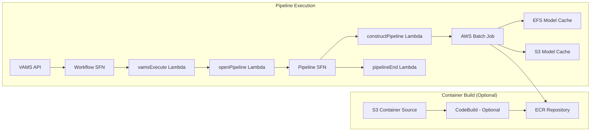

# NVIDIA Cosmos Reason Pipeline

The NVIDIA Cosmos Reason pipeline is a Vision Language Model (VLM) that analyzes video and image content to generate text-based analysis, captions, descriptions, and structured reasoning. Unlike video generation models, Cosmos Reason reads visual content and produces detailed text output.

:::info[Cosmos Reason v2]
VAMS supports the **Cosmos-Reason2** model family with 2B and 8B parameter variants. Both provide spatial-temporal reasoning capabilities based on the Qwen3-VL architecture.
:::

## Overview

| Property                    | Value                                                                      |
| --------------------------- | -------------------------------------------------------------------------- |
| **Model Family**            | Cosmos-Reason2 (Vision Language Model)                                     |
| **Pipeline ID (2B)**        | `cosmos-reason2-2b`                                                        |
| **Pipeline ID (8B)**        | `cosmos-reason2-8b`                                                        |
| **Configuration flag**      | `app.pipelines.useNvidiaCosmos.modelsReason.reason2B.enabled`              |
| **Configuration flag**      | `app.pipelines.useNvidiaCosmos.modelsReason.reason8B.enabled`              |
| **Execution type**          | Lambda (asynchronous with callback)                                        |
| **Supported input formats** | `.mp4`, `.mov`, `.avi` (video), `.jpg`, `.jpeg`, `.png` (image)            |
| **Output**                  | JSON file with structured text analysis stored at `outputS3AssetFilesPath` |
| **Timeout**                 | 8 hours (AWS Batch job), 8 hours (VAMS workflow task token)                |

### Approximate Run Times

| Phase                             | Duration (2B / g6e.12xlarge) | Duration (8B / g6e.12xlarge) | Notes                                                 |
| --------------------------------- | ---------------------------- | ---------------------------- | ----------------------------------------------------- |
| Cold start (instance launch)      | 5-10 min                     | 5-10 min                     | Skipped if `useWarmInstances` is enabled              |
| Container image pull              | 5-8 min                      | 5-8 min                      | Cached after first pull on instance                   |
| Model sync (EFS cached)           | 1-3 min                      | 2-5 min                      | First run: longer for model download from HuggingFace |
| Video analysis (vLLM inference)   | 3-8 min                      | 5-12 min                     | Main inference on GPU                                 |
| S3 upload + callback              | < 1 min                      | < 1 min                      | Small JSON output                                     |
| **Total (cached models)**         | **~15-30 min**               | **~18-40 min**               | Including cold start                                  |
| **Total (warm instance, cached)** | **~10-20 min**               | **~13-30 min**               | No cold start                                         |

:::tip[Model selection]
The 2B model provides faster inference and lower memory requirements, suitable for standard video analysis tasks. The 8B model offers improved reasoning quality for complex spatial-temporal understanding at the cost of longer run times and higher memory usage.
:::

## Container Build Options

VAMS supports two methods for building the Cosmos Reason container:

### CodeBuild (Optional)

When `useCodeBuild: true`, containers are built in the cloud using AWS CodeBuild:

-   Container source code is uploaded to S3 during CDK deployment
-   CodeBuild builds the Docker image and pushes to ECR
-   Batch job definitions reference the ECR image
-   Automatic rebuilds when container source code changes
-   Runs in the same private VPC subnets as the pipeline Batch compute, with NAT Gateway egress for internet access

**Advantages:**

-   No local Docker build required (avoids large image builds on developer machines)
-   Faster iteration with high-bandwidth cloud builds
-   Automatic rebuilds on source changes

**Troubleshooting CodeBuild failures:** CodeBuild runs asynchronously after CDK deployment completes. If a container build fails, the CDK deployment itself will succeed but the Batch pipeline will fail with a container image pull error. To check build status, use the CodeBuild project name from the CDK stack outputs:

```bash
# Get the CodeBuild project name from stack outputs
aws cloudformation describe-stacks --stack-name <your-stack-name> --query "Stacks[0].Outputs[?contains(OutputKey,'CodeBuildProject')].OutputValue" --output text

# Check build status
aws codebuild list-builds-for-project --project-name <project-name>
aws codebuild batch-get-builds --ids <build-id>
```

:::warning[CodeBuild Internet Access]
CodeBuild runs in the same private VPC subnets used by the Cosmos pipeline Batch compute environments. These private subnets require a NAT Gateway for internet egress, which is automatically provisioned when the Cosmos pipeline is enabled. For GovCloud deployments, organizations should validate that CodeBuild is configured with the correct private VPC settings for their environment.
:::

:::warning[Docker Hub Rate Limiting]
CodeBuild builds that pull base images from Docker Hub (e.g., `nvidia/cuda`) are subject to Docker Hub's anonymous pull rate limits, which can cause build failures with "429 Too Many Requests" errors. To avoid throttling, configure Docker Hub authentication credentials in CodeBuild by storing credentials in AWS Secrets Manager and referencing them in the buildspec or CodeBuild environment. See [AWS CodeBuild Docker Hub authentication](https://docs.aws.amazon.com/codebuild/latest/userguide/sample-private-registry.html) for details. Alternatively, organizations can mirror base images to Amazon ECR Public or a private ECR repository.
:::

### DockerImageAsset (Legacy)

When `useCodeBuild: false`, containers are built locally during CDK deployment using Docker and pushed to a CDK-managed ECR repository. This requires significant local resources and bandwidth.

## Architecture

The pipeline leverages NVIDIA Cosmos Reason models running on GPU-enabled AWS Batch compute instances with vLLM-based inference. Models are cached on Amazon EFS and optionally backed up to Amazon S3 for faster subsequent runs.



### Processing Stages

1. **Model Download and Caching (First Run Only)** -- On the first pipeline execution, the container downloads the Cosmos-Reason2 model from HuggingFace to Amazon EFS. Model size depends on variant: 2B model (~5GB), 8B model (~16GB). Subsequent runs reuse the cached models from EFS with S3 backup.

2. **Video/Image Analysis (AWS Batch on GPU Instances)** -- The container loads the model from Amazon EFS using vLLM inference engine, processes the input video or image with the user-provided or default prompt, and generates structured text analysis. The analysis includes captions, descriptions, temporal event localization (with timestamps for video), spatial-temporal reasoning, and physics understanding.

3. **Output Processing** -- The container writes a structured JSON file to the `outputS3AssetFilesPath` in the asset bucket. The VAMS workflow process-output step registers the output file with the asset, making it visible as a file in VAMS.

## Prerequisites

:::warning[HuggingFace access and model license required]
You must accept the NVIDIA Cosmos Reason model license on HuggingFace before using this pipeline. All model access must be granted to the same HuggingFace account used to generate the API token. The pipeline will fail to download models if the license has not been accepted.
:::

-   **HuggingFace Account** -- Create an account at [huggingface.co](https://huggingface.co/).
-   **Accept Licenses and Request Model Access** -- You must explicitly accept the license and request access for each Cosmos Reason model you plan to use on HuggingFace. Visit each model page, accept the license terms, click "Request access" (if gated), and wait for approval.

    | Model                                                                       | Purpose                         | License                   | HuggingFace URL                                         |
    | --------------------------------------------------------------------------- | ------------------------------- | ------------------------- | ------------------------------------------------------- |
    | [nvidia/Cosmos-Reason2-2B](https://huggingface.co/nvidia/Cosmos-Reason2-2B) | 2B VLM for video/image analysis | NVIDIA Open Model License | [Link](https://huggingface.co/nvidia/Cosmos-Reason2-2B) |
    | [nvidia/Cosmos-Reason2-8B](https://huggingface.co/nvidia/Cosmos-Reason2-8B) | 8B VLM for deeper reasoning     | NVIDIA Open Model License | [Link](https://huggingface.co/nvidia/Cosmos-Reason2-8B) |

-   **HuggingFace Token** -- Generate a Read access token from your HuggingFace account settings. The token must be associated with the account that has been granted access to the models listed above. Store the token value directly in the `huggingFaceToken` field of the CDK configuration (shared with Cosmos Predict pipelines) -- it will be securely stored in AWS Secrets Manager during deployment.
-   **GPU Instance Availability** -- The pipeline uses `BEST_FIT_PROGRESSIVE` allocation with multiple fallback instance types. Ensure your AWS Region has capacity for at least one of these types.
    -   **2B model**: Requires 24GB+ VRAM per GPU. Default: `g6e.12xlarge` (4x L40S 48GB), fallback: `g5.12xlarge` (4x A10G 24GB)
    -   **8B model**: Requires 32GB+ VRAM per GPU. Default: `g6e.12xlarge` (4x L40S 48GB), fallback: `g6e.24xlarge` (4x L40S 48GB). **Note:** g5 instances (A10G, 24GB VRAM) do not have sufficient VRAM for the 8B model.
-   **VPC Configuration** -- The pipeline deploys into private subnets with NAT Gateway or public subnets for internet access (required for HuggingFace model downloads on first run). Ensure VPC endpoints are configured for Amazon S3, Amazon EFS, Amazon ECR, and AWS Batch if running in a VPC-only environment.
-   **Amazon EFS** -- The pipeline uses the shared Amazon EFS file system (created by Cosmos Predict pipeline) for model caching across AWS Batch instances.

## Configuration

Add the following to your `config.json` under `app.pipelines.useNvidiaCosmos.modelsReason`:

```json
{
    "app": {
        "pipelines": {
            "useNvidiaCosmos": {
                "enabled": true,
                "huggingFaceToken": "hf_yourTokenHere",
                "useWarmInstances": false,
                "warmInstanceCount": 1,
                "modelsReason": {
                    "reason2B": {
                        "enabled": true,
                        "autoRegisterWithVAMS": true,
                        "instanceTypes": ["g6e.12xlarge", "g5.12xlarge"],
                        "maxVCpus": 192
                    },
                    "reason8B": {
                        "enabled": true,
                        "autoRegisterWithVAMS": true,
                        "instanceTypes": ["g6e.12xlarge", "g6e.24xlarge"],
                        "maxVCpus": 192
                    }
                }
            }
        }
    }
}
```

| Option                                       | Default                            | Description                                                                                                                                                                                                                                                                                       |
| -------------------------------------------- | ---------------------------------- | ------------------------------------------------------------------------------------------------------------------------------------------------------------------------------------------------------------------------------------------------------------------------------------------------- |
| `enabled`                                    | `false`                            | Enable or disable the Cosmos Reason pipeline deployment (applies to all Cosmos pipelines).                                                                                                                                                                                                        |
| `huggingFaceToken`                           | `""`                               | HuggingFace Read access token value (e.g., `hf_xxxx`). CDK automatically stores this in AWS Secrets Manager during deployment. Shared across all Cosmos pipelines (Predict, Reason, Transfer).                                                                                                    |
| `useWarmInstances`                           | `false`                            | When `true`, keeps GPU instances running when idle for instant pipeline starts. When `false`, scales to zero after job completion and incurs ~5-10 minute cold start. **Warning:** Warm instances incur continuous compute costs (~$5.67/hr per g5.12xlarge). Shared across all Cosmos pipelines. |
| `warmInstanceCount`                          | `1`                                | Number of warm GPU instances to keep running when `useWarmInstances` is `true`. Shared across all Cosmos pipelines.                                                                                                                                                                               |
| `modelsReason.reason2B.enabled`              | `false`                            | Enable the Cosmos-Reason2-2B model for video/image analysis with text output.                                                                                                                                                                                                                     |
| `modelsReason.reason2B.autoRegisterWithVAMS` | `true`                             | Automatically register the pipeline and workflow with VAMS at deploy time.                                                                                                                                                                                                                        |
| `modelsReason.reason2B.instanceTypes`        | `["g6e.12xlarge", "g5.12xlarge"]`  | EC2 GPU instance types for AWS Batch compute (BEST_FIT_PROGRESSIVE). Requires 24GB+ VRAM.                                                                                                                                                                                                         |
| `modelsReason.reason2B.maxVCpus`             | `192`                              | Maximum vCPUs for the AWS Batch compute environment.                                                                                                                                                                                                                                              |
| `modelsReason.reason8B.enabled`              | `false`                            | Enable the Cosmos-Reason2-8B model for video/image analysis with improved reasoning quality.                                                                                                                                                                                                      |
| `modelsReason.reason8B.autoRegisterWithVAMS` | `true`                             | Automatically register the pipeline and workflow with VAMS at deploy time.                                                                                                                                                                                                                        |
| `modelsReason.reason8B.instanceTypes`        | `["g6e.12xlarge", "g6e.24xlarge"]` | EC2 GPU instance types for AWS Batch compute (BEST_FIT_PROGRESSIVE). Requires 32GB+ VRAM per GPU. g5 instances (A10G, 24GB) are not supported for the 8B model.                                                                                                                                   |
| `modelsReason.reason8B.maxVCpus`             | `192`                              | Maximum vCPUs for the AWS Batch compute environment.                                                                                                                                                                                                                                              |

## Cosmos Reason

NVIDIA Cosmos Reason is a Vision Language Model (VLM) that reads video and image content and produces text-based analysis. It is based on the Qwen3-VL architecture and provides spatial-temporal reasoning, physics understanding, and embodied reasoning capabilities.

**Key Differences from Cosmos Predict:**

| Feature              | Cosmos Predict                      | Cosmos Reason                               |
| -------------------- | ----------------------------------- | ------------------------------------------- |
| **Model Type**       | World generation (diffusion/flow)   | Vision Language Model (VLM)                 |
| **Input**            | Text or image/video                 | Video or image                              |
| **Output**           | Generated video file (MP4)          | Text analysis (JSON)                        |
| **Use Case**         | Content generation, synthesis       | Content understanding, analysis, captioning |
| **Inference Engine** | NVIDIA Transformer Engine           | vLLM                                        |
| **GPU Requirements** | 24GB+ (2B), 40GB+ (14B) for Predict | 24GB+ (2B), 32GB+ (8B) for Reason           |

### Input Prompt

The text prompt controls what type of analysis the model should perform. The prompt can be set via the `COSMOS_REASON_PROMPT` file metadata key or passed in the workflow `inputParameters` as `{"prompt": "your prompt text"}`.

**Prompt Priority:** `COSMOS_REASON_PROMPT` file metadata > `inputParameters` prompt > default prompt ("Caption the video in detail.")

**Default Prompt:** If no prompt is provided, the pipeline uses: _"Caption the video in detail."_

**Example Prompts:**

-   "Caption the video in detail."
-   "Describe the actions and events occurring in this video with timestamps."
-   "Analyze the spatial relationships between objects in this image."
-   "Explain the physics principles demonstrated in this video."
-   "Provide a detailed description of the scene, including temporal events and spatial layout."

### Output Format

The pipeline produces a JSON file written to `outputS3AssetFilesPath` so it appears as a file in the VAMS asset. The output filename follows the pattern:

```
<inputFilenameStem>_CosmosReason_<YYYYMMDD-HHMMSS>.json
```

For example, if the input file is `robot-demo.mp4`, the output is `robot-demo_CosmosReason_20260410-165029.json`.

The JSON contains structured fields separating the system prompt, user prompt, and model response:

```json
{
    "model": "nvidia/Cosmos-Reason2-2B",
    "modelSize": "2B",
    "inputFile": "robot-demo.mp4",
    "timestamp": "20260410-165029",
    "systemPrompt": "You are a helpful assistant.",
    "userPrompt": "Tell me what objects are in the scene",
    "result": "Center-right on the countertop, there is a transparent glass cup filled with a reddish-brown liquid. Left-center on the countertop, next to the glass cup, there is a small jar containing granulated sugar. A light green kettle is being held by a white robotic arm, dispensing liquid into the glass cup. A metallic spoon is present in the glass cup, stirring the contents.",
    "jobLogs": "Loading safetensors checkpoint shards: 100% Completed | 1/1 ...",
    "reasoning": "The scene contains several objects arranged on a kitchen countertop..."
}
```

| Field          | Description                                                                                     |
| -------------- | ----------------------------------------------------------------------------------------------- |
| `model`        | HuggingFace model identifier used for inference                                                 |
| `modelSize`    | Model size variant (`2B` or `8B`)                                                               |
| `inputFile`    | Input filename that was analyzed                                                                |
| `timestamp`    | Inference timestamp (`YYYYMMDD-HHMMSS`)                                                         |
| `systemPrompt` | System prompt sent to the model                                                                 |
| `userPrompt`   | User prompt from VAMS metadata (`COSMOS_REASON_PROMPT`)                                         |
| `result`       | The model's analysis response (clean text, no progress bars or ANSI codes)                      |
| `jobLogs`      | Container runtime logs (model loading, CUDA graph capture, inference timing)                    |
| `reasoning`    | _(Optional)_ Model's reasoning chain, present when the model produces separate reasoning output |

```

### Use Cases

-   **Video Captioning** -- Generate detailed descriptions of video content for indexing and search
-   **Temporal Event Localization** -- Identify and timestamp specific events within videos
-   **Spatial-Temporal Reasoning** -- Analyze relationships between objects and their movements over time
-   **Physics Understanding** -- Explain physical principles and interactions visible in the content
-   **Embodied Reasoning** -- Support robotics applications with scene understanding and task planning
-   **Chain-of-Thought Analysis** -- Generate step-by-step reasoning about visual content

## GPU Instance Recommendations

The NVIDIA Cosmos Reason models require GPU instances with sufficient VRAM for inference. The following table provides instance recommendations:

| Model Size | Min VRAM | Recommended Instance | vCPUs | GPUs           | System RAM | Hourly Cost (Approx.) |
| ---------- | -------- | -------------------- | ----- | -------------- | ---------- | --------------------- |
| 2B         | 24 GB    | g6e.12xlarge         | 48    | 4x L40S (48GB) | 180GB      | ~$5.67                |
| 2B         | 24 GB    | g5.12xlarge          | 48    | 4x A10G (24GB) | 180GB      | ~$5.67                |
| 8B         | 32 GB    | g6e.12xlarge         | 48    | 4x L40S (48GB) | 180GB      | ~$5.67                |
| 8B         | 32 GB    | g6e.24xlarge         | 96    | 4x L40S (48GB) | 384GB      | ~$8.02                |

:::tip[Instance availability]
g5.12xlarge instances may have limited capacity in some AWS Regions. If you encounter capacity issues, consider requesting a quota increase or deploying to a different Region.
:::

## Model Caching

On the first pipeline execution, the container downloads the Cosmos-Reason2 model from HuggingFace:

-   **Cosmos-Reason2-2B** -- ~5GB
-   **Cosmos-Reason2-8B** -- ~16GB

The models are cached on Amazon EFS (shared with Cosmos Predict pipelines) with backup to Amazon S3. Subsequent pipeline runs load models directly from Amazon EFS, enabling faster start times after cold start warm-up.

:::info[Amazon EFS costs]
The Amazon EFS file system is shared across all VAMS Cosmos pipelines (Predict, Reason, Transfer). The total storage footprint depends on which pipelines are enabled. Monitor Amazon EFS costs and consider setting lifecycle policies for long-term cost optimization.
:::

## Warm vs Cold Instances

The `useWarmInstances` configuration option controls whether AWS Batch compute instances remain running when idle. This setting is shared across all Cosmos pipelines (Predict, Reason, Transfer).

### Cold Instances (useWarmInstances: false, default)

-   **Behavior:** AWS Batch scales to zero when no jobs are running. Instances launch on-demand when a job is queued.
-   **Cold Start Time:** ~5-10 minutes (instance launch + model load from Amazon EFS).
-   **Cost:** Pay only for active job execution time (no idle instance costs).
-   **Use Case:** Infrequent pipeline usage, cost-sensitive deployments.

### Warm Instances (useWarmInstances: true)

-   **Behavior:** AWS Batch keeps `warmInstanceCount` GPU instances running at all times. Jobs start immediately without waiting for instance launch.
-   **Start Time:** Near-instant (model already loaded in memory).
-   **Cost:** Continuous compute costs (~$5.67/hr per g5.12xlarge, even when idle). Multiply by `warmInstanceCount` for total cost.
-   **Use Case:** Frequent pipeline usage, latency-sensitive applications, interactive demos.

:::warning[Warm instance costs]
Keeping warm instances running incurs continuous compute costs. A single g5.12xlarge instance costs ~$136/day (~$4,080/month) at 24/7 utilization. Use warm instances only when start-time reduction justifies the additional cost.
:::

## Metadata Reference

The Cosmos Reason pipeline uses metadata keys to configure the analysis prompt. All metadata must be set on **file-level metadata** (not asset metadata) because Reason operates on a specific video or image file.

| Metadata Key           | Scope             | Description                                                                                                                     | Default                          |
| ---------------------- | ----------------- | ------------------------------------------------------------------------------------------------------------------------------- | -------------------------------- |
| `COSMOS_REASON_PROMPT` | **File metadata** | Analysis prompt describing what to analyze or caption. Set on the **specific video/image file** that the pipeline will process. | `"Caption the video in detail."` |

:::warning[File metadata only]
The `COSMOS_REASON_PROMPT` must be set as **file-level metadata** on the specific video or image file you want to analyze. Setting it on asset-level metadata will NOT work -- the pipeline reads from `fileMetadata` in the VAMS metadata structure, not `assetMetadata`.
:::

**Prompt examples for different use cases:**

-   Video captioning: `"Caption the video in detail."`
-   Temporal localization: `"Describe notable events in the video with timestamps in mm:ss.ff format. Output as JSON."`
-   Spatial reasoning: `"What objects are visible and how are they arranged in the scene?"`
-   Physics understanding: `"Describe the physical interactions happening in this video."`
-   Embodied reasoning: `"What actions could a robot take next based on what is shown?"`

---

## Troubleshooting

### Out-of-Memory (OOM) errors

If the pipeline fails with OOM errors, the selected instance type may not have sufficient GPU memory for the model size:

-   **2B model:** Use g5.12xlarge or larger (minimum 24GB VRAM per GPU).
-   **8B model:** Use g6e.12xlarge or g6e.24xlarge (minimum 32GB VRAM per GPU). g5 instances (A10G, 24GB) do not have sufficient VRAM.

### HuggingFace token issues

If the pipeline fails to download models from HuggingFace:

1. Verify the HuggingFace token value in the `huggingFaceToken` config field is correct and has Read permissions.
2. Ensure the Cosmos-Reason2 model license has been accepted on your HuggingFace account.
3. Verify the token is associated with the HuggingFace account that has access to the model.
4. Check the AWS Batch job logs in Amazon CloudWatch for detailed error messages.

### Invalidating model cache (force re-download)

If a model has been updated on HuggingFace or the cached version on Amazon EFS is corrupted, you can force the pipeline to re-download the model by adding `INVALIDATE_COSMOS_MODELS` to the pipeline's input parameters:

1. In the VAMS UI, edit the pipeline's input parameters to include `{"INVALIDATE_COSMOS_MODELS": "true"}`.
2. Run the pipeline. The cached model on Amazon EFS and Amazon S3 will be deleted and re-downloaded from HuggingFace.
3. After the run completes successfully, remove the `INVALIDATE_COSMOS_MODELS` parameter to resume using the fast EFS cache path.

:::warning
Invalidating the model cache triggers a full re-download of the model weights from HuggingFace. This increases the pipeline execution time.
:::

### Amazon EFS mount failures

If the pipeline fails to mount the Amazon EFS file system:

-   Ensure the AWS Batch compute instances are in subnets with access to the Amazon EFS mount targets.
-   Verify the security group attached to the Amazon EFS mount targets allows inbound traffic from the AWS Batch compute instances on port 2049 (NFS).
-   Check Amazon EFS mount target status in the Amazon EFS console.

### Cold start timeout

If pipeline jobs are queued for longer than expected:

-   Check AWS Batch compute environment status in the AWS Batch console.
-   Verify the selected instance types are available in your Region and Availability Zones.
-   Request a quota increase for the instance type if capacity is constrained.

## Attribution

This pipeline is built on NVIDIA Cosmos foundation models, which are licensed under the [NVIDIA Open Model License](https://developer.nvidia.com/cosmos-license). When using NVIDIA Cosmos in your applications, you must include the following attribution:

**"Built on NVIDIA Cosmos"**

For commercial use, review the NVIDIA Open Model License terms to ensure compliance.

## Related pages

-   [NVIDIA Cosmos Predict](nvidia-cosmos.md)
-   [NVIDIA Cosmos Transfer](nvidia-cosmos-transfer.md)
-   [Pipeline overview](overview.md)
-   [Custom pipelines](custom-pipelines.md)
-   [Deployment configuration](../deployment/configuration-reference.md)
```
