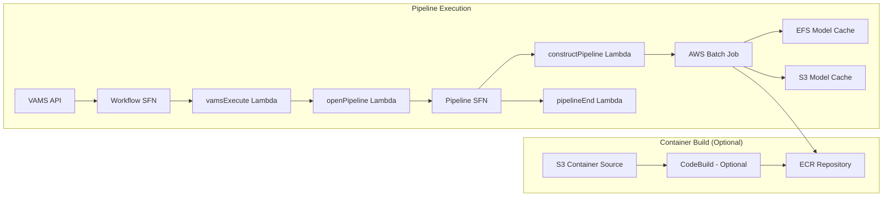

# NVIDIA Cosmos Transfer Pipeline

The NVIDIA Cosmos Transfer pipeline generates stylized and transformed videos from source videos combined with control signals. Using Cosmos-Transfer2.5 models, the pipeline enables video-to-video transformation with visual guidance from depth maps, edge detection, semantic segmentation, or visual blur.

:::info[Cosmos Transfer v2.5]
VAMS supports the **Cosmos-Transfer2.5-2B** model for video transformation using control signal conditioning. The model requires significant GPU resources (minimum 65.4GB VRAM across 8 GPUs) and is deployed on g6e.48xlarge instances (8x L40S 48GB) by default, with p5.48xlarge (8x H100 80GB) as a fallback.
:::

## Overview

| Property                    | Value                                                                                                         |
| --------------------------- | ------------------------------------------------------------------------------------------------------------- |
| **Model Family**            | Cosmos-Transfer2.5 (control signal-based video transformation)                                                |
| **Pipeline ID**             | `cosmos-transfer2-edge-2b`                                                                                    |
| **Configuration flag**      | `app.pipelines.useNvidiaCosmos.modelsTransfer.transfer2B.enabled`                                             |
| **Execution type**          | Lambda (asynchronous with callback)                                                                           |
| **Supported input formats** | `.mp4`, `.mov` (source video); control signal (optional, auto-computed or provided)                           |
| **Output**                  | MP4 video file stored at `outputS3AssetFilesPath`                                                             |
| **Timeout**                 | 8 hours (AWS Batch job), 8 hours (VAMS workflow task token)                                                   |
| **GPU Requirements**        | 65.4GB VRAM minimum across 8 GPUs. Default: g6e.48xlarge (8x L40S 48GB), fallback: p5.48xlarge (8x H100 80GB) |

### Approximate Run Times

| Phase                                       | Duration (g6e.48xlarge) | Notes                                                 |
| ------------------------------------------- | ----------------------- | ----------------------------------------------------- |
| Cold start (instance launch)                | 5-10 min                | Skipped if `useWarmInstances` is enabled              |
| Container image pull                        | 5-8 min                 | Cached after first pull on instance                   |
| Model sync (EFS cached)                     | 2-5 min                 | First run: longer for model download from HuggingFace |
| Control signal computation (if auto)        | 2-10 min                | Depends on control type (edge: fast, seg: slow)       |
| Video transformation (inference)            | 10-20 min               | Main inference on 8x L40S GPUs (g6e.48xlarge)         |
| S3 upload + callback                        | < 1 min                 | Output video upload                                   |
| **Total (cached models, auto edge)**        | **~25-45 min**          | Including cold start and auto edge computation        |
| **Total (warm instance, provided control)** | **~15-30 min**          | No cold start, control signal pre-provided            |

:::warning[High compute requirements]
The Cosmos-Transfer2.5-2B model requires 65.4GB VRAM and runs on g6e.48xlarge instances (8x L40S 48GB) by default, with p5.48xlarge (8x H100 80GB) as a fallback. The g6e.48xlarge instance costs approximately $13.35/hour; the p5.48xlarge costs approximately $98.32/hour.
:::

## Container Build Options

VAMS supports two methods for building the Cosmos Transfer container:

### CodeBuild (Optional)

When `useCodeBuild: true`, containers are built in the cloud using AWS CodeBuild:

-   Container source code is uploaded to S3 during CDK deployment
-   CodeBuild builds the Docker image and pushes to ECR
-   Batch job definitions reference the ECR image
-   Automatic rebuilds when container source code changes
-   Runs in the same private VPC subnets as the pipeline Batch compute, with NAT Gateway egress for internet access

**Advantages:**

-   No local Docker build required (avoids large image builds on developer machines)
-   Faster iteration with high-bandwidth cloud builds
-   Automatic rebuilds on source changes

**Troubleshooting CodeBuild failures:** CodeBuild runs asynchronously after CDK deployment completes. If a container build fails, the CDK deployment itself will succeed but the Batch pipeline will fail with a container image pull error. To check build status, use the CodeBuild project name from the CDK stack outputs:

```bash
# Get the CodeBuild project name from stack outputs
aws cloudformation describe-stacks --stack-name <your-stack-name> --query "Stacks[0].Outputs[?contains(OutputKey,'CodeBuildProject')].OutputValue" --output text

# Check build status
aws codebuild list-builds-for-project --project-name <project-name>
aws codebuild batch-get-builds --ids <build-id>
```

:::warning[CodeBuild Internet Access]
CodeBuild runs in the same private VPC subnets used by the Cosmos pipeline Batch compute environments. These private subnets require a NAT Gateway for internet egress, which is automatically provisioned when the Cosmos pipeline is enabled. For GovCloud deployments, organizations should validate that CodeBuild is configured with the correct private VPC settings for their environment.
:::

:::warning[Docker Hub Rate Limiting]
CodeBuild builds that pull base images from Docker Hub (e.g., `nvidia/cuda`) are subject to Docker Hub's anonymous pull rate limits, which can cause build failures with "429 Too Many Requests" errors. To avoid throttling, configure Docker Hub authentication credentials in CodeBuild by storing credentials in AWS Secrets Manager and referencing them in the buildspec or CodeBuild environment. See [AWS CodeBuild Docker Hub authentication](https://docs.aws.amazon.com/codebuild/latest/userguide/sample-private-registry.html) for details. Alternatively, organizations can mirror base images to Amazon ECR Public or a private ECR repository.
:::

### DockerImageAsset (Legacy)

When `useCodeBuild: false`, containers are built locally during CDK deployment using Docker and pushed to a CDK-managed ECR repository. This requires significant local resources and bandwidth.

## Architecture

The pipeline leverages the NVIDIA Cosmos-Transfer2.5 model running on high-memory GPU-enabled AWS Batch compute instances. Control signals can be auto-computed from the source video or provided as separate input files. Models are cached on Amazon EFS and optionally backed up to Amazon S3.



### Processing Stages

1. **Model Download and Caching (First Run Only)** -- On the first pipeline execution, the container downloads the Cosmos-Transfer2.5-2B model (~20GB) and supporting models (VideoDepthAnything for depth, GroundDino+SAM2 for segmentation) from HuggingFace to Amazon EFS. Subsequent runs reuse the cached models from EFS with S3 backup.

2. **Control Signal Preparation** -- The container either loads a pre-provided control signal from S3 (path set via `COSMOS_TRANSFER_CONTROL_PATH` file metadata) or auto-computes it on-the-fly from the source video. Control signal types include:

    - **Edge:** Canny edge detection boundaries (fast, always auto-computed if not provided)
    - **Depth:** Depth maps from VideoDepthAnything model (slower, auto-computed if not provided)
    - **Segmentation:** Semantic segmentation via GroundDino+SAM2 (slowest, auto-computed if not provided)
    - **Visual Blur:** Bilateral Gaussian blur (always auto-computed, cannot be pre-provided)

3. **Video Transformation (AWS Batch on GPU Instances)** -- The container loads the Cosmos-Transfer2.5-2B model from Amazon EFS, processes the source video with the control signal and text prompt, and generates a transformed output video. The prompt controls the style and transformation applied.

4. **Output Processing** -- The container writes the transformed MP4 video to `outputS3AssetFilesPath` in the asset bucket. The VAMS workflow process-output step registers the output video with the asset.

## Prerequisites

:::warning[Multiple HuggingFace model licenses required]
The Transfer pipeline downloads models from multiple NVIDIA HuggingFace repositories. You must accept the license for each model repository before the pipeline can run. All model access must be granted to the same HuggingFace account used to generate the API token.
:::

-   **HuggingFace Account** -- Create an account at [huggingface.co](https://huggingface.co/).
-   **Accept Licenses and Request Model Access** -- You must explicitly accept the license and request access for each model on HuggingFace. Visit each model page, accept the license terms, click "Request access" (if gated), and wait for approval.

    | Model                                                                               | Purpose                                                  | License                   | HuggingFace URL                                             |
    | ----------------------------------------------------------------------------------- | -------------------------------------------------------- | ------------------------- | ----------------------------------------------------------- |
    | [nvidia/Cosmos-Transfer2.5-2B](https://huggingface.co/nvidia/Cosmos-Transfer2.5-2B) | Transfer model (edge, depth, segmentation, blur control) | NVIDIA Open Model License | [Link](https://huggingface.co/nvidia/Cosmos-Transfer2.5-2B) |
    | [nvidia/Cosmos-Predict2.5-2B](https://huggingface.co/nvidia/Cosmos-Predict2.5-2B)   | VAE tokenizer (shared dependency)                        | NVIDIA Open Model License | [Link](https://huggingface.co/nvidia/Cosmos-Predict2.5-2B)  |
    | [nvidia/Cosmos-Reason1-7B](https://huggingface.co/nvidia/Cosmos-Reason1-7B)         | Guardrail tokenizer (used when guardrails enabled)       | NVIDIA Open Model License | [Link](https://huggingface.co/nvidia/Cosmos-Reason1-7B)     |

    :::note
    The Transfer pipeline shares the Cosmos Predict 2.5 VAE tokenizer and Cosmos Reason 1 guardrail model. Your HuggingFace token must have access to all three repositories even if you only intend to use Transfer.
    :::

    Additional optional dependencies for control signal auto-computation:

    | Model                                                                             | Size  | Purpose                                                | License    |
    | --------------------------------------------------------------------------------- | ----- | ------------------------------------------------------ | ---------- |
    | [video-depth-anything](https://huggingface.co/models?search=video-depth-anything) | ~2 GB | Depth map generation for depth control signals         | Apache 2.0 |
    | [sam2](https://huggingface.co/models?search=segment-anything-2)                   | ~5 GB | Semantic segmentation for segmentation control signals | Apache 2.0 |

-   **HuggingFace Token** -- Generate a Read access token from your HuggingFace account settings. The token must be associated with the account that has been granted access to all three NVIDIA model repositories listed above. Store the token value directly in the `huggingFaceToken` field of the CDK configuration (shared with Cosmos Predict and Reason pipelines) -- it will be securely stored in AWS Secrets Manager during deployment.
-   **GPU Instance Availability** -- The pipeline requires g6e.48xlarge instances (8x L40S 48GB GPUs, 192 vCPUs) by default, with p5.48xlarge (8x H100 80GB GPUs, 192 vCPUs) as a fallback. Ensure your AWS Region has capacity for these instance types. The pipeline uses `BEST_FIT_PROGRESSIVE` allocation strategy.
-   **VPC Configuration** -- The pipeline deploys into private subnets with NAT Gateway or public subnets for internet access (required for HuggingFace model downloads on first run). Ensure VPC endpoints are configured for Amazon S3, Amazon EFS, Amazon ECR, and AWS Batch if running in a VPC-only environment.
-   **Amazon EFS** -- The pipeline uses the shared Amazon EFS file system (created by Cosmos Predict pipeline) for model caching across AWS Batch instances.

## Configuration

Add the following to your `config.json` under `app.pipelines.useNvidiaCosmos.modelsTransfer`:

```json
{
    "app": {
        "pipelines": {
            "useNvidiaCosmos": {
                "enabled": true,
                "huggingFaceToken": "hf_yourTokenHere",
                "useWarmInstances": false,
                "warmInstanceCount": 1,
                "modelsTransfer": {
                    "transfer2B": {
                        "enabled": true,
                        "autoRegisterWithVAMS": true,
                        "instanceTypes": ["g6e.48xlarge", "p5.48xlarge"],
                        "maxVCpus": 192
                    }
                }
            }
        }
    }
}
```

| Option                                           | Default                           | Description                                                                                                                                                                                                                                                                        |
| ------------------------------------------------ | --------------------------------- | ---------------------------------------------------------------------------------------------------------------------------------------------------------------------------------------------------------------------------------------------------------------------------------- |
| `enabled`                                        | `false`                           | Enable or disable the Cosmos Transfer pipeline deployment (applies to all Cosmos pipelines).                                                                                                                                                                                       |
| `huggingFaceToken`                               | `""`                              | HuggingFace Read access token value (e.g., `hf_xxxx`). CDK automatically stores this in AWS Secrets Manager during deployment. Shared across all Cosmos pipelines (Predict, Reason, Transfer).                                                                                     |
| `useWarmInstances`                               | `false`                           | When `true`, keeps GPU instances running when idle for instant pipeline starts. When `false`, scales to zero after job completion and incurs ~5-10 minute cold start. **Warning:** Warm g6e.48xlarge instances cost ~$13.35/hr even when idle. Shared across all Cosmos pipelines. |
| `warmInstanceCount`                              | `1`                               | Number of warm GPU instances to keep running when `useWarmInstances` is `true`. Shared across all Cosmos pipelines.                                                                                                                                                                |
| `modelsTransfer.transfer2B.enabled`              | `false`                           | Enable the Cosmos-Transfer2.5-2B model for video transformation with control signals.                                                                                                                                                                                              |
| `modelsTransfer.transfer2B.autoRegisterWithVAMS` | `true`                            | Automatically register the pipeline and workflow with VAMS at deploy time.                                                                                                                                                                                                         |
| `modelsTransfer.transfer2B.instanceTypes`        | `["g6e.48xlarge", "p5.48xlarge"]` | EC2 GPU instance types for AWS Batch compute (BEST_FIT_PROGRESSIVE). g6e.48xlarge (8x L40S 48GB) is the recommended default. p5.48xlarge (8x H100 80GB) provides higher performance at higher cost.                                                                                |
| `modelsTransfer.transfer2B.maxVCpus`             | `192`                             | Maximum vCPUs for the AWS Batch compute environment.                                                                                                                                                                                                                               |

## Cosmos Transfer

NVIDIA Cosmos Transfer is a video transformation model that applies style transfer and content transformation using control signals. The model takes a source video and a control signal (edge, depth, segmentation, or visual blur) and generates a stylistically transformed output video guided by a text prompt.

**Key Differences from Cosmos Predict:**

| Feature               | Cosmos Predict                     | Cosmos Transfer                                         |
| --------------------- | ---------------------------------- | ------------------------------------------------------- |
| **Model Type**        | World generation (diffusion/flow)  | Video transformation with control signals               |
| **Input**             | Text or image/video                | Source video + control signal                           |
| **Output**            | Generated video file (MP4)         | Transformed video file (MP4)                            |
| **Use Case**          | Content generation, synthesis      | Style transfer, video transformation                    |
| **Control Mechanism** | Text prompt or visual conditioning | Control signal (edge, depth, seg, blur) + text prompt   |
| **GPU Requirements**  | 24GB+ (2B), 40GB+ (14B)            | 65.4GB (2B only, requires 8x L40S 48GB or 8x H100 80GB) |

### Input Files

The pipeline accepts two inputs:

1. **Source Video (Required)** -- The main video file the pipeline runs on. Supported formats: `.mp4`, `.mov`. This is the file selected when executing the pipeline in VAMS.

2. **Control Signal (Optional)** -- A control signal file that guides the transformation. The control signal path is set via the `COSMOS_TRANSFER_CONTROL_PATH` file metadata key. If not provided, the pipeline auto-computes the control signal from the source video based on the `COSMOS_TRANSFER_CONTROL_TYPE` metadata key.

### Control Signal Types

The control signal type is set via the `COSMOS_TRANSFER_CONTROL_TYPE` file metadata key. Supported types:

| Control Type     | Metadata Key Value | Description                                                             | Can Auto-Compute     | Auto-Compute Speed |
| ---------------- | ------------------ | ----------------------------------------------------------------------- | -------------------- | ------------------ |
| **Edge**         | `edge`             | Canny edge detection boundaries. Emphasizes structural outlines.        | Yes                  | Fast (~1-2 min)    |
| **Depth**        | `depth`            | Depth maps from VideoDepthAnything. Captures spatial depth information. | Yes                  | Medium (~5-8 min)  |
| **Segmentation** | `seg`              | Semantic segmentation via GroundDino+SAM2. Object-level masks.          | Yes                  | Slow (~10-15 min)  |
| **Visual Blur**  | `vis`              | Bilateral Gaussian blur. Smooths textures while preserving edges.       | Always auto-computed | Fast (~1 min)      |

**Default Control Type:** If not specified, the pipeline uses `"edge"` as the default control type.

**Auto-Compute Behavior:**

-   If `COSMOS_TRANSFER_CONTROL_PATH` is not set, the pipeline automatically computes the control signal from the source video using the specified `COSMOS_TRANSFER_CONTROL_TYPE`.
-   **Visual Blur** is always auto-computed and cannot be pre-provided.
-   For pre-computed control signals (edge, depth, seg), upload the control signal file to the asset and set its S3 path in the `COSMOS_TRANSFER_CONTROL_PATH` metadata key.

### Input Prompt

The text prompt controls the style and transformation applied to the video. The prompt can be set via the `COSMOS_TRANSFER_PROMPT` file metadata key or passed in the workflow `inputParameters` as `{"prompt": "your prompt text"}`.

**Prompt Priority:** `COSMOS_TRANSFER_PROMPT` file metadata > `inputParameters` prompt > default prompt ("Transform the video")

**Default Prompt:** If no prompt is provided, the pipeline uses: _"Transform the video"_

**Example Prompts:**

-   "Transform the video into a watercolor painting"
-   "Apply a cinematic film noir style to this video"
-   "Convert this video to a sketch-like drawing"
-   "Make this video look like a vintage 1980s recording"
-   "Transform the video with neon cyberpunk aesthetics"

### Output Format

The pipeline writes an MP4 video file to `outputS3AssetFilesPath` in the asset bucket. The output filename is:

```
{source_filename}_CosmosTransfer_{control_type}_{timestamp}.mp4
```

Example: `input_video_CosmosTransfer_edge_20260407120000.mp4`

The output video has the same resolution and frame rate as the source video.

### Metadata Keys

The following file metadata keys control Cosmos Transfer pipeline behavior:

| Metadata Key                   | Type   | Description                                                                           | Default                 |
| ------------------------------ | ------ | ------------------------------------------------------------------------------------- | ----------------------- |
| `COSMOS_TRANSFER_CONTROL_TYPE` | string | Control signal type: `edge`, `depth`, `seg`, or `vis`                                 | `"edge"`                |
| `COSMOS_TRANSFER_CONTROL_PATH` | string | S3 path to pre-computed control signal file (optional, auto-computed if not provided) | `""` (auto-compute)     |
| `COSMOS_TRANSFER_PROMPT`       | string | Text prompt for transformation style                                                  | `"Transform the video"` |

## GPU Instance Recommendations

| Model Size    | Min VRAM | Default Instance | vCPUs | GPUs           | System RAM | Approx. Cost/hr |
| ------------- | -------- | ---------------- | ----- | -------------- | ---------- | --------------- |
| 2B            | 65.4 GB  | g6e.48xlarge     | 192   | 8x L40S (48GB) | 768GB      | ~$13.35         |
| 2B (fallback) | 65.4 GB  | p5.48xlarge      | 192   | 8x H100 (80GB) | 2048GB     | ~$98.32         |

:::danger[p4d instances not supported]
The `p4d.24xlarge` instance type (8x A100 40GB) is **not recommended** for the Cosmos Transfer 2.5 pipeline. The p4d instances use older NVIDIA drivers (550.x, CUDA 12.4) that are incompatible with the Cosmos Transfer 2.5 CUDA 12.8 runtime requirements, causing NCCL communication failures during multi-GPU context parallelism. Use `g6e.48xlarge` or `p5.48xlarge` instead.
:::

## Model Caching

On the first pipeline execution, the container downloads the following models from HuggingFace:

-   **Cosmos-Transfer2.5-2B** -- ~20GB
-   **VideoDepthAnything** (for depth control) -- ~2GB
-   **SAM2 + GroundDino** (for segmentation control) -- ~5GB

**Total Download Size:** ~27GB (all control types enabled)

The models are cached on Amazon EFS (shared with Cosmos Predict and Reason pipelines) with backup to Amazon S3. Subsequent pipeline runs load models directly from Amazon EFS, enabling faster start times after cold start warm-up.

:::info[Amazon EFS costs]
The Amazon EFS file system is shared across all VAMS Cosmos pipelines (Predict, Reason, Transfer). The total storage footprint depends on which pipelines are enabled. Monitor Amazon EFS costs and consider setting lifecycle policies for long-term cost optimization.
:::

## Warm vs Cold Instances

The `useWarmInstances` configuration option controls whether AWS Batch compute instances remain running when idle. This setting is shared across all Cosmos pipelines (Predict, Reason, Transfer).

### Cold Instances (useWarmInstances: false, default)

-   **Behavior:** AWS Batch scales to zero when no jobs are running. Instances launch on-demand when a job is queued.
-   **Cold Start Time:** ~5-10 minutes (instance launch + model load from Amazon EFS).
-   **Cost:** Pay only for active job execution time (no idle instance costs).
-   **Use Case:** Infrequent pipeline usage, cost-sensitive deployments.

### Warm Instances (useWarmInstances: true)

-   **Behavior:** AWS Batch keeps `warmInstanceCount` GPU instances running at all times. Jobs start immediately without waiting for instance launch.
-   **Start Time:** Near-instant (model already loaded in memory).
-   **Cost:** Continuous compute costs (~$13.35/hr per g6e.48xlarge, even when idle). Multiply by `warmInstanceCount` for total cost.
-   **Use Case:** Frequent pipeline usage, latency-sensitive applications, interactive demos.

:::danger[Warm instance costs]
Keeping warm g6e.48xlarge instances running incurs continuous compute costs. A single g6e.48xlarge instance costs ~$320/day (~$9,612/month) at 24/7 utilization. Use warm instances only when start-time reduction justifies the additional cost.
:::

## Use Cases

-   **Video Style Transfer** -- Apply artistic styles (painting, sketch, anime) to existing videos
-   **Content Transformation** -- Convert videos to different visual aesthetics (vintage, cyberpunk, film noir)
-   **Temporal Consistency** -- Maintain temporal coherence during style transfer across video frames
-   **Edge-Guided Transformation** -- Preserve structural boundaries while changing visual appearance
-   **Depth-Aware Effects** -- Apply depth-dependent transformations for realistic visual effects
-   **Semantic-Based Editing** -- Transform specific objects or regions based on semantic segmentation

## Metadata Reference

The Cosmos Transfer pipeline uses multiple metadata keys to configure the transformation. **All metadata must be set on file-level metadata** (not asset metadata) because Transfer operates on a specific source video file.

| Metadata Key                   | Scope             | Description                                                                                                                                                                                   | Default                 |
| ------------------------------ | ----------------- | --------------------------------------------------------------------------------------------------------------------------------------------------------------------------------------------- | ----------------------- |
| `COSMOS_TRANSFER_PROMPT`       | **File metadata** | Text prompt describing the desired transformation style. Set on the **source video file**.                                                                                                    | `"Transform the video"` |
| `COSMOS_TRANSFER_CONTROL_TYPE` | **File metadata** | Control signal type: `edge`, `depth`, `seg`, or `vis`. Determines what structural information guides the transformation.                                                                      | `"edge"`                |
| `COSMOS_TRANSFER_CONTROL_PATH` | **File metadata** | Relative S3 path to a pre-computed control signal file within the asset (e.g., `depth_maps/scene_depth.mp4`). If empty, the control signal is auto-computed on-the-fly from the source video. | `""` (auto-compute)     |

:::warning[File metadata only]
All three metadata keys must be set as **file-level metadata** on the specific source video file you want to transform. Setting them on asset-level metadata will NOT work -- the pipeline reads from `fileMetadata` in the VAMS metadata structure, not `assetMetadata`.
:::

**Minimum required:** Only the source video file is needed. If no metadata is set, Transfer defaults to edge-based transformation with an auto-computed edge map and the prompt "Transform the video."

**With pre-computed control signal:** Set `COSMOS_TRANSFER_CONTROL_PATH` to the relative path of the control signal video within the same asset. The path is relative to the asset root (after the `inputAssetLocationKey` prefix). For example, if the asset has files:

```
asset-id/source_video.mp4
asset-id/controls/edge_map.mp4
```

Set `COSMOS_TRANSFER_CONTROL_PATH` to `controls/edge_map.mp4` on the `source_video.mp4` file metadata.

---

## Troubleshooting

### Out-of-Memory (OOM) errors

If the pipeline fails with OOM errors:

-   Verify the pipeline is deployed with g6e.48xlarge or p5.48xlarge instances.
-   Check that the AWS Batch compute environment `maxVCpus` is set to at least 192.
-   Ensure no other memory-intensive processes are running on the instance.

The Cosmos-Transfer2.5-2B model requires 65.4GB VRAM and cannot run on smaller GPU instances.

### HuggingFace token issues

If the pipeline fails to download models from HuggingFace:

1. Verify the HuggingFace token value in the `huggingFaceToken` config field is correct and has Read permissions.
2. Ensure the Cosmos-Transfer2.5-2B model license has been accepted on your HuggingFace account.
3. If using depth control, verify access to VideoDepthAnything model.
4. If using segmentation control, verify access to SAM2 and GroundDino models.
5. Check the AWS Batch job logs in Amazon CloudWatch for detailed error messages.

### Control signal computation failures

If auto-compute of control signals fails:

-   **Depth control:** Ensure the source video has clear depth cues. VideoDepthAnything may fail on abstract or 2D content.
-   **Segmentation control:** Ensure the video contains recognizable objects. GroundDino+SAM2 requires identifiable semantic content.
-   **Edge control:** Rarely fails, but ensure the video has sufficient contrast for edge detection.

Consider pre-computing control signals offline and providing them via `COSMOS_TRANSFER_CONTROL_PATH` for complex videos.

### Invalidating model cache (force re-download)

If a model has been updated on HuggingFace or the cached version on Amazon EFS is corrupted, you can force the pipeline to re-download all models by adding `INVALIDATE_COSMOS_MODELS` to the pipeline's input parameters:

1. In the VAMS UI, edit the pipeline's input parameters to include `{"INVALIDATE_COSMOS_MODELS": "true"}`.
2. Run the pipeline. All cached models on Amazon EFS and Amazon S3 will be deleted and re-downloaded from HuggingFace.
3. After the run completes successfully, remove the `INVALIDATE_COSMOS_MODELS` parameter to resume using the fast EFS cache path.

:::warning
Invalidating the model cache triggers a full re-download of ~27GB of model weights from HuggingFace. This significantly increases the pipeline execution time (30+ minutes for the download alone).
:::

### Amazon EFS mount failures

If the pipeline fails to mount the Amazon EFS file system:

-   Ensure the AWS Batch compute instances are in subnets with access to the Amazon EFS mount targets.
-   Verify the security group attached to the Amazon EFS mount targets allows inbound traffic from the AWS Batch compute instances on port 2049 (NFS).
-   Check Amazon EFS mount target status in the Amazon EFS console.

### Cold start timeout

If pipeline jobs are queued for longer than expected:

-   Check AWS Batch compute environment status in the AWS Batch console.
-   Verify g6e.48xlarge or p5.48xlarge instances are available in your Region and Availability Zones.
-   Request a quota increase for G6e or P5 instances if capacity is constrained.

### Instance quota limits

g6e.48xlarge and p5.48xlarge instances have region-specific quotas. If you encounter quota issues:

1. Navigate to the Amazon EC2 service quotas page in the AWS Console.
2. For g6e.48xlarge: Search for "Running On-Demand G and VT instances" quota. Request an increase for at least 192 vCPUs.
3. For p5.48xlarge (fallback): Search for "Running On-Demand P instances" quota. Request an increase for at least 192 vCPUs.
4. Allow 1-2 business days for quota approval.

## Attribution

This pipeline is built on NVIDIA Cosmos foundation models, which are licensed under the [NVIDIA Open Model License](https://developer.nvidia.com/cosmos-license). When using NVIDIA Cosmos in your applications, you must include the following attribution:

**"Built on NVIDIA Cosmos"**

For commercial use, review the NVIDIA Open Model License terms to ensure compliance.

## Related pages

-   [NVIDIA Cosmos Predict](nvidia-cosmos.md)
-   [NVIDIA Cosmos Reason](nvidia-cosmos-reason.md)
-   [Pipeline overview](overview.md)
-   [Custom pipelines](custom-pipelines.md)
-   [Deployment configuration](../deployment/configuration-reference.md)
