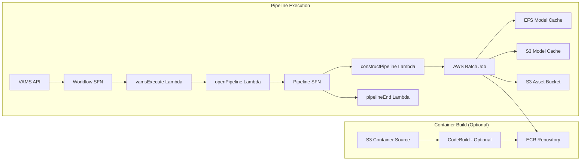

# NVIDIA Gr00t Fine-Tuning Pipeline

The NVIDIA Gr00t fine-tuning pipeline enables fine-tuning of NVIDIA's GR00T-N1.5-3B foundation model for embodied AI and robotics applications. The pipeline runs on GPU-accelerated AWS Batch instances, downloads training data from VAMS assets, and produces model checkpoints that are stored back to the asset.

:::info[Gr00t Model]
VAMS supports the **GR00T-N1.5-3B** model from NVIDIA's Isaac GR00T project. This 3B-parameter model is designed for robot manipulation tasks and supports both LoRA and full fine-tuning on user-provided datasets in LeRobot v2.1 format.
:::

## Overview

| Property               | Value                                                                       |
| ---------------------- | --------------------------------------------------------------------------- |
| **Model**              | GR00T-N1.5-3B (embodied AI foundation model)                                |
| **Pipeline ID**        | `nvidia-gr00t-finetune-n1-5-3b`                                             |
| **Configuration flag** | `app.pipelines.useNvidiaGr00t.modelsFinetune.gr00tN1_5_3B.enabled`          |
| **Execution type**     | Lambda (asynchronous with callback)                                         |
| **Pipeline scope**     | Asset-level (downloads entire asset, not individual files)                  |
| **Input**              | LeRobot v2.1 dataset in `dataset/` subfolder + optional `gr00t_config.json` |
| **Output**             | Model checkpoints in `gr00tOutput_N1.5-3B_trainingjob_{TIMESTAMP}_{JOBID}/` |
| **Timeout**            | 8 hours (AWS Batch job), 8 hours (VAMS workflow task token)                 |

### Approximate Run Times

| Phase                        | Duration (g6e.4xlarge / 1 GPU) | Duration (g6e.12xlarge / 4 GPU) | Notes                                                  |
| ---------------------------- | ------------------------------ | ------------------------------- | ------------------------------------------------------ |
| Cold start (instance launch) | 5-10 min                       | 5-10 min                        | Skipped if `useWarmInstances` is enabled               |
| Container image pull         | 5-8 min                        | 5-8 min                         | Cached after first pull on instance                    |
| Model sync (EFS cached)      | 1-5 min                        | 1-5 min                         | First run: 10+ min for model download from HuggingFace |
| Dataset download from S3     | 1-10 min                       | 1-10 min                        | Depends on dataset size                                |
| Training (6000 steps)        | 60-120 min                     | 20-40 min                       | Varies with batch size, LoRA vs full, dataset size     |
| Checkpoint upload to S3      | 1-5 min                        | 1-5 min                         | Depends on checkpoint size                             |
| **Total (cached, LoRA)**     | **~80-150 min**                | **~35-70 min**                  | LoRA fine-tuning (default)                             |
| **Total (cached, full)**     | **~120-200 min**               | **~50-90 min**                  | Full fine-tuning (all components)                      |

:::tip[GPU Selection]
For LoRA fine-tuning (default), a single GPU instance like `g6e.4xlarge` is sufficient. For full model fine-tuning with all components enabled (`tuneLlm`, `tuneVisual`), use multi-GPU instances like `g6e.12xlarge` (4 GPUs) for significantly faster training. The `numGpus` parameter is configurable at runtime.
:::

## Container Build Options

VAMS supports two methods for building the Gr00t container:

### CodeBuild (Recommended)

When `useCodeBuild: true`, containers are built in the cloud using AWS CodeBuild:

-   Container source code is uploaded to S3 during CDK deployment
-   CodeBuild builds the Docker image and pushes to ECR
-   Batch job definitions reference the ECR image
-   Automatic rebuilds when container source code changes
-   Runs in the same private VPC subnets as the pipeline Batch compute, with NAT Gateway egress for internet access

**Advantages:**

-   No local Docker build required (avoids large GPU image builds on developer machines)
-   Faster iteration with high-bandwidth cloud builds
-   Automatic rebuilds on source changes

**Troubleshooting CodeBuild failures:** CodeBuild runs asynchronously after CDK deployment completes. If a container build fails, the CDK deployment itself will succeed but the Batch pipeline will fail with a container image pull error. To check build status:

```bash
# Get the CodeBuild project name from stack outputs
aws cloudformation describe-stacks --stack-name <your-stack-name> --query "Stacks[0].Outputs[?contains(OutputKey,'Gr00tFinetuneCodeBuildProject')].OutputValue" --output text

# Check build status
aws codebuild list-builds-for-project --project-name <project-name>
aws codebuild batch-get-builds --ids <build-id>
```

:::warning[CodeBuild Internet Access]
CodeBuild runs in the same private VPC subnets used by the Gr00t pipeline Batch compute environments. These private subnets require a NAT Gateway for internet egress, which is automatically provisioned when the Gr00t pipeline is enabled.
:::

### DockerImageAsset (Legacy)

When `useCodeBuild: false`, containers are built locally during CDK deployment using Docker and pushed to a CDK-managed ECR repository. This requires significant local resources and bandwidth.

## Architecture

The pipeline runs asset-level fine-tuning jobs on GPU-enabled AWS Batch compute instances with model caching on Amazon EFS.



### Processing Stages

1. **Model Download and Caching (First Run Only)** -- On the first pipeline execution, the container downloads the GR00T-N1.5-3B model from HuggingFace to Amazon EFS. Subsequent runs reuse the cached model from EFS with S3 backup.

2. **Asset Download** -- The container downloads all asset files from S3 to a local working directory, excluding any previous training output folders (`gr00tOutput_*`). Previous outputs are never deleted from S3 -- they are only excluded from the local download.

3. **Configuration Resolution** -- The container resolves training configuration using a 3-tier priority system:

    - **Priority 1 (highest):** `gr00t_config.json` file in the asset root
    - **Priority 2:** Asset metadata keys (e.g., `GROOT_MAX_STEPS`, `GROOT_LORA_RANK`)
    - **Priority 3:** Pipeline `inputParameters` (set at pipeline registration or runtime)
    - **Default:** Built-in defaults for all parameters

4. **Fine-Tuning (AWS Batch on GPU Instances)** -- The container loads the base model from Amazon EFS, resolves the user-provided dataset (in LeRobot v2.1 format) from the asset, and runs fine-tuning using the gr00t training framework. Supports single-GPU and multi-GPU (torchrun) execution, LoRA and full fine-tuning, and configurable training hyperparameters.

5. **Output Upload** -- Training checkpoints are uploaded to the asset S3 bucket in a structured folder: `gr00tOutput_N1.5-3B_trainingjob_{TIMESTAMP}_{JOBID}/`. All intermediate checkpoints (e.g., `checkpoint-2000/`, `checkpoint-4000/`, `checkpoint-6000/`) are included.

6. **HF Cache Backup** -- After successful training, the HuggingFace model cache on EFS is backed up to S3 for persistence across container restarts.

## Quick Start

Follow these steps to test the pipeline with an example dataset.

:::info[Dataset Format]
The GR00T fine-tuning pipeline requires training data in **LeRobot v2.1 format**. This is an open format used by the [LeRobot](https://github.com/huggingface/lerobot) robotics framework, consisting of `meta/` (metadata JSON files), `data/` (Parquet episode files with state/action data), and `videos/` (MP4 video episodes per camera). You can use any dataset that follows this structure — the examples below are just starting points. See the [LeRobot documentation](https://huggingface.co/docs/lerobot) for details on the format specification.
:::

### 1. Download an example dataset

The [youliangtan/so101-table-cleanup](https://huggingface.co/datasets/youliangtan/so101-table-cleanup) dataset is an SO-100/SO-101 robot manipulation dataset in LeRobot v2 format. Download it using the HuggingFace CLI:

```bash
pip install huggingface-hub
huggingface-cli download \
    --repo-type dataset youliangtan/so101-table-cleanup \
    --local-dir ./so101-table-cleanup
```

The downloaded dataset (if git cloned) has this structure:

```
so101-table-cleanup/
  meta/
    info.json                        # Dataset metadata
    episodes.jsonl                   # Episode index
    episodes_stats.jsonl             # Episode statistics
    tasks.jsonl                      # Task descriptions
  data/
    chunk-000/
      episode_000000.parquet         # State/action tabular data
      episode_000001.parquet
      ...
  videos/
    chunk-000/
      observation.images.front/      # Front camera video episodes
        episode_000000.mp4
        ...
      observation.images.wrist/      # Wrist camera video episodes
        episode_000000.mp4
        ...
```

:::tip[Other example datasets]

-   [nvidia/PhysicalAI-Robotics-GR00T-X-Embodiment-Sim](https://huggingface.co/datasets/nvidia/PhysicalAI-Robotics-GR00T-X-Embodiment-Sim) -- NVIDIA's cross-embodiment simulation dataset (larger, 307k entries)
-   See the [NVIDIA Isaac-GR00T getting started guide](https://github.com/NVIDIA/Isaac-GR00T/blob/main/getting_started/finetune_new_embodiment.md) for additional dataset examples and the [SO-100/SO-101 fine-tuning tutorial](https://huggingface.co/blog/nvidia/gr00t-n1-5-so101-tuning) for a complete walkthrough
    :::

### 2. Organize the asset folder

Place the dataset contents (in LeRobot v2.1 format) inside a `dataset/` subfolder. Upload the `meta/`, `data/`, and `videos/` directories -- skip the `.git/` folder and `.gitattributes` file if git cloned.

```
(asset root)
  dataset/                           # Default datasetPath
    meta/
      info.json
      episodes.jsonl
      episodes_stats.jsonl
      tasks.jsonl
    data/
      chunk-000/
        episode_*.parquet
    videos/
      chunk-000/
        observation.images.front/
          episode_*.mp4
        observation.images.wrist/
          episode_*.mp4
```

:::note[Missing files are handled automatically]

-   **`modality.json`** -- When using the default `dataConfig` of `so100_dualcam`, the container automatically creates the required `meta/modality.json` file if it is missing. You do not need to create it manually for SO-100/SO-101 datasets.
-   **`stats.json`** -- Some HuggingFace datasets include `episodes_stats.jsonl` instead of `stats.json`. The training script computes statistics automatically during dataset loading if they are missing.
    :::

### 3. Upload to VAMS

1. Create a new asset in any VAMS database
2. Upload the `dataset/` folder and all its contents to the asset, preserving the folder structure. The `meta/`, `data/`, and `videos/` directories should be nested inside `dataset/` at the asset root.

### 4. Run the pipeline

1. Navigate to the asset in VAMS
2. Open the Pipelines/Workflows panel
3. Select **"NVIDIA Gr00t N1.5 3B Fine-Tuning"**
4. Run with default `inputParameters` -- no metadata or configuration overrides needed

The default parameters are already configured for the SO-100/SO-101 dual-camera dataset format:

| Parameter       | Default          | Description                                          |
| --------------- | ---------------- | ---------------------------------------------------- |
| `datasetPath`   | `dataset`        | Matches the folder name uploaded                     |
| `dataConfig`    | `so100_dualcam`  | Correct for SO-100/SO-101 with front + wrist cameras |
| `maxSteps`      | `6000`           | Full training run                                    |
| `embodimentTag` | `new_embodiment` | Correct for SO-100 (not in pre-training data)        |

### 5. Quick smoke test (faster)

For a faster smoke test, override these `inputParameters` when triggering the pipeline:

```json
{
    "maxSteps": "500",
    "saveSteps": "250",
    "batchSize": "16"
}
```

This completes in approximately 10-20 minutes of training time (plus instance startup).

### 6. Expected output

A new folder appears in the asset after successful completion:

```
gr00tOutput_N1.5-3B_trainingjob_20260412T143022_abc123/
  checkpoint-250/
  checkpoint-500/
```

### 7. Optional: test config override

Upload a `gr00t_config.json` file to the asset root to test the configuration priority system:

```json
{
    "maxSteps": 1000,
    "saveSteps": 500,
    "loraRank": 32,
    "loraAlpha": 64
}
```

This overrides pipeline defaults and enables LoRA fine-tuning with rank 32.

### Expected timelines

| Phase                               | First Run      | Subsequent Runs      |
| ----------------------------------- | -------------- | -------------------- |
| Instance launch                     | 5-10 min       | 5-10 min (0 if warm) |
| Container image pull                | 5-8 min        | Cached               |
| Model download (HuggingFace to EFS) | 10-15 min      | Cached on EFS        |
| Asset download from S3              | 1-5 min        | 1-5 min              |
| Training (500 steps smoke test)     | 10-20 min      | 10-20 min            |
| Checkpoint upload to S3             | 1-2 min        | 1-2 min              |
| **Total (smoke test)**              | **~35-60 min** | **~20-35 min**       |

## Prerequisites

:::warning[HuggingFace access and model license required]
You must accept the NVIDIA GR00T model license on HuggingFace before using this pipeline. The pipeline will fail to download the model if the license has not been accepted.
:::

-   **HuggingFace Account** -- Create an account at [huggingface.co](https://huggingface.co/).
-   **Accept License** -- Visit the model page and accept the license terms:

    | Model                                                               | Purpose                    | License                   | HuggingFace URL                                     |
    | ------------------------------------------------------------------- | -------------------------- | ------------------------- | --------------------------------------------------- |
    | [nvidia/GR00T-N1.5-3B](https://huggingface.co/nvidia/GR00T-N1.5-3B) | Base model for fine-tuning | NVIDIA Open Model License | [Link](https://huggingface.co/nvidia/GR00T-N1.5-3B) |

-   **HuggingFace Token** -- Generate a Read access token from your HuggingFace account settings. Store the token value directly in the `huggingFaceToken` field of the CDK configuration -- it will be securely stored in AWS Secrets Manager during deployment.
-   **GPU Instance Availability** -- The pipeline uses `BEST_FIT_PROGRESSIVE` allocation with multiple fallback instance types (default: `g6e.4xlarge`, `g6e.12xlarge`, `g5.12xlarge`). Ensure your AWS Region has capacity for at least one of these types. Multiple instance types are listed for regional capacity flexibility.
-   **VPC Configuration** -- The pipeline deploys into private subnets with NAT Gateway for internet access (required for HuggingFace model downloads on first run). Ensure VPC endpoints are configured for Amazon S3, Amazon EFS, Amazon ECR, and Amazon Batch.
-   **Amazon EFS** -- The pipeline creates a shared Amazon EFS file system for model caching across AWS Batch instances.

## Configuration

Add the following to your `config.json` under `app.pipelines`:

```json
{
    "app": {
        "pipelines": {
            "useNvidiaGr00t": {
                "enabled": true,
                "huggingFaceToken": "hf_yourTokenHere",
                "useCodeBuild": true,
                "useWarmInstances": false,
                "warmInstanceCount": 0,
                "modelsFinetune": {
                    "gr00tN1_5_3B": {
                        "enabled": true,
                        "autoRegisterWithVAMS": true,
                        "instanceTypes": ["g6e.4xlarge", "g6e.12xlarge", "g5.12xlarge"],
                        "maxVCpus": 192
                    }
                }
            }
        }
    }
}
```

| Option                                             | Default                                          | Description                                                                                                                                                                                     |
| -------------------------------------------------- | ------------------------------------------------ | ----------------------------------------------------------------------------------------------------------------------------------------------------------------------------------------------- |
| `enabled`                                          | `false`                                          | Enable or disable the Gr00t fine-tuning pipeline deployment.                                                                                                                                    |
| `huggingFaceToken`                                 | `""`                                             | HuggingFace Read access token value (e.g., `hf_xxxx`). CDK stores this in AWS Secrets Manager during deployment. **Required when enabled.**                                                     |
| `useCodeBuild`                                     | `false`                                          | Build container image via AWS CodeBuild + ECR instead of local Docker. Recommended for large GPU images.                                                                                        |
| `useWarmInstances`                                 | `false`                                          | Keeps GPU instances running when idle for faster pipeline starts. **Warning:** Warm instances incur continuous compute costs.                                                                   |
| `warmInstanceCount`                                | `0`                                              | Number of warm GPU instances to keep running when `useWarmInstances` is `true`.                                                                                                                 |
| `modelsFinetune.gr00tN1_5_3B.enabled`              | `false`                                          | Enable GR00T-N1.5-3B fine-tuning.                                                                                                                                                               |
| `modelsFinetune.gr00tN1_5_3B.autoRegisterWithVAMS` | `true`                                           | Automatically register the pipeline and workflow with VAMS at deploy time.                                                                                                                      |
| `modelsFinetune.gr00tN1_5_3B.instanceTypes`        | `["g6e.4xlarge", "g6e.12xlarge", "g5.12xlarge"]` | EC2 GPU instance types for AWS Batch compute (BEST_FIT_PROGRESSIVE). Multiple types for regional capacity flexibility. g6e.4xlarge (1 GPU) for LoRA, g6e.12xlarge (4 GPU) for full fine-tuning. |
| `modelsFinetune.gr00tN1_5_3B.maxVCpus`             | `192`                                            | Maximum vCPUs for the AWS Batch compute environment. Controls concurrent job scaling ceiling.                                                                                                   |

## Asset Structure

The pipeline operates at the asset level. Upload your training data as an asset with this structure:

```
asset/
  gr00t_config.json                    # Optional: highest-priority config override
  dataset/                             # Default dataset folder (LeRobot v2.1 format)
    meta/
      info.json                        # Dataset metadata (fps, features, shapes)
      episodes.jsonl                   # Episode index
      stats.json                       # Normalization statistics
      tasks.jsonl                      # Task descriptions
      modality.json                    # State/action/video channel mapping
    data/
      chunk-000/
        episode_000000.parquet         # State/action tabular data
    videos/
      chunk-000/
        observation.images.front/      # Front camera video episodes
        observation.images.wrist/      # Wrist camera video episodes
  gr00tOutput_N1.5-3B_trainingjob_20260409T143022_abc123/  # Previous run output (preserved)
    checkpoint-2000/
    checkpoint-4000/
    checkpoint-6000/
```

### Dataset Location

By default, the pipeline looks for training data in a `dataset/` subfolder within the asset. The dataset must be in **LeRobot v2.1 format** (containing `meta/`, `data/`, and `videos/` directories). This can be overridden:

-   **`gr00t_config.json`:** Set `"datasetPath": "my-custom-folder"` (Priority 1)
-   **Asset metadata:** Set `GROOT_DATASET_PATH` key (Priority 2)
-   **inputParameters:** Set `"datasetPath": "my-custom-folder"` (Priority 3)

### gr00t_config.json

Place a `gr00t_config.json` file in the asset root to override all training parameters. All fields are optional -- only specified fields override lower-priority sources.

```json
{
    "datasetPath": "dataset",
    "dataConfig": "so100_dualcam",
    "baseModelPath": "nvidia/GR00T-N1.5-3B",
    "maxSteps": 6000,
    "batchSize": 32,
    "learningRate": 1e-4,
    "weightDecay": 1e-5,
    "warmupRatio": 0.05,
    "saveSteps": 2000,
    "numGpus": 1,
    "loraRank": 0,
    "loraAlpha": 16,
    "loraDropout": 0.1,
    "tuneLlm": false,
    "tuneVisual": false,
    "tuneProjector": true,
    "tuneDiffusionModel": true,
    "embodimentTag": "new_embodiment",
    "videoBackend": "torchvision_av"
}
```

## Training Parameters

All training parameters can be set via `gr00t_config.json` (Priority 1), asset metadata (Priority 2), or pipeline `inputParameters` (Priority 3). If not specified anywhere, built-in defaults are used.

| Parameter            | Default                | Asset Metadata Key           | Description                                                                                                                                                         |
| -------------------- | ---------------------- | ---------------------------- | ------------------------------------------------------------------------------------------------------------------------------------------------------------------- |
| `datasetPath`        | `dataset`              | `GROOT_DATASET_PATH`         | Path to the dataset folder within the asset                                                                                                                         |
| `dataConfig`         | `so100_dualcam`        | `GROOT_DATA_CONFIG`          | Data config name for modality mapping. Options: `so100_dualcam`, `fourier_gr1_arms_only`, `fourier_gr1_arms_waist`, `agibot_genie1_dualcam`, `oxe_droid_single_cam` |
| `baseModelPath`      | `nvidia/GR00T-N1.5-3B` | `GROOT_BASE_MODEL_PATH`      | HuggingFace model to fine-tune. Can point to a previously fine-tuned checkpoint                                                                                     |
| `maxSteps`           | `6000`                 | `GROOT_MAX_STEPS`            | Total training steps                                                                                                                                                |
| `batchSize`          | `32`                   | `GROOT_BATCH_SIZE`           | Batch size per GPU                                                                                                                                                  |
| `learningRate`       | `1e-4`                 | `GROOT_LEARNING_RATE`        | Learning rate                                                                                                                                                       |
| `weightDecay`        | `1e-5`                 | `GROOT_WEIGHT_DECAY`         | Weight decay for regularization                                                                                                                                     |
| `warmupRatio`        | `0.05`                 | `GROOT_WARMUP_RATIO`         | Fraction of training steps for warmup                                                                                                                               |
| `saveSteps`          | `2000`                 | `GROOT_SAVE_STEPS`           | Save checkpoint every N steps                                                                                                                                       |
| `numGpus`            | `1`                    | `GROOT_NUM_GPUS`             | Number of GPUs for training. Use 1 for LoRA, 4+ for full fine-tuning                                                                                                |
| `loraRank`           | `0` (disabled)         | `GROOT_LORA_RANK`            | LoRA rank. Set > 0 to enable LoRA fine-tuning (e.g., 32 or 64)                                                                                                      |
| `loraAlpha`          | `16`                   | `GROOT_LORA_ALPHA`           | LoRA alpha scaling factor                                                                                                                                           |
| `loraDropout`        | `0.1`                  | `GROOT_LORA_DROPOUT`         | LoRA dropout rate                                                                                                                                                   |
| `tuneLlm`            | `false`                | `GROOT_TUNE_LLM`             | Fine-tune the LLM backbone                                                                                                                                          |
| `tuneVisual`         | `false`                | `GROOT_TUNE_VISUAL`          | Fine-tune the vision tower                                                                                                                                          |
| `tuneProjector`      | `true`                 | `GROOT_TUNE_PROJECTOR`       | Fine-tune the action head projector                                                                                                                                 |
| `tuneDiffusionModel` | `true`                 | `GROOT_TUNE_DIFFUSION_MODEL` | Fine-tune the action head diffusion model (DiT)                                                                                                                     |
| `embodimentTag`      | `new_embodiment`       | `GROOT_EMBODIMENT_TAG`       | Embodiment type tag for the dataset                                                                                                                                 |
| `videoBackend`       | `torchvision_av`       | `GROOT_VIDEO_BACKEND`        | Video loading backend                                                                                                                                               |

### Model Invalidation

To force re-download of the base model from HuggingFace (clearing both EFS and S3 caches), set `INVALIDATE_GROOT_MODELS` to `"true"` in the pipeline `inputParameters`.

## Fine-Tuning Modes

### LoRA Fine-Tuning (Default)

LoRA (Low-Rank Adaptation) fine-tunes a small number of additional parameters while keeping the base model frozen. This is faster, uses less memory, and works well on single-GPU instances.

**Recommended settings:**

```json
{
    "loraRank": 32,
    "loraAlpha": 64,
    "tuneLlm": false,
    "tuneVisual": false,
    "tuneProjector": false,
    "tuneDiffusionModel": false,
    "numGpus": 1,
    "batchSize": 32
}
```

### Full Fine-Tuning

Full fine-tuning updates all selected model components. This requires more GPU memory and benefits from multi-GPU instances.

**Recommended settings:**

```json
{
    "loraRank": 0,
    "tuneLlm": true,
    "tuneVisual": true,
    "tuneProjector": true,
    "tuneDiffusionModel": true,
    "numGpus": 4,
    "batchSize": 8
}
```

### Selective Component Tuning

You can selectively enable fine-tuning for specific model components:

| Component        | Parameter            | Description                                    |
| ---------------- | -------------------- | ---------------------------------------------- |
| LLM backbone     | `tuneLlm`            | Language model backbone                        |
| Vision tower     | `tuneVisual`         | Visual feature extraction                      |
| Action projector | `tuneProjector`      | Maps LLM features to action space              |
| Diffusion model  | `tuneDiffusionModel` | Flow-matching diffusion head for action output |

By default, only the action head components (`tuneProjector` and `tuneDiffusionModel`) are fine-tuned. This provides a good balance of training speed and task adaptation.

## Output Format

Training outputs are stored in a structured folder within the asset:

```
gr00tOutput_N1.5-3B_trainingjob_20260409T143022_abc123/
  checkpoint-2000/
    model files and training state
  checkpoint-4000/
    model files and training state
  checkpoint-6000/
    model files and training state
```

-   **Folder naming:** `gr00tOutput_{MODEL}_{trainingjob}_{TIMESTAMP}_{JOBID}` where MODEL is the short model name (e.g., `N1.5-3B`), TIMESTAMP is `YYYYMMDDTHHMMSS`, and JOBID is the first segment of the AWS Batch job ID.
-   **All checkpoints included:** Intermediate checkpoints saved at every `saveSteps` interval are included, allowing comparison or resumption from any point.
-   **Previous outputs preserved:** When the pipeline runs again, previous `gr00tOutput_*` folders in the asset are not deleted. They are only excluded from the local download to avoid unnecessary data transfer.

## Supported Data Configs

The `dataConfig` parameter selects a predefined modality mapping that tells the model how to interpret the dataset's state, action, and video channels:

| Data Config              | Robot Platform    | Cameras       | Description                                |
| ------------------------ | ----------------- | ------------- | ------------------------------------------ |
| `so100_dualcam`          | SO-100            | Front + Wrist | Standard dual-camera setup (default)       |
| `fourier_gr1_arms_only`  | Fourier GR-1      | --            | Arms-only control                          |
| `fourier_gr1_arms_waist` | Fourier GR-1      | --            | Arms + waist control                       |
| `agibot_genie1_dualcam`  | AgiBOT Genie 1    | Dual camera   | Dual-camera robot platform                 |
| `oxe_droid_single_cam`   | Open X-Embodiment | Single camera | Single-camera setup from OXE DROID dataset |

:::note[Custom Data Configs]
If your dataset uses a non-standard modality mapping, include a `meta/modality.json` file in your dataset directory. The modality file defines the state/action dimensions and video channel mappings for your specific robot configuration.
:::

## Use Cases

-   **Robot Manipulation** -- Fine-tune for pick-and-place, insertion, pouring, and other manipulation tasks
-   **Custom Embodiments** -- Adapt the model to new robot hardware configurations
-   **Domain Adaptation** -- Specialize the model for specific environments (kitchen, warehouse, lab)
-   **LoRA Experimentation** -- Quickly iterate on task-specific adaptations with minimal compute
-   **Multi-Dataset Training** -- Combine multiple datasets for broader skill coverage
