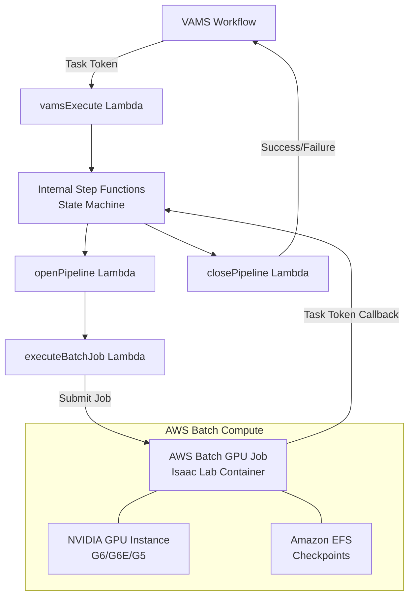

# NVIDIA Isaac Lab Training Pipeline

The NVIDIA Isaac Lab pipeline enables reinforcement learning (RL) policy training and evaluation using [NVIDIA Isaac Lab](https://developer.nvidia.com/isaac/lab) on GPU-accelerated Amazon EC2 instances managed by AWS Batch. It supports two operational modes -- training new RL policies from scratch and evaluating pre-trained policies -- both orchestrated by AWS Step Functions with asynchronous task token callbacks.

:::tip[Learn more]
Read the AWS blog post [GPU-Accelerated Robotic Simulation Training with NVIDIA Isaac Lab in VAMS](https://aws.amazon.com/blogs/physical-ai/gpu-accelerated-robotic-simulation-training-with-nvidia-isaac-lab-in-vams/) for a detailed walkthrough of the pipeline architecture, setup, and usage with example training scenarios.
:::

## Overview

| Property               | Value                                                   |
| ---------------------- | ------------------------------------------------------- |
| **Pipeline IDs**       | `isaaclab-training`, `isaaclab-evaluation`              |
| **Configuration flag** | `app.pipelines.useIsaacLabTraining.enabled`             |
| **Execution type**     | Lambda (asynchronous with callback)                     |
| **Launch**             | Manual only -- neither workflow registers a trigger     |
| **Compute**            | AWS Batch with GPU instances (G6, G6E, G5 families)     |
| **Storage**            | Amazon Elastic File System (Amazon EFS) for checkpoints |
| **Training timeout**   | 8 hours                                                 |
| **Evaluation timeout** | 2 hours                                                 |

## Architecture


The pipeline uses a two-level AWS Step Functions pattern. The VAMS workflow invokes the `vamsExecute` Lambda function, which starts an internal Step Functions state machine. The internal state machine manages the AWS Batch GPU job lifecycle and reports completion back to the VAMS workflow via task tokens.



### AWS infrastructure components

| Component           | Service                                        | Purpose                                                 |
| ------------------- | ---------------------------------------------- | ------------------------------------------------------- |
| Container image     | Amazon Elastic Container Registry (Amazon ECR) | Isaac Lab Docker image built from NVIDIA NGC base       |
| Compute environment | AWS Batch (Amazon EC2)                         | GPU instance management with G6, G6E, G5 instance types |
| Job queue           | AWS Batch                                      | Job scheduling and priority management                  |
| Checkpoint storage  | Amazon EFS                                     | Persistent storage for training checkpoints across jobs |
| Orchestration       | AWS Step Functions                             | Workflow management with error handling                 |
| Monitoring          | Amazon CloudWatch Container Insights           | ECS cluster metrics and logging                         |

## Configuration

Add the following to your `config.json` under `app.pipelines`:

```json
{
    "app": {
        "pipelines": {
            "useIsaacLabTraining": {
                "enabled": true,
                "acceptNvidiaEula": true,
                "useCodeBuild": true,
                "autoRegisterWithVAMS": true,
                "keepWarmInstance": false
            }
        }
    }
}
```

| Option                 | Default | Description                                                                                                                                                                                                                                                                   |
| ---------------------- | ------- | ----------------------------------------------------------------------------------------------------------------------------------------------------------------------------------------------------------------------------------------------------------------------------- |
| `enabled`              | `false` | Enable or disable the pipeline deployment.                                                                                                                                                                                                                                    |
| `acceptNvidiaEula`     | `false` | **Required when enabled.** You must accept the [NVIDIA Software License Agreement](https://docs.nvidia.com/ngc/gpu-cloud/ngc-catalog-user-guide/index.html#ngc-software-license) by setting this to `true`. Deployment fails if this is `false` when the pipeline is enabled. |
| `useCodeBuild`         | `false` | Build the container image via AWS CodeBuild + ECR instead of local Docker. Recommended for the large Isaac Lab GPU image.                                                                                                                                                     |
| `autoRegisterWithVAMS` | `true`  | Automatically register both the `isaaclab-training` and `isaaclab-evaluation` pipelines and workflows with VAMS at deploy time.                                                                                                                                               |
| `keepWarmInstance`     | `false` | When `true`, maintains one warm GPU instance (8 vCPUs for g6.2xlarge) in the AWS Batch compute environment. Reduces cold-start latency at the cost of continuous GPU instance charges.                                                                                        |

:::warning[NVIDIA EULA acceptance required]
The Isaac Lab container is built from the NVIDIA NGC base image. You must review and accept the [NVIDIA Software License Agreement](https://docs.nvidia.com/ngc/gpu-cloud/ngc-catalog-user-guide/index.html#ngc-software-license) before enabling this pipeline. The CDK deployment will fail with a validation error if `acceptNvidiaEula` is not set to `true`.
:::

## Container Build Options

VAMS supports two methods for building the Isaac Lab container:

### CodeBuild (Recommended)

When `useCodeBuild: true`, the container is built in the cloud using AWS CodeBuild:

-   Container source code is uploaded to S3 during CDK deployment
-   CodeBuild builds the Docker image and pushes to ECR
-   The Batch job definition references the ECR image
-   Automatic rebuilds when container source code changes
-   Runs in the same private VPC subnets as the pipeline Batch compute, with NAT Gateway egress for internet access
-   The `acceptNvidiaEula` flag is forwarded to the build as the `ACCEPT_EULA` Docker build argument

**Advantages:**

-   No local Docker build required (avoids building the large Isaac Lab GPU image on developer machines)
-   Faster iteration with high-bandwidth cloud builds
-   Automatic rebuilds on source changes

**Troubleshooting CodeBuild failures:** CodeBuild runs asynchronously after CDK deployment completes. If a container build fails, the CDK deployment itself will succeed but the Batch pipeline will fail with a container image pull error. To check build status:

```bash
# Get the CodeBuild project name from stack outputs
aws cloudformation describe-stacks --stack-name <your-stack-name> --query "Stacks[0].Outputs[?contains(OutputKey,'IsaacLabTrainingCodeBuildProject')].OutputValue" --output text

# Check build status
aws codebuild list-builds-for-project --project-name <project-name>
aws codebuild batch-get-builds --ids <build-id>
```

:::warning[CodeBuild Internet Access]
CodeBuild runs in the same private VPC subnets used by the Isaac Lab pipeline Batch compute environments. These private subnets require a NAT Gateway for internet egress, which is automatically provisioned when the Isaac Lab pipeline is enabled.
:::

### DockerImageAsset (Legacy)

When `useCodeBuild: false`, the container is built locally during CDK deployment using Docker and pushed to a CDK-managed ECR repository. This requires significant local resources and bandwidth.

:::note[The Amazon EFS file system is removed with the stack]
This pipeline's Amazon EFS file system uses a `DESTROY` removal policy, so it is deleted on teardown and
needs no manual step — and its contents are not retained. Training checkpoints written there do not
repopulate themselves, so copy anything you need to keep before tearing the stack down. This pipeline
creates no Amazon S3 model cache bucket of its own. See
[AWS resources](../architecture/aws-resources.md#amazon-efs).
:::

## Prerequisites

-   **GPU instance availability** -- Request quota increases for G6, G6E, or G5 instance families in your deployment region if needed. The compute environment uses `BEST_FIT_PROGRESSIVE` allocation across multiple instance types for optimal availability.
-   **VPC with NAT Gateway** -- The pipeline requires private subnets with internet access (via NAT Gateway) because the Isaac Lab container needs to download NVIDIA Omniverse assets at runtime. Its compute runs in `pipelineNetwork.privateSubnets.pipeline`, which the VPC builder creates as `PRIVATE_WITH_EGRESS`.

:::warning[Air-gapped deployments]
Any Isaac Lab feature that reaches the NVIDIA Omniverse content server needs outbound internet access, so those features do not operate in an air-gapped deployment. Amazon VPC endpoints cover the AWS services the pipeline calls but not the NVIDIA content server. Evaluate the tasks you intend to run before enabling `app.pipelines.useIsaacLabTraining` on an isolated network; configuration validation does not check for egress.
:::
-   **Amazon EFS** -- An Amazon EFS file system is automatically created in isolated subnets for training checkpoint persistence.
-   **Large EBS volume** -- A 100 GB GP3 EBS volume is configured via launch template to accommodate the Isaac Lab container image (10+ GB).

## Training mode

The training mode trains new RL policies from scratch using the RSL-RL, RL Games, or SKRL reinforcement learning libraries.

### Training input parameters

The training configuration is the configuration body of the pipeline template the run uses. Deployment registers the `isaaclab-training-cartpole` template with the body below, whose `{{TAG}}` placeholders are the fields the execute screen renders. A run sets each field there, and the template also permits a per-run body edit for anything the fields do not cover:

```json
{
    "trainingConfig": {
        "mode": "train",
        "task": "{{TASK}}",
        "numEnvs": {{NUM_ENVS}},
        "maxIterations": {{MAX_ITERATIONS}},
        "rlLibrary": "{{RL_LIBRARY}}",
        "seed": "{{SEED}}"
    }
}
```

The **Template tag** column names the execute-form field that supplies each parameter. A row with `--` is fixed by the template body: `mode` is what distinguishes this pipeline from the evaluation one, so it is not operator-settable.

| Parameter                      | Template tag       | Default                      | Description                                                     |
| ------------------------------ | ------------------ | ---------------------------- | --------------------------------------------------------------- |
| `trainingConfig.mode`          | --                 | `"train"`                    | Must be `"train"` for training mode.                            |
| `trainingConfig.task`          | `TASK`             | `"Isaac-Cartpole-Direct-v0"` | The Isaac Lab task environment name.                            |
| `trainingConfig.numEnvs`       | `NUM_ENVS`         | `4096`                       | Number of parallel simulation environments.                     |
| `trainingConfig.maxIterations` | `MAX_ITERATIONS`   | `1500`                       | Maximum training iterations.                                    |
| `trainingConfig.rlLibrary`     | `RL_LIBRARY`       | `"rsl_rl"`                   | RL library to use. Options: `"rsl_rl"`, `"rl_games"`, `"skrl"`. Any other value fails the execution, naming the value and the supported set. The rejection happens in the pipeline's first state, so no GPU node is provisioned and no container image is pulled. |
| `trainingConfig.seed`          | `SEED`             | `null`                       | Optional random seed for reproducibility. Leaving the field blank lets Isaac Lab choose one.  |

### Training output

Training results are uploaded to the VAMS asset bucket under the job UUID prefix:

| Output                   | Format  | Description                                                              |
| ------------------------ | ------- | ------------------------------------------------------------------------ |
| `checkpoints/model_*.pt` | PyTorch | Model checkpoint files saved during training                             |
| `metrics.csv`            | CSV     | Training metrics exported from TensorBoard event files                   |
| `*_git_diff.txt`         | Text    | Configuration diff files (converted from `.diff` for VAMS compatibility) |
| `train-config.json`      | JSON    | Input configuration saved for reference                                  |

## Evaluation mode

The evaluation mode runs a pre-trained policy against the simulation environment and captures metrics and video recordings.

### Evaluation input parameters

The evaluation pipeline requires a template (`systemConfig.requireTemplate` is `true`), so a run cannot start without selecting one. Deployment registers `isaaclab-evaluation-cartpole`, whose configuration body follows this shape, with each `{{TAG}}` placeholder supplied by an execute-form field:

```json
{
    "trainingConfig": {
        "mode": "evaluate",
        "task": "{{TASK}}",
        "numEnvs": {{NUM_ENVS}},
        "numEpisodes": {{NUM_EPISODES}},
        "stepsPerEpisode": {{STEPS_PER_EPISODE}},
        "recordVideo": {{RECORD_VIDEO}},
        "rlLibrary": "{{RL_LIBRARY}}",
        "checkpointPath": "{{CHECKPOINT_PATH}}"
    }
}
```

The **Template tag** column names the execute-form field that supplies each parameter. `mode` is fixed by the template body, because it is what makes this the evaluation pipeline rather than the training one.

| Parameter                        | Template tag        | Default                      | Description                                                                                                                                                                         |
| -------------------------------- | ------------------- | ---------------------------- | ----------------------------------------------------------------------------------------------------------------------------------------------------------------------------------- |
| `trainingConfig.mode`            | --                  | (required)                   | Must be `"evaluate"` for evaluation mode.                                                                                                                                           |
| `trainingConfig.task`            | `TASK`              | `"Isaac-Cartpole-Direct-v0"` | The Isaac Lab task environment name. It must match the task the policy was trained on.                                                                                              |
| `trainingConfig.numEnvs`         | `NUM_ENVS`          | `100`                        | Number of parallel environments for evaluation.                                                                                                                                     |
| `trainingConfig.numEpisodes`     | `NUM_EPISODES`      | `50`                         | Number of evaluation episodes to run.                                                                                                                                               |
| `trainingConfig.stepsPerEpisode` | `STEPS_PER_EPISODE` | `1000`                       | Steps per evaluation episode.                                                                                                                                                       |
| `trainingConfig.recordVideo`     | `RECORD_VIDEO`      | `false`                      | Whether the evaluation video is uploaded to the asset. Recording always happens, because the Isaac Lab play script requires `--video` to terminate; this controls publication only. |
| `trainingConfig.rlLibrary`       | `RL_LIBRARY`        | `"rsl_rl"`                   | RL library the policy was trained with. Selects the Isaac Lab play script, so it must match the library used for training. Options: `"rsl_rl"`, `"rl_games"`, `"skrl"`; any other value fails the execution rather than falling back. |
| `trainingConfig.checkpointPath`  | `CHECKPOINT_PATH`   | `null`                       | Path to the policy file within the asset, for example `checkpoints/model_300.pt`. Leaving the field blank evaluates the `.pt` file found on the asset.                              |
| `trainingConfig.policyS3Uri`     | --                  | `null`                       | Amazon S3 URI to a `.pt` policy file. Operator-supplied, and must name the executing asset's own bucket. Omit it to use `checkpointPath` or auto-discovery.                         |

### Evaluation output

| Output                 | Format | Description                                                          |
| ---------------------- | ------ | -------------------------------------------------------------------- |
| `metrics.csv`          | CSV    | Evaluation metrics from TensorBoard                                  |
| `videos/*.mp4`         | MP4    | Evaluation episode recordings, uploaded when `recordVideo` is `true` |
| `evaluate-config.json` | JSON   | Input configuration saved for reference                              |

## Custom environments

The pipeline supports custom Isaac Lab environments packaged as Python packages. Upload your custom environment package (`.tar.gz`, `.tgz`, `.zip`, or `.whl`) into the asset the execution runs against and reference it in the `trainingConfig` section:

```json
{
    "trainingConfig": {
        "mode": "train",
        "task": "MyCustomTask-v0",
        "customEnvironmentPath": "environments/my-custom-env.tar.gz"
    }
}
```

`customEnvironmentPath` is a path relative to the asset root, which the `openPipeline` Lambda resolves against the executing asset's bucket. `trainingConfig.customEnvironmentS3Uri` accepts a full Amazon S3 URI instead, and must name that same bucket -- a URI pointing anywhere else is rejected in the `openPipeline` state, before any AWS Batch job is submitted, with a message naming the offending bucket. Both keys are read from `trainingConfig`; a value placed at the top level of the configuration is ignored.

:::warning[The package's install code runs in the container]
`pip install` executes the package's build and setup code as root inside the GPU container, which is why the URI is constrained to the executing asset's own bucket. The same constraint applies to `trainingConfig.policyS3Uri`, whose `.pt` file is deserialized by PyTorch.
:::

The container downloads the package at runtime and installs it with `pip install --no-build-isolation <archive>` before starting training or evaluation. `pip install -e` is not used: the editable flag accepts only a local project directory or a version-control URL, never an archive.

## Heartbeat mechanism

Long-running training jobs send periodic heartbeats (every 5 minutes) to both the internal and external AWS Step Functions state machines to prevent timeout. The heartbeat thread runs in the background during the entire training or evaluation process. The internal state machine has a 30-minute heartbeat timeout, so any interruption lasting longer than 30 minutes will cause the job to be marked as failed.

:::tip[Monitoring training progress]
Training progress can be monitored through Amazon CloudWatch Logs for the AWS Batch job. Container Insights is enabled on the ECS cluster for detailed resource utilization metrics.
:::

## Related pages

-   [Pipeline overview](overview.md)
-   [Custom pipelines](custom-pipelines.md)
-   [Deployment configuration](../deployment/configuration-reference.md)
-   [GPU-Accelerated Robotic Simulation Training with NVIDIA Isaac Lab in VAMS](https://aws.amazon.com/blogs/physical-ai/gpu-accelerated-robotic-simulation-training-with-nvidia-isaac-lab-in-vams/) (AWS Blog)
