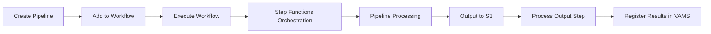
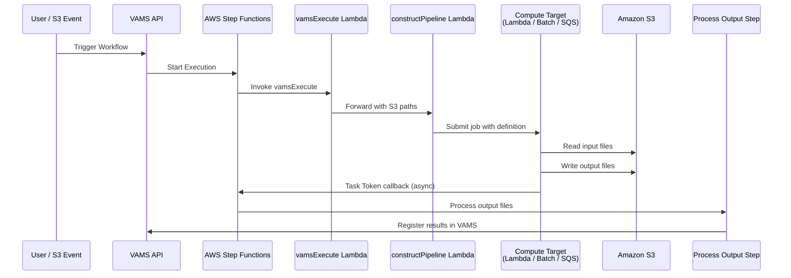

# Pipeline System Overview

VAMS provides a configurable pipeline system for processing visual assets through automated workflows. Pipelines are modular processing steps that transform, analyze, or generate previews from files stored in VAMS. They execute within orchestrated workflows powered by AWS Step Functions and can be triggered manually, via API, or automatically on file upload.

## Core Concepts

### What Are Pipelines?

A pipeline is a registered processing unit that accepts input files from Amazon S3, performs a specific operation (such as format conversion, metadata extraction, or preview generation), and writes output back to Amazon S3. Each pipeline is defined by its execution type, supported file formats, and compute requirements. VAMS ships with several built-in pipelines and also supports registering custom pipelines.

### Pipeline Execution Types

VAMS supports three pipeline execution types, each suited for different processing patterns:

| Execution Type  | Invocation                                                       | Callback                      | Best For                                |
| :-------------- | :--------------------------------------------------------------- | :---------------------------- | :-------------------------------------- |
| **Lambda**      | Synchronous or asynchronous invocation of an AWS Lambda function | Immediate response            | Lightweight operations under 15 minutes |
| **SQS**         | Asynchronous message to an Amazon SQS queue                      | AWS Step Functions Task Token | Decoupled, long-running workloads       |
| **EventBridge** | Asynchronous event to an Amazon EventBridge bus                  | AWS Step Functions Task Token | Event-driven architectures and fan-out  |

:::info[Task Token Callbacks]
SQS and EventBridge pipelines are always asynchronous. They use AWS Step Functions Task Tokens to signal completion back to the orchestrating workflow. The workflow pauses until the pipeline sends a success or failure callback.
:::

### Pipeline Lifecycle

Every pipeline follows a consistent lifecycle from registration through execution:



1. **Create** -- Register a pipeline in VAMS with its execution type, supported formats, and compute target.
2. **Add to Workflow** -- Attach one or more pipelines to a VAMS workflow. Workflows define the execution order and pass data between pipeline steps.
3. **Execute** -- Trigger the workflow manually, via API, or automatically on file upload. AWS Step Functions orchestrates the execution.
4. **Process** -- The pipeline reads input from Amazon S3, performs its operation, and writes output to the designated S3 path.
5. **Output** -- The workflow's process-output step picks up generated files and registers them in VAMS (new files, previews, metadata).

## Pipeline Execution Flow

The following diagram shows how a workflow execution moves through the VAMS pipeline system:



## Built-in Pipelines

VAMS includes the following built-in pipelines, each controlled by a configuration flag in `config.json`:

| Pipeline                                               | Config Flag                              | Description                                   | Supported Formats                                                                                       | Execution Type      | VPC Required |
| :----------------------------------------------------- | :--------------------------------------- | :-------------------------------------------- | :------------------------------------------------------------------------------------------------------ | :------------------ | :----------- |
| [3D Basic Conversion](3d-conversion.md)                | `useConversion3dBasic`                   | Convert 3D mesh files between formats         | STL, OBJ, PLY, GLTF, GLB, 3MF, XAML, 3DXML, DAE, XYZ                                                    | Lambda              | No           |
| [CAD/Mesh Metadata Extraction](cad-mesh-extraction.md) | `useConversionCadMeshMetadataExtraction` | Extract metadata from CAD and mesh files      | STEP, STP, DXF, STL, OBJ, PLY, GLTF, GLB, 3MF, XAML, 3DXML, DAE, XYZ                                    | Lambda              | No           |
| [Potree Point Cloud Viewer](potree-viewer.md)          | `usePreviewPcPotreeViewer`               | Convert point clouds to Potree octree format  | E57, PLY, LAS, LAZ                                                                                      | AWS Batch (Fargate) | Yes          |
| [3D Preview Thumbnail](3d-thumbnail.md)                | `usePreview3dThumbnail`                  | Generate animated GIF/static image previews   | PLY, STL, OBJ, GLB, GLTF, FBX, DRC, LAS, LAZ, E57, PTX, PCD, FLS, FWS, STP, STEP, USD, USDA, USDC, USDZ | AWS Batch (Fargate) | Yes          |
| [Gaussian Splatting](gaussian-splatting.md)            | `useSplatToolbox`                        | Generate 3D Gaussian splats from images/video | ZIP (images), MP4, MOV                                                                                  | AWS Batch (GPU)     | Yes          |
| [GenAI Metadata Labeling](genai-labeling.md)           | `useGenAiMetadata3dLabeling`             | AI-powered metadata labeling for 3D files     | GLB, FBX, OBJ                                                                                           | AWS Batch (Fargate) | Yes          |

## Pipeline Configuration

All built-in pipelines are configured through the CDK deployment configuration file at `infra/config/config.json` under the `app.pipelines` section.

### Common Configuration Options

Every built-in pipeline supports the following configuration options:

| Option                                | Type    | Description                                                                                                                                                                          |
| :------------------------------------ | :------ | :----------------------------------------------------------------------------------------------------------------------------------------------------------------------------------- |
| `enabled`                             | boolean | Whether to deploy this pipeline's infrastructure during CDK deployment.                                                                                                              |
| `autoRegisterWithVAMS`                | boolean | Automatically register the pipeline and its workflow in the global VAMS database during deployment. When enabled, the pipeline is available immediately without manual registration. |
| `autoRegisterAutoTriggerOnFileUpload` | boolean | Automatically trigger the pipeline when matching files are uploaded to VAMS. Requires `autoRegisterWithVAMS` to also be enabled.                                                     |

:::tip[Auto-Registration]
When `autoRegisterWithVAMS` is enabled, the CDK deployment creates a custom resource that invokes the pipeline's registration Lambda function. This registers both the pipeline definition and an associated workflow in the global VAMS database so that users can execute the pipeline immediately after deployment.
:::

### Example Configuration

```json
{
    "app": {
        "pipelines": {
            "useConversion3dBasic": {
                "enabled": true,
                "autoRegisterWithVAMS": true
            },
            "usePreviewPcPotreeViewer": {
                "enabled": true,
                "autoRegisterWithVAMS": true,
                "autoRegisterAutoTriggerOnFileUpload": true
            }
        }
    }
}
```

### VPC Requirements

Pipelines that use AWS Batch (Fargate or GPU) require a VPC. When any VPC-requiring pipeline is enabled, VAMS automatically enables the global VPC configuration (`app.useGlobalVpc.enabled`). The VPC builder creates the necessary subnets, security groups, and VPC endpoints (Amazon ECR, AWS Batch, Amazon ECR Docker) for pipeline operation.

:::warning[VPC Endpoint Costs]
Enabling VPC-required pipelines creates several VPC Interface Endpoints, each of which incurs hourly charges. Review the [Configuration Guide](../deployment/configuration-reference.md) for details on VPC endpoint management.
:::

## Pipeline S3 Output Paths


The workflow orchestrator generates specific S3 paths for each pipeline step. Understanding these paths is important for custom pipeline development and troubleshooting.

| Path Variable                          | Target Bucket    | Purpose                                                         | Versioned |
| :------------------------------------- | :--------------- | :-------------------------------------------------------------- | :-------- |
| `outputS3AssetFilesPath`               | Asset bucket     | File-level outputs: new files, file previews (`.previewFile.*`) | Yes       |
| `outputS3AssetPreviewPath`             | Asset bucket     | Asset-level preview images (whole-asset representative image)   | Yes       |
| `outputS3AssetMetadataPath`            | Asset bucket     | Metadata files produced by the pipeline                         | Yes       |
| `inputOutputS3AssetAuxiliaryFilesPath` | Auxiliary bucket | Temporary working files or special non-versioned viewer data    | No        |

:::note[Output Path Distinction]
`outputS3AssetFilesPath` is for file-level outputs, including `.previewFile.gif/.jpg/.png` thumbnails tied to specific files. `outputS3AssetPreviewPath` is reserved for asset-level preview images that represent the asset as a whole. Most pipelines producing per-file previews write to `outputS3AssetFilesPath`. The auxiliary path is used only for temporary files or special non-versioned data such as Potree octree viewer files.
:::

## Custom Pipelines

In addition to the built-in pipelines, you can register custom pipelines through the VAMS API or web interface. Custom pipelines can use any of the three execution types (Lambda, SQS, EventBridge) and can target any compute resource accessible from your AWS account.

For detailed guidance on creating custom pipelines, see [Custom Pipelines](custom-pipelines.md).
