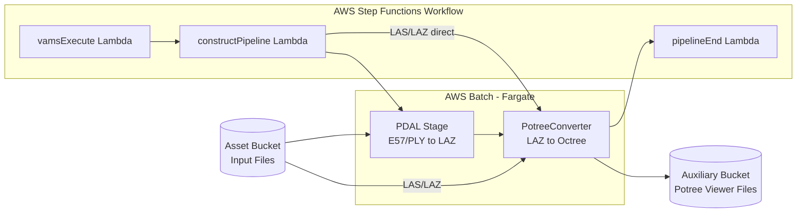

# Potree Point Cloud Viewer Pipeline

The Potree Point Cloud Viewer pipeline converts point cloud files into the Potree octree format, enabling interactive 3D visualization of large point cloud datasets directly in the VAMS web interface. This pipeline uses PDAL (Point Data Abstraction Library) for format translation and the PotreeConverter tool for octree generation, both running inside an AWS Batch Fargate container.

## Supported Formats

| Format | Extension | Notes                                                                                            |
| :----- | :-------- | :----------------------------------------------------------------------------------------------- |
| E57    | `.e57`    | ASTM standard for 3D imaging data. Requires PDAL pre-processing to LAZ before octree conversion. |
| PLY    | `.ply`    | Polygon File Format. Requires PDAL pre-processing to LAZ before octree conversion.               |
| LAS    | `.las`    | ASPRS LiDAR data exchange format. Directly processed by PotreeConverter.                         |
| LAZ    | `.laz`    | Compressed LAS format. Directly processed by PotreeConverter.                                    |

:::info[Two-Stage Processing]
E57 and PLY files require a two-stage pipeline: first, PDAL converts the file to LAZ format, then PotreeConverter generates the octree. LAS and LAZ files skip the PDAL stage and go directly to PotreeConverter.
:::

## Architecture



### Processing Stages

The `constructPipeline` Lambda function inspects the input file extension and builds a pipeline definition with either one or two stages:

-   **E57 and PLY files**: Two stages -- PDAL converts the file to LAZ, then PotreeConverter generates the octree from the intermediate LAZ file.
-   **LAS and LAZ files**: Single stage -- PotreeConverter processes the file directly into the octree format.

### Output Location

Unlike most pipelines, the Potree viewer writes output to the **auxiliary Amazon S3 bucket** rather than the asset bucket. This is because Potree octree files are non-versioned viewer data that the VAMS web frontend reads directly. The output is written to:

```
s3://<auxiliary-bucket>/<assetId>/preview/PotreeViewer/
```

The octree files at this location include `metadata.json`, `hierarchy.bin`, and the octree node files that the Potree web viewer loads on demand.

## Configuration

Enable this pipeline in `infra/config/config.json`:

```json
{
    "app": {
        "pipelines": {
            "usePreviewPcPotreeViewer": {
                "enabled": true,
                "autoRegisterWithVAMS": true,
                "autoRegisterAutoTriggerOnFileUpload": true
            }
        }
    }
}
```

### Configuration Options

| Option                                | Default | Description                                                                                                                      |
| :------------------------------------ | :------ | :------------------------------------------------------------------------------------------------------------------------------- |
| `enabled`                             | `false` | Deploy the Potree viewer pipeline infrastructure. Enables the global VPC.                                                        |
| `autoRegisterWithVAMS`                | `false` | Automatically register the pipeline and workflow in the global VAMS database during CDK deployment.                              |
| `autoRegisterAutoTriggerOnFileUpload` | `true`  | Automatically trigger the pipeline when E57, PLY, LAS, or LAZ files are uploaded. Requires `autoRegisterWithVAMS` to be enabled. |

## Prerequisites

### VPC with Internet Access

This pipeline runs on AWS Batch with AWS Fargate compute. Enabling it automatically sets `app.useGlobalVpc.enabled` to `true`. The VPC builder creates the required VPC endpoints for AWS Batch, Amazon ECR, and Amazon ECR Docker so that the Fargate container can pull its image.

### Container Image

The pipeline container image is built from the Dockerfile located at `backendPipelines/preview/pcPotreeViewer/container/Dockerfile` during CDK deployment and stored in Amazon ECR. The container includes:

-   **PDAL** -- Point Data Abstraction Library for format translation
-   **PotreeConverter** -- Generates the octree structure for web-based viewing

:::warning[License Notice]
This pipeline uses a third-party open-source library with a GPL license. Refer to your legal team before enabling this pipeline in production. See the NOTICE file in the pipeline directory for details.
:::

## How It Works

1. A workflow execution triggers the `vamsExecute` Lambda function, which receives the input file path and Amazon S3 output paths from the workflow state.
2. The `constructPipeline` Lambda function inspects the file extension and builds a stage definition targeting either PDAL + Potree (for E57/PLY) or Potree only (for LAS/LAZ).
3. AWS Batch submits an AWS Fargate job with the pipeline definition. The container downloads the input file from Amazon S3, runs the appropriate processing stages, and uploads the resulting octree files to the auxiliary bucket.
4. Upon completion, AWS Step Functions receives a task token callback, and the `pipelineEnd` Lambda function finalizes the workflow execution.
5. The VAMS web frontend detects the Potree viewer data in the auxiliary bucket and renders the point cloud using the built-in Potree viewer plugin.

## Infrastructure Components

The following AWS resources are created when this pipeline is enabled:

| Resource                     | Service            | Purpose                                                                                       |
| :--------------------------- | :----------------- | :-------------------------------------------------------------------------------------------- |
| Fargate Compute Environment  | AWS Batch          | Serverless container execution                                                                |
| Job Queue                    | AWS Batch          | Job scheduling and prioritization                                                             |
| Job Definition               | AWS Batch          | Container configuration and resource limits                                                   |
| Container Image              | Amazon ECR         | PDAL + PotreeConverter container                                                              |
| Step Functions State Machine | AWS Step Functions | Workflow orchestration                                                                        |
| Lambda Functions (5)         | AWS Lambda         | Pipeline coordination (vamsExecute, constructPipeline, openPipeline, sqsExecute, pipelineEnd) |
| SQS Queue                    | Amazon SQS         | Event-driven pipeline triggering                                                              |

## Related Resources

-   [Pipeline System Overview](overview.md)
-   [3D Preview Thumbnail Pipeline](3d-thumbnail.md) -- generates static and animated previews for point clouds and other 3D formats
    
