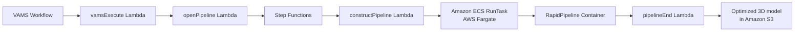

# RapidPipeline 3D Processor

The RapidPipeline pipeline integrates the DGG RapidPipeline 3D processing engine for automated 3D model optimization and format conversion. It is a licensed third-party product that runs as a container on Amazon Elastic Container Service (Amazon ECS) with AWS Fargate or on Amazon Elastic Kubernetes Service (Amazon EKS). RapidPipeline provides polygon reduction, texture optimization, and format conversion capabilities for production 3D workflows.

## Overview

| Property | Value |
|---|---|
| **Pipeline IDs** | `rapid-pipeline-to-glb`, `rapid-pipeline-to-gltf` |
| **Configuration flag** | `app.pipelines.useRapidPipeline.useEcs.enabled` or `app.pipelines.useRapidPipeline.useEks.enabled` |
| **Execution type** | Lambda (asynchronous with callback) |
| **Compute (ECS)** | Amazon ECS on AWS Fargate (2 vCPU, 16 GB memory) |
| **Compute (EKS)** | Amazon EKS with Kubernetes |
| **Supported input formats** | `.glb`, `.gltf`, `.fbx`, `.obj`, `.stl`, `.ply`, `.usd`, `.usdz`, `.dae`, `.abc` |
| **Supported output formats** | `.glb`, `.gltf` |
| **Timeout** | 5 hours |

:::warning[Licensed product]
RapidPipeline is a commercial product by DGG that requires a valid subscription. The container image must be obtained through AWS Marketplace or provided as a private Amazon ECR image URI. Contact DGG for licensing information.
:::


## Architecture

### Amazon ECS on AWS Fargate deployment

The ECS deployment runs the RapidPipeline container as an AWS Fargate task orchestrated by AWS Step Functions. This is the recommended deployment model for most use cases.



### Amazon EKS deployment

The EKS deployment runs the RapidPipeline container on a Kubernetes cluster. This option is suitable for organizations that already operate Kubernetes infrastructure or need more control over compute resource management. The EKS pattern also serves as a reference implementation for building other Kubernetes-based pipelines in VAMS.

## Configuration

### Amazon ECS on AWS Fargate mode

```json
{
  "app": {
    "pipelines": {
      "useRapidPipeline": {
        "useEcs": {
          "enabled": true,
          "ecrContainerImageURI": "your-ecr-image-uri",
          "autoRegisterWithVAMS": true
        }
      }
    }
  }
}
```

| Option | Default | Description |
|---|---|---|
| `useEcs.enabled` | `false` | Enable the Amazon ECS on AWS Fargate deployment. |
| `useEcs.ecrContainerImageURI` | (required) | The Amazon ECR container image URI for the RapidPipeline container. Obtained from AWS Marketplace or your private registry. |
| `useEcs.autoRegisterWithVAMS` | `true` | Automatically register conversion pipelines and workflows with VAMS at deploy time. |

### Amazon EKS mode

```json
{
  "app": {
    "pipelines": {
      "useRapidPipeline": {
        "useEks": {
          "enabled": true,
          "ecrContainerImageURI": "your-ecr-image-uri",
          "eksCluster": {
            "roleArn": "arn:aws:iam::123456789012:role/eks-cluster-role",
            "kubectlRoleArn": "arn:aws:iam::123456789012:role/eks-kubectl-role"
          }
        }
      }
    }
  }
}
```

| Option | Default | Description |
|---|---|---|
| `useEks.enabled` | `false` | Enable the Amazon EKS deployment. |
| `useEks.ecrContainerImageURI` | (required) | The Amazon ECR container image URI for the RapidPipeline container. |
| `useEks.eksCluster.roleArn` | (required) | The IAM role ARN for the Amazon EKS cluster. |
| `useEks.eksCluster.kubectlRoleArn` | (required) | The IAM role ARN with `kubectl` permissions for managing the cluster. |

:::note[Choose one deployment mode]
Enable either `useEcs` or `useEks`, not both. The ECS mode is simpler to operate and recommended for most deployments. The EKS mode provides a Kubernetes-based pipeline pattern that can be adapted for other container workloads.
:::


## Prerequisites

- **RapidPipeline license** -- A valid DGG RapidPipeline subscription is required. The container image is available through AWS Marketplace.
- **Internet access** -- The container requires internet access to communicate with the AWS Marketplace metering API. The ECS cluster runs in private subnets with a NAT Gateway for egress.
- **VPC with private subnets** -- Both ECS and EKS modes require private subnets with internet egress. When using an external VPC, you must provide private subnet IDs in the VPC configuration.
- **Container image** -- The `ecrContainerImageURI` must point to a valid container image accessible from your AWS account.

## Registered workflows

When `autoRegisterWithVAMS` is `true`, the following pipelines and workflows are automatically registered at deploy time:

| Pipeline ID | Output format | Description |
|---|---|---|
| `rapid-pipeline-to-glb` | `.glb` | Optimize and convert 3D models to GLB (GL Transmission Format Binary) |
| `rapid-pipeline-to-gltf` | `.gltf` | Optimize and convert 3D models to GLTF (GL Transmission Format) |

All registered pipelines accept any supported input file format (`.all`) and operate as asynchronous pipelines with callback enabled.

## AWS Marketplace integration

The RapidPipeline container integrates with AWS Marketplace for usage tracking. The container IAM roles include permissions for `aws-marketplace:RegisterUsage` and `aws-marketplace:MeterUsage` to enable metered billing. Ensure that the AWS Marketplace subscription is active in the deployment account before running the pipeline.

## How it works

1. **Trigger** -- The VAMS workflow triggers the `vamsExecute` Lambda function with the input file path and desired output format.
2. **Pipeline construction** -- The `constructPipeline` Lambda builds the pipeline definition including input/output Amazon S3 paths and container commands.
3. **Container execution** -- The RapidPipeline container downloads the input file from Amazon S3, processes it (optimization, conversion), and uploads the result to the output Amazon S3 path.
4. **Completion** -- The `pipelineEnd` Lambda closes the pipeline and sends the callback to the VAMS workflow with success or failure status.

## Related pages

- [Pipeline overview](overview.md)
- [ModelOps pipeline](model-ops.md)
- [Custom pipelines](custom-pipelines.md)
- [Deployment configuration](../deployment/configuration-reference.md)
