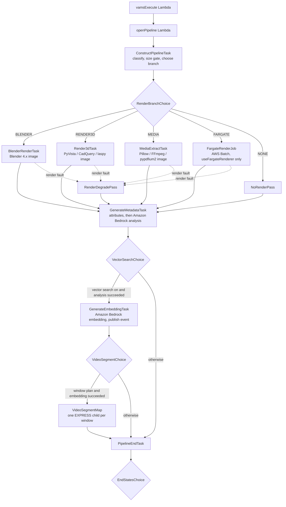

# SYSTEM - GenAI Metadata Generation Pipeline

The SYSTEM GenAI metadata pipeline analyzes every file type VAMS has a viewer for and writes what it learns back onto the file: structured attributes extracted from the file itself, and descriptive metadata generated by an Amazon Bedrock model from renders, keyframes, extracted text, and the existing metadata on the file, its asset, and its database. When [vector search](../concepts/vector-search.md) is enabled, it also produces one embedding per file version — plus one per video window or content chunk — and publishes them for the vector indexer. It is a [system pipeline](system-pipelines.md): it ships with the deployment, is read-only through the API except for its pause switches and template content, and runs automatically on file upload.

| Item                | Value                                                                                                                                                                                                                           |
| ------------------- | ------------------------------------------------------------------------------------------------------------------------------------------------------------------------------------------------------------------------------- |
| Pipeline id         | `system-genai-metadata` (workflow id identical, database `GLOBAL`)                                                                                                                                                              |
| Pipeline name       | `SYSTEM - GenAI Metadata Generation`                                                                                                                                                                                            |
| Category            | `SYSTEM - GenAI`                                                                                                                                                                                                                |
| Configuration block | `app.pipelines.useSystemGenAiMetadata`                                                                                                                                                                                          |
| Execution type      | Lambda with an AWS Step Functions task-token callback (`taskTimeout` 18,000 seconds)                                                                                                                                            |
| Input               | One file per execution; every viewer-supported extension plus `.docx`, `.pptx`, and `.xlsx`                                                                                                                                     |
| Compute             | AWS Lambda — zip functions and three container images (Blender renderer, 3D renderer, media extractor); an optional AWS Batch (Fargate) renderer behind `useFargateRenderer`                                                    |
| VPC required        | No. `useFargateRenderer: true` is the only setting that requires `app.useGlobalVpc.enabled`                                                                                                                                     |
| Models              | Analysis: `bedrockAnalysisModelId` (Claude Haiku 4.5 in the commercial template; Claude Sonnet 4.5 in GovCloud). Embeddings: `app.vectorSearch.embeddingModelId` (Amazon Titan Text Embeddings V2, 1024 dimensions, by default) |
| Concurrency         | `perInputFileVersion` — a second execution over the same file version is rejected while one is running; a newer version runs concurrently                                                                                       |

## How it works



1. The workflow invokes `vamsExecute`, which resolves the input file, output prefixes, asset identity, and file version from the execution manifest and hands them to `openPipeline`.
2. `openPipeline` checks the extension against the allow list, starts the sub-state-machine, and registers the sub-execution and its log group with VAMS so the execution detail page can show and abort it.
3. `ConstructPipelineTask` classifies the file into a `fileClass`, applies the size gates, and chooses a render branch. For a file no library can read (`NONE`) it writes the analysis manifest itself.
4. The branch task downloads the file to the function's `/tmp`, extracts attributes, and renders stills or keyframes. A render fault routes through `RenderDegradePass` to `GenerateMetadataTask`, which records the render as skipped (`renderSkipped: "error"`) and continues attributes-only — a render failure never fails the execution.
5. `GenerateMetadataTask` writes the file's attributes first, promotes the typed `ext_*` metadata and the GeoJSON `location` from them, then calls the analysis model with the renders, text excerpt, attributes, asset context, the existing metadata when `SEED_WITH_EXISTING_METADATA` is `true`, and the classification vocabulary, and writes the file's metadata.
6. When vector search is enabled and the analysis succeeded, `GenerateEmbeddingTask` composes the embedding text, calls the embeddings model, writes the embedding document, and publishes `vector.embedding.ready` — and, for document, text, and data files with `CONTENT_CHUNKING` on, one more document and event per [content chunk](#content-chunks).
7. When the media branch produced a window plan (a video with `VIDEO_SEGMENT_SECONDS` above 0) and the embedding succeeded, `VideoSegmentMap` runs one child execution per [video window](#video-windows) — `SegmentAnalyzeTask`, the media image's second function — eight at a time, and writes its own result manifest under the execution's auxiliary prefix.
8. `PipelineEndTask` reports success or failure to the workflow through the task token. The workflow's process-output step then applies the metadata and attribute files to the asset.

The file-upload trigger fires on a **new** version of a file: an upload, a direct Amazon S3 write, a copy, move, or rename into the asset, a revert to an earlier version, and — when the workflow allows trigger chaining — another workflow's output. It does not fire when a file or an asset is **unarchived**: the restore copies the file's newest content version forward under a new version id, the pipeline has already analyzed that content, and its metadata, attributes, and vectors stay as they were (the vector indexer marks them live again without re-embedding; see [Vector search](../concepts/vector-search.md#only-the-latest-live-version-is-searchable)). To analyze a restored file again, re-execute the workflow on it or run the vector reindexer.

<!-- TODO(owner): diagram: pipeline_usecase_systemGenAiMetadata.png — pipeline use-case diagram (branches, images, Bedrock calls, event to the vector indexer), exported to documentation/diagrams/ and static/img/ -->

## Supported files and how each is analyzed

The pipeline accepts every extension that a viewer in the deployment's viewer catalog supports (see [File Viewers](../concepts/viewers.md)) plus the three office formats marked ‡ below; the pipeline, workflow, and trigger allow lists are identical and finite. The `fileClass` decides the branch, the attributes written, and what the analysis model receives.

| `fileClass`  | Extensions                                                                                                                                                                    | Branch                                                    | Attributes written                                                        | Analysis input                                                                                                                                 |
| ------------ | ----------------------------------------------------------------------------------------------------------------------------------------------------------------------------- | --------------------------------------------------------- | ------------------------------------------------------------------------- | ---------------------------------------------------------------------------------------------------------------------------------------------- |
| `image`      | `.png .jpg .jpeg .gif .webp`; `.svg`                                                                                                                                          | MEDIA                                                     | `sys_image`, `sys_file`                                                   | The image (resized to at most 1568 px); SVG: the SVG text                                                                                      |
| `video`      | `.mp4 .webm .mov .avi .mkv .flv .wmv .m4v`                                                                                                                                    | MEDIA                                                     | `sys_media` (duration, resolution, codecs, frame rate, rotation, bitrate) | Four evenly spaced keyframes; with `VIDEO_SEGMENT_SECONDS` above 0, one analysis per time window as well (see [Video windows](#video-windows)) |
| `audio`      | `.mp3 .wav .ogg .aac .flac .m4a`                                                                                                                                              | MEDIA                                                     | `sys_media` (duration, tags, codec)                                       | Tag text                                                                                                                                       |
| `document`   | `.pdf`                                                                                                                                                                        | MEDIA                                                     | `sys_document` (pages, title, author, has text)                           | Text excerpt and the first two pages rasterized; the full text is captured for [content chunks](#content-chunks)                               |
| `document` ‡ | `.docx .pptx`                                                                                                                                                                 | MEDIA                                                     | `sys_document` (pages or slides, words, title, author, created, has text) | Text excerpt; the full text is captured for content chunks — nothing is rasterized                                                             |
| `text`       | `.txt .md .json .xml .yaml .yml .toml .ini .cfg .inf .log .py .js .ts .sql .sh .ps1 .ipynb .html .htm`                                                                        | MEDIA                                                     | `sys_text` (encoding, lines, words, language guess)                       | Text excerpt; the full text is captured for content chunks                                                                                     |
| `data`       | `.csv .fcs`                                                                                                                                                                   | MEDIA                                                     | `sys_data` (columns, row count, sample rows)                              | Header and sample rows; the full text is captured for content chunks                                                                           |
| `data` ‡     | `.xlsx`                                                                                                                                                                       | MEDIA                                                     | `sys_data` (sheets, rows, columns of the first sheet)                     | Header and sample rows; the full text of every sheet is captured for content chunks                                                            |
| `data`       | `.json` whose root is a GeoJSON `Geometry`, `Feature`, or `FeatureCollection` (detected while reading it as text)                                                             | MEDIA                                                     | `sys_geo` (feature count, geometry types, footprint)                      | Attribute text                                                                                                                                 |
| `tiles3d`    | `.json` whose root carries `asset` and `geometricError`                                                                                                                       | MEDIA                                                     | `sys_tiles3d` (geometric error, bounding volume, tile count)              | Attribute text                                                                                                                                 |
| `mesh`       | `.glb .gltf .fbx .obj .dae .abc .blend .stl .ply` (mesh)                                                                                                                      | BLENDER                                                   | `sys_geometry`, `sys_statistics`, `sys_format`, `sys_visual`, `sys_scene` | Six orthographic and two perspective renders                                                                                                   |
| `mesh`       | `.3ds .3mf .wrl .off .amf .3dm .bim .drc`                                                                                                                                     | RENDER3D where a loader exists; otherwise attributes only | As above where loadable; otherwise `sys_file`                             | Renders where produced                                                                                                                         |
| `usd`        | `.usd .usda .usdc .usdz`                                                                                                                                                      | BLENDER (RENDER3D fallback)                               | `sys_geometry`, `sys_scene`                                               | Renders                                                                                                                                        |
| `cad`        | `.stp .step .iges .igs .brep`                                                                                                                                                 | RENDER3D                                                  | `sys_geometry`, `sys_statistics`, `sys_cad`                               | Four stills                                                                                                                                    |
| `cad`        | `.dxf`                                                                                                                                                                        | RENDER3D, attributes only                                 | `sys_geometry` (2D), `sys_cad` (entity counts)                            | Attribute text                                                                                                                                 |
| `cad`        | `.asm .catpart .catproduct .iam .ipt .jt .par .prt .sldasm .sldprt .x_b .x_t`                                                                                                 | NONE                                                      | `sys_file`                                                                | File name and asset context                                                                                                                    |
| `pointcloud` | `.las .laz .e57 .pcd .ptx .xyz`                                                                                                                                               | RENDER3D (streamed, capped by `maxPointCloudPoints`)      | `sys_pointcloud` (points, bounds, colour, header fields)                  | Four stills                                                                                                                                    |
| `splat`      | `.spz .sog .splat .lcc .ply` (splat)                                                                                                                                          | RENDER3D, attributes only                                 | `sys_file`, `sys_pointcloud` (header)                                     | Attribute text                                                                                                                                 |
| `ifc`        | `.ifc .ifczip`                                                                                                                                                                | RENDER3D, attributes only                                 | `sys_ifc` (schema, project, entity counts)                                | Attribute text                                                                                                                                 |
| `other`      | Not an allow-list entry: a listed extension whose loader fails (a `.ply` that is neither mesh, splat, nor point cloud; a `.json` that is neither 3D Tiles nor decodable text) | NONE                                                      | `sys_file`                                                                | File name and asset context                                                                                                                    |

`.ply` is disambiguated by loading it: faces make it a mesh, `f_dc_0` properties make it a splat, anything else is a point cloud. `sys_file` (`name`, `ext`, `sizeBytes`, `contentType`, `etag`, `versionId`, and `sha256` for files up to 512 MB) is written for every file.

‡ Office formats no viewer renders. They are allow-listed through the classifier's `ADDITIONAL_EXTENSIONS` for their text: `.docx` (paragraphs and table cells, in order) and `.pptx` (slide text and notes, one page per slide) are classified `document`, `.xlsx` (per sheet, the header row then tab-separated rows, one page per sheet) is classified `data`; spreadsheet row counts are taken up to 200,000 rows per sheet, so a larger sheet's `ext_row_count` is that floor. They receive attributes and generated metadata from the text alone and are never rendered.

:::note[Proprietary CAD formats]
The Physna add-on's proprietary CAD extensions are allow-listed so that every viewable file is covered, but no open library reads them. They receive `sys_file` attributes and metadata generated from the file name and the asset's own metadata.
:::

### Size gates and the Fargate renderer

`lambdaLimits.maxInputFileSizeMb` (default 2048) and `lambdaLimits.maxPointCloudPoints` (default 20,000,000, checked from the file header) bound what a Lambda render attempts. A file above either limit is processed attributes-only, with the skip recorded in the analysis manifest, in `genai_source_modalities`, and in `analysis-summary.json`. With `useFargateRenderer: true`, those files instead take the `FARGATE` branch — an AWS Batch job running the same 3D renderer image with a four-hour attempt limit — which requires `app.useGlobalVpc.enabled` and adds the AWS Batch, Amazon ECR API, and Amazon ECR Docker interface endpoints. Every shipped configuration template leaves the sub-flag off. The job's container output goes to the pipeline's own `/aws/vendedlogs/Pipelines/SystemGenAiMetadataRender<hash>` log group (KMS-encrypted, one-year retention), which `openPipeline` registers as the `FargateRenderJob` stage's log source so the execution log view can read it, and the state machine can describe and terminate the job when an execution is stopped. See [Pipeline log groups](../architecture/aws-resources.md#pipeline-log-groups-per-enabled-pipeline).

## Outputs

The pipeline writes two layers per file to the execution's metadata output prefix, and the workflow's process-output step applies the files to the asset as `SYSTEM_USER`.

**File attributes** — `<relativePath>.attribute.json`: the complete technical record, one `sys_*` key per attribute group, each value a JSON string (file attributes are string-typed). Attributes are written before the analysis model is called, so they land even when the model call fails.

**File metadata** — `<relativePath>.metadata.json` (`updateType: update`): a typed, deterministic promotion of the attributes under the `ext_*` prefix, a GeoJSON `location` when the file has none, and the `genai_*` block the analysis model produces. Every `ext_*` and `genai_*` key is pipeline-owned and rewritten on each run; keys you author yourself are untouched because `replace_all` is never used. A promoted key whose source disappears in a later file version (a re-export without textures, for example) keeps its previous value until the next run writes it. List-valued keys are written as `string` rather than `inline_controlled_list` because the web interface's inline controlled list field holds a single value. Every key, its type, and its source are catalogued in [Fields written](#fields-written).

**Asset metadata** — `asset.metadata.json` (`updateType: update`) with `genai_asset_keywords` (the union of the asset's file keywords) and `genai_asset_categories` (the distinct file categories), both `string` joined with `", "`, is written only when the template tag `WRITE_ASSET_KEYWORDS` is `true`.

**Results** — written to the execution's results prefix and recorded on the execution as results rows: `analysis-summary.json` (model ids, token usage, modalities, skips, vocabulary corrections, the number of promoted fields, whether the guardrail's PII filter masked entities and which types — `guardrailMasked`, `guardrailMaskedTypes` — and an `existingMetadata` block — how many existing-metadata lines were kept, how many the budget dropped, and whether the analysis prompt was seeded with them) always, and `execution.status.json` when a Bedrock call failed (see [Failure behaviour](#failure-behaviour)). With video windows, one `segments/<segmentKey>.json` per window (its description, keywords, objects, actions, on-screen text, label, and time range) and, beside it, `segments/<segmentKey>.failed.json` for a window whose model call failed or from which no frame could be read; the map's own result manifest is written under the execution's auxiliary prefix (`segments/results/`), not here. `execution.status.json` is a reserved results file name for every pipeline; see [Building custom pipelines](custom-pipelines.md).

## Fields written

The three tables below are the complete list of keys the pipeline writes. One prefix identifies each layer — `sys_*` for attributes, `ext_*` for metadata promoted from them, `genai_*` for metadata the model generates — so the fields are easy to recognise on the file's **Metadata** tab, in search columns, and in a metadata schema. A file has one class, so a key such as `ext_width` is never ambiguous within a file.

### Attribute groups

Attributes are string-valued JSON documents. A group is written when its class applies and the extractor could read the file; `sys_file` is written for every file.

| Group            | What it holds                                                                                                                                                               | Classes                                                                                  |
| ---------------- | --------------------------------------------------------------------------------------------------------------------------------------------------------------------------- | ---------------------------------------------------------------------------------------- |
| `sys_file`       | `name`, `ext`, `sizeBytes`, `contentType`, `etag`, `versionId`, `sha256` (files up to 512 MB)                                                                               | every class                                                                              |
| `sys_image`      | `width`, `height`, `mode`, `exif` (`make`, `model`, `dateTimeOriginal`, and `gps` with `latitude`, `longitude`, `altitude` — `gps` only when `EXTRACT_GEO_LOCATION` is on)  | `image`                                                                                  |
| `sys_media`      | `kind`, `durationSeconds`, `width`, `height`, `frameRate`, `videoCodec`, `audioCodec`, `bitrateKbps`, `channels`, `sampleRate`, `tags` (`title`, `artist`, `album`, `year`) | `video`, `audio`                                                                         |
| `sys_document`   | `pageCount`, `title`, `author`, `createdAt`, `hasText`                                                                                                                      | `document`                                                                               |
| `sys_text`       | `encoding`, `lineCount`, `wordCount`, `language`                                                                                                                            | `text`                                                                                   |
| `sys_data`       | `columnCount`, `rowCount`, `columns`, sample rows                                                                                                                           | `data`                                                                                   |
| `sys_geo`        | `featureCount`, `geometryTypes`, `footprint` (a GeoJSON geometry)                                                                                                           | `data` — a `.json` whose root is a GeoJSON `Geometry`, `Feature`, or `FeatureCollection` |
| `sys_tiles3d`    | `geometricError`, `tileCount`, `region` (`[west, south, east, north, minHeight, maxHeight]`)                                                                                | `tiles3d`                                                                                |
| `sys_geometry`   | `boundsMin`, `boundsMax`, `dimensions` (`width`, `height`, `depth`), `extentMax`, `volume`, `surfaceArea`, `units` (`m`, `mm`, `cm`, `in`, or `ft`; absent when unknown)    | `mesh`, `usd`, `cad`                                                                     |
| `sys_statistics` | `meshCount`, `vertices`, `faces`, `triangles`, `watertight`                                                                                                                 | `mesh`, `cad`                                                                            |
| `sys_format`     | Format facts reported by the mesh loader; not promoted to metadata                                                                                                          | `mesh`                                                                                   |
| `sys_visual`     | `materialCount`, `textureCount`, `hasUv`, `hasVertexColors`                                                                                                                 | `mesh`                                                                                   |
| `sys_scene`      | `nodeCount`, `hasAnimation`, `hasArmature`                                                                                                                                  | `mesh`, `usd`                                                                            |
| `sys_cad`        | `solidCount`, `faceCount`, `edgeCount`, `assemblyCount`, `declaredUnits`, `estimatedUnits`                                                                                  | `cad`                                                                                    |
| `sys_pointcloud` | `pointCount`, `hasColor`, `boundsMin`, `boundsMax`, `crs` (`epsg`, `name`, `geographic`)                                                                                    | `pointcloud`, `splat`                                                                    |
| `sys_ifc`        | `schema`, `projectName`, `storeyCount`, `elementCount`, `site` (`latitude`, `longitude`, `elevation`)                                                                       | `ifc`                                                                                    |

### Promoted metadata

When the template tag `WRITE_EXTRACTED_METADATA` is `true` (the default), the pipeline maps the attributes to typed metadata through a fixed catalogue, with no model involved. A field is written only when its source is present and non-null. Numbers become `number`, flags `boolean`, timestamps `date` (ISO 8601), triples `xyz` (`{"x", "y", "z"}`), and lists `string` joined with `", "`. Where a key has two sources, the first one present wins.

| Key                     | Type      | Source                                                                                                                                                                                     | Classes                                                  |
| ----------------------- | --------- | ------------------------------------------------------------------------------------------------------------------------------------------------------------------------------------------ | -------------------------------------------------------- |
| `ext_dimensions`        | `xyz`     | `sys_geometry.dimensions`                                                                                                                                                                  | `mesh`, `usd`, `cad`, `splat`, `ifc`                     |
| `ext_bounds_min`        | `xyz`     | `sys_geometry.boundsMin`; `sys_pointcloud.boundsMin`                                                                                                                                       | `mesh`, `usd`, `cad`, `splat`, `ifc`, `pointcloud`       |
| `ext_bounds_max`        | `xyz`     | `sys_geometry.boundsMax`; `sys_pointcloud.boundsMax`                                                                                                                                       | `mesh`, `usd`, `cad`, `splat`, `ifc`, `pointcloud`       |
| `ext_units`             | `string`  | `sys_geometry.units`; `sys_cad.declaredUnits`; `sys_cad.estimatedUnits` — omitted when none is known                                                                                       | `mesh`, `usd`, `cad`, `splat`, `ifc`                     |
| `ext_extent_max`        | `number`  | `sys_geometry.extentMax`                                                                                                                                                                   | `mesh`, `usd`, `cad`, `splat`, `ifc`                     |
| `ext_volume`            | `number`  | `sys_geometry.volume`                                                                                                                                                                      | `mesh`, `usd`, `cad`, `splat`, `ifc`                     |
| `ext_surface_area`      | `number`  | `sys_geometry.surfaceArea`                                                                                                                                                                 | `mesh`, `usd`, `cad`, `splat`, `ifc`                     |
| `ext_size_category`     | `string`  | `sys_geometry.extentMax` converted to metres with `ext_units`, only when the units are known: `tiny` (under 0.3 m), `small` (under 1 m), `medium` (under 2 m), `large` (under 5 m), `huge` | `mesh`, `usd`, `cad`, `splat`, `ifc`                     |
| `ext_vertex_count`      | `number`  | `sys_statistics.vertices`                                                                                                                                                                  | `mesh`, `usd`, `cad`, `splat`, `ifc`                     |
| `ext_face_count`        | `number`  | `sys_statistics.faces`; `sys_cad.faceCount`                                                                                                                                                | `mesh`, `usd`, `cad`, `splat`, `ifc`                     |
| `ext_triangle_count`    | `number`  | `sys_statistics.triangles`                                                                                                                                                                 | `mesh`, `usd`, `cad`, `splat`, `ifc`                     |
| `ext_mesh_count`        | `number`  | `sys_statistics.meshCount`                                                                                                                                                                 | `mesh`, `usd`, `cad`, `splat`, `ifc`                     |
| `ext_watertight`        | `boolean` | `sys_statistics.watertight`                                                                                                                                                                | `mesh`, `usd`, `cad`, `splat`, `ifc`                     |
| `ext_material_count`    | `number`  | `sys_visual.materialCount`                                                                                                                                                                 | `mesh`, `usd`, `cad`, `splat`, `ifc`                     |
| `ext_texture_count`     | `number`  | `sys_visual.textureCount`                                                                                                                                                                  | `mesh`, `usd`, `cad`, `splat`, `ifc`                     |
| `ext_has_textures`      | `boolean` | `sys_visual.textureCount` greater than 0                                                                                                                                                   | `mesh`, `usd`, `cad`, `splat`, `ifc`                     |
| `ext_has_uv`            | `boolean` | `sys_visual.hasUv`                                                                                                                                                                         | `mesh`, `usd`, `cad`, `splat`, `ifc`                     |
| `ext_has_vertex_colors` | `boolean` | `sys_visual.hasVertexColors`                                                                                                                                                               | `mesh`, `usd`, `cad`, `splat`, `ifc`                     |
| `ext_object_count`      | `number`  | `sys_scene.nodeCount`                                                                                                                                                                      | `mesh`, `usd`, `cad`, `splat`, `ifc`                     |
| `ext_has_animation`     | `boolean` | `sys_scene.hasAnimation`                                                                                                                                                                   | `mesh`, `usd`, `cad`, `splat`, `ifc`                     |
| `ext_has_armature`      | `boolean` | `sys_scene.hasArmature`                                                                                                                                                                    | `mesh`, `usd`, `cad`, `splat`, `ifc`                     |
| `ext_solid_count`       | `number`  | `sys_cad.solidCount`                                                                                                                                                                       | `cad`                                                    |
| `ext_edge_count`        | `number`  | `sys_cad.edgeCount`                                                                                                                                                                        | `cad`                                                    |
| `ext_assembly_count`    | `number`  | `sys_cad.assemblyCount`                                                                                                                                                                    | `cad`                                                    |
| `ext_point_count`       | `number`  | `sys_pointcloud.pointCount`                                                                                                                                                                | `pointcloud`, `splat`                                    |
| `ext_has_color`         | `boolean` | `sys_pointcloud.hasColor`                                                                                                                                                                  | `pointcloud`, `splat`                                    |
| `ext_crs`               | `string`  | `sys_pointcloud.crs` — `EPSG:<code>` when the code is known, otherwise the CRS name                                                                                                        | `pointcloud`, `splat`                                    |
| `ext_ifc_schema`        | `string`  | `sys_ifc.schema`                                                                                                                                                                           | `ifc`                                                    |
| `ext_project_name`      | `string`  | `sys_ifc.projectName`                                                                                                                                                                      | `ifc`                                                    |
| `ext_storey_count`      | `number`  | `sys_ifc.storeyCount`                                                                                                                                                                      | `ifc`                                                    |
| `ext_element_count`     | `number`  | `sys_ifc.elementCount`                                                                                                                                                                     | `ifc`                                                    |
| `ext_geometric_error`   | `number`  | `sys_tiles3d.geometricError`                                                                                                                                                               | `tiles3d`                                                |
| `ext_tile_count`        | `number`  | `sys_tiles3d.tileCount`                                                                                                                                                                    | `tiles3d`                                                |
| `ext_width`             | `number`  | `sys_image.width`; `sys_media.width`                                                                                                                                                       | `image`, `video`                                         |
| `ext_height`            | `number`  | `sys_image.height`; `sys_media.height`                                                                                                                                                     | `image`, `video`                                         |
| `ext_color_mode`        | `string`  | `sys_image.mode`                                                                                                                                                                           | `image`                                                  |
| `ext_camera`            | `string`  | `sys_image.exif.make` and `sys_image.exif.model`, space-joined                                                                                                                             | `image`                                                  |
| `ext_captured_at`       | `date`    | `sys_image.exif.dateTimeOriginal` (EXIF `YYYY:MM:DD HH:MM:SS` converted to ISO 8601)                                                                                                       | `image`                                                  |
| `ext_duration_seconds`  | `number`  | `sys_media.durationSeconds`                                                                                                                                                                | `video`, `audio`                                         |
| `ext_frame_rate`        | `number`  | `sys_media.frameRate`                                                                                                                                                                      | `video`                                                  |
| `ext_bitrate_kbps`      | `number`  | `sys_media.bitrateKbps`                                                                                                                                                                    | `video`, `audio`                                         |
| `ext_channels`          | `number`  | `sys_media.channels`                                                                                                                                                                       | `video`, `audio`                                         |
| `ext_sample_rate`       | `number`  | `sys_media.sampleRate`                                                                                                                                                                     | `video`, `audio`                                         |
| `ext_resolution`        | `string`  | `sys_media.width` and `sys_media.height` as `1920x1080`                                                                                                                                    | `video`                                                  |
| `ext_video_codec`       | `string`  | `sys_media.videoCodec`                                                                                                                                                                     | `video`                                                  |
| `ext_audio_codec`       | `string`  | `sys_media.audioCodec`                                                                                                                                                                     | `video`, `audio`                                         |
| `ext_title`             | `string`  | `sys_media.tags.title`; `sys_document.title`                                                                                                                                               | `video`, `audio`, `document`                             |
| `ext_artist`            | `string`  | `sys_media.tags.artist`                                                                                                                                                                    | `video`, `audio`                                         |
| `ext_album`             | `string`  | `sys_media.tags.album`                                                                                                                                                                     | `video`, `audio`                                         |
| `ext_year`              | `number`  | `sys_media.tags.year`                                                                                                                                                                      | `video`, `audio`                                         |
| `ext_page_count`        | `number`  | `sys_document.pageCount`                                                                                                                                                                   | `document`                                               |
| `ext_author`            | `string`  | `sys_document.author`                                                                                                                                                                      | `document`                                               |
| `ext_created_at`        | `date`    | `sys_document.createdAt`                                                                                                                                                                   | `document`                                               |
| `ext_has_text`          | `boolean` | `sys_document.hasText`                                                                                                                                                                     | `document`                                               |
| `ext_language`          | `string`  | `sys_text.language`                                                                                                                                                                        | `text`                                                   |
| `ext_encoding`          | `string`  | `sys_text.encoding`                                                                                                                                                                        | `text`                                                   |
| `ext_line_count`        | `number`  | `sys_text.lineCount`                                                                                                                                                                       | `text`                                                   |
| `ext_word_count`        | `number`  | `sys_text.wordCount`                                                                                                                                                                       | `text`                                                   |
| `ext_row_count`         | `number`  | `sys_data.rowCount`                                                                                                                                                                        | `data`                                                   |
| `ext_column_count`      | `number`  | `sys_data.columnCount`                                                                                                                                                                     | `data`                                                   |
| `ext_columns`           | `string`  | `sys_data.columns`, joined with `", "`                                                                                                                                                     | `data`                                                   |
| `ext_feature_count`     | `number`  | `sys_geo.featureCount`                                                                                                                                                                     | `data` (GeoJSON)                                         |
| `ext_geometry_types`    | `string`  | `sys_geo.geometryTypes`, joined with `", "`                                                                                                                                                | `data` (GeoJSON)                                         |
| `location`              | `geojson` | See [Location](#location) — the one promoted key without the prefix                                                                                                                        | `image`, `ifc`, `pointcloud`, `splat`, `tiles3d`, `data` |

### Generated metadata

The analysis model receives the renders or keyframes, the text excerpt, the attributes, the asset's name, description, and tags, and — when the template tag `SEED_WITH_EXISTING_METADATA` is `true` — the existing metadata of the file, of its asset, and of its database and the file's attributes that no pipeline wrote, each group under its own heading (`Existing file metadata:`, `Existing asset metadata:`, `Existing database metadata:`, `Existing file attributes:`) and under the same 12,000-character budget as the embedding, together with the classification vocabulary, and answers with one JSON document. The tag governs the prompt only; the embedding carries the existing metadata in every run. Its fields are written as follows; an empty or null answer is not written.

| Key                              | Type               | Meaning                                                                                                                                             |
| -------------------------------- | ------------------ | --------------------------------------------------------------------------------------------------------------------------------------------------- |
| `genai_title`                    | `string`           | A short title for the file (at most 80 characters)                                                                                                  |
| `genai_description`              | `multiline_string` | Description of the file's content (at most 1,200 characters)                                                                                        |
| `genai_keywords`                 | `string`           | 8 to 15 keywords, joined with `", "`                                                                                                                |
| `genai_category`                 | `string`           | One category from the classification vocabulary                                                                                                     |
| `genai_subcategory`              | `string`           | The category's subcategory, when one fits                                                                                                           |
| `genai_style`                    | `string`           | Visual style — one of the vocabulary's styles, or an unlisted value when the vocabulary allows it                                                   |
| `genai_materials`                | `string`           | Materials the model identified, joined with `", "`                                                                                                  |
| `genai_colors`                   | `string`           | Colors, primary first, joined with `", "`                                                                                                           |
| `genai_primary_color`            | `string`           | The first entry of `genai_colors`                                                                                                                   |
| `genai_objects`                  | `string`           | Objects detected in the renders, keyframes, or image, joined with `", "`                                                                            |
| `genai_complexity`               | `string`           | `low`, `medium`, or `high`                                                                                                                          |
| `genai_orientation`              | `string`           | 3D files: the up axis and facing direction (for example `Z-up, front faces -Y`)                                                                     |
| `genai_size_estimate`            | `string`           | Estimated real-world size in words, because most formats carry no units                                                                             |
| `genai_text_summary`             | `multiline_string` | Summary of extracted text, when the file carried text                                                                                               |
| `genai_model`                    | `string`           | The analysis model id                                                                                                                               |
| `genai_generated_at`             | `date`             | Generation timestamp                                                                                                                                |
| `genai_source_modalities`        | `string`           | What the model saw, joined with `", "`: `renders`, `keyframes`, `image`, `pages`, `file-text`, `file-attributes`, `asset-metadata`, `seed-metadata` |
| `genai_segment_count`            | `number`           | Video files analyzed in windows: the number of time windows (see [Video windows](#video-windows))                                                   |
| `genai_segment_interval_seconds` | `number`           | Video files analyzed in windows: the effective window length in seconds — the tag value, or longer when a long video was sampled coarser            |
| `genai_content_chunk_count`      | `number`           | Document, text, and data files with `CONTENT_CHUNKING` on: the number of content chunks embedded (see [Content chunks](#content-chunks))            |
| `genai_asset_keywords`           | `string`           | Asset level, with `WRITE_ASSET_KEYWORDS`: the union of the asset's file keywords, joined with `", "`                                                |
| `genai_asset_categories`         | `string`           | Asset level, with `WRITE_ASSET_KEYWORDS`: the distinct file categories, joined with `", "`                                                          |

### Location

When the template tag `EXTRACT_GEO_LOCATION` is `true` (the default) and the file carries no `location` metadata, the pipeline writes `location` as a `geojson` value — the key the geospatial index and the map view read. A `location` you entered yourself is never overwritten: the file's existing metadata arrives with the execution, so the check costs no extra call. The value is a GeoJSON geometry rather than a point only, so a survey area or a tileset footprint is stored as the area it covers. Sources, first match wins:

| Source                                                                                                  | Geometry written                                                                                                           | Classes               |
| ------------------------------------------------------------------------------------------------------- | -------------------------------------------------------------------------------------------------------------------------- | --------------------- |
| `sys_image.exif.gps`                                                                                    | `Point` `[longitude, latitude]`, with the altitude as a third coordinate when present                                      | `image`               |
| `sys_ifc.site` (the IfcSite reference latitude and longitude, converted from degrees-minutes-seconds)   | `Point`                                                                                                                    | `ifc`                 |
| `sys_pointcloud` bounds, when `crs.geographic` is `true` (the EPSG:4326 family)                         | `Polygon` — the bounding-box ring. A projected CRS contributes `ext_crs` only; coordinates are not reprojected             | `pointcloud`, `splat` |
| `sys_tiles3d.region` (`[west, south, east, north, minHeight, maxHeight]`, radians converted to degrees) | `Polygon` — the region's bounding box                                                                                      | `tiles3d`             |
| `sys_geo.footprint`                                                                                     | The file's own geometry when it is a single `Point` or `Polygon`; otherwise the bounding-box `Polygon` of all its features | `data` (GeoJSON)      |

Every value passes the structural and ring checks the metadata API applies to `geojson` values before it is written. Setting `EXTRACT_GEO_LOCATION` to `false` also stops the media extractor from recording `sys_image.exif.gps` in the attributes.

### Editing the classification vocabulary

The analysis prompt lists the categories, styles, materials, and colors the model may choose from. They come from the `classificationVocabulary` object in the template's configuration body — a plain JSON object beside the tag placeholders, not a tag — with this shape:

```json
{
    "classificationVocabulary": {
        "categories": {
            "<Category name>": {
                "description": "<one line the model uses to decide>",
                "subcategories": ["<Subcategory>", "..."]
            }
        },
        "styles": ["<style>", "..."],
        "materials": ["<material>", "..."],
        "colors": ["<color>", "..."],
        "allowUnlisted": true
    }
}
```

The shipped default is VAMS-wide rather than domain-specific: the categories `Vehicle`, `Industrial Equipment`, `Architecture`, `Interior & Furniture`, `Terrain & Environment`, `Character & Creature`, `Prop & Object`, `Infrastructure & Utility`, `Medical & Scientific`, `Electronics`, `Document`, `Media`, `Data`, and `Other`, each with a one-line description and three to eight subcategories; the styles `realistic`, `stylized`, `low-poly`, `technical/CAD`, `scanned`, `schematic`, and `other`; sixteen materials (metal, steel, aluminium, plastic, wood, glass, concrete, stone, brick, fabric, leather, rubber, ceramic, composite, paper, other); and sixteen basic color names. `allowUnlisted` is `true`, so the model may answer outside the lists when nothing fits: an off-list value is kept, and is normalised to the vocabulary's spelling when it matches an entry case-insensitively. With `allowUnlisted: false` an off-list category becomes `Other`, an off-list subcategory or style is dropped, off-list materials and colors are removed, and every correction is listed in `analysis-summary.json`.

To change the vocabulary, read the current body, edit the `classificationVocabulary` object while keeping every `{{TAG}}` placeholder in place (the body must still reference every tag), and write it back:

```bash
vamscli pipeline template get -d GLOBAL -p system-genai-metadata -t system-genai-metadata-default --json-output
vamscli pipeline template update -d GLOBAL -p system-genai-metadata -t system-genai-metadata-default --config-body-file config-body.json
```

Editing the configuration body is one of the two changes a [system template](system-pipelines.md) allows, so the new vocabulary applies to the next execution without a deployment. A deployment that registers the bundle again restores the shipped body (the deployment owns system records), so keep a copy of a customised body and re-apply it after such a deployment. Keep the object under 6 KB so the prompt section stays small.

:::warning[Databases that restrict metadata to schemas]
A database with **Restrict metadata outside schemas** enabled rejects any metadata key its schemas do not define. The pipeline does not read schemas and does not drop fields, so on such a database the process-output metadata write fails after the attributes have landed, and the execution is recorded **FAILED** with the metadata service's message as its error:

```text
Field 'ext_width' is not defined in the metadata schema. Only schema-defined fields are allowed when restrictMetadataOutsideSchemas is enabled.
```

Declare the pipeline's fields in a schema once. The two arrays below list every field with its `metadataFieldValueType`; the first is a `fileMetadata` schema, the second an `assetMetadata` schema. Save each as a file and create the schemas — no field is required, so files the pipeline has not analyzed still validate:

```bash
vamscli metadata-schema create -d <databaseId> -e fileMetadata -n "SYSTEM GenAI file metadata" -f genai-file-fields.json
vamscli metadata-schema create -d <databaseId> -e assetMetadata -n "SYSTEM GenAI asset metadata" -f genai-asset-fields.json
```

The same arrays go under `fields.fields` in a `POST /metadataschema` request body (see [Metadata API](../api/metadata.md)). If your files already carry a `location` under a different value type, keep your own definition and drop the `location` entry.

`genai-file-fields.json`:

```json
[
    { "metadataFieldKeyName": "ext_dimensions", "metadataFieldValueType": "xyz" },
    { "metadataFieldKeyName": "ext_bounds_min", "metadataFieldValueType": "xyz" },
    { "metadataFieldKeyName": "ext_bounds_max", "metadataFieldValueType": "xyz" },
    { "metadataFieldKeyName": "ext_units", "metadataFieldValueType": "string" },
    { "metadataFieldKeyName": "ext_extent_max", "metadataFieldValueType": "number" },
    { "metadataFieldKeyName": "ext_volume", "metadataFieldValueType": "number" },
    { "metadataFieldKeyName": "ext_surface_area", "metadataFieldValueType": "number" },
    { "metadataFieldKeyName": "ext_size_category", "metadataFieldValueType": "string" },
    { "metadataFieldKeyName": "ext_vertex_count", "metadataFieldValueType": "number" },
    { "metadataFieldKeyName": "ext_face_count", "metadataFieldValueType": "number" },
    { "metadataFieldKeyName": "ext_triangle_count", "metadataFieldValueType": "number" },
    { "metadataFieldKeyName": "ext_mesh_count", "metadataFieldValueType": "number" },
    { "metadataFieldKeyName": "ext_watertight", "metadataFieldValueType": "boolean" },
    { "metadataFieldKeyName": "ext_material_count", "metadataFieldValueType": "number" },
    { "metadataFieldKeyName": "ext_texture_count", "metadataFieldValueType": "number" },
    { "metadataFieldKeyName": "ext_has_textures", "metadataFieldValueType": "boolean" },
    { "metadataFieldKeyName": "ext_has_uv", "metadataFieldValueType": "boolean" },
    { "metadataFieldKeyName": "ext_has_vertex_colors", "metadataFieldValueType": "boolean" },
    { "metadataFieldKeyName": "ext_object_count", "metadataFieldValueType": "number" },
    { "metadataFieldKeyName": "ext_has_animation", "metadataFieldValueType": "boolean" },
    { "metadataFieldKeyName": "ext_has_armature", "metadataFieldValueType": "boolean" },
    { "metadataFieldKeyName": "ext_solid_count", "metadataFieldValueType": "number" },
    { "metadataFieldKeyName": "ext_edge_count", "metadataFieldValueType": "number" },
    { "metadataFieldKeyName": "ext_assembly_count", "metadataFieldValueType": "number" },
    { "metadataFieldKeyName": "ext_point_count", "metadataFieldValueType": "number" },
    { "metadataFieldKeyName": "ext_has_color", "metadataFieldValueType": "boolean" },
    { "metadataFieldKeyName": "ext_crs", "metadataFieldValueType": "string" },
    { "metadataFieldKeyName": "ext_ifc_schema", "metadataFieldValueType": "string" },
    { "metadataFieldKeyName": "ext_project_name", "metadataFieldValueType": "string" },
    { "metadataFieldKeyName": "ext_storey_count", "metadataFieldValueType": "number" },
    { "metadataFieldKeyName": "ext_element_count", "metadataFieldValueType": "number" },
    { "metadataFieldKeyName": "ext_geometric_error", "metadataFieldValueType": "number" },
    { "metadataFieldKeyName": "ext_tile_count", "metadataFieldValueType": "number" },
    { "metadataFieldKeyName": "ext_width", "metadataFieldValueType": "number" },
    { "metadataFieldKeyName": "ext_height", "metadataFieldValueType": "number" },
    { "metadataFieldKeyName": "ext_color_mode", "metadataFieldValueType": "string" },
    { "metadataFieldKeyName": "ext_camera", "metadataFieldValueType": "string" },
    { "metadataFieldKeyName": "ext_captured_at", "metadataFieldValueType": "date" },
    { "metadataFieldKeyName": "ext_duration_seconds", "metadataFieldValueType": "number" },
    { "metadataFieldKeyName": "ext_frame_rate", "metadataFieldValueType": "number" },
    { "metadataFieldKeyName": "ext_bitrate_kbps", "metadataFieldValueType": "number" },
    { "metadataFieldKeyName": "ext_channels", "metadataFieldValueType": "number" },
    { "metadataFieldKeyName": "ext_sample_rate", "metadataFieldValueType": "number" },
    { "metadataFieldKeyName": "ext_resolution", "metadataFieldValueType": "string" },
    { "metadataFieldKeyName": "ext_video_codec", "metadataFieldValueType": "string" },
    { "metadataFieldKeyName": "ext_audio_codec", "metadataFieldValueType": "string" },
    { "metadataFieldKeyName": "ext_title", "metadataFieldValueType": "string" },
    { "metadataFieldKeyName": "ext_artist", "metadataFieldValueType": "string" },
    { "metadataFieldKeyName": "ext_album", "metadataFieldValueType": "string" },
    { "metadataFieldKeyName": "ext_year", "metadataFieldValueType": "number" },
    { "metadataFieldKeyName": "ext_page_count", "metadataFieldValueType": "number" },
    { "metadataFieldKeyName": "ext_author", "metadataFieldValueType": "string" },
    { "metadataFieldKeyName": "ext_created_at", "metadataFieldValueType": "date" },
    { "metadataFieldKeyName": "ext_has_text", "metadataFieldValueType": "boolean" },
    { "metadataFieldKeyName": "ext_language", "metadataFieldValueType": "string" },
    { "metadataFieldKeyName": "ext_encoding", "metadataFieldValueType": "string" },
    { "metadataFieldKeyName": "ext_line_count", "metadataFieldValueType": "number" },
    { "metadataFieldKeyName": "ext_word_count", "metadataFieldValueType": "number" },
    { "metadataFieldKeyName": "ext_row_count", "metadataFieldValueType": "number" },
    { "metadataFieldKeyName": "ext_column_count", "metadataFieldValueType": "number" },
    { "metadataFieldKeyName": "ext_columns", "metadataFieldValueType": "string" },
    { "metadataFieldKeyName": "ext_feature_count", "metadataFieldValueType": "number" },
    { "metadataFieldKeyName": "ext_geometry_types", "metadataFieldValueType": "string" },
    { "metadataFieldKeyName": "location", "metadataFieldValueType": "geojson" },
    { "metadataFieldKeyName": "genai_title", "metadataFieldValueType": "string" },
    { "metadataFieldKeyName": "genai_description", "metadataFieldValueType": "multiline_string" },
    { "metadataFieldKeyName": "genai_keywords", "metadataFieldValueType": "string" },
    { "metadataFieldKeyName": "genai_category", "metadataFieldValueType": "string" },
    { "metadataFieldKeyName": "genai_subcategory", "metadataFieldValueType": "string" },
    { "metadataFieldKeyName": "genai_style", "metadataFieldValueType": "string" },
    { "metadataFieldKeyName": "genai_materials", "metadataFieldValueType": "string" },
    { "metadataFieldKeyName": "genai_colors", "metadataFieldValueType": "string" },
    { "metadataFieldKeyName": "genai_primary_color", "metadataFieldValueType": "string" },
    { "metadataFieldKeyName": "genai_objects", "metadataFieldValueType": "string" },
    { "metadataFieldKeyName": "genai_complexity", "metadataFieldValueType": "string" },
    { "metadataFieldKeyName": "genai_orientation", "metadataFieldValueType": "string" },
    { "metadataFieldKeyName": "genai_size_estimate", "metadataFieldValueType": "string" },
    { "metadataFieldKeyName": "genai_text_summary", "metadataFieldValueType": "multiline_string" },
    { "metadataFieldKeyName": "genai_model", "metadataFieldValueType": "string" },
    { "metadataFieldKeyName": "genai_generated_at", "metadataFieldValueType": "date" },
    { "metadataFieldKeyName": "genai_source_modalities", "metadataFieldValueType": "string" },
    { "metadataFieldKeyName": "genai_segment_count", "metadataFieldValueType": "number" },
    {
        "metadataFieldKeyName": "genai_segment_interval_seconds",
        "metadataFieldValueType": "number"
    },
    { "metadataFieldKeyName": "genai_content_chunk_count", "metadataFieldValueType": "number" }
]
```

`genai-asset-fields.json`:

```json
[
    { "metadataFieldKeyName": "genai_asset_keywords", "metadataFieldValueType": "string" },
    { "metadataFieldKeyName": "genai_asset_categories", "metadataFieldValueType": "string" }
]
```

:::

## Embeddings and the `vector.embedding.ready` event

When `app.vectorSearch.enabled` is `true` and the analysis succeeded, `GenerateEmbeddingTask` builds the embedding text from, in order and deduplicated, one line per part: the asset name, description, and tags; the database id, the file path, and the file class; the `genai_*` block — `genai_title`, `genai_description`, `genai_keywords`, `genai_category`, `genai_subcategory`, `genai_style`, `genai_materials`, `genai_colors`, `genai_objects`, `genai_size_estimate`, `genai_orientation`, `genai_text_summary`; human-readable attribute facts (dimensions with units, counts, duration, resolution, pages, camera, CRS — the same values the `ext_*` fields carry); the existing metadata of the file, then of its asset, then of its database, then the file's attributes that no pipeline wrote, as `key: value` lines sorted by key within each group; and, last, the text excerpt when `EMBEDDING_INCLUDE_TEXT_EXCERPT` is `true`.

The existing metadata contributes in every run — `SEED_WITH_EXISTING_METADATA` governs only what the analysis model is shown — so the embedding represents what users already recorded about a file whether or not the model saw it. Keys under the `ext_`, `genai_`, and `sys_` prefixes are skipped because the current run contributes them fresh; legacy `autoGeneratedKeywords` and `AB_*` rows and other pipelines' keys are kept. A GeoJSON value is rendered as its geometry type (for example `Point geometry`), any other value longer than 400 characters is cut there, and the lines are kept whole up to 12,000 characters in total: the first line that would cross the budget and every later line are dropped, and the dropped count is logged as a warning and recorded in `analysis-summary.json`. The excerpt comes last because it is the one unbounded, low-density part — when the embedding model's window cuts anything, it cuts the excerpt, never the metadata. The text is truncated to VAMS's per-model budget (30,000 characters for Amazon Titan Text Embeddings V2 — below the model's own 8,192-token limit, leaving headroom for dense attribute JSON), embedded with `normalize: true`, and written as a document to the auxiliary bucket.

`sourceModalities`, on the event and on the vector item, lists in composition order each part that contributed at least one line: `asset-metadata`, `file-identity`, `genai-metadata`, `file-attributes`, `existing-file-metadata`, `existing-asset-metadata`, `existing-database-metadata`, `existing-file-attributes`, and `file-text`. A `videoTime` segment document also lists `segment-frames`; a `textChunk` document lists `asset-metadata`, `file-identity`, `genai-metadata`, and `file-text`. The four `existing-*` labels show — on the vector item, in the API's `_vector` block, and in the web interface's relevance popover — that a database's or an asset's metadata reached a file's vector without reading the stored text. A label records that at least one line of that scope reached the text, not that the scope was captured whole; a scope whose metadata could not be read carries no label, like one that has nothing. This vocabulary is distinct from the analysis model's `genai_source_modalities`, which records what the model saw.

The embedding reflects the metadata that existed when the run read its inputs, and those inputs are bounded when the execution is launched: each entity's metadata is kept in key order up to 1,000 entries and 300 KiB — an entry that does not fit is skipped, so a single value larger than that budget never reaches the run — and an entity whose metadata could not be read contributes an empty scope. A bounded entity and an unreadable database are reported in the execute request's response `warnings`, and every partial capture is logged by the execute-workflow Lambda; a run launched by the upload trigger or by the reindexer has no caller to receive the warnings. A first upload usually carries asset and database metadata but no file metadata yet, and a later metadata edit does not re-embed the file; re-executing the workflow on the same file version, or running the vector reindexer, picks up the current values.

The pipeline then publishes one event on the VAMS orchestration bus — the same contract any pipeline with `events:PutEvents` on the bus can use to contribute embeddings:

| Event field  | Value                                                                                                                                                                                                                                                                                                                                                                                                                   |
| ------------ | ----------------------------------------------------------------------------------------------------------------------------------------------------------------------------------------------------------------------------------------------------------------------------------------------------------------------------------------------------------------------------------------------------------------------- |
| `Source`     | The execution's `orchestrationEventPrefix` from the manifest                                                                                                                                                                                                                                                                                                                                                            |
| `DetailType` | `vector.embedding.ready`                                                                                                                                                                                                                                                                                                                                                                                                |
| `Detail`     | `schemaVersion` (1), `databaseId`, `assetId`, `filePath`, `versionId`, `contentEtag`, `bucketId`, `fileClass`, `fileExt`, `fileSize`, `contentType`, `embeddingModelId`, `embeddingDimensions`, `analysisModelId`, `sourceModalities`, `pipelineExecutionId`, `workflowExecutionId`, `generatedAt`, `documentS3Location`, `segmentKey`, `segmentKind`, `segmentLabel`, `segmentStartMs`, `segmentEndMs`, `segmentCount` |

The embedding vector and the source text travel only in the document at `documentS3Location`, never in the event. The vector indexer reads the document, writes the vector item, marks the file's other versions as not latest, and deletes the document. It drops a document whose `embeddingModelId` or `embeddingDimensions` differ from the deployed vector index. A manifest built from an earlier workflow step's outputs carries an empty `bucketId`; the indexer then resolves the file's bucket from the asset row. See [Vector search](../concepts/vector-search.md).

### Segment vectors

A file version may carry more than one vector. Beside the whole-file vector, the pipeline publishes one vector per [video window](#video-windows) and one per [content chunk](#content-chunks), each under the same file with its own `segmentKey` — a fixed-width key of at most 32 bytes that sorts in content order (`t` plus a 10-digit start millisecond for a window, `c` plus a 6-digit ordinal for a chunk, `c000001` first) — and a `segmentKind` of `videoTime` or `textChunk`. The whole-file vector carries `segmentKey` empty, `segmentKind` `none`, `segmentLabel` empty, and `segmentStartMs`/`segmentEndMs` null; every vector of the run carries the same `segmentCount`: the number of chunks the run embeds (its chunk count), or the number of windows planned (`0` for a run without segments; for windows, a count a skipped window does not reduce — see [Video windows](#video-windows)). `segmentKind` is one of the seven filter attributes of the vector index, so a search can ask for whole-file vectors only.

Segment vectors share the file's key prefix in the vector table, so every lifecycle rule — a new version, archive, unarchive, permanent delete, reindex — covers them together with the whole-file vector, and the vector indexer removes the segments an earlier run published for the same version when the new run's whole-file document arrives. Search returns one hit per file however many of its windows or chunks matched; see [Vector search](../concepts/vector-search.md).

Any pipeline that publishes `vector.embedding.ready` may emit several vectors for one file version the same way, by giving each document and event a distinct `segmentKey`, a `segmentKind` of `videoTime` or `textChunk`, a `segmentLabel`, and — for `videoTime` only — `segmentStartMs` and `segmentEndMs`. A `Detail` without the six segment fields is indexed as the file's whole-file vector.

### Video windows

Off by default. When the template tag `VIDEO_SEGMENT_SECONDS` is `2` or more, the media branch divides the video into fixed time windows of that many seconds, at most 360 per file — a longer video is sampled coarser rather than cut off, and the effective window length is recorded in `genai_segment_interval_seconds`; a video shorter than two windows produces none. Each window is analyzed by one child execution of the pipeline's state machine, eight at a time: it reads three frames at 10 %, 50 %, and 90 % of the window through a presigned URL (downloading the file once when the URL read fails), asks the analysis model for a short description, keywords, objects, actions, and any on-screen text, embeds those together with the asset name, the file path, and the file's own `genai_title` and `genai_category`, and publishes the vector with `segmentKind` `videoTime`, a key of `t` plus the window's start millisecond zero-padded to 10 digits, and a label of the form `HH:MM:SS.mmm–HH:MM:SS.mmm`. The window document's `sourceModalities` are `asset-metadata`, `file-identity`, `segment-frames`, and `genai-metadata` — `segment-frames` marks the three frames as the content the model described. The file's metadata records `genai_segment_count` and `genai_segment_interval_seconds`; window descriptions are **not written as file metadata** (file metadata has no time axis) but land as results — `segments/<segmentKey>.json` per window — so a consumer can read matching timestamps without re-analyzing the video.

A window whose model call fails, or whose `vector.embedding.ready` event cannot be published, is recorded, not raised: the child writes `execution.status.json` with `BedrockSegmentError` or `SegmentPublishError` and `segments/<segmentKey>.failed.json` beside the window records, then completes normally; the map completes, the execution is recorded **FAILED**, and every vector already published stays indexed (a window document written but not published is overwritten by key on the re-run). A window from which `ffmpeg` can read no frame — a black or corrupt stretch — is **skipped**, not failed: the child returns `SKIPPED` with `SegmentFramesUnavailable`, writes the `.failed.json` record and no `execution.status.json`, and publishes no vector. The whole-file vector's `segmentCount` is therefore the **planned** window count, and a video with skipped windows carries fewer window vectors than it states. A child that crashes — a timeout, an out-of-memory condition, a throttled invocation — is retried twice, after 10 and 20 seconds; a Lambda service fault on the invocation itself is instead retried up to six times by the invoke retrier — whichever retrier matches the error class applies; a window is idempotent, so a retry publishes the same vector under the same key. A child that still fails after its retries fails the map and the execution like any other crash. The map's own result manifest — each window's `segmentKey`, `status` and `documentS3Location`, with an `error` code (`BedrockSegmentError`, `SegmentPublishError` or `SegmentFramesUnavailable`) on a failed or skipped window — is written under the execution's auxiliary prefix, `segments/results/`.

Three images per window are about 5,000 input tokens: about $0.005 per window with Claude Haiku 4.5, about $2 per hour of video at a 10-second interval, plus a negligible embedding cost — which is why the tag is off by default and its interval is bounded below at 2 seconds. One video in flight is about eight children every ten seconds, or about 240,000 input tokens per minute against the account's Claude Haiku 4.5 quota — commonly 1–2 million tokens per minute — so roughly four to eight videos analyze concurrently before Amazon Bedrock throttles; a throttled window retries adaptively and then records `BedrockThrottled`. The pipeline reserves no Lambda concurrency: raise the model quota or stagger bulk video uploads.

### Content chunks

On by default. For document, text, and data files (including the ‡ office formats), the media branch captures the full extracted text — up to 2,000,000 characters — together with the page, slide, or sheet boundaries, and `GenerateEmbeddingTask` embeds it in windows of 1,600 characters with 200 characters of overlap, each end snapped to the last paragraph or sentence break inside the final fifth of the window, at most 1,000 chunks per file version (text beyond that is not chunked, and the dropped count is logged). Each chunk is published as its own vector with `segmentKind` `textChunk`, a key of `c` plus the chunk's 1-based ordinal zero-padded to 6 digits (`c000001` is the first chunk), and a label of the form `chunk 12/200 · page 7` (the page, slide, or sheet where the chunk starts; omitted when the file has none), embedding the asset name, the file path, the file's `genai_title`, the label, and the chunk text; its `sourceModalities` are `asset-metadata`, `file-identity`, `genai-metadata`, and `file-text`. The file's metadata records `genai_content_chunk_count`. Content chunks are produced for files up to 50 MiB. A larger document, text, or data file keeps its whole-file vector, built from the first 12,000 characters of its text and the generated summary, and produces no chunks; the run records the skip in its results and writes no `genai_content_chunk_count`. A thousand chunks cost about a thousand embedding calls — well under a cent with Amazon Titan Text Embeddings V2 — so the feature is on by default; set `CONTENT_CHUNKING` to `false` for whole-file vectors only. A failure while chunking is recorded like any other embedding failure (`BedrockAccessDenied`, `BedrockThrottled`, or `BedrockEmbeddingError`), and a chunk event that cannot be published is recorded as `SegmentPublishError`; in every case the chunks already published stay indexed.

## Prerequisites

### Amazon Bedrock model access

The pipeline calls Amazon Bedrock with the deployment's Lambda roles, which hold `bedrock:InvokeModel` (and `InvokeModelWithResponseStream` for the analysis model) on the configured models and no AWS Marketplace permissions. Model access itself is account state:

-   **Commercial AWS** — Bedrock enables third-party models on first invocation when a principal in the account holds `aws-marketplace:Subscribe`, `aws-marketplace:ViewSubscriptions`, and `aws-marketplace:Unsubscribe`. Invoke the analysis model once from such a principal, or enable it on the Bedrock console's **Model access** page, before the first upload. Amazon-provider models — including the default Amazon Titan Text Embeddings V2 — need no Marketplace step.
-   **Anthropic models** (the commercial and GovCloud defaults) additionally require a one-time use-case form, submitted once per account or once at the organization's management account. Until it is submitted, Bedrock returns `FTUFormNotFilled` and the pipeline records the execution as failed with `BedrockAccessDenied`.
-   **AWS GovCloud (US)** — enable the model in **both** the linked commercial account and the GovCloud account (console **Model access** page in `us-gov-west-1`). Amazon models are enabled in the GovCloud account only. Use a `us-gov.` inference profile id for `bedrockAnalysisModelId`.
-   **AWS European Sovereign Cloud** — configuration validation rejects `app.vectorSearch.enabled: true`; the pipeline can run without vector search once a model is available there.

Configuration validation warns at synthesis when `bedrockAnalysisModelId` names an Anthropic model, as a reminder of the form. Deployment prerequisites are collected in [Prerequisites](../deployment/prerequisites.md).

### Amazon Bedrock guardrail

The analysis prompt carries untrusted content — the text extracted from an uploaded file, user-entered metadata, and asset descriptions. Amazon Bedrock Guardrails screens that content before the model reads it, and the deployment creates the guardrail by default (`app.pipelines.useSystemGenAiMetadata.bedrockGuardrail.create.enabled`, `true` in the commercial template). The pipeline wraps the untrusted blocks of every Converse call — the analysis call and each video-window call — in guardrail content tags so the filters evaluate them, and the two analysis functions receive `bedrock:ApplyGuardrail` on that guardrail only.

The created guardrail follows the organizational Bedrock guardrail guidance:

-   **Prompt-attack filter** on the prompt at `create.promptAttackInputStrength` (`LOW`, `MEDIUM`, or `HIGH`; default `LOW`), and none on the model response. Start at `LOW` and raise the strength only when malicious prompts pass; a higher strength blocks more legitimate file content. Configuration validation rejects any other value, so the input side is never `NONE`.
-   **PII filter** per `create.piiFilter`, applied to the prompt and to the model response alike: `anonymize` (default) masks, and `block` rejects, an email address, phone number, person name, postal address, US Social Security number, payment card number, AWS access key, AWS secret key, or password; `off` adds no PII filter. Metadata generation does not need personal data, so the default masks an entity in the prompt before the model reads it and masks one the model writes before the response reaches the pipeline, each replaced by its type token (`{NAME}`, `{ADDRESS}`, `{EMAIL}`, …). A masked prompt or response is analyzed normally and the run **succeeds**: the `genai_*` values carry the tokens where the entities were, and `analysis-summary.json` records `guardrailMasked: true` with the masked entity types in `guardrailMaskedTypes` (types only, never the values). Only `block` makes a detected entity an intervention. An operator-owned guardrail whose PII filter sets the legacy per-entity `action` alone masks the response only; set its input action too, or use `block`, to keep PII from reaching the model.
-   **Encryption** with the deployment's KMS key when `app.useKmsCmkEncryption.enabled` is `true`, otherwise with the AWS-managed Amazon Bedrock key. The role that deploys the stack needs `kms:Decrypt`, `kms:GenerateDataKey`, `kms:DescribeKey`, and `kms:CreateGrant` on that key (the default AWS CDK bootstrap role has them), and the analysis functions hold `kms:Decrypt` through the standard VAMS key grant.
-   **A published version** follows the draft, and the analysis functions reference that version, never `DRAFT`. Changing the strength or the PII filter publishes a new version on the next deployment.
-   **A fixed name**, `VAMS-SystemGenAiMetadata-<deployment hash>`, unique per deployment in an account and Region. The name is required by Amazon Bedrock, so the guardrail is an explicitly named resource: an orphaned copy left by a failed teardown collides with a redeploy of the same configuration (see [Uninstall](../deployment/uninstall.md#step-1-destroy-the-cdk-stack)).

To use a guardrail you own instead — one with denied topics, word filters, or a different PII treatment — set `create.enabled` to `false` and reference it in `guardrailIdentifier` and `guardrailVersion` (both or neither): create it in the deployment Region with the **Prompt attacks** content filter enabled at input strength `LOW` or higher and publish a version. Configuration validation rejects `create.enabled` together with a `guardrailIdentifier`, because the analysis functions carry one guardrail. A configuration written before the `create` block existed that already names a guardrail keeps it: an absent `create.enabled` defaults to `true` only when no `guardrailIdentifier` is set.

**How an intervention surfaces.** Amazon Bedrock returns `stopReason: guardrail_intervened` whenever the guardrail acted — when a filter **blocked** the prompt or the response, and also when the PII filter only **masked** text — so the pipeline reads the guardrail trace to tell the two apart. A `BLOCKED` action in any filter of the trace — a prompt-attack detection, or PII under `piiFilter: block` — is a caught failure: the pipeline writes `execution.status.json` with `BedrockGuardrailIntervened` and a cause that lists the filters that fired (policy, type, action, and confidence — never the matched text), and the execution is recorded **FAILED** while the file's attributes and promoted metadata still land (see [Failure behaviour](#failure-behaviour)). A video window the guardrail blocks fails that window only. A trace whose actions are all `ANONYMIZED` is not an intervention: the response is the complete answer with mask tokens, the analysis completes, and `guardrailMasked` is recorded (on `analysis-summary.json` for the file, on `segments/<segmentKey>.json` for a window). A `guardrail_intervened` response that carries no trace at all is treated as an intervention.

:::tip[Security baseline]
The created guardrail satisfies the common security control that every Amazon Bedrock model invocation fed with user-supplied content runs behind a prompt-attack filter. Set `create.enabled` to `false` without a `guardrailIdentifier` only in a deployment whose security review accepts unscreened prompts; configuration validation prints a warning for that combination. The AWS GovCloud (US) and AWS European Sovereign Cloud templates ship with `create.enabled` `false` because Amazon Bedrock Guardrails availability in those partitions is unverified; enable it there once verified in the account.
:::

### Network

The pipeline's Lambda functions run outside the VPC unless `app.useGlobalVpc.useForAllLambdas` is `true`, in which case VAMS creates the Amazon Bedrock Runtime interface endpoint for them. With `useFargateRenderer` the AWS Batch job runs in the isolated pipeline subnets and needs the shared Batch and ECR endpoints. See [Pipeline System Overview — VPC and Network Requirements](overview.md#vpc-and-network-requirements).

## Configuration

Enable and tune the pipeline in `infra/config/config.json`:

```json
{
    "app": {
        "pipelines": {
            "useSystemGenAiMetadata": {
                "enabled": true,
                "bedrockAnalysisModelId": "global.anthropic.claude-haiku-4-5-20251001-v1:0",
                "autoRegisterWithVAMS": true,
                "autoRegisterAutoTriggerOnFileUpload": true,
                "useFargateRenderer": false,
                "lambdaLimits": {
                    "maxInputFileSizeMb": 2048,
                    "maxPointCloudPoints": 20000000
                },
                "bedrockGuardrail": {
                    "guardrailIdentifier": "",
                    "guardrailVersion": "",
                    "create": {
                        "enabled": true,
                        "promptAttackInputStrength": "LOW",
                        "piiFilter": "anonymize"
                    }
                }
            }
        }
    }
}
```

| Option                                | Purpose                                                                                                                                                                                                                                                                                                                                                                                                                                                                                                                                                           |
| ------------------------------------- | ----------------------------------------------------------------------------------------------------------------------------------------------------------------------------------------------------------------------------------------------------------------------------------------------------------------------------------------------------------------------------------------------------------------------------------------------------------------------------------------------------------------------------------------------------------------- |
| `enabled`                             | Deploys the pipeline. Required when `app.vectorSearch.enabled` is `true`.                                                                                                                                                                                                                                                                                                                                                                                                                                                                                         |
| `bedrockAnalysisModelId`              | The Converse-capable vision model that generates metadata. `global.` is accepted only in the commercial partition and `us-gov.` only in AWS GovCloud (US); `us.` is accepted in both, and in a GovCloud Region emits a configuration warning to verify the profile exists there.                                                                                                                                                                                                                                                                                  |
| `autoRegisterWithVAMS`                | Registers the pipeline, workflow, template, and trigger from the `vamsSchema` bundle at deployment.                                                                                                                                                                                                                                                                                                                                                                                                                                                               |
| `autoRegisterAutoTriggerOnFileUpload` | Arms the file-upload trigger. Required when `app.vectorSearch.enabled` is `true`.                                                                                                                                                                                                                                                                                                                                                                                                                                                                                 |
| `useFargateRenderer`                  | Adds the AWS Batch renderer branch for files above the Lambda limits. The only setting on this block that requires a VPC.                                                                                                                                                                                                                                                                                                                                                                                                                                         |
| `lambdaLimits.maxInputFileSizeMb`     | Files above this size are analyzed attributes-only (or on Fargate).                                                                                                                                                                                                                                                                                                                                                                                                                                                                                               |
| `lambdaLimits.maxPointCloudPoints`    | Point clouds above this count are analyzed attributes-only (or on Fargate).                                                                                                                                                                                                                                                                                                                                                                                                                                                                                       |
| `bedrockGuardrail`                    | The Amazon Bedrock guardrail every analysis prompt is sent with; see [Amazon Bedrock guardrail](#amazon-bedrock-guardrail). `create.enabled` (default `true`; `false` in the AWS GovCloud (US) and AWS European Sovereign Cloud templates) creates it with a prompt-attack filter at `create.promptAttackInputStrength` (`LOW`, `MEDIUM`, `HIGH`) and a PII filter per `create.piiFilter` (`off`, `anonymize`, `block`); `guardrailIdentifier` and `guardrailVersion` name an operator-owned one instead (both set or both empty, with `create.enabled` `false`). |

Every field is described in the [Configuration Reference](../deployment/configuration-reference.md).

## Template

Deployment registers the `system-genai-metadata-default` template, whose configuration body references every tag below and carries one plain JSON object that is not a tag, `classificationVocabulary` (see [Editing the classification vocabulary](#editing-the-classification-vocabulary)). The template is the trigger's default for the pipeline, and its body and tag schema are the only parts of the template that can be edited on a system pipeline.

| Tag                              | Type    | Default | Effect                                                                                                                                                                                                                                                                                                                                                                                                                                    |
| -------------------------------- | ------- | ------- | ----------------------------------------------------------------------------------------------------------------------------------------------------------------------------------------------------------------------------------------------------------------------------------------------------------------------------------------------------------------------------------------------------------------------------------------- |
| `SEED_WITH_EXISTING_METADATA`    | boolean | `true`  | Shows the existing file, asset, and database metadata and non-pipeline file attributes to the analysis model (prompt only)                                                                                                                                                                                                                                                                                                                |
| `INCLUDE_SIBLING_FILES`          | boolean | `true`  | Downloads textures, `.mtl`, and `.bin` files next to the primary file before rendering                                                                                                                                                                                                                                                                                                                                                    |
| `RENDER_VIEWS`                   | integer | `8`     | Number of rendered views for mesh and USD files                                                                                                                                                                                                                                                                                                                                                                                           |
| `MAX_TEXT_CHARS`                 | integer | `12000` | Characters of extracted text given to the analysis model                                                                                                                                                                                                                                                                                                                                                                                  |
| `WRITE_ASSET_KEYWORDS`           | boolean | `false` | Also writes `genai_asset_keywords` and `genai_asset_categories` at the asset level                                                                                                                                                                                                                                                                                                                                                        |
| `EMBEDDING_INCLUDE_TEXT_EXCERPT` | boolean | `true`  | Includes the text excerpt in the embedding text                                                                                                                                                                                                                                                                                                                                                                                           |
| `WRITE_EXTRACTED_METADATA`       | boolean | `true`  | Writes the typed `ext_*` metadata promoted from the attributes (see [Promoted metadata](#promoted-metadata))                                                                                                                                                                                                                                                                                                                              |
| `EXTRACT_GEO_LOCATION`           | boolean | `true`  | Writes `location` as GeoJSON when the file has none, and records EXIF GPS coordinates in `sys_image` (see [Location](#location))                                                                                                                                                                                                                                                                                                          |
| `VIDEO_SEGMENT_SECONDS`          | integer | `0`     | `0` turns per-window video analysis off; `2` or more analyzes the video in fixed windows of that many seconds and publishes one embedding per window (see [Video windows](#video-windows)). About $0.005 per window with Claude Haiku 4.5, about $2 per hour of video at 10 seconds, at most 360 windows per file; roughly four to eight videos analyze concurrently within a typical Bedrock quota (see [Video windows](#video-windows)) |
| `CONTENT_CHUNKING`               | boolean | `true`  | Embeds the content of document, text, and data files up to 50 MiB in overlapping chunks as additional vectors under the same file (see [Content chunks](#content-chunks))                                                                                                                                                                                                                                                                 |

`SEED_WITH_EXISTING_METADATA` governs the analysis prompt only; the embedding text carries the existing metadata whether the tag is `true` or `false`.

## Failure behaviour

-   **Attributes first.** `<relativePath>.attribute.json` is written before any Bedrock call, so a model failure never discards extracted attributes.
-   **Bedrock failures are recorded, not raised.** When the analysis or embedding call fails with an access, model, throttling, guardrail, or input-length error, the pipeline writes `execution.status.json` to the results prefix as `{"status": "FAILED", "error": "<code>", "cause": "<detail>"}` with one of `BedrockAccessDenied`, `BedrockModelError`, `BedrockThrottled`, `BedrockGuardrailIntervened`, or `BedrockEmbeddingError`, completes normally, and the workflow's process-output step applies the attributes and then records the execution — and its pipeline step — as **FAILED** with `executionError` set to `<code>: <cause>`. No embedding is published for an execution recorded as failed; the vector for that file version is produced by a later run (a re-upload or a reindex).
-   **Window failures are recorded per window.** A child of `VideoSegmentMap` whose model call fails (`BedrockSegmentError`) or whose event cannot be published (`SegmentPublishError`) writes `execution.status.json` with that code and `segments/<segmentKey>.failed.json`, then completes normally; the map finishes, the execution is recorded **FAILED**, and every vector already published stays indexed. A chunk event that cannot be published is `SegmentPublishError` the same way. A window with no readable frame is skipped (`SegmentFramesUnavailable`) and fails nothing (see [Video windows](#video-windows)).
-   **Render faults degrade.** A timeout, out-of-memory condition, or loader exception in a render task marks the render as skipped and continues attributes-only; the execution succeeds.
-   **Crashes fail.** An uncaught fault in `ConstructPipelineTask`, `GenerateMetadataTask`, `GenerateEmbeddingTask`, or — after its two retries — a child of `VideoSegmentMap` reports failure through the task token and the workflow records the execution as failed through its error handler.

The execution detail page shows the recorded error, and `analysis-summary.json` lists every skip.

## Costs

Each execution incurs one Amazon Bedrock Converse call (text plus up to eight images) on the analysis model and, with vector search enabled, one embeddings call. Lambda time is dominated by rendering (up to 10 GB memory for the 3D images). With `VIDEO_SEGMENT_SECONDS` above 0, add one Converse call with three images per window (about $0.005 with Claude Haiku 4.5, at most 360 windows per file); content chunks add one embeddings call per chunk, which is negligible. See [Costs](../overview/costs.md).

## Third-party components

The three container images are built in the deploying account from pinned open-source components. The copyleft ones are invoked as subprocesses and are not linked into VAMS code:

| Component | Version | License                                           | Image            | Use                                                                        |
| --------- | ------- | ------------------------------------------------- | ---------------- | -------------------------------------------------------------------------- |
| Blender   | 4.5.13  | GPL-3.0-or-later                                  | Blender renderer | Imports mesh and USD files and renders the views the analysis model sees   |
| FFmpeg    | 7.0.2   | LGPL-2.1-or-later (GPL per build)                 | Media extractor  | Static binary bundled by `imageio-ffmpeg` 0.6.0; video metadata and frames |
| VTK       | 9.6.2   | BSD-3-Clause                                      | 3D renderer      | Mesh, CAD, and point-cloud rendering through PyVista                       |
| pypdfium2 | 5.13.0  | Apache-2.0 or BSD-3-Clause (PDFium: BSD-3-Clause) | Media extractor  | PDF text extraction and page rasterization                                 |
| tinytag   | 2.3.2   | MIT                                               | Media extractor  | Audio tags and durations                                                   |

The complete pinned list with licenses is recorded in the repository's `NOTICE.md` and summarised in [Notices](../additional/notices.md).

## Related pages

-   [System pipelines](system-pipelines.md)
-   [Vector search](../concepts/vector-search.md)
-   [Pipeline System Overview](overview.md)
-   [3D Preview Thumbnail Pipeline](3d-thumbnail.md) — the other shipped system pipeline; its renderers are shared with this pipeline's 3D render image
-   [Metadata and Schemas](../concepts/metadata-and-schemas.md)
