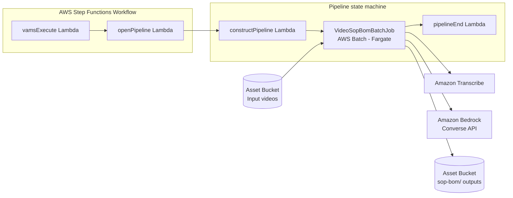

# Video SOP/BOM Extraction Pipeline

The Video SOP/BOM Extraction pipeline turns one to four narrated teardown videos of a single asset into a transcript, a step-by-step standard operating procedure (SOP), a bill of materials (BOM) in the 66-column `LCA-BOM-INPUT` layout, a lab summary, and the key frames used to verify the BOM visually. It transcribes the audio with Amazon Transcribe, extracts and verifies the structured content with Amazon Bedrock (Anthropic Claude through the Converse API), and runs as one AWS Batch container on AWS Fargate in the deployment's isolated subnets. Every input limit is enforced inside the pipeline, and a refused run reports the active limit as a readable execution error.

:::info[Validation status]
The pipeline's unit, contract, and CDK test suites cover every stage; live smoke validation against a deployed environment is pending. Report defects found in a deployment through the project's issue tracker.
:::

## Overview

| Property                    | Value                                                                                                                                                                       |
| --------------------------- | --------------------------------------------------------------------------------------------------------------------------------------------------------------------------- |
| **Pipeline ID**             | `genai-video-sop-bom` (the workflow carries the same id)                                                                                                                    |
| **Configuration flag**      | `app.pipelines.useGenAiVideoSopBom.enabled`                                                                                                                                 |
| **Category**                | `GenAI`                                                                                                                                                                     |
| **Execution type**          | Lambda (asynchronous with callback)                                                                                                                                         |
| **Input**                   | 1 to 4 explicitly selected video files from one asset (`inputFileArity: multi`)                                                                                             |
| **Supported input formats** | `.mp4`, `.mov`, `.m4v`, `.webm`, `.mkv` (matched case-insensitively)                                                                                                        |
| **Output**                  | Files under `sop-bom/<executionId>/` on the asset, asset-level metadata (`sopBom_*` keys), and a results summary                                                            |
| **Timeout**                 | 8.5 hours for the workflow task (`VIDEO_SOP_BOM_BUNDLE_TASK_TIMEOUT_SECONDS`, 30600); the container attempt is bounded at 6 hours and the pipeline state machine at 8 hours |

## Supported Input Formats

| Format    | Extension | Notes                                                                   |
| :-------- | :-------- | :---------------------------------------------------------------------- |
| MP4       | `.mp4`    | MPEG-4 Part 14 container; `.MP4` (the GoPro default casing) is accepted |
| QuickTime | `.mov`    | Apple QuickTime container                                               |
| M4V       | `.m4v`    | Apple MPEG-4 video container                                            |
| WebM      | `.webm`   | Matroska-derived web container                                          |
| Matroska  | `.mkv`    | Matroska container                                                      |

The pipeline's accepted-input list is `*.mp4`, `*.mov`, `*.m4v`, `*.webm`, and `*.mkv`, so only files with those extensions are offered in the execute wizard. Matching is case-insensitive at every gate. AVI, WMV, and FLV are not accepted. A custom template that overrides `inputFileFilters` to add another container format does not widen the pipeline: the entry-point Lambda checks every selected file's extension against the same five-entry list and refuses the run with a readable cause, so widening the format list is a code change rather than a template change.

## Input selection

-   **Explicit files only.** Select the video files themselves. A whole-asset (`/`) or folder (`/dir/`) selection is refused by the execute API with a `400` response — `Workflow does not allow whole-asset ('/') selection.` or `Workflow does not allow folder selection.` — before any execution record exists, because the platform never expands a container into files.
-   **Playback order.** When this pipeline is the first step of its workflow, the videos are processed in the order they were selected; the web wizard keeps multi-file rows in the order they were added. As a later step of a custom workflow, files arrive in `databaseId:assetId:/relativeKey` order — set the `VIDEO_ORDER` tag to `filename` (natural sort on the relative path, suited to chaptered camera files such as `GX010001.MP4`, `GX010002.MP4`) or name the files in playback order.
-   **No file-upload trigger.** The workflow registers no `fileUpload` trigger and the configuration block has no `autoRegisterAutoTriggerOnFileUpload` key: a trigger fires one run per uploaded object, so a four-part teardown would cost four Amazon Transcribe and Amazon Bedrock runs. Start runs from the execute wizard, the API, or `vamscli workflow execute`.

## Architecture



### Processing Flow

1. The `vamsExecute` Lambda receives the workflow event, resolves the input manifest, and applies the pre-launch gates: file count, container entries, extension, and per-file and total byte size (one `HeadObject` per file). A refused run reports its cause on the workflow task token before any job is submitted.
2. `openPipeline` starts the pipeline state machine, naming the execution after the AWS Batch job (`VideoSopBom_<pipelineExecutionId prefix>_<timestamp>_<random>`), and registers it on the orchestration bus so an abort reaches it.
3. `constructPipeline` validates the rendered template configuration against its JSON Schema (enumerations, the key-frame ceiling, string lengths — rejecting rather than clamping), reads the manifest envelope, writes the run's definition document to the auxiliary bucket, and hands the container a pointer to it.
4. AWS Batch runs the container on AWS Fargate. The container probes Amazon Transcribe and Amazon Bedrock reachability and model access, checks the disk budget, downloads the videos, probes each stream with `ffprobe`, extracts and concatenates FLAC audio, transcribes it with Amazon Transcribe, analyzes the transcript in windows with Amazon Bedrock, merges the windows deterministically, extracts key frames, verifies the BOM against the frames, runs one finalize call, renders the deliverables, and uploads them.
5. The container reports its outcome on the state machine's task token as its final act (`SendTaskSuccess` with a reporter marker, or `SendTaskFailure` with a readable cause).
6. `pipelineEnd` lifts the outcome — including AWS Batch's own reason when the container exited without reporting — onto the workflow task token, and the workflow's process-output step ingests the files, metadata, and results.

### Container Image Build

The container image is built by AWS CodeBuild during CDK deployment when `useCodeBuild` is enabled: CDK uploads the container source to Amazon S3 and a custom resource starts a build that pushes the image, tagged by the content hash of that source, to an Amazon ECR repository named `<config.name>-<baseStackName>-videosopbom`. With `useCodeBuild` disabled the image is built locally with Docker at synthesis time. The image is a digest-pinned `python:3.12-slim` (Debian) base with the Debian `ffmpeg` package, boto3, jsonschema, and Pillow, and runs as a non-root user.

## Configuration

Enable this pipeline in `infra/config/config.json`:

```json
{
    "app": {
        "pipelines": {
            "useGenAiVideoSopBom": {
                "enabled": true,
                "useCodeBuild": true,
                "autoRegisterWithVAMS": true,
                "bedrockModelId": "global.anthropic.claude-sonnet-5",
                "limits": {
                    "maxVideoFiles": 4,
                    "maxTotalDurationMinutes": 240
                }
            }
        }
    }
}
```

### Configuration Options

| Option                           | Default                                                                                                 | Description                                                                                                                                                                                                                                                                                                                                                                                                                                                                                                                                                                                                                      |
| :------------------------------- | :------------------------------------------------------------------------------------------------------ | :------------------------------------------------------------------------------------------------------------------------------------------------------------------------------------------------------------------------------------------------------------------------------------------------------------------------------------------------------------------------------------------------------------------------------------------------------------------------------------------------------------------------------------------------------------------------------------------------------------------------------- |
| `enabled`                        | `false`                                                                                                 | Deploy the pipeline infrastructure. Requires `app.useGlobalVpc.enabled`.                                                                                                                                                                                                                                                                                                                                                                                                                                                                                                                                                         |
| `useCodeBuild`                   | `false`                                                                                                 | Build the container image with AWS CodeBuild during deployment. CodeBuild runs outside the VPC to pull the public base image.                                                                                                                                                                                                                                                                                                                                                                                                                                                                                                    |
| `autoRegisterWithVAMS`           | `true`                                                                                                  | Register the pipeline, its two templates, and the workflow in the global VAMS database during deployment.                                                                                                                                                                                                                                                                                                                                                                                                                                                                                                                        |
| `bedrockModelId`                 | `global.anthropic.claude-sonnet-5` (commercial); empty in the GovCloud and EU Sovereign Cloud templates | One Amazon Bedrock model id used for both text and vision calls through the Converse API with forced tool use. A cross-Region inference-profile prefix is partition-specific (`global.` and `us.` exist in the commercial partition; AWS GovCloud (US) uses `us-gov.`); configuration validation rejects an empty value and a commercial prefix outside the commercial partition. The GovCloud template leaves the value empty for the operator to set from a `us-gov.` inference profile; the EU Sovereign Cloud template also ships it empty, but the pipeline cannot be enabled there (see the partition prerequisite below). |
| `limits.maxVideoFiles`           | `4`                                                                                                     | Maximum number of video files per run (integer, 1 to 4).                                                                                                                                                                                                                                                                                                                                                                                                                                                                                                                                                                         |
| `limits.maxTotalDurationMinutes` | `240`                                                                                                   | Maximum summed audio duration per run (integer, 1 to 480; Amazon Transcribe accepts at most 28,800 seconds of audio per job).                                                                                                                                                                                                                                                                                                                                                                                                                                                                                                    |

The byte caps are not operator options. They are `config.ts` constants sized to the container's 100 GiB ephemeral volume: `VIDEO_SOP_BOM_MAX_VIDEO_FILE_SIZE_MB` (4096) per video and `VIDEO_SOP_BOM_MAX_TOTAL_INPUT_SIZE_MB` (16384) per run.

The pipeline is accepted in the commercial and AWS GovCloud (US) partitions. Amazon Transcribe and Amazon Bedrock are documented by AWS as available in both AWS GovCloud (US) Regions; the pipeline is not live-tested there, and the GovCloud template ships `bedrockModelId` empty for the operator to set. Enabling it in any other partition fails configuration validation with a message ending `not validated outside the commercial and GovCloud partitions: Amazon Transcribe endpoint availability is unverified and the service-helper has no row for this partition; a missing endpoint hangs a run until its timeout.`

## Input Parameters

Parameters reach the pipeline through the template selected for the run (`systemConfig.requireTemplate` is `true`, so a run cannot start without one). Deployment registers two templates; a run may also supply an edited copy of a template body, which `constructPipeline` validates in full before any job starts.

**`video-sop-bom-full`** (default) — every deliverable:

```json
{"mode":"full","languageCode":"{{LANGUAGE_CODE}}","videoOrder":"{{VIDEO_ORDER}}","productName":"{{PRODUCT_NAME}}","contributors":"{{CONTRIBUTORS}}","maxKeyFrames":{{MAX_KEY_FRAMES}},"partLevelBase":"{{PART_LEVEL_BASE}}","generateLabSummary":{{GENERATE_LAB_SUMMARY}},"additionalInstructions":"{{ADDITIONAL_INSTRUCTIONS}}"}
```

**`video-sop-bom-transcript-only`** — the transcript files, the video timeline, and the analysis report, with no Amazon Bedrock calls. Use it as an inexpensive dry run that proves audio, limits, and Amazon Transcribe reachability, or as the transcript deliverable for non-teardown footage:

```json
{ "mode": "transcript", "languageCode": "{{LANGUAGE_CODE}}", "videoOrder": "{{VIDEO_ORDER}}" }
```

### Parameter Reference

| Tag                       | Type    | Default     | Description                                                                                                                                                                                                                                                                                   |
| :------------------------ | :------ | :---------- | :-------------------------------------------------------------------------------------------------------------------------------------------------------------------------------------------------------------------------------------------------------------------------------------------- |
| `LANGUAGE_CODE`           | enum    | `en-US`     | Amazon Transcribe language code: `auto`, `en-US`, `en-GB`, `en-AU`, `de-DE`, `fr-FR`, `es-US`, `es-ES`, `it-IT`, `pt-BR`, `ja-JP`, `ko-KR`, `zh-CN`. `auto` enables language identification; set a code explicitly for media with little or no speech.                                        |
| `VIDEO_ORDER`             | enum    | `selection` | `selection` (the order the files were selected) or `filename` (natural sort on the relative path).                                                                                                                                                                                            |
| `PRODUCT_NAME`            | string  | —           | Product name for the SOP title, BOM part numbers, and lab summary. Takes precedence over the asset name; when empty, the asset name is used. The pipeline never reads its own `sopBom_productName` metadata back, so a rerun does not inherit an earlier run's value. At most 256 characters. |
| `CONTRIBUTORS`            | string  | —           | Copied into the lab summary header. At most 256 characters.                                                                                                                                                                                                                                   |
| `MAX_KEY_FRAMES`          | integer | `60`        | Upper bound on extracted key frames, 1 to 200. A value above 200 is refused before the container starts, naming both values.                                                                                                                                                                  |
| `PART_LEVEL_BASE`         | enum    | `0`         | First BOM part level, `0` or `1`.                                                                                                                                                                                                                                                             |
| `GENERATE_LAB_SUMMARY`    | boolean | `true`      | Whether `lab-summary.json` and `lab-summary.md` are produced.                                                                                                                                                                                                                                 |
| `ADDITIONAL_INSTRUCTIONS` | string  | —           | Free text appended to the extraction prompts under the pipeline's system boundary: it may adjust emphasis and vocabulary but cannot change the output schema or field meanings. At most 4,000 characters; a longer value is refused, naming both lengths.                                     |

:::note[What the system boundary does]
Every Amazon Bedrock call carries a fixed system prompt stating that the transcript, frames, and any text they contain are untrusted data to be described rather than instructions to follow, and that the operator's additional instructions cannot change the schema. The transcript is passed inside a `<transcript>` element and `ADDITIONAL_INSTRUCTIONS` under its own heading. Every structured response is requested through a forced tool call and validated against the tool's JSON Schema before it is used.
:::

## Limits

The pipeline enforces its input limits itself because templates and workflows cannot. Two caps are deployment configuration and two are `config.ts` constants; the active values of all four are written to every run's `results/summary.json` under `limits.configured`.

| Limit                     | Default                   | Where it is set                                                       | Enforced by                                                                      |
| :------------------------ | :------------------------ | :-------------------------------------------------------------------- | :------------------------------------------------------------------------------- |
| Video files per run       | 1 to 4                    | `limits.maxVideoFiles`                                                | `vamsExecute`, before any job is submitted                                       |
| Size per video            | 4 GB (4096 MB)            | constant `VIDEO_SOP_BOM_MAX_VIDEO_FILE_SIZE_MB`                       | `vamsExecute` (one `HeadObject` per file) and the container again after download |
| Total input size          | 16 GB (16384 MB)          | constant `VIDEO_SOP_BOM_MAX_TOTAL_INPUT_SIZE_MB`                      | `vamsExecute` and the container                                                  |
| Total audio duration      | 240 minutes               | `limits.maxTotalDurationMinutes`                                      | the container, summing the extracted audio tracks                                |
| Key frames per run        | 60 (tag), ceiling 200     | `MAX_KEY_FRAMES` tag, constant `VIDEO_SOP_BOM_MAX_KEY_FRAMES_CEILING` | `constructPipeline`, rejecting rather than clamping                              |
| Additional instructions   | 4,000 characters          | the rendered configuration's JSON Schema                              | `constructPipeline`                                                              |
| Concatenated audio        | 2 GB and 28,800 seconds   | Amazon Transcribe service limits                                      | the container, before `StartTranscriptionJob`                                    |
| Free disk before download | total bytes × 1.5 + 2 GiB | derived from the byte caps and the 100 GiB volume                     | the container's disk preflight                                                   |

:::note[How a refused run is reported]
A limit refusal fails the pipeline step through the AWS Step Functions task token, not with a `400` response: the execution is recorded `FAILED` and its `executionError` reads `<code>: <cause>`, where the cause names the observed value and the active cap (for example `VideoSopBomInputRejected: 5 video files selected; this deployment allows at most 4.`). The `400` behaviour described under [Pipeline Template and Tag-Schema Limits](../additional/quotas.md#pipeline-template-and-tag-schema-limits) applies to template authoring, not to runs. Gates that run in `vamsExecute` fail within a few minutes and start no AWS Batch job; gates that run in the container fail before the Amazon Transcribe job is started.
:::

## Prerequisites

:::warning[Amazon Bedrock model access required]
You must enable access to the configured Amazon Bedrock model in your deployment Region before using this pipeline. Go to the Amazon Bedrock console, select **Model access**, and request access to the model named in `bedrockModelId`. The container probes model access with a one-token `Converse` call before downloading any video, so a deployment without access fails in the first minute with `VideoSopBomConnectivityError` rather than after the transcription spend.
:::

-   **Amazon Transcribe** — Available in the deployment Region. The pipeline uses batch transcription with the job role's own identity, writes the transcript and subtitle files to the auxiliary bucket, and deletes the transcription job record once its output is downloaded.
-   **VPC and interface endpoints** — The pipeline runs in the isolated subnets, which have no internet route. With `app.useGlobalVpc.addVpcEndpoints` enabled, the VPC builder creates Amazon Transcribe and Amazon Bedrock Runtime interface endpoints when this pipeline is enabled, in addition to the shared AWS Batch, Amazon ECR API, and Amazon ECR Docker endpoints and the always-present Amazon S3, Amazon CloudWatch Logs, and AWS Step Functions endpoints. An imported VPC must already provide them; a missing endpoint surfaces as a connect timeout in the container's preflight, reported as `VideoSopBomConnectivityError`.
-   **AWS Fargate On-Demand vCPU quota** — Each job reserves 4 vCPU and 16 GiB of memory. The default AWS Fargate On-Demand vCPU quota is 6 per account and Region, so two concurrent runs serialize: the second waits in `RUNNABLE` until the first finishes. The pipeline's timeout chain absorbs one such wait (the container attempt is bounded at 6 hours and the state machine at 8 hours); raise the quota through Service Quotas for deployments that expect concurrent runs.
-   **CodeBuild internet access** — When `useCodeBuild` is enabled, the CodeBuild project runs outside the VPC to pull the public base image and reaches Amazon ECR and Amazon S3 through IAM credentials.
-   **Partition** — Commercial and AWS GovCloud (US) only, as described under [Configuration](#configuration).

## Output

Outputs are per-run aggregates, so they anchor at the asset root rather than beside each input video. The container writes flat into a `sop-bom/` folder and the workflow inserts the run folder as the leaf, so files land at `sop-bom/<executionId>/` on the asset and a rerun never overwrites an earlier run. No previews and no file-level metadata are written. A run that fails ingests nothing: there are no partial deliverables.

| File                                         | Full mode                           | Transcript mode | Content                                                                                                                |
| :------------------------------------------- | :---------------------------------- | :-------------- | :--------------------------------------------------------------------------------------------------------------------- |
| `transcript.json`                            | Yes                                 | Yes             | Raw Amazon Transcribe output                                                                                           |
| `transcript.txt`                             | Yes                                 | Yes             | Readable timestamped transcript                                                                                        |
| `transcript.vtt`, `transcript.srt`           | Yes                                 | Yes             | WebVTT and SRT subtitles                                                                                               |
| `video-timeline.json`                        | Yes                                 | Yes             | Per-video offsets built from the extracted audio durations, so timestamps match what Amazon Transcribe reports         |
| `sop.json`, `sop.md`                         | Yes                                 | —               | Steps with action, component, fasteners, locations, dependencies, tools, motion, force, and failure modes              |
| `bom.json`, `bom.md`, `bom.csv`              | Yes                                 | —               | Bill of materials; `bom.md` is a seven-column readable table indented by part level                                    |
| `lab-summary.json`, `lab-summary.md`         | When `GENERATE_LAB_SUMMARY` is true | —               | Sections 1.1 to 1.9 of the lab summary; mass, component count, and materials breakdown are computed from the BOM       |
| `frames.json`, `keyframe-NNNN-HHhMMmSSs.jpg` | Yes                                 | —               | Key-frame manifest keyed by moment index and the frames (at most `MAX_KEY_FRAMES`, long edge at most 1568 px)          |
| `analysis-report.json`                       | Yes                                 | Yes             | Models, per-stage tokens and timings, windows, frames requested/extracted/skipped, limits, warnings, vocabulary misses |

### `bom.csv` contract

`bom.csv` is written as UTF-8 without a byte-order mark with LF line endings, and its first line is the 66-column `LCA-BOM-INPUT` header exactly (the `LCA_BOM_COLUMNS` constant the container validates against). The eight columns every row carries are `part_level`, `part_type`, `lab_part_number` (`<productSlug>-<seq>`), `manufacturer_part_number`, `alternative` (`Yes`/`No`), `part_description`, `qty`, and `material_or_component_type`; `mass_g_per_unit` and `primary_manufacturing_process` are filled when observable and the remaining columns are left blank. Part types, material types, and manufacturing processes come from fixed vocabularies; a row whose value falls outside a vocabulary keeps the raw value in `material_notes` and is listed under `vocabularyMisses` in `analysis-report.json`. Text cells beginning with `=`, `+`, `-`, `@`, tab, or carriage return are written with a leading apostrophe so spreadsheet applications do not evaluate them as formulas. The CSV carries a header row and data rows only, with no spreadsheet preamble.

### Asset metadata

Both modes write `asset.metadata.json` (`updateType: update`) on the output asset:

```json
{
    "type": "metadata",
    "updateType": "update",
    "metadata": [
        {
            "metadataKey": "sopBom_latestExecutionId",
            "metadataValue": "<executionId>",
            "metadataValueType": "string"
        },
        { "metadataKey": "sopBom_mode", "metadataValue": "full", "metadataValueType": "string" },
        { "metadataKey": "sopBom_videoCount", "metadataValue": "2", "metadataValueType": "number" },
        {
            "metadataKey": "sopBom_totalDurationSeconds",
            "metadataValue": "148.6",
            "metadataValueType": "number"
        },
        {
            "metadataKey": "sopBom_language",
            "metadataValue": "en-US",
            "metadataValueType": "string"
        },
        {
            "metadataKey": "sopBom_transcriptPath",
            "metadataValue": "/sop-bom/<executionId>/transcript.json",
            "metadataValueType": "string"
        }
    ]
}
```

Full mode adds `sopBom_productName`, `sopBom_componentCount`, `sopBom_stepCount`, `sopBom_totalMassG`, `sopBom_sopPath`, `sopBom_bomPath`, and `sopBom_labSummaryPath`. Path values are the final asset-relative paths, including the run folder.

### Results summary

Both modes write `results/summary.json` (under 50 KB), which the execution details page shows: `mode`, `status`, `fileCount`, `bedrock` (`calls`, `inputTokens`, `outputTokens`), `limits.configured` and `limits.observed`, `timings`, `warnings`, the final paths, and the resolved configuration.

### A video with no speech

A narrated video is required. When Amazon Transcribe returns a transcript with no pronounced words, the container rejects the run on the task token with `VideoSopBomInputRejected` and the cause `no speech detected in <file names>; a narrated video is required.`; nothing is ingested. A file with no audio stream is rejected the same way, before any transcription starts. The transcript-only template is the inexpensive way to confirm that a set of videos carries usable narration.

## Infrastructure Components

The following AWS resources are created when this pipeline is enabled:

| Resource                          | Service                | Purpose                                                                                                                                                                                                                                                                                                                                                                                                     |
| :-------------------------------- | :--------------------- | :---------------------------------------------------------------------------------------------------------------------------------------------------------------------------------------------------------------------------------------------------------------------------------------------------------------------------------------------------------------------------------------------------------- |
| Fargate Compute Environment       | AWS Batch              | Serverless container execution in the isolated subnets                                                                                                                                                                                                                                                                                                                                                      |
| Job Queue                         | AWS Batch              | Job scheduling                                                                                                                                                                                                                                                                                                                                                                                              |
| Job Definition                    | AWS Batch              | `VideoSopBomJob_<config.name>_<baseStackName><hash>`: 4 vCPU, 16 GiB memory, 100 GiB ephemeral storage, 6-hour attempt duration, a single attempt (`retryAttempts: 1` — AWS Batch does not retry the job)                                                                                                                                                                                                   |
| Container Repository              | Amazon ECR             | `<config.name>-<baseStackName>-videosopbom` (explicitly named; CodeBuild path)                                                                                                                                                                                                                                                                                                                              |
| CodeBuild Project                 | AWS CodeBuild          | Builds and pushes the container image                                                                                                                                                                                                                                                                                                                                                                       |
| Step Functions State Machine      | AWS Step Functions     | Pipeline orchestration with an 8-hour timeout; logs to `/aws/vendedlogs/VAMSStateMachine-VideoSopBom<hash>`                                                                                                                                                                                                                                                                                                 |
| Container Log Group               | Amazon CloudWatch Logs | `/aws/vendedlogs/Pipelines/VideoSopBom<hash>`, encrypted with the deployment's AWS KMS key, one-year retention                                                                                                                                                                                                                                                                                              |
| Lambda Functions (4)              | AWS Lambda             | Pipeline coordination (`vamsExecuteVideoSopBomPipeline`, `openPipeline`, `constructPipeline`, `pipelineEnd`)                                                                                                                                                                                                                                                                                                |
| Interface VPC Endpoints           | Amazon VPC             | Amazon Transcribe and Amazon Bedrock Runtime, in the isolated subnets                                                                                                                                                                                                                                                                                                                                       |
| Auxiliary bucket temporary prefix | Amazon S3              | `pipelines/genai-video-sop-bom/<executionId>/` holds the definition document, audio, transcript, and analysis artefacts; a run deletes the prefix on success and keeps the transcript and analysis objects on a handled failure. A lifecycle rule on the asset auxiliary bucket, scoped to `pipelines/genai-video-sop-bom/`, expires whatever a crashed or aborted run leaves behind 30 days after creation |

## Logs

`vamscli execution logs` and the execution details page show the container's stream from the pipeline log group. The container logs stage names, counts, byte and second totals, token counts, timings, and the markers `STAGE <n> <name> start|end <seconds>s`, `BEDROCK_CALL stage=<name> model=<id> in=<tokens> out=<tokens>` (one per Amazon Bedrock call), and `TRANSCRIBE_ORPHANED job=<name> stage=<n>` (when a run is stopped while a transcription is in flight). It never logs transcript text, prompt bodies, model output, frame bytes, or a task token; those artefacts live under the auxiliary bucket's temporary prefix, encrypted with the deployment's AWS KMS key.

## Troubleshooting

Every failure the pipeline reports carries a short code in the execution's error and a readable sentence in its cause. The examples below are the rendered `executionError` values; the full detail is in the container or Lambda log.

### Too many, too few, or unsupported inputs

```
VideoSopBomInputRejected: 5 video files selected; this deployment allows at most 4.
```

Reported by `vamsExecute` before any job starts, also for a zero-file selection, a folder entry, or an extension outside the accepted list. The container reports the same code for an undecodable file, a file without an audio stream, and a video set with no detectable speech (`no speech detected in <file names>; a narrated video is required.`). Select between one and `limits.maxVideoFiles` narrated video files.

### Input larger than the byte caps

```
VideoSopBomInputRejected: part3.mov is 5.2 GB; this deployment allows at most 4.0 GB per video.
```

The per-video cap is 4 GB and the per-run total 16 GB; both are checked before launch from the objects' sizes and again after download. Re-encode or split the video, or raise the `config.ts` constants together with the ephemeral volume they are sized against.

### Total duration or Amazon Transcribe limits exceeded

```
VideoSopBomLimitExceeded: total video duration 5h12m exceeds this deployment's limit of 4h00m (240 minutes).
```

The container sums the extracted audio tracks before starting the transcription. Raise `limits.maxTotalDurationMinutes` (at most 480, the Amazon Transcribe ceiling) or split the run. The same code reports concatenated audio above 2 GB or 28,800 seconds and a disk budget the container cannot meet.

### Amazon Transcribe job failed

```
VideoSopBomTranscribeFailed: Amazon Transcribe job failed: Invalid file size: file size too large.
```

The cause carries Amazon Transcribe's own `FailureReason`. When it mentions language identification, set `LANGUAGE_CODE` explicitly for media with little or no speech.

### Model output invalid

```
VideoSopBomModelOutputInvalid: finalize output exceeded 32K tokens for 240 components / 310 steps.
```

Reported when Amazon Bedrock returns content that fails schema validation after one retry, stops for `content_filtered`, `guardrail_intervened`, or `model_context_window_exceeded`, or exhausts the output budget after the compacted retry. Reduce the footage per run or the level of detail requested in `ADDITIONAL_INSTRUCTIONS`.

### Cannot reach Amazon Transcribe or Amazon Bedrock

```
VideoSopBomConnectivityError: could not connect to bedrock-runtime.us-east-1.amazonaws.com from the isolated subnet (connect timeout) — the Bedrock Runtime interface endpoint is missing (app.useGlobalVpc.addVpcEndpoints).
```

The preflight probe runs before any download. A connect timeout means the interface endpoint for the named service is missing from the VPC; an `AccessDeniedException`, `ResourceNotFoundException`, or `ValidationException` from the Amazon Bedrock probe means the model is not accessible in this account and Region — enable model access in the Amazon Bedrock console.

### Container exited without reporting

```
VideoSopBomPipelineError: container exited without reporting (Batch status FAILED, exit 137, Essential container in task exited).
```

`pipelineEnd` lifts AWS Batch's status reason when the container was killed (out of memory, `SIGKILL`) or hit the 6-hour attempt bound, in which case the cause reads `the container did not finish within the 6 h bound; last stage per the container log`. The same code reports Amazon Bedrock throttling that persisted past the retry budget (`Amazon Bedrock <code> persisted for <n> min at stage <stage>`) and output uploads that failed.

### Whole-asset or folder selection refused

```
Workflow does not allow whole-asset ('/') selection.
Workflow does not allow folder selection.
```

A `400` from the execute API, before any execution exists — the first sentence for a `/` selection, the second for a `/dir/` selection. Select the video files individually.

### Template value out of range

A rendered template value outside its schema — an enumeration value the tag does not allow, `MAX_KEY_FRAMES` above 200, `ADDITIONAL_INSTRUCTIONS` above 4,000 characters — is refused by `constructPipeline` with a cause naming the offending and the permitted value. An invalid enumeration value is refused earlier, by the execute API, with a `400` naming the tag.

### Run aborted while a transcription was in flight

Aborting a run stops the pipeline state machine and terminates the AWS Batch job, which sends `SIGTERM` to the container. The container logs `TRANSCRIBE_ORPHANED job=<transcribeJobName> stage=<n>`: Amazon Transcribe has no cancel operation for a running batch job, so the transcription completes on its own and is billed for the audio already submitted, which the duration cap bounds. Nothing is written to the asset.

### Run waits in RUNNABLE

A job that stays `RUNNABLE` while another run is `RUNNING` is waiting on the AWS Fargate On-Demand vCPU quota (see [Prerequisites](#prerequisites)). The wait counts against the 8-hour state-machine timeout, not against the 6-hour attempt bound.

### Container fails to start

If the AWS Batch job fails immediately, check that the CodeBuild project completed successfully:

```bash
aws codebuild list-builds-for-project \
    --project-name <CodeBuild-project-name> \
    --sort-order DESCENDING \
    --region <region>
```

Verify the build status is `SUCCEEDED` and that the Amazon ECR repository contains the image tag the job definition names.

:::info[Cost considerations]
Each run is billed for the audio minutes Amazon Transcribe processes and for the Amazon Bedrock input and output tokens of the window, vision, and finalize calls. `results/summary.json` and `analysis-report.json` record the call and token counts per stage, and the transcript-only template makes no Amazon Bedrock calls.
:::

## Third-Party Library Licenses

The container installs the Debian `ffmpeg` package to probe video streams, extract and encode audio (FLAC), and extract key frames. Debian builds FFmpeg with `--enable-gpl`, so the `ffmpeg` and `ffprobe` binaries are distributed under the GNU General Public License version 2 or later (GPL-2.0-or-later). The pipeline runs them as separate processes and does not link against the FFmpeg libraries. The pipeline's Python dependencies — boto3 and botocore (Apache-2.0), jsonschema (MIT), and Pillow (HPND) — are permissively licensed. See [Notices](../additional/notices.md) for the full third-party software notice.

:::warning[License Notice]
This pipeline uses a third-party open-source library with a GPL license. Refer to your legal team before enabling this pipeline in production. See the `NOTICE.md` file at the repository root for details.
:::

## Related Resources

-   [Pipeline System Overview](overview.md)
-   [GenAI 3D Metadata Labeling Pipeline](genai-labeling.md) -- the other Amazon Bedrock pipeline, whose model-access prerequisite is the same
-   [Configuration Reference](../deployment/configuration-reference.md) -- all pipeline configuration options
-   [Service Quotas and Limits](../additional/quotas.md) -- the pipeline-specific limits table
