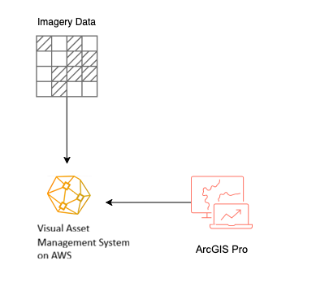

# ArcGIS Pro Connector for VAMS (EXPERIMENTAL)

[](https://pro.arcgis.com/)
[](https://dotnet.microsoft.com/)
[](LICENSE)
[]()

> **EXPERIMENTAL**: This plugin is in experimental status and may still have issues. Verify with your organization before deploying to any production environment.

VamsConnector is an ArcGIS Pro add-in that provides integration with Visual Asset Management System on AWS (VAMS) [https://github.com/awslabs/visual-asset-management-system], a cloud-based visual data management platform. The add-in enables GIS professionals to browse, explore, manage, and reference VAMS databases, assets, and files directly from within ArcGIS Pro.

## 🌟 Key Features

### 📁 **Database & Asset Management**

-   **Hierarchical Browser**: Navigate through VAMS databases, assets, and files in an intuitive tree view with folder structure support
-   **Real-time Authentication**: Secure CLI-based login with session management
-   **Detailed Metadata**: Rich information display including statistics, timestamps, and technical details
-   **Native Integration**: Seamless dockpane integration within ArcGIS Pro interface
-   **Resizable Panes**: Adjustable splitter between database explorer and details pane
-   **Smart Icons**: Dynamic folder and database icons that change when expanded/collapsed

### 🔗 **File Reference System**

-   **Smart Field Creation**: Automatically adds VAMS reference fields to feature classes and tables
-   **Flexible Workflow**: Reference VAMS files from any feature or table row
-   **Rich Metadata Storage**: Stores database names, asset names, file names, S3 locations, and more
-   **Context Menu Integration**: Right-click workflows for adding and accessing references
-   **Folder Structure Support**: Files organized in folders display correctly in tree hierarchy

### 🖼️ **Enhanced Image Preview**

-   **Advanced Viewer**: Professional image preview with pan and zoom capabilities
-   **Universal Panning**: Click and drag at any zoom level including fit-to-window
-   **Smart Zoom Controls**: Mouse wheel + Ctrl for precise zooming centered on cursor
-   **Download Support**: Direct file download with progress tracking
-   **Multiple Formats**: Support for JPG, PNG, GIF, BMP, TIFF, and more

### 📊 **Table Integration**

-   **Context Menu Access**: Right-click in attribute tables to open VAMS file links
-   **Smart Detection**: Automatically detects tables with VAMS reference fields
-   **Batch Operations**: Open multiple file links from selected table rows
-   **Seamless Workflow**: Works with both feature layers and standalone tables

## 🚀 Getting Started

### Prerequisites

-   **ArcGIS Pro 3.5+** (minimum version 3.5)
-   **.NET 8.0** targeting Windows
-   **VAMS CLI** installed and configured (see below)

### VAMS CLI Setup

The connector uses the **VAMS CLI** (`vamscli`) for all VAMS operations. The CLI must be installed and configured before using the add-in.

#### 1. Install the VAMS CLI

```bash
# From the VAMS repository
pip install -e /path/to/vams/tools/VamsCLI

# Or if published to a package registry
pip install vamscli
```

Verify the installation:

```bash
vamscli --version
```

#### 2. Configure a VAMS CLI profile

Run the setup command with your VAMS API Gateway URL (found in your CloudFormation stack outputs):

```bash
vamscli setup https://your-api-gateway-url.amazonaws.com
```

This creates a `default` profile that stores the API endpoint configuration. You only need to run this once per VAMS deployment.

#### 3. Verify the CLI works

```bash
vamscli auth login -u your-email@example.com
vamscli database list --json-output
```

### Authentication Methods

The connector supports two authentication methods, automatically detected from your VAMS CLI profile configuration:

#### Cognito Authentication (Username/Password)

For VAMS deployments using AWS Cognito as the identity provider. Enter your VAMS username (email) and password in the login dialog.

CLI equivalent:

```bash
vamscli auth login -u user@example.com -p yourpassword
```

#### Token Override Authentication (IDP JWT Token or VAMS API Key)

For VAMS deployments using an external identity provider, or when authenticating with a VAMS API key. Enter your user ID and the token/API key in the login dialog.

-   **VAMS API keys** are prefixed with `vams_` (e.g., `vams_abc123...`)
-   **IDP JWT tokens** are standard JWT strings from your external identity provider

CLI equivalent:

```bash
vamscli auth login --user-id user@example.com --token-override "vams_your-api-key"
vamscli auth login --user-id user@example.com --token-override "eyJhbGciOiJSUzI1NiIs..."
```

The connector automatically determines which authentication method to use based on the `auth_type` field in your VAMS CLI profile (`Cognito` or `External`).

### Installation

1. **Download** the latest release from the releases page
2. **Close ArcGIS Pro** if it's currently running
3. **Double-click** the `.esriAddinX` file to install
4. **Launch ArcGIS Pro** and open any database
5. **Look for the VAMS tab** in the ribbon or find "Database Explorer" in the Add-In tab

### First Time Setup

1. **Open the VAMS Database Explorer** from the Add-In tab
2. **Click the login button** - this will authenticate with VAMS CLI
3. **Browse your databases** in the hierarchical tree view
4. **Start adding references** to your GIS data

## 📖 User Guide

### Basic Workflow

#### 1. **Browse VAMS Content**

```
Database Explorer → Login → Navigate Databases → Explore Assets → View Files
```

#### 2. **Add File References to GIS Data**

```
Select Layer/Table → Right-click Visual Asset Management System File → "Add Reference to Feature Class/Table"
```

#### 3. **Access Referenced Files**

```
Open Attribute Table → Select Rows → Right-click → "Open VAMS Links"
```

### Detailed Instructions

#### **Adding VAMS References**

1. **Prepare Your Data**

    - Open a map with feature layers or standalone tables
    - Select the target layer/table in the Contents pane

2. **Select VAMS File**

    - Navigate to desired file in VAMS Database Explorer
    - Right-click on the file
    - Choose "Add Reference to Feature Class/Table..."

3. **Field Creation** (if needed)

    - System checks for existing VAMS reference fields
    - If not found, prompts to add them automatically
    - Creates 9 fields with "Vams\_" prefix for comprehensive metadata

4. **Feature Selection & Population**
    - Select specific features/rows you want to associate with the file
    - Confirm the operation
    - System populates selected records with file metadata

#### **Using File References**

1. **Open Attribute Table**

    - Right-click layer → "Attribute Table" or use Table ribbon

2. **Select Referenced Rows**

    - Choose rows containing VAMS file references
    - Look for populated "Vams_FileLink" fields

3. **Access Files**
    - Right-click selected rows
    - Choose "Open VAMS Links" from context menu
    - Files open in enhanced preview window

#### **Image Preview Features**

-   **🖱️ Pan**: Click and drag at any zoom level
-   **🔍 Zoom**: Ctrl + Mouse Wheel (centers on cursor)
-   **📐 Fit to Window**: Reset button for optimal viewing
-   **💾 Download**: Save files locally with progress tracking

#### **Downloading Files**

There are multiple ways to download VAMS files to your local machine:

**Option 1: From Image Preview Window**

1. Open an image file from the Database Explorer (right-click → "Preview Image")
2. Click the **Download** button in the preview window footer
3. Choose save location and filename in the dialog
4. File downloads with progress indication

**Option 2: From Database Explorer (Single File)**

1. Navigate to the desired file in the Database Explorer tree
2. Right-click on the file
3. Select **"Download File"** from the context menu
4. Choose save location and filename
5. File downloads directly to the selected location

**Option 3: From Database Explorer (All Asset Files)**

1. Navigate to an asset in the Database Explorer tree
2. Right-click on the asset (not individual files)
3. Select **"Download All Files"** from the context menu
4. Choose a folder location
5. All files in the asset download to the selected folder, preserving folder structure

**Download Features:**

-   Progress tracking for large files
-   Automatic folder creation for nested file structures
-   Original filenames preserved by default
-   Supports all file types (images, documents, archives, etc.)

## 🏗️ Architecture

<p align="center">
  
</p>

### Database Structure

```
VamsConnector/
├── Commands/                    # UI Commands
│   ├── AddVamsReferenceCommand.cs
│   └── OpenVamsLinkCommand.cs
├── Handlers/                    # URL & Event Handlers
│   └── VamsUrlHandler.cs
├── Helpers/                     # Data Models & Tree Items
│   ├── VamsItemBase.cs
│   ├── VamsDatabaseItem.cs
│   ├── VamsAssetItem.cs
│   ├── VamsFolderItem.cs
│   └── VamsFileItem.cs
├── Models/                      # Data Transfer Objects
│   └── VamsModels.cs
├── Services/                    # Business Logic
│   ├── VamsCliService.cs
│   ├── AwsCliService.cs
│   └── VamsReferenceService.cs
├── Images/                      # UI Assets
├── Config.daml                  # ArcGIS Pro Configuration
└── *.xaml                      # UI Definitions
```

### Key Components

#### **Services Layer**

-   **VamsCliService**: Interfaces with VAMS CLI for authentication and data retrieval
-   **AwsCliService**: Handles AWS S3 operations for file access
-   **VamsReferenceService**: Manages field creation and data population in GIS layers

#### **UI Layer**

-   **DatabaseExplorerViewModel**: Main dockpane with MVVM pattern
-   **ImagePreviewWindow**: Enhanced image viewer with pan/zoom
-   **Context Menus**: Integrated right-click workflows

#### **Data Layer**

-   **Hierarchical Models**: Tree-based structure for databases/assets/files
-   **Field Schema**: Standardized "Vams\_" prefixed fields for metadata storage

## 🔧 Technical Details

### Technology Stack

-   **Framework**: .NET 8.0 targeting Windows (`net8.0-windows`)
-   **UI Framework**: WPF with ArcGIS Pro SDK integration
-   **Architecture**: MVVM pattern with command binding
-   **External Dependencies**: YamlDotNet for CLI output parsing

### Field Schema

All VAMS reference fields use the "Vams\_" prefix:

| Field Name           | Type   | Length | Purpose                           |
| -------------------- | ------ | ------ | --------------------------------- |
| `Vams_FileName`      | String | 255    | VAMS file display name            |
| `Vams_DatabaseId`    | String | 255    | VAMS database identifier          |
| `Vams_DatabaseName`  | String | 255    | VAMS database display name        |
| `Vams_AssetId`       | String | 255    | VAMS asset identifier             |
| `Vams_AssetName`     | String | 255    | VAMS asset display name           |
| `Vams_FileLink`      | String | 1000   | Clickable hyperlink URL           |
| `Vams_FileExtension` | String | 10     | File extension (e.g., .jpg, .pdf) |
| `Vams_AddedDate`     | Date   | -      | Timestamp of reference creation   |

### File Deep Link URL Format

VAMS file reference URLs point directly to the file viewer in the VAMS web application using the HashRouter format:

```
https://<VAMS_WEBSITE>/#/databases/<databaseId>/assets/<assetId>/file/<encodedFilePath>
```

The file path is URL-encoded using `encodeURIComponent()`. Optional query parameters for versioning:

-   `?version=<fileVersionId>` — view a specific file version
-   `?assetVersion=<assetVersionId>` — view the file at a specific asset version (takes priority over `version`)

Example:

```
https://vams.example.com/#/databases/building/assets/x7150f39c-abc123/file/images%2Fphoto.jpg
```

## 🛠️ Development

### Building from Source

1. **Clone the repository**

    ```bash
    git clone <repository-url>
    cd VamsConnector
    ```

2. **Restore dependencies**

    ```bash
    dotnet restore
    ```

3. **Build the solution**

    ```bash
    dotnet build
    ```

4. **Debug in ArcGIS Pro**
    - Set ArcGIS Pro as the startup application
    - Press F5 to launch with debugger attached

### Development Environment

-   **Visual Studio 2022** (recommended)
-   **ArcGIS Pro SDK for .NET**
-   **Git** for version control

### Code Style

-   **MVVM Pattern**: ViewModels inherit from `DockPane` and use `SetProperty`
-   **Command Pattern**: `RelayCommand` for UI interactions
-   **Async/Await**: Proper async patterns with `QueuedTask.Run()`
-   **Error Handling**: Comprehensive try-catch with user feedback
-   **Resource Management**: Proper disposal of resources and event unsubscription

## 🔍 Troubleshooting

### Common Issues

| Issue                              | Solution                                                                                                                    |
| ---------------------------------- | --------------------------------------------------------------------------------------------------------------------------- |
| **Context menu not appearing**     | Ensure you're right-clicking on a VamsFileItem                                                                              |
| **"No selection" error**           | Select features in the target layer first                                                                                   |
| **Field creation fails**           | Check if layer is editable and you have write permissions                                                                   |
| **Context menu option greyed out** | Ensure table has VAMS reference fields and selected rows                                                                    |
| **Preview doesn't open**           | Check network connectivity and VAMS authentication                                                                          |
| **Login fails**                    | Verify VAMS CLI is installed (`vamscli --version`) and profile is configured (`vamscli profile info default --json-output`) |
| **"Profile may not be set up"**    | Run `vamscli setup <api-gateway-url>` to configure the CLI profile                                                          |

### Debug Information

-   **Console Output**: Check ArcGIS Pro console for debug messages
-   **Field Verification**: Verify field creation in layer's attribute table
-   **URL Validation**: Ensure Vams_FileLink field contains valid URLs
-   **Selection State**: Confirm table rows are selected before using context menu

### Performance Tips

-   **Batch Operations**: Select multiple rows for efficient link opening
-   **Field Management**: VAMS fields are added once per layer, reused for all files
-   **Memory Usage**: Image preview properly disposes resources on close
-   **Network Optimization**: Files are streamed efficiently from S3

## 📋 Supported File Types

| Category      | Extensions                                 | Preview Support               |
| ------------- | ------------------------------------------ | ----------------------------- |
| **Images**    | .jpg, .jpeg, .png, .gif, .bmp, .tiff, .tif | ✅ Full preview with pan/zoom |
| **Documents** | .pdf                                       | ℹ️ Info dialog only           |
| **Text**      | .txt, .csv                                 | ℹ️ Info dialog only           |
| **Archives**  | .zip, .rar, .7z                            | ℹ️ Info dialog only           |
| **Other**     | All others                                 | ℹ️ Generic info dialog        |

## 📄 Licensing

Licensed under the Apache License, Version 2.0 (the "License"); you may not use this file except in compliance with the License. You may obtain a copy of the License at

http://www.apache.org/licenses/LICENSE-2.0

Unless required by applicable law or agreed to in writing, software distributed under the License is distributed on an "AS IS" BASIS, WITHOUT WARRANTIES OR CONDITIONS OF ANY KIND, either express or implied. See the License for the specific language governing permissions and limitations under the License.

A copy of the license is available in the repository's [LICENSE](LICENSE) file.

## Trademarks

ArcGIS, ArcGIS Pro, and the ArcGIS logo are trademarks, registered trademarks, or service marks of Esri in the United States, the European Community, or certain other jurisdictions. Esri holds all rights, copyrights, and trademarks to ArcGIS and ArcGIS Pro. This project is not affiliated with, endorsed by, or sponsored by Esri. All other trademarks referenced herein are the property of their respective owners.
